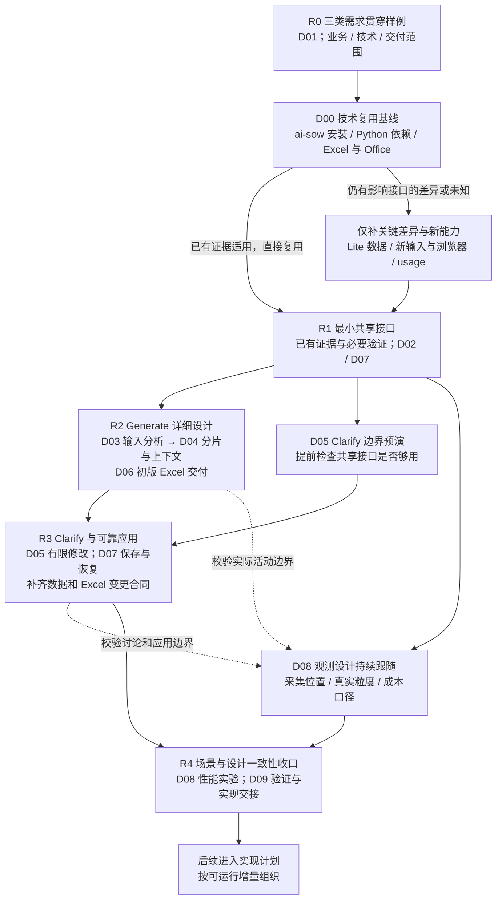

# 11 · 详细设计路线图

[返回总览](../../design/README.md)

## 1. 目标与当前状态

目前没有阻塞详细设计的业务问题需要用户先确认。接下来把已经确定的产品规则细化为可实现的 Skill 职责、共享数据、工具接口、异常处理和验证方案。ai-sow 已跑通，D00 先复用其安装、技术栈和 Excel 证据，只对 Lite 差异及影响共享接口的真实未知能力补测；只有发现新的业务取舍，才带着具体影响请用户决定。

本文件规划详细设计的层级、主题、依赖和完成标准。[D00 技术栈与运行形态](../../design/detailed/D00-technology-stack.md) 已记录可复用基线和来源；[D01/D02/D07/D09](../../design/detailed/README.md) 已形成交互与贯穿样例、最小共享合同、保存接口和场景追踪表，[D04](../../design/detailed/D04-generate-and-context.md) 已展开骨架、语义分片、主会话与独立子上下文及并发边界。R0—R4 的详细设计正文与 D09 衔接收口已形成，EX01—EX07 提供合成走读与有限探针，I1—I4 给出下一步实现/验收顺序；Lite Skill/运行时、适配和性能仍待实际验证。现有 ai-sow 能力与 Lite 手工模板测试可以减少重复实验，但不等于 Lite 新模型、模板适配、恢复或跨会话修改已完成。

实现前交接已补 [P00—P04](../implementation/README.md)：固定共用机械协议，按14项任务说明文件、输入输出、验证和退出条件；[REVIEW](REVIEW.md) 汇总本次新增/修改文档。设计 review 后从 I1.1 开始，不再增加一轮无消费者的概要设计。

详细设计继续围绕一个完整使用周期：**补足必要信息后快速给出可用初版；用户直接使用，有反馈再通过 clarify 讨论并应用有限修改。**

以下约束贯穿所有专题：

- 两个入口为 `generate` 和 `clarify`，共享业务文件，各自完成本次请求；没有后置定稿，也不增加专业阶段 Skill。
- 开场确定新旧项目并收集必要输入：PRD、HLD 必需，旧项目额外需要往期 SOW，原型可选；已有信息复用。分析后仅澄清和确认输入相关的业务、技术、交付事项，默认首轮合批加最多一轮补问；不引入拆解、分类或出稿审批。
- 专业工作由 agent 自主完成。先组织 Epic/Feature 骨架，再按业务切片联合形成 Story、来源 AC、Task，不把探索路径和片内推理编成 Action 链。
- 输入除原型外只支持可读文本（默认 Markdown）与 `.xlsx`；PDF/DOCX、扫描件及其他格式暂不支持，不做 OCR 或自动转换。
- 往期 SOW 构建估算 as-is，其余项目材料构建 to-be，识别本期负责的 gap；历史按可识别条目/说明建轻量索引；无候选默认新建，相关候选实例未明时新建+待确认；实例适用明确才按实际变化判断或排除已满足工作。
- 从需求及技术方案主动识别业务、技术/NFR 和交付需求。独立公共能力、业务接入、迁移及上线准备进入相应 Epic/Feature/Story；按依据和责任拆分，公共建设不重复计量，不默认增加方案。
- AC 与 Task 职责不同但联合形成，不强制逐条映射。“实施对象”作为分析方法，首版不增加独立实体、字段或生成阶段。
- 保留原件及按需提取的轻量索引与分析，区分输入格式、材料类型和使用用途，记录来源、版本及读取覆盖。IR 不成为全量转换门槛，具体结构由 D02/D03 结合生成和修改样例设计。
- 不猜前提、方案、AC 或缺失事实。复杂度无法判断默认 M 并附问题，不追加找证据；其他局部分类缺值留空，基础不足先补资料。
- Clarify 先讨论具体方案，确认后只修改闭合切片；读取、写入、回查深度和扩大范围的处理分别明确。
- 模板拥有标准与计算规则，agent 只做四项定性匹配。基础模板保持独立手填能力，agent 辅助结构在独立文件中设计。
- D04B 统一所有探索/澄清/返修/恢复环路的批量范围、次数与退出；正常首次覆盖与反复工作分开，计数跨恢复保留。默认上限需实际验证，不是已测得的最优值。
- 用时/token 记录用于看清开销与优化。上下文组织、增量复用和有限恢复负责减少浪费，不引入默认资源配额、预算批准或固定团队。
- 复用成熟技术的实现、测试与可行性证据，不复用旧专业流程；验证按直接复用、迁入冒烟、差异回归、新能力实验分类，不要求所有探针重新执行。

## 2. 设计方式：先明确共用接口，再沿使用路径细化

| 路线 | 优点 | 主要代价 |
|---|---|---|
| **先用贯穿样例明确最小接口，再分别细化两个入口（采用）** | 尽早暴露 generate 的产物是否足够支持独立 clarify；专业自由度和工程可靠性一起考虑 | 第一轮需要同时看一遍生成、修改和交付，但只讨论接口必需信息 |
| 按 generate 的步骤全部设计完，再设计 clarify | 初版生成的描述容易顺着流程展开 | 容易到修改阶段才发现身份、来源、问题状态和版本信息不足，反过来重设计前面 |
| 先完成通用数据平台、流程引擎和全部工具 | 基础设施看起来统一 | 容易提前固化细步骤，投入大量尚未证明需要的结构，延后首个可用结果 |

共用接口只包含后续工作真正需要的输入、结果、身份、依据和失效条件。原型分析、材料阅读、Story/Task 拆解等专业内部过程保持开放。详细设计完成的标志是边界和结果可以验证，不是把每个动作都枚举出来。

## 3. 五个设计层级

这些层级用于组织设计内容，**不对应五层运行时编排，也不是 clarify 的上游回查层数**。回查仍使用 [04](../../design/04-bounded-change-and-recovery.md) 中的依据、分析、业务对象和 Excel 责任坐标。

| 层级 | 回答的问题 | 需要形成的结果 |
|---|---|---|
| L0 · 用户体验与结果边界 | 何时提问、何时出稿、何时退出？用户拿走什么？哪些决定必须来自用户？ | 两入口交互与结果表、贯穿样例、信息不足和局部未知的分界案例 |
| L1 · 共享业务数据与依据 | 新会话如何读懂结果？哪些文件是当前事实？对象和来源怎样关联？ | 最小交付模型、依据与问题模型、版本关系、读写边界及实例 |
| L2 · Agent 专业工作 | 如何分析、探索、拆解和修改？如何保持有限上下文？ | 两个 Skill 的职责设计、专业工作包、切片与增量复核方法、必要检查和退出条件 |
| L3 · 确定性工具与宿主适配 | 哪些工作必须由代码保证？Excel、保存、恢复和观测怎样可靠执行？ | 小范围工具接口、文件提交协议、Excel 适配、宿主能力矩阵、埋点与计算口径 |
| L4 · 验证与实现交接 | 如何证明快、结果可靠且没有全量返工？第一版实际支持什么？ | 场景与检查映射、故障注入计划、性能实验、首版能力边界及后续实现拆分 |

D00 横跨各层，统一确定运行形态、主语言、工具接入、数据合同技术、Excel 计算、观测和依赖边界。L4 的案例从第一轮开始参与设计；L3 的高风险能力提前验证。不能把这张层级表理解为“上层全部写完，最后才做验证”。

## 4. 详细设计专题与文档目录

现有 `01`—`10` 保留产品规则及概要说明。详细设计集中放在 `docs/design/detailed/`，按专题维护唯一的细节定义；概要只保留原则和链接，避免两处维护字段、状态或接口。[详细设计目录](../../design/detailed/README.md) 已包含 D00—D09、D04A/D04B 及 EX01—EX07 样例；D08 的观测合同与有限探针已形成，D09 已完成设计衔接与四个实现增量规划。

```text
docs/design/
  11-detailed-design-roadmap.md
  detailed/
    README.md
    D00-technology-stack.md
    D01-interaction-and-outcomes.md
    D02-shared-data-and-evidence.md
    D03-input-analysis-and-exploration.md
    D04-generate-and-context.md
    D04A-single-session-panorama.md
    D05-clarify-and-change-scope.md
    D06-excel-projection-and-delivery.md
    D07-tools-storage-and-recovery.md
    D08-telemetry-and-performance.md
    D09-validation-and-implementation.md
    examples/
      EX01-generate-clarify.md
      EX02-input-analysis-and-exploration.md
```

专题划分是文档职责划分，不表示要创建十个模块、十个 agent 或十套持久化状态。

| 专题 / 主层级 | 要详细解决什么 | 必须交付的设计内容 | 重点异常与前置检查 |
|---|---|---|---|
| D00 技术栈与运行形态 / 跨层 | ai-sow 安装/工具链/Excel 证据复用，Lite 输入、浏览器、版本保存与观测差异 | 来源版本和适用范围；TS01—TS06 复用/差异清单；基线、剩余选择和限制 | 把旧结果当 Lite 已通过、旧流程耦合、跨插件依赖、usage 不可得、改动后的文件损坏或冷启动过重 |
| D01 交互与结果 / L0 | 两入口接入、充分性分界、提问与留空、暂停和成功返回的含义 | 交互决策表；正常与异常完整流程；generate/clarify 协作时序；具体问答及结果示例 | 基础不足、部分回答、回答推翻依据、后期局部未知、拿到 Excel 即离开 |
| D02 共享数据与依据 / L1 | 对象身份、层级、来源 AC、分类依据、三种字段语义、问题与决定、候选与当前版本；轻量分析的事实/观察/判断区分 | 与 D03 联合确定必要提取字段和来源/版本；字段字典与生成/修改实例；引用和写入约束；同版模型/问题/Excel 关系 | 同名对象、重命名和拆合、旧答案、草案提前生效、来源丢失、分析判断冒充事实 |
| D03 输入分析与探索 / L2 | 输入格式/类型/用途、原件索引、业务/技术/交付需求识别、原型自主探索、冲突与充分性、draft 复用 | 输入能力矩阵；与 D02 联合确定必要提取和定位；三类范围及责任证据；解析/分析复用；补读、问答与退出规则 | 漏技术/NFR 或迁移上线要求、原型被当技术方案、多用途、不可读/长资料、假数据、历史基线冲突、零匹配与未读混淆、全量 to-be 重复计入 |
| D04 Generate 与上下文 / L2 | 单 Skill/单 session 全流程输入输出与历史累积；三类骨架、公共建设/业务接入、交付责任、关联分片、Story/AC/Task 联合生成及定性匹配 | D04A 无 subagent 全景与优化判断顺序；Skill 职责草案；三类层级、单一计量、AC 边界、复用和有限修复规则 | 落盘误当清空历史、重复生成/回读、压缩丢有效事实、未分析就预选子 agent；非业务遗漏、重复计量、无依据分类、中断半片 |
| D05 Clarify 与修改边界 / L2 | 自然语言定位、讨论及按需模板预览、确认有效性、读写集合、语义依赖、回查和有限批次 | Skill 职责草案；方案与确认实例；修改影响表；拆合/清空/问题关闭规则；新会话接续时序 | 指向歧义、部分答复、取消、相关基线变化、越界 diff、回查过深、全局政策变化 |
| D06 Excel 投影与交付 / L3 | 原模板填值、业务对象与安全名称映射、工作簿内待确认/全文、必要扩行及原公式保存 | 逐列写入/只读映射；保持原模板结构；既有 Office 证据；文件兼容与错误出口 | 输入空值误填、同名/特殊字符、原公式被覆盖、扩行丢保护、内容修复提示、长 AC 裁切 |
| D07 工具、存储与恢复 / L3 | 宿主与安装边界、最小工具职责、单写者、完整版本生效、中断和重复请求 | 工具入参/返回/错误合同；物理文件布局；提交与恢复时序；能力矩阵；版本和清理策略 | 半成品生效、过期方案覆盖、保存成功响应丢失、取消后结果晚到、环境缺依赖、证据被清理 |
| D08 观测与性能 / L3，贯穿各层 | 宿主实际可采的数据、请求/活动/调用关系、耗时和 token 去重、性能实验 | 事件字段与真实样例；采集位置；统计公式；用户摘要与开发明细；对比实验表 | usage 不可得、父子重复统计、跨片总量不能拆分、离线时间混入执行时间、观测故障 |
| D09 验证与实现交接 / L4 | 既有证据复用、差异场景、检查成本、故障演练、支持范围和实现单元 | 场景追踪矩阵；复用与新增检查分层；三类需求贯穿用例；首版能力和增量实现路线 | 重复做成熟能力实验、三类范围漏项、只测提示词、最后才发现新增限制、优化导致少分析或少记成本 |

D00 定义共用技术基线；D02 定义共享业务语义；D07 定义怎样可靠保存与读取；D06 定义怎样投影为用户文件。D04/D05 消费这些接口，不能各自另建一套“当前结果”或问题状态。

## 5. 按五轮推进

### R0 · 用户样例与既有技术证据

**主产物：D00 复用基线与差异清单、D01，以及 D09 的场景追踪表初稿。**

选择一个合成项目作为贯穿样例：PRD 有业务及 NFR 要求，HLD 明确公共能力与迁移/上线安排；分析后补充一个关键责任事实。形成三类需求骨架，技术 Story 承担公共建设，两个业务 Story 分别承担必要接入，交付 Story 承担本期迁移或上线准备。后期一个分类细节没有依据，初版 Excel 带空值、待确认项和真实已知小计交付；新会话 clarify 确认局部方案后更新。

同时核对 ai-sow 的来源版本、安装方式、Python/依赖与 Excel 实现，沿用已用组合，列出 Lite 真正改变的部分。已有 Excel 写入、Office 重算证据分别复用；工具计时与宿主 token 能力分别核对，不因已有插件能运行就假定逐步 usage 已可取得。

同时列出资料严重不足、老项目缺往期 SOW、取消和保存失败等短分支。每个出口都写明用户看到什么、保留什么、下一次请求从哪里接续。

**完成标准：** 同一组材料能走读两个入口及三类范围，明确必须提问与可以带出的问题，不依赖隐含前提、逐片批准或后置定稿。只约定必需共享信息；已有技术证据有来源和适用范围，差异与新能力有验证归属。

### R1 · 核对关键差异并明确最小共享接口

**主产物：D00 技术选型基线；D02；D07 的最小接口草案；D03/D06/D08 的能力验证结论。**

先按 D00 的 TS01—TS06 区分已有证据可直接采用的部分、迁入时冒烟的部分、差异回归和真正的新能力实验。Python/依赖安装及 Excel 路径不再重复选型；只前置仍影响共享接口的未知项，例如宿主 usage、Lite 版本协议或必要读取定位差异。其余回归跟随适配实现，不阻塞无关详细设计。

从贯穿样例反推必需信息：原件定位、事实与决定、对象身份、来源 AC、分类依据、局部空缺、问题答案、方案边界、候选与有效版本。给出初版和一次修改前后的具体结构示例，区分已知、缺依据、不适用与非法数据。

D02 与 D03 用同一生成切片和一次 clarify 确定“哪些只需索引、哪些需要提取、哪些可按需回查”，同时验证来源定位、输入版本及分析适用性。每项持久化信息应有明确使用方；不用统一 IR 的名义增加全量提取、实施对象实体或逐条 AC—Task 映射。R1 确定最小表达，R2 再用更多输入形式补齐覆盖、解析缓存与语义结论的局部失效案例。

定义两入口共用的读取、候选检查、Excel 生成和一致保存的输入输出边界。先确定语义和失败结果，函数签名及内部实现由 D07 后续细化。

同步安排以下证据复用与早期差异核对，详见 D00，结论注明来源版本、平台、样例及限制：

| 验证项 | 要证明什么 | 不能满足时如何收口 |
|---|---|---|
| 运行时、依赖与文件保存 | 采用已用安装及工具链；迁入时做路径/身份冒烟，重点核对 Lite 保存协议与基线变化 | 只修差异及确定故障；不因局部问题重开语言或安装方案选型 |
| 输入读取与定位 | 复用已支持格式和原型读取方法，核对轻量索引、as-is/to-be 用途与覆盖差异；不支持格式有补料出口 | 明确支持格式和必要补充，不为 PDF/DOCX、扫描件等开展解析选型或转换实验 |
| Excel 写入与真实重算 | 复用已有投影、扩行、Office 和模板单项证据，验证 Lite 输入映射、工作簿内问题展示及原公式/保护保留 | 优先修适配，保留有效原路径；不为未改能力重做可行性实验 |
| 宿主交互与 usage | 问答、跨会话文件恢复、取消信号、用时与 token 的可得粒度 | 给出能力矩阵和诚实降级；没有逐调用 token 就记录实际可得层级，不编造分摊 |

**完成标准：** 新会话只凭文件能解释三类范围、公共建设/接入关系及一次反馈；关键能力有适用的旧证据、新验证或明确限制。D00 区分已有能力与 Lite 待实现差异，不以全部探针重跑为出口条件；自动交付仍须提供已重算的结果。

### R2 · 细化 Generate，从资料到初版 Excel

**主产物：D03、D04、D06 的初版交付设计；同步补齐 D07/D08 涉及的接口。**

D03 与 D04 围绕同一样例联合细化材料覆盖、骨架、分片与合并，先通过 [D04A](../../design/detailed/D04A-single-session-panorama.md) 看清单 Skill、单 session、无 subagent 的每步输入输出和历史累积，再用实际成本判断读取/输出优化、压缩恢复及是否隔离；并发另评估。D06 以同一份模型验证 Excel 映射、工作簿内问题说明与真实空值保留。不要求专题严格串行编写，也不以子 agent 适配作为基线生成前置。专业内部只写目标、输入、成果、自由度和退出条件，不规定固定阅读顺序或页面 Action。

每个活动写清使用哪些 PRD、HLD、Prototype、往期 SOW、draft、用户答复与模板依据，产生哪些业务/技术/交付 Epic/Feature/Story/AC/Task 或待确认项。验证 NFR 独立建设与局部约束的区别、公共建设与业务接入的计量、迁移/上线责任及来源 AC；引用足以支持下一片和 clarify。

**完成标准：** 有一份完整的 generate 职责设计和可走读产物；大材料靠索引与分片处理；后期局部未知能够真实交付；片内或导出失败能说明最小恢复范围，没有默认全量重跑。

### R3 · 细化 Clarify，证明有限修改可以独立完成

**主产物：D05、D07；补齐 D02/D06 的修改与一致生效细节。**

直接使用 R2 的输出作为基线，只提供本次反馈，不提供 generate 聊天。分别走读补值、改 AC、改分类、拆合、公共能力及接入变化、迁移/上线条件变化、纯说明变更和自由建议，明确跨三类需求的有限影响范围。

每种修改都明确读取依赖、写对象、最深回查位置、继续留空的字段及问题处理；说明哪些只是重新计算或导出，哪些确实需要重新做专业分析。语义修改必须受限，Excel 是否整本重算或重导出由正确性和实际开销决定，不把“文件重新生成”误解为“专业工作全量重做”。

确认后若要扩大范围，停在候选，回到具体方案讨论。全局变化先定义有限且能保持一致的批次，不承诺任何反馈都能压成一个小修改。

**完成标准：** 能指出修改前后的全部语义差异与保留对象；未确认、过期、越界、半片失败和重复请求均有明确处理；已保存版本可恢复，不依赖长上下文或固定的上游阶段链。

### R4 · 收口异常、性能与实现边界

**主产物：D08、D09 定版，以及各专题的一致性修订。**

将前几轮已处理的场景和可复用证据汇入追踪矩阵，补齐高代价组合与缺口。检查分为专业自查、机械检查、Excel 差异回归和必要贯穿演练；每项说明为什么需要执行或为何已有证据足够，避免重复基础可行性实验及默认每阶段 Reviewer。

用小型、典型、大材料以及不同修改范围设计性能实验；明确首个有用反馈、首版文件、clarify 方案、确认后应用的用时和 token 口径。数值目标根据实测基线提出，不能凭空填秒数或 token 上限。

最后依据复用基线与 Lite 差异核实首版支持范围，再拆后续实现增量；不会到此时才首次选择主语言或 Excel 方案。优先打通覆盖业务、技术和交付的 generate—clarify 使用周期。通用导入器、多 agent 并行和插件自身的复杂历史版本迁移按证据决定，不与 SOW 中需识别的客户数据迁移工作混淆。

**完成标准：** 每项首版能力有设计归属、实例和验证办法；关键技术风险有验证结论；剩余事项明确为首版限制或后续范围。详细设计通过不等于实现测试通过。

## 6. 依赖与并行安排



图源：[详细设计路线图](diagrams/detailed-design-roadmap.mmd)。这张图是设计工作的依赖图，不是插件运行流程。

R0—R1 先核对既有技术证据和关键差异；需要增加自有 agent 运行时、外部服务或改变安装方式时，说明具体原因与代价。R1 后可以并行细化输入分析、Excel 适配和观测。Clarify 的边界提前预演，完整设计使用 R2 的产物。接口不足只定向修订受影响字段、使用方和样例，不推翻无关专题。

轮次完成标准用于判断是否能进入下一项设计，不自动要求用户逐轮审批。路线图不预设工期；耗时主要取决于技术验证和材料规模，有证据后再排实现计划。

## 7. 每份详细设计写到什么深度

每份专题使用以下结构，形成可以直接交给实现者的说明：

1. **职责与依据：** 解决的问题、所属层级、已确定规则，以及 agent、代码、用户各自的决定权。
2. **输入与结果：** 使用哪些原件或共享数据，产生哪些对象和文件；哪些只是草案，哪些会成为有效结果。
3. **合同与实例：** 必需字段、关系、空值语义、读写范围、正常和异常实例。新增字段须说明消费者，避免为潜在需求堆字段。
4. **执行与交互：** 需要固定的协作顺序、用户接入和条件；agent 内部专业过程只定义工作约束与成果。时序图只描述角色间必须成立的协作关系。
5. **异常与恢复：** 最早发现位置、判断者、用户动作、保留内容、写范围、回查深度、续接点、退出条件及验证方式。
6. **上下文与开销：** 工作包最小内容、按需补读、复用与失效条件；埋点位置、可观察数据及不能精确归因的部分。
7. **验证与交接：** 对应场景编号、设计走读结果、技术验证证据、后续测试层级，以及仍待收口的具体选择。

业务事实不足、业务决定未定和技术故障必须分别表达。前两者按交互位置决定先问还是带出；技术故障不能伪装成待确认项。不能以“最多重试 N 次”代替根因、进展和有限影响范围的判断。

## 8. 场景前置安排

以 [08 场景目录](../../design/08-scenario-catalog.md) 为基础，第一轮就指定设计归属与最早检查点，再逐轮补充具体样例。以下是优先贯穿组合，不替代目录中其余案例。

| 组合 | 设计开始轮次 | 覆盖重点 | 主要场景 |
|---|---|---|---|
| 完整生成、局部未知、直接带走、新会话补值 | R0 | 问答边界、依据、问题与 Excel 同版、有限修改 | IN10、IN12、CL01、CL06、CL09、XL03、X01、X02 |
| 必需材料缺失、部分回答、补后仍不足 | R0 | 真实退出与继续问答的区别，不凭标题编造 | IN02、IN07、IN08、IN13、IN14、IN15 |
| 多用途输入、轻量提取不足、输入或用途变化 | R1 定义最小表达，R2 扩展样例 | 来源与用途分开、解析复用、必要补读和局部失效，不全量结构化 | IN17、AN19、AN20 |
| 原型未知交互、不可运行、模拟成功、来源冲突 | R1 | agent 自主探索、证据等级和局部补读 | IN04、IN05、AN01—AN05、FS09、FS10 |
| 大材料、共享任务、后片改变骨架 | R2 | 有限上下文、覆盖、单一计量与失效范围 | AN07、AN10—AN15、FS11、OB07 |
| 多条 AC 与多项工作、有依据的设计/PoC、同一对象的不同变化 | R1 预演，R2 收口 | 联合拆解，保留验收意图，按工作边界判断重复，不强造 AC 关联或实施对象层 | AN16—AN18 |
| NFR 公共能力、业务接入、迁移上线与责任缺口 | R0 纳入贯穿样例，R2 收口 | 三类需求进入层级，独立建设有依据，接入不重复建设，不编造 AC 或交付责任 | AN21—AN26、XL19、X07 |
| 公共能力或交付条件变更，影响少量业务 Story | R1 预演，R3 收口 | 建设方、接入方、交付方在有限切片内一起判断，不全项目重拆 | CL19、CL20 |
| 复用 ai-sow 安装与 Excel 能力、比较实际提速 | R0 核对证据，适配时回归 | 不重复基础选型，迁入后自包含，性能比较保持三类需求覆盖 | FS12、OB10 |
| 改 AC/分类、拆合、跨原片的小修改、范围扩大 | R1 预演，R3 收口 | 同一修改片可跨业务层级；明确回查与写范围 | AN08、CL12—CL16、CL18、X03 |
| 同名、未知分类、公式扩行与导出失败 | R1 | 内部身份到可见名称、缺值展示与原生文件可用 | AN08、FS01、XL03—XL08、XL10—XL18 |
| 过期方案、重复请求、保存中断与取消晚到 | R1 定义结果，R3 收口 | 不覆盖新版本、不部分生效、不重复应用 | CL08—CL11、FS03—FS08、X04—X06 |
| 只有请求总 token、记录失败、并行与用户等待 | R1 | 真实粒度、去重、未知显式化，观测不阻断业务 | OB01—OB06、OB08、OB09 |

后续追踪表至少包含：场景 ID、负责专题、最早检查点、触发样例、预期结果、保留成果、有限恢复范围、观测项目和验证状态。设计已覆盖、技术试验通过、实现回归通过必须分开标记。

## 9. 现有缺口如何归入路线图

以下映射接续 [07 设计缺口](../../design/07-gaps-and-decisions.md)，不把缺口重新解释为开工前的用户问卷。

| 缺口 | 主责专题 | 最迟收口轮次 |
|---|---|---|
| G01 输入格式、用途、覆盖与原型资源包 | D03，D02 数据表达，D07 支持能力 | R2；关键可行性在 R1 验证 |
| G02 充分性与局部缺口 | D01、D03 | R2 |
| G04 共享依据、交付模型与留空编码 | D02，D03 联合确定必要提取 | R1 定义基本合同和生成/修改实例，R2 扩展输入验证，R3 补齐复杂修改 |
| G05 原模板填值与问题说明 | D06 | R2；R1 验证展示可行性 |
| G06 公式计算与文件兼容 | D06、D07 | R2；扩行及原生打开在 R1 验证 |
| G07 检查范围与成本 | D04、D05、D09 | R4；各轮同步落实最早检查点 |
| G08 确认、取消与恢复 | D05、D07 | R3 |
| G09 内部身份与名称关联 | D02、D06 | R2，修改部分在 R3 验证 |
| G10 Draft 格式与复用 | D03 | R2 |
| G11 跨片影响与回查 | D04、D05 | R3 |
| G12 宿主 usage 与性能 | D08 | R1 验证可得性，R4 完成实验方案 |
| G13 原件、解析/分析结果、草案及版本复用和保留 | D02、D03 定义适用性，D07 文件操作 | R1 明确最小表达，R2 验证局部失效，R3 收口保留与清理 |
| G14 资料不足时的交互 | D01、D03 | R2 |
| G15 分片粒度与失败收敛 | D04、D07、D08 | R3 明确机制，R4 形成比较实验 |
| G16 技术证据复用、Lite 差异与未知能力 | D00，D06/D07/D08 提供差异与新证据 | R0 复用基线，R1 解决影响接口的未知项；适配时回归，R4 核实范围 |
| G17 技术/交付需求及公共建设与接入拆分 | D03、D04，D02 关系，D05 有限修改 | R0 贯穿样例，R2 验证识别与计量，R3 验证影响范围 |

G03 的 UAT 类型规则已落实在手工模板中，详细设计继续复用；新增工作是保证投影、扩行和修改没有破坏该规则，不重建一套 agent UAT 判定逻辑。

## 10. 进入详细设计的起点与最终出口

**当前已形成 R2 执行/交付与 R3 有限修改设计：** [EX01](../../design/detailed/examples/EX01-generate-clarify.md) 覆盖三类范围及局部补值，[D03](../../design/detailed/D03-input-analysis-and-exploration.md)/[EX02](../../design/detailed/examples/EX02-input-analysis-and-exploration.md) 明确读取/用途/输入问答，D04/D04A 保持单 session 基线，D04B 统一环路，EX03 细化历史候选；[D06](../../design/detailed/D06-excel-projection-and-delivery.md)/[EX04](../../design/detailed/examples/EX04-excel-projection.md) 已定义逐列映射、工作簿内问题/全文、安全别名与必要扩行，D02/D07 同步产物接口，D09 指定 163 个场景的主责和最早实现增量。[D05](../../design/detailed/D05-clarify-and-change-scope.md)/[EX05](../../design/detailed/examples/EX05-clarify-changes.md) 已形成 R3 有限修改设计，覆盖部分答复/确认、拆合与历史引用、原模板预览复用和串行异常退出，D02/D07 同步最小合同。[D08](../../design/detailed/D08-telemetry-and-performance.md)/[EX06](../../design/detailed/examples/EX06-telemetry-accounting.md) 已完成观测合同与实验设计，有限只读探针证明当前有 usage 数据载体，尚未证明完整请求和逐活动归属。[D09](../../design/detailed/D09-validation-and-implementation.md)/[EX07](../../design/detailed/examples/EX07-design-consistency.md) 已补初始化/依据登记、首次空基线、ID 与未拆明工作说明的接口，四个实现增量已明确；下一步为 I1 可靠程序交付。Excel 和修改差异适配及性能证据随实现补齐。已验证安装和 Excel 基础不重新从零探查，目前没有完成 Lite 运行时或性能实测。

详细设计全部完成后，应当能回答：两个入口各用哪些文件、何时找用户、每项业务值来自哪里、未知怎样显示、agent 在哪里自主工作、一次修改最多触及哪些对象和依据、失败后从哪里续接、怎样产生真正可用的 Excel，以及如何观察这些工作的实际成本。

不以文档篇数作为完成标准，不预建通用工作流引擎、全动作状态机、固定 Reviewer 团队、任意 Excel 双向同步或资源配额系统。具体实现步骤在这些边界与关键能力确定之后编排。
