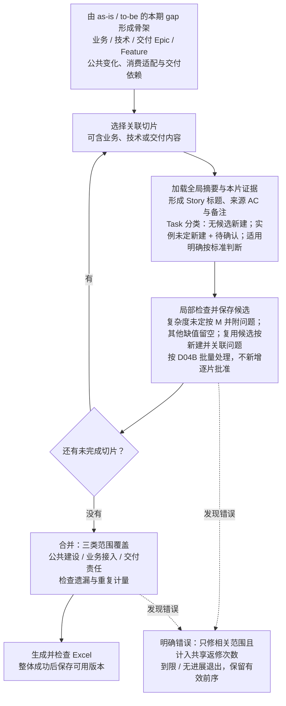
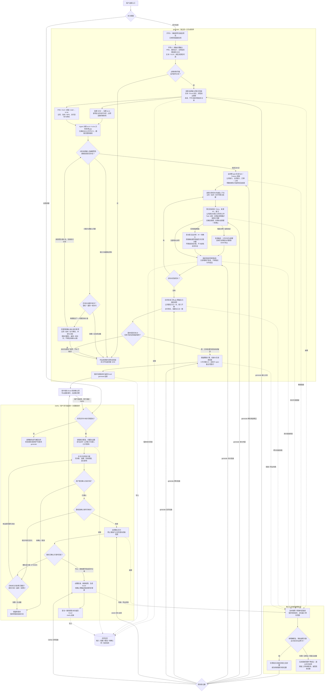
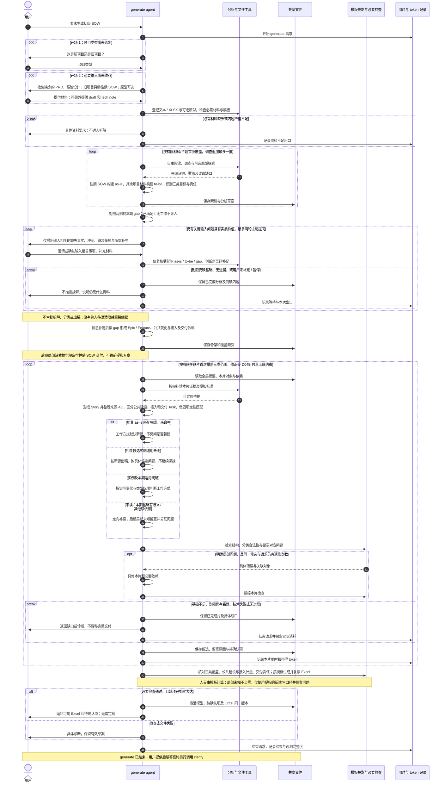

# 01 · 两个入口的流程与用户输入

[返回总览](README.md)

## 1. 两个独立请求

`generate` 首次形成 SOW；`clarify` 基于已有 SOW 处理答复、补充和修改。共享文件关联项目、模型和待确认项，不依赖同一聊天或暂停中的执行流程。

已有结果时再次要求生成，先识别用户是创建新方案还是修改当前方案，不静默覆盖现有结果。首次生成失败可恢复仍有效的分析和切片。已有业务 draft 是 generate 的辅助输入，详见 [10](10-draft-inputs.md)。

## 2. 固定开场：确定新旧项目并收集必要输入

开场交互固定完成两件事：确定新项目或旧项目；根据项目类型收集必要输入。已给出的项目类型直接复用，已提供的材料直接登记，只要求补充缺少的内容：

| 项目类型 | PRD | 高阶设计 | 原型 HTML/JS/CSS | 往期 SOW |
|---|---|---|---|---|
| 新项目 | 必需 | 必需 | 可选 | 不要求 |
| 老项目 | 必需 | 必需 | 可选 | 必需 |

除原型资源包外，只支持可直接读取的文本（默认 Markdown）与 Excel（首版 `.xlsx`）；PDF/DOCX、扫描件及其他格式暂不支持，要求提供相关可读内容，不自动转换。

高阶设计在本文简称 HLD。可额外提供 draft、tech note 或其他补充依据。开场不再固定询问用途、约束、范围和决策人；这些信息先从材料分析，真正缺少且影响推进时集中澄清。

先检查必需材料是否齐备及可读取。只有文件名、空壳模板或极少量标题不算资料充分。缺必需材料时直接说明应补什么，不能把原型、draft 或历史标题当作 PRD/HLD 的替代物。

## 3. 分析输入后：仅澄清和确认输入相关事项

agent 登记全部已提供输入，以往期 SOW 构建 as-is，以 PRD、原型、HLD 及其他项目材料构建 to-be；交叉分析业务、技术/NFR、交付的 gap、验收意图与责任边界。模板仅提供规则，不进入需求范围。主动识别公共能力及使用方、数据迁移和上线准备等本期工作，不等待材料提供现成的技术或交付标题。原型可选：没有原型不阻断；提供了相关原型则自主探索并明确实际观察与未验证内容。

分析后仅围绕输入中的业务、技术和交付事项整理待确认项、待决策项及需要补充的材料。提问说明来源、缺失或冲突、对输入理解的影响，以及需要用户回答的事实或作出的决定。可以解释输入中已有方案的差别，但不能虚构方案或替用户作决定。

| 输入事项 | 可以澄清或确认的内容 |
|---|---|
| 业务 | 本期范围、业务规则、验收意图，以及 PRD/原型中的歧义和冲突 |
| 技术 | 历史能力边界的具体冲突、HLD 方案含义及取舍、技术/NFR 约束、缺失技术事实；不例行追问历史是否已交付 |
| 交付 | 本期与外部责任、迁移范围及数据起点、发布条件、交付边界 |

这一阶段不要求用户批准 Epic/Feature/Story/Task 的组织和拆法、四项定性分类、切片安排或是否出稿。相关专业工作由 agent 完成。例如可以问“本次迁移有多少条记录”，不能把问题改成“请选这个 Task 的复杂度”。输入没有实质缺口就直接推进，不固定要求用户确认一遍分析摘要。Clarify 对具体修改方案的确认属于另一个入口，不受此处的提问范围替代。

| 情况 | 本次处理 |
|---|---|
| 必需材料缺失或基本业务/设计信息大量不足 | 要求补充资料，保留已完成分析，不进入生成 |
| 少量关键事实或决定可通过问答补足 | 集中交互；回答后仅复核相关结论和新增材料 |
| 回答后仍有可补足的关键缺口 | 还有一次补问额度且答案有实质进展时合批补问；到限仍缺基础就列补料清单结束，不反复追问 |
| 用户暂停、未补充或明确不知道关键事实 | 保留问题和分析，不用猜测、默认值或沉默批准向下推进 |
| 基本范围、验收意图与设计依据已足够支撑拆解 | 结束分析后澄清，进入分片生成 |

充分性由语义判断，不以问题数、页数或空值比例证明；执行另受 D04B 上限约束，默认首轮问题包加最多一轮补问。达到上限不代表资料已充分，基础仍不足就退出补料。用户提供判断所缺的业务、技术、交付事实与输入相关决定；agent 负责基于这些依据拆解和分类。

每轮只追问仍影响推进的内容，保留已答项。新答案改变结论时只复核关联范围，不重新分析整个项目。大量缺失用具体资料要求表达，避免用大量细碎问题试图凭空拼出 PRD 或 HLD。

## 4. Generate：整体骨架、逐片补全、合并出稿

信息补足后，agent 先按本期 gap 形成业务、技术和交付的 Epic/Feature 骨架、责任与依赖，再按关联切片联合形成 Story、来源 AC 与 Task。独立公共能力与业务接入分别界定工作、公共建设只计一次；迁移与上线准备进入交付层级。片内 Task 只做工作类型名称、工作方式、复杂度、集成类型的定性匹配；无相关候选时默认新建，候选实例适用未明时新建+待确认；实例及本次适用明确才按变化与标准判断，真正已满足且无工作不造 Task；人天交给模板。

切片可包含业务、技术或交付内容，粒度由关联与材料规模决定，不固定绑定 Feature、模型调用或子 agent。每片加载全局摘要、相关对象、证据及模板标准，局部检查后保存候选。合并时核对三类范围、公共建设与接入边界、交付责任及重复计量；只修相关内容。识别到必要工作但方案或责任缺依据时，按现有问答与留空规则处理，不为非业务需求另开审批阶段。

图源：[按片生成](diagrams/generate-slices.mmd)。

分析时足够推进，不等于已预知所有细节。后期复杂度无法识别就默认 M，其他局部字段没有依据则保留空白，在备注中定位问题并随 Excel 交付待确认项；不新增逐步骤问答，不为定档回头补证，不猜前提或采用未确认方案。后续答案由 clarify 在确认的切片内补入。

若后期发现的是大范围基础不足，而非局部字段缺口，停止推进并返回具体缺失和已完成草案，不能靠大量空行或“待确认”包装为可用初版。技术错误和明确内容错误也不能包装成业务未知。

必要检查完成后直接返回原模板填值的 Excel 与同版待确认说明。局部空缺在输入字段及问题中如实表达，金额让模板自己处理；不要求所有待确认项关闭，也不增加估算完整性门禁。

## 5. Clarify：讨论具体修改后更新

Clarify 接收对待确认项的答复、自由建议和新材料。先读取当前业务文件和有关输入，明确新信息怎样影响 Story、来源 AC、Task 分类、备注及待确认项。

方案说明改哪些对象、依据是什么、哪些字段可以补入、哪些仍需留空、预期影响和最深回查范围。用户确认后执行；答案草案不提前变成有效决定，未确认方案不修改当前 SOW。分类变更引发的人天变化由模板试算，不由 agent 自行估数。

仍缺证据时按需要讨论；不能用猜测填满。执行发现需扩大范围或改变方案时，保留原版本并回到具体方案讨论。成功应用直接返回新 Excel 与剩余待确认项，无后置定稿。详见 [04](04-bounded-change-and-recovery.md)。

## 6. 完整流程图

澄清最多两轮主动提问，追加调查最多一批；分片首次覆盖有限目标，返修另有请求级上限。故障恢复只处理原失败位置及必要依赖；新信息/新路径还须满足剩余轮次和有限范围才能继续。统一规则见 [D04B](detailed/D04B-bounded-loops.md)。

图源：[完整流程](diagrams/workflow.mmd)。

## 7. Generate 协作时序

时序图约束用户接入、共享文件与交付的协作顺序。阅读、探索和片内组织由 agent 自主决定。Clarify 独立时序见 [04](04-bounded-change-and-recovery.md)。

图源：[Generate 时序](diagrams/generate-sequence.mmd)。
