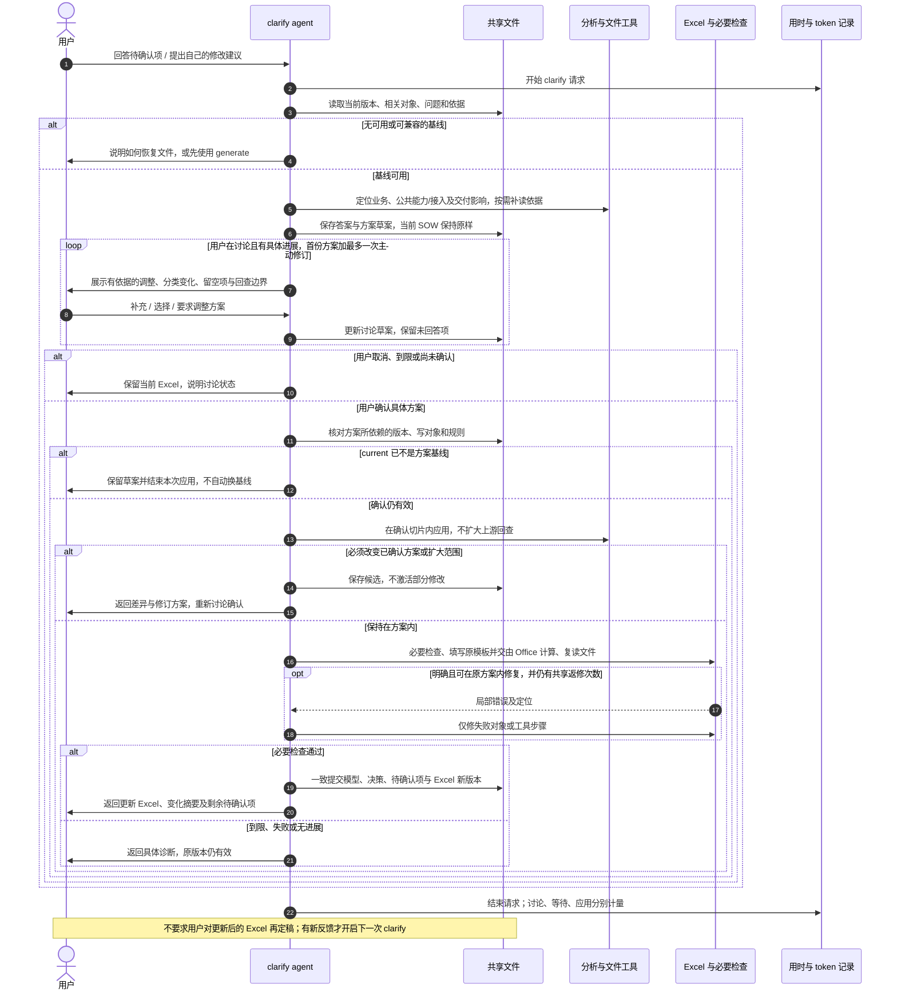

# 04 · Clarify：方案讨论、有限修改与恢复

[返回总览](README.md) · [D05 详细设计](detailed/D05-clarify-and-change-scope.md) · [EX05 修改走读](detailed/examples/EX05-clarify-changes.md)

## 1. 从反馈到具体方案

Clarify 接受对待确认项的答复、自由修改意见和新材料。先定位它们涉及的已有对象与依据，再讨论调整方案。问题编号可加快定位，但不要求用户学内部 ID；自然语言存在多种合理指向时，先展示候选定位让用户选择。

用户可讨论输入中已有方案或明确修改，Agent 进行必要局部分析并展示专业变化。金额让原模板计算，插件不分析金额差异；用户明确需要候选 Excel 时才生成原模板预览，讨论不更新有效 SOW，也不为一句建议重读全部输入。

一次方案至少说明：

| 内容 | 需要具体到什么程度 |
|---|---|
| 目标与依据 | 用户哪条回答或建议引起什么变化；原有范围与新范围 |
| 修改对象 | 明确对象集合及新增对象归属；不能写“相关部分”作为无限授权 |
| 读取依赖 | 相关原文、范围决定、公共义务、共享计量和模板规则 |
| 调整方式 | 增删、拆合、内容变化、工作类型、工作方式、复杂度或集成类型变化，以及义务的去向 |
| 影响 | Story/AC/Task、范围、人天和责任的可预见变化；不能量化的影响单列 |
| 待确认项处理 | 哪些会关闭、重写、保留或新建，哪些字段有依据可以补入，哪些继续留空 |
| 回查与续接 | 最深回查对象、责任层与最大深度；完成后接哪些必要检查和导出 |
| 完成判据 | 本片内应满足的关系、覆盖、计算及与保留部分的边界 |

用户确认的是这份具体方案。一条明确表达“按刚才方案执行”的消息可以构成确认，不必再点专门按钮或复述所有字段。含糊答复、沉默、仅补充事实或“让我看看方案”不表示确认。

补充往期 SOW 或更正历史边界时，先复核相关 gap 与 Task 匹配，包含原先“未匹配→新建”的判断。新增历史记录可能影响原来没有命中引用的 Task，不能只按已匹配来源查影响。按主题和资产/工作边界限定回查与写集合，提出具体变化后确认；不因历史文件新增就重新生成整个 SOW。

## 2. 切片如何闭合

Clarify 的修改切片按本次反馈重新界定，不要求沿用 generate 的分片边界。可以只修改一个已生成片的局部，也可以联合涉及多个原片的相关对象。

切片以业务变化为中心，可以覆盖多个层级。例如更改某项验收要求时，把该 Story 的相关 AC、Task、估算和待确认项放在同一片内；不必人为拆成多次跨阶段返修。

显式引用只提供影响线索。agent 还要检查共享服务、公共验收和责任等隐含关系。无关对象只读；共用对象必须明确单一写入与计量归属。切片是否闭合由具体义务和影响证明，不能仅凭“不超过几个对象”判断。

技术和交付需求同样参与影响判断。公共 NFR 能力的责任或接口变化时，定位其技术 Story 与相关业务接入 Story；迁移或上线条件变化时，定位相关交付 Story 和真正依赖它的功能。方案区分公共建设、各方接入与交付执行的改动和计量，保留无关 Story，不因引用同一个公共能力就全项目重拆。工作方式仍逐 Task 按事实判断，不能一律改为接入复用。

全局变化不能伪装成局部修改。若新政策触及多个业务区域，应在讨论时列出有限批次及先后关系；用户选择本次范围后再执行。尚未调整部分仍适用原版本前提，必须在结果中清楚区分。若新旧前提不能共存，就不能交付看似一致的半套修改，需要先决定能形成一致结果的范围。

## 3. 回查几步、退到哪里

以下是定位根因的责任坐标，不是必须按序运行的四个阶段：

| 层 | 内容 |
|---|---|
| 0 | 原始输入、用户事实与决定 |
| 1 | As-is/to-be/gap、历史匹配范围、责任、依赖与分析依据 |
| 2 | Epic / Feature / Story / 来源 AC / Task 及四项定性匹配 |
| 3 | Excel 投影、计算结果与交付说明 |

方案声明具体回查对象和最深层，深度等于起点层与最深层的差；不是允许任意往返的次数。回查层 0 只表示补读原件或处理用户提供的新事实，不允许 agent 改写原件、替用户编造决定。

| 修改或故障 | 最深回查 | 最大深度 | 应续接的工作 |
|---|---|---|---|
| Task 分类错，业务边界不变 | 层 2 的该 Task 与所用规则 | 0 | 相关估算、必要检查、Excel |
| Story 责任变化导致 Task 调整 | 层 1 的该项范围与责任依据 | 1（从层 2） | 同片 Story/AC/Task 与交付 |
| Excel 中任务显示错误，根因是模型字段 | 层 2 的具体对象 | 1（从层 3） | 相关模型修正及 Excel |
| Excel 暴露范围依据矛盾 | 层 1 的特定范围决定 | 2（从层 3） | 同片依据与交付对象 |
| 用户纠正原始事实，影响当前工作簿 | 层 0 的该事实 | 3（从层 3） | 该事实影响的分析、模型与 Excel |
| 仅导出格式或显示问题 | 层 3 的文件步骤 | 0 | 重做相关文件操作，不重做业务分析 |

回查深度与往返次数分别控制。D04B 默认一次定位扩展、首份方案加最多一次主动修订；应用中要求扩大也计入这一次修订，不能形成无限返回讨论。

数字只表达本方案边界，不意味着每次修改最多统一退若干步。必须先找到必要根因，再确定最小且完整的回查范围。执行中发现还要更深或改更多对象，原方案停止应用，带着具体差异回到讨论；不递归扩大冻结的切片。

## 4. 确认、应用与一致生效

1. 讨论阶段保存答案、候选分析和方案草案。当前 SOW、已应用决定及待确认项有效状态保持原样。
2. 方案确认后，核对它依赖的基线、输入和模板仍然有效。current 不等于方案基线即停止旧候选应用并保留草案，不判断相关性或自动换基线。
3. 在隔离的候选中完成整个切片。复杂度无法识别按 M 并附问题；其他无默认口径的缺依据字段留空并列为待确认项，不补猜前提。如果新信息推翻已有值的依据，方案应说明清空或更正该字段；若改变已确认方案或扩大切片，先重新讨论。
4. 检查真实改动是否在范围内，相关引用、公共义务、分类和待确认是否一致。必要检查覆盖变化及依赖，低成本全局 ID/引用检查可执行；AC 来自输入或用户明确答复，分类输入如实填写，金额只由原模板计算，插件不干预结果。
5. 同时提交模型、已应用决定、待确认项和 Excel，返回新文件及变化摘要。未回答问题继续保留；收到但尚未应用的答案不假作已解决。

后半片失败时不能先让前半片生效。用户取消或未确认就离开时，保留原 Excel 和可恢复的讨论草案，不自动继续，不催促，也不把未回复记成同意。

## 5. 最小修复与恢复

| 情况 | 本次处理 | 保留什么 |
|---|---|---|
| 明确局部内容错误，原方案内可修 | 定位后只修相关对象，续接必要检查 | 无关对象、有效证据和已成功分析 |
| 工具或 Excel 步骤失败 | 只恢复失败步骤，不重做专业拆解 | 合法候选、模板及仍适用的检查 |
| 需要扩大切片或改核心方案 | 不激活候选，返回具体修订方案讨论 | 当前有效版本与已完成草案 |
| 同因无进展 | 结束本次应用并说明实际障碍 | 当前有效版本与诊断 |
| 保存前中断 | 根据完整性记录恢复候选 | 上一有效版本 |
| 保存后响应丢失 | 核实是否已经提交，返回已有结果 | 已成功的新版本，避免重复应用 |
| 旧草案对应的基线已不是 current | 拒绝旧候选应用，保留草案，不自动合并或重建 | 最新有效版本与本次草案 |

首版优先串行应用和提交。草案讨论可独立进行，但不能用最后写入覆盖另一条已生效意见。跨请求复用检查时必须确认被检查内容和规则未变化。

## 6. Clarify 协作时序

循环只发生在 D04B 上限内的用户方案讨论或有明确修法的局部恢复中；到限保存草案/诊断及当前版本，之后有实质新输入才定向接续。没有固定的全项目“检查—修复—回退—重审”环。

图源：[Clarify 时序](diagrams/clarify-sequence.mmd)。
