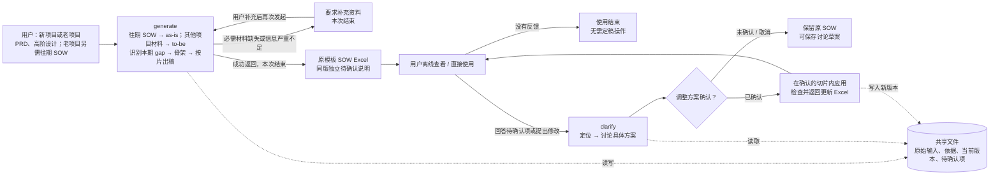

# AI SOW Lite 设计总览

**核心：generate 补足必要信息后快速出稿；clarify 根据用户答复或意见，讨论并应用有限修改。两入口共享文件，流程独立。**

**优先级：准确性与减少可避免的返工在先，耗时与 token 优化在后。** 准确性包括业务、技术、交付范围及依据完整，未知如实表达，改稿不误伤其他范围；不能通过遗漏需求、补猜结论或削弱校验获得更快结果。默认 M、实例未定按新建加待确认仍是已授权口径，不为追求确定性增加反复查证或审批。验收先核对专业结果，再比较同等质量下的成本，见[质量与返工口径](../validation/performance.md#质量优先与返工口径)。

本目录保存独立的 Lite 设计。实际开发进度、阶段提交与验证入口统一见 [实施目录](implementation/README.md)，连续实施中的取舍见 [自主决策记录](../validation/implementation-decisions.md)。ai-sow 已跑通，Lite 的目标是降低出稿与修改的耗时和 token；安装、基础技术栈和 Excel 操作复用已有实现经验，仅对差异和未知能力补测。模板使用用户选定的 [sow-template.xlsx](../../assets/sow-template.xlsx)，保持可独立手填的可见结构及 SIT/UAT 只读公式。

领域边界从 [13 自检结论与已定边界](13-self-review-and-decisions.md) 和 [设计审阅入口](REVIEW.md) 查看。单人串行、金额交给原模板且不改模板已落实到设计及实施计划；实际支持范围以对应验证记录为准，设计完成不代表功能已实现。

## 1. 用户如何使用

1. 调用 `generate`，完成开场第一件事：确定新项目或旧项目；已说明项目类型就直接复用。
2. 完成开场第二件事：收集必要输入。所有项目都要 PRD 和高阶设计；旧项目额外需要往期 SOW；Prototype（HTML/JS/CSS）可选。已有 draft 和 tech note 可作为辅助输入，已有材料不重复索取。
3. agent 用往期 SOW 构建 as-is，用其余项目材料构建 to-be，识别业务、技术及交付的本期 gap；之后只澄清和确认输入相关的缺失事实、歧义、冲突与待决策项。问题先合批，最多首轮加一轮补问；仍缺基础则补料退出；不要求用户批准拆解、分类或出稿。必需材料缺失或信息严重不足时，不推进拆解。
4. 信息补足后，先按本期 gap 形成覆盖三类需求的 Epic/Feature 骨架，区分公共能力建设、业务接入与迁移/上线等交付工作，再按关联切片补全 Story、AC 与 Task，合并检查后输出 Excel。
5. 复杂度无法判断时默认 M，附待确认项直接出稿，不回头反复找定档证据；其他局部缺依据字段保持空白并随 SOW 给出待确认项。agent 不猜前提、不代选未知方案或人天；工作方式在无相关候选时默认新建；有相关候选但实例/适用性未定时，也先按新建并附确认项。
6. 用户可以直接带走 Excel 与同版待确认说明，无需回来定稿。后续改稿需保留原项目的 `.ai-sow-lite/` 共享文件，并在该项目中调用 `clarify`；新会话不需要原聊天。讨论具体调整方案、确认后在限定切片内更新并返回新 Excel。只有 Excel 附件不能恢复完整修改基线，按 [D05](detailed/D05-clarify-and-change-scope.md) 处理。

图源：[两个入口](diagrams/entrypoints.mmd)。文件关联不表示 generate 挂起等待 clarify。

## 2. 已确定的输入与输出

| 项目类型 | 必需输入 | 可选输入 |
|---|---|---|
| 新项目 | PRD、高阶设计 | 原型、已有 draft、tech note 等补充材料 |
| 老项目 | PRD、高阶设计、往期 SOW | 原型、已有 draft、tech note 等补充材料 |

除原型资源包外，输入只支持可直接读取的文本（默认 Markdown）与 Excel（首版 `.xlsx`）；PDF/DOCX、扫描件及其他格式暂不支持，需提供可读文本/Excel 内容。模板独立提供标准和输出格式，不参与 as-is/to-be 需求范围。

往期 SOW 直接作为估算 as-is，不另设逐条交付核验。历史只保留能识别的层级、说明和来源，不要求补历史 AC 或 Task 类型。只有实例适用已明确时才按变化判断调整/接入复用或排除已满足工作；无候选默认新建；相关候选实例未定则新建+待确认。未读/失败或本期基础不足仍按真实缺口处理。见 [D03](detailed/D03-input-analysis-and-exploration.md) 与 [EX03](detailed/examples/EX03-as-is-to-be-gap.md)。

文件齐备还要检查内容是否充分。仅有 Epic/Feature 标题和技术备注，通常不足以支持来源 AC、业务规则、实际起点及工作分类，不能替代必需输入。

| 对象 | 用户可见的专业内容 |
|---|---|
| Epic / Feature | 对应模板中的“需求 / 子需求”，形成整体骨架 |
| Story | 标题、从输入提取的 AC、备注 |
| Task | 任务名称、工作类型名称、工作方式、复杂度、集成类型、备注 |

agent 按 `90-估算标准` 做四项定性匹配。基础人天、系数、SIT/UAT 支持和汇总由模板规则与公式负责；agent 不估数、不调参数凑总量。关联 ID、来源和留空原因拟保存在独立内部文件，不扩张 Story/Task 的业务字段。当前模板不保留隐藏 agent 辅助列，其格式与写入适配另行设计。

AC 表达验收结果，Task 表达实施工作，两者在同一片内联合形成，不逐条转换或强制一一关联。页面、API 等“实施对象”仅帮助 agent 理解工作针对什么，不新增业务实体、独立阶段或必填字段，详见 [02](02-inputs-and-domain-model.md)。

技术和交付需求也是完整的 Epic/Feature/Story 拆解对象。agent 从 PRD、原型和 HLD 主动识别有依据的 NFR 能力、迁移与上线准备等内容；独立公共能力单列建设工作，业务 Story 保留自身功能及必要接入适配，公共建设只计一次。未明确的方案、责任和验收条件仍按澄清或留空规则处理，不能按通用清单自动加范围。

SIT/UAT 适用性属于模板标准。系统集成类 Task 的 SIT适用为是，Story 含任意 SIT 适用 Task 就自动适用。UAT 则按是否直接交付系统功能判定，设计、PoC、Spike、部署等类型不适用；Story 包含任意 UAT 适用 Task 就由公式自动标记为适用。agent 和用户不填写或覆盖这两项公式结果，也不为适用性另设决策步骤，详见 [05](05-excel-and-delivery.md)。

## 3. 交互与留空边界

| 位置 | 行为 | 推进条件 |
|---|---|---|
| 固定开场 | 确定新旧项目，并收集对应的必要输入；已有信息复用 | 必需输入齐备且可分析，才开展后续分析 |
| 分析后澄清 | 仅澄清和确认输入中的业务、技术、交付事项；首轮合批，最多一轮补问；到限按基础/局部出口处理 | 基础信息补足即生成；没有输入问题不增加摘要、拆解或分类审批 |
| 分片生成与合并 | 复杂度未定按 M 并附问题，其他局部无依据字段留空并关联待确认项 | 基础仍充分；不能用大片空白包装严重不足 |
| clarify 讨论 | 读取现有文件和新答复，提出有依据的具体修改方案 | 用户确认方案后应用；仍未知的字段保留空白 |
| 每次成功返回 | Excel 和同版待确认项一起交付 | 无额外定稿、批准结果或再次导出步骤 |

局部未知是允许的业务状态，输入空值和业务缺口如实记录。金额、空白参与计算及 SIT/UAT 均由原模板处理；插件不改公式或结果、不判定金额完整性。插件只修自身填值、引用或文件错误，模板提示不要求 Agent 补猜数值。

## 4. 执行与稳定性

agent 自主选择专业活动和切片粒度。小项目可以一片完成，大项目逐片保存；不强制每个 Feature 对应一次调用。骨架来自 as-is/to-be 对照后的本期 gap 与责任，分片依据目标、证据量和关联边界。先以一个 generate Skill、一个主 session、无 subagent 梳理从开场到 Excel 的全部输入输出，区分当前所需信息、文件成果和实际历史累积，见 [D04A 全景](detailed/D04A-single-session-panorama.md)。分片和落盘不会清空历史；先观察并减少重复读取/生成，验证宿主压缩和恢复，再判断是否需要局部隔离及并发。[D04](detailed/D04-generate-and-context.md) 保留其条件边界，尚未选定多 agent 执行。

原件始终保留，输入按物理格式、材料类型和使用用途理解。轻量索引与分析结果按需提取，区分物理读取与用途分析覆盖，不要求全量 IR。[D03](detailed/D03-input-analysis-and-exploration.md) 明确角色/用途区域、来源定位、原型探索结束条件和输入问题移交；[EX02](detailed/examples/EX02-input-analysis-and-exploration.md) 走读多用途材料、原型冲突和局部未知。原型未观察到的交互不能认定不存在，保存观察不等于证明真实后端能力。

代码负责可靠文件操作、结构和引用检查、原模板填值及 Office 调用、串行版本一致性、有限编辑构造和资源记录。金额由模板计算，不设金额门禁。Clarify 的修改切片按本次反馈界定，可跨越初版生成片，但不能超出已确认方案。相同错误没有新依据或具体修法时停止自动恢复。

[D04B](detailed/D04B-bounded-loops.md) 统一探索、补问、返修及恢复的批量范围、追加上限和退出机制；新路径或新回复本身不能无限延长流程。埋点独立记录真实用时/token，用于优化，次数控制不变成资源预算审批。

## 5. 文档导航

用户指定旧版资料的筛选见 [12 专业资料吸收评估](12-reference-absorption.md)：专业方法与反例已同步到 [P00—P04 执行计划](implementation/README.md)，包含参考文件归属、五组生成夹具、有限修改/原型反例及资源实测要求；与 Lite 冲突的旧规则不迁入。设计 review 已收口，当前按执行计划推进；尚未实现 Skill。

详细设计层级、专题、依赖顺序与验证安排见 [11 详细设计路线图](11-detailed-design-roadmap.md)。[详细设计](detailed/README.md) 已包含 R0 交互、R1 数据/工具接口、R2 输入分析、Generate 与 [D06 Excel 投影](detailed/D06-excel-projection-and-delivery.md)，以及场景追踪表。[EX04](detailed/examples/EX04-excel-projection.md) 走读独立问题说明、原模板填值、安全名称关联与修改后的交付。[D05 Clarify](detailed/D05-clarify-and-change-scope.md) 与 [EX05 修改走读](detailed/examples/EX05-clarify-changes.md) 已细化有限候选、部分答复、拆合和异常出口。[D08 观测与性能](detailed/D08-telemetry-and-performance.md) 与 [EX06 计量走读](detailed/examples/EX06-telemetry-accounting.md) 已定义实际采集、去重/共享/未知和性能对照，并记录有限宿主只读证据。[D09 设计收口与实现增量](detailed/D09-validation-and-implementation.md) 已完成接口衔接核对及 I1—I4 规划，[EX07](detailed/examples/EX07-design-consistency.md) 补充尚未拆明工作与首次生效反例。下一步是 I1 可靠程序交付；逐活动 usage 与输出/修改适配仍待实际验证。

技术栈参考 ai-sow 已验证的 Python 3.12、uv、jsonschema、openpyxl 与 Office 处理路径，[D00 技术栈与运行形态](detailed/D00-technology-stack.md) 列出来源版本、可复用证据、Lite 差异和新能力验证。R0—R1 先复用证据，仅前置会影响共享接口的未知能力；不重复开展成熟能力的基础可行性选型。

| 主题 | 文档 |
|---|---|
| 详细设计的层级、轮次与专题交付物 | [11 详细设计路线图](11-detailed-design-roadmap.md) |
| 设计衔接、最早验证与最小实现增量 | [D09 收口与实现规划](detailed/D09-validation-and-implementation.md)、[EX07 合同反例](detailed/examples/EX07-design-consistency.md) |
| 首批详细设计与三类需求贯穿样例 | [详细设计目录](detailed/README.md)、[EX01](detailed/examples/EX01-generate-clarify.md) |
| 技术复用基线、运行形态、依赖及差异验证 | [D00 技术栈与运行形态](detailed/D00-technology-stack.md) |
| 用户流程、完整图与 Generate 时序 | [01 流程与用户输入](01-workflow-and-user-input.md) |
| As-is、实例、复用候选与待确认用语 | [领域用语](CONTEXT.md) |
| 全部环路的批量范围、次数与退出 | [D04B 环路控制](detailed/D04B-bounded-loops.md) |
| 输入职责、逐步产物与最小业务字段 | [02 输入与领域模型](02-inputs-and-domain-model.md) |
| Agent 自主工作、切片与上下文 | [03 执行与检查](03-agent-execution-and-review.md) |
| 修改方案、回查边界与 Clarify 时序 | [04 有限修改](04-bounded-change-and-recovery.md) |
| 原模板填值、字段映射与独立问题说明 | [05 Excel 与交付](05-excel-and-delivery.md) |
| 用时、token 与性能验证 | [06 资源观测](06-observability-and-validation.md)、[D08 详细设计](detailed/D08-telemetry-and-performance.md)、[EX06 计量走读](detailed/examples/EX06-telemetry-accounting.md) |
| 剩余实现与样例验证事项 | [07 设计缺口](07-gaps-and-decisions.md) |
| 各阶段与组合异常 | [08 场景目录](08-scenario-catalog.md) |
| 两 Skill 的业务文件与草案边界 | [09 共享文件](09-shared-files.md) |
| BA 已有 draft 的价值及信息充分性 | [10 Draft 辅助输入](10-draft-inputs.md) |

最小贯穿验证包括：新老项目材料要求、分析后两轮内批量补充及到限退出、业务/技术/交付范围覆盖、公共建设与接入的单一计量、来源 AC、四项分类、局部留空、模板计算，以及新会话 clarify 确认后有限更新。任何一次成功返回后，用户离开也不影响文件可用性。
