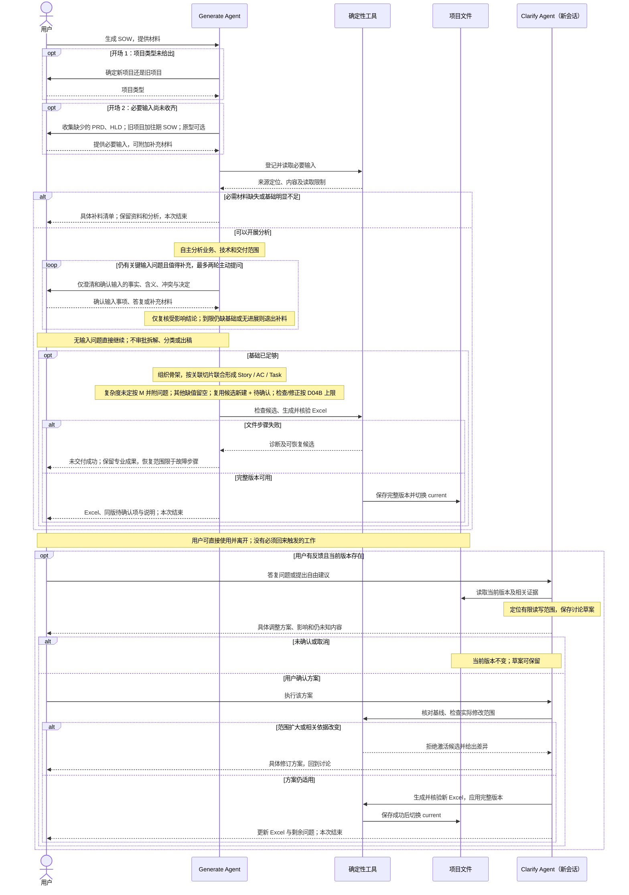

# D01 · 交互与结果

[详细设计目录](README.md) · [概要规则](../01-workflow-and-user-input.md) · [贯穿样例 EX01](examples/EX01-generate-clarify.md)

状态：R0 设计完成，已用合成材料走读；不是 Skill 执行或 Excel 生成的测试结论。

## 1. 职责与决定权

本专题定义用户什么时候参与、每次请求怎样结束，以及下一次如何接续。专业分析、读取顺序、原型探索路线和片内拆解由宿主 agent 决定。代码验证文件与候选是否合法，不通过问题数、页数或空值比例替 agent 判断资料充分性。

用户决定项目事实、本期责任、需求与方案取舍；agent 可以从材料组织新的 Epic/Feature/Story 标题和实施工作，但不能新增未经支持的需求、架构选择、验收阈值或估算前提。模板决定计算与 SIT/UAT，用户回答业务事实，不需要回答“Story 是否 SIT/UAT 适用”。

已有 current 时，重复取相同请求结果直接复用；对现版的修改进入 clarify，另建独立方案使用明确的新项目目录，不静默覆盖。新建目录的必要机械初始化随首次 ingest 完成，不增加第三个用户入口或 setup 问卷。

## 2. Generate 的输入、交互与产物

| 活动边界 | 使用什么 | 用户参与 | 产生什么 |
|---|---|---|---|
| 开场：确定新旧项目 | 请求中已有或补充的项目类型 | 已明确则复用，未明确才问新项目还是旧项目 | 项目类型及对应必要输入清单 |
| 开场：收集必要输入 | PRD、HLD；旧项目加往期 SOW；可选 Prototype、draft、tech note | 收集所缺必要材料，已有材料直接登记 | 必要输入、原件版本与用途登记；缺件说明 |
| 全输入分析 | 上述材料及其关联资源；模板的工作边界按需查阅 | 先分析和汇总输入问题，不在分析过程中逐项提问 | 轻量 as-is/to-be/gap 与依据索引、三类范围、匹配/读取限制、输入问题包 |
| 分析后澄清 | 输入问题包、用户答复或新增材料、关联分析 | 只澄清和确认输入相关的业务、技术、交付事项；首轮合批，最多一轮补问 | 输入事实、含义、冲突与决定得到补充/确认，或具体补料请求；定向复核关联结论 |
| 骨架与分片 | 可推进依据、原件定位、模板标准；按需补读 Prototype/HLD 等 | 局部未知随结果带出；基础被推翻则中止并说明缺口 | Epic/Feature，逐片联合形成 Story/AC/Task、依赖和待确认项 |
| 合并和交付 | 各片候选、覆盖索引、模板、当前问题 | 不增加逐片批准、最终批准或后置定稿 | 同版模型、Excel、待确认项、依据、说明、资源摘要 |

非原型材料只接收可读文本（默认 Markdown）和 `.xlsx`，不支持 PDF/DOCX、扫描件等或自动转换。往期 SOW 构建估算 as-is，其余项目材料构建 to-be；用户只需澄清真实的输入缺口/冲突，不额外逐条证明历史已交付。历史粗粒度不强求补历史 AC/Task 类型；无相关候选默认新建，相关候选实例未明则新建+待确认。未读/失败及本期基础不足仍是缺口。

“全输入分析”要求登记并判断所有提供材料的用途和相关性，覆盖与本期相关的内容。它不要求先把每份原件的每一行转换为 IR，也不把未读区标成没有要求。

### 2.1 充分性采用影响判断

agent 对缺口回答三个问题，并保留简短理由：**影响哪项范围或工作？哪些已知结论仍成立？未知能否明确隔离而不暗示默认方案？** 不维护打分模型。

| 判断结果 | 具体例子 | 行为与出口 |
|---|---|---|
| 必需材料缺失/不可用 | 老项目没有往期 SOW；PRD 只有空目录 | 索取缺失材料及其用途，保留已登记原件；本次不进入生成 |
| 少量关键事实待定 | 已知需承接旧数据，但本期是否承担迁移未定 | 分析后问用户；答案足够后定向更新分析继续 |
| 关键事实仍未补足 | 仅回答“要迁移”，仍没有数据起点、目标和切换方向 | 仅在尚有一次补问且可获得实质答案时合批补问；否则列补料清单退出，不用长问卷代写 HLD |
| 可隔离的局部未知 | 单一源目标、映射及回滚已定，条数暂未知，仅影响迁移 Task 复杂度 | 条数只影响定档时不为此追加问答或补证；形成 Task 后默认 M，关联待确认项随初版交付 |
| 历史存在相关 API/事件，但实例适用未明 | 本期目标清楚，仅不确定是否采用某历史实现 | 按新建出稿并附具体复用候选问题，默认随 Excel 带出；不阻塞为历史补规格 |
| 后期发现局部未知 | 匹配标准时发现某个 API 的独立权限规则没有依据 | 留空受影响字段并带出问题；不临时增加阶段批准 |
| 后期发现根本不足 | 多数功能只有名称，HLD 没有可据以界定工作的方案 | 停止生成，保留可复用草案，说明缺什么；不能把大片空表叫作可用 SOW |

数量少不一定局部，数量多也不一定基础不足。例如一个租户隔离方案可能改变全案；多项仅影响各自复杂度的未知则可能互相独立。判断必须说明影响，不能仅以“缺一点/很多”作理由。

### 2.2 问题包的内容

每项只包含输入的歧义、冲突、缺失事实或待决策事项，说明来源、为什么现在需要、用户可直接回答的问题及影响范围。可列材料中已有的选项及各自影响；没有依据就不编推荐架构。能在原件中继续查清的先查，不把专业工作转交用户。

| 事项范围 | 合法问题示例 |
|---|---|
| 业务输入 | PRD 与原型对该操作的角色范围不同，本期以哪个范围为准？ |
| 技术输入 | HLD 对本期系统边界有两种冲突说明，以哪项为准？如果必须修改指定旧接口，该接口具体指哪个？ |
| 交付输入 | 迁移资产、生产执行分别由谁负责？本次迁移数据条数和切换条件是什么？ |

不询问用户是否接受 Epic/Feature/Story/Task 拆法、四项分类、切片安排或是否出稿；这些由 agent 根据已足够的输入负责。数据条数属于输入事实；仅影响定档的缺口直接采用 M 并留问题，用户可随后确认或调整。影响范围/方案/责任的规模事实仍属于必要输入澄清。输入没有实质待澄清事项时跳过该交互，不固定请用户批准分析摘要。此边界适用于 generate；clarify 仍需讨论并确认具体调整方案。

EX01 的问题是“本期是否包含迁移资产和发布方案，生产执行由谁负责？”条数缺口只影响复杂度，形成 Task 后默认 M 并附待确认，不为此提问；之后没有第二个“是否允许带问题出稿”的审批。

默认首轮问题包加最多一轮定向补问；每轮只复核答案触及的事实和结论，无进展提前停止，到限仍缺基础则列补料清单结束。复用候选问题可以在工作方式已有新建值时保持 open，缺值问题才要求对应字段为空。规则见 [D04B](D04B-bounded-loops.md)；沉默不代表决定，用户后来实际补料只续接相关范围。

## 3. Clarify 的输入、讨论与应用

| 边界 | 输入 | 处理与结果 |
|---|---|---|
| 恢复 | 当前版本、模型、问题、已应用决定、证据索引、本次反馈 | 不读取 generate 聊天作为必要条件；从问题 ID、标题或描述定位对象 |
| 定位与补读 | 相关对象和关系、原件、用户答复 | 歧义对象请用户选清楚；事实答案保存在草案，不立即关闭当前问题 |
| 讨论具体方案 | 当前值、依据、预期变化、涉及对象与回查边界 | 告知哪些字段将填入/清空/变化、公共或交付依赖是否受影响、剩余未知；如需试算只用模板 |
| 确认 | 用户针对已展示方案的明确执行意思 | 保存方案身份和简短确认依据；“按刚才方案执行”足够，不重复确认 |
| 应用 | 确认的方案、仍有效的读依赖、候选修改 | 检查实际 diff 在范围内；生成一致的新 Excel，再让完整版本生效 |
| 返回 | 新版本与剩余问题 | 说明实际变化；用户可直接使用，无定稿入口 |

确认对象是**具体调整方案**，不是每个 Task 的推理过程。没有 SOW 当前版本时不暗中转入全生成；先说明缺失文件以及是否能恢复。仅有用户自制 draft 则沿 generate 的输入要求处理。

## 4. 两入口协作时序

图源：[两入口交互时序](../diagrams/detailed-interaction-sequence.mmd)。此图固定的是角色间的输入、确认与保存关系。图中 agent 的专业活动不是一次模型调用，也不规定阅读、探索或切片内部的固定时序。工具故障恢复与保存中断细节见 [D07](D07-tools-storage-and-recovery.md)。

## 5. 请求出口与接续

以下是交付语义，不是领域步骤状态机。共享业务版本只认 `current.json`，草案或日志里的结果名称不能让版本生效。

| 出口 | 用户拿到什么 | 保留什么 | 接续位置 |
|---|---|---|---|
| 已交付 | 已重算、检查的 Excel；同版问题与说明 | 完整不可变版本 | 有意见才发起 clarify |
| 需要补充信息 | 具体缺失内容及影响；已有 Excel 如有仍可用 | 原件、有效分析、草案 | 同入口读取补充材料，仅续接受影响分析 |
| 讨论未应用 | 已讨论方案、未定事项；原 Excel | 讨论草案 | clarify 接续方案，复核基线 |
| 用户取消 | 本次未应用的说明；原 Excel | 已保存草案可保留，迟到候选不能生效 | 新请求显式恢复；不能自行后台继续 |
| 执行失败 | 具体技术诊断、保留位置和最小恢复范围 | 原版本、有效候选 | 已有具体修法时恢复局部步骤 |

若没有新依据或具体修法，相同失败不因换措辞、重开 worker、换切片编号而获得新一轮自动重试。已经提交但响应丢失是“找回已交付结果”，不是重新修改。

## 6. 上下文、开销与验证

问题包只带受影响的原文摘录、当前解释及需要回答的事实；跨会话只带当前索引和本次切片。用户等待与实际工作分开记录，离线查看 Excel 的时间不计入 generate。宿主没有逐步 usage 时保留真实粒度和未知，不能按问题数或切片数分摊。

走读开场及正常结果见 EX01 第 1—6 节，短分支见其第 7 节。对应 IN01—IN16、IN18、CL01—CL10、CL16—CL17、X01—X02；保存类分支由 D07 和 [D09](D09-validation-and-implementation.md) 接续。D01 不替代后续宿主真实问答、取消和新会话试运行。
