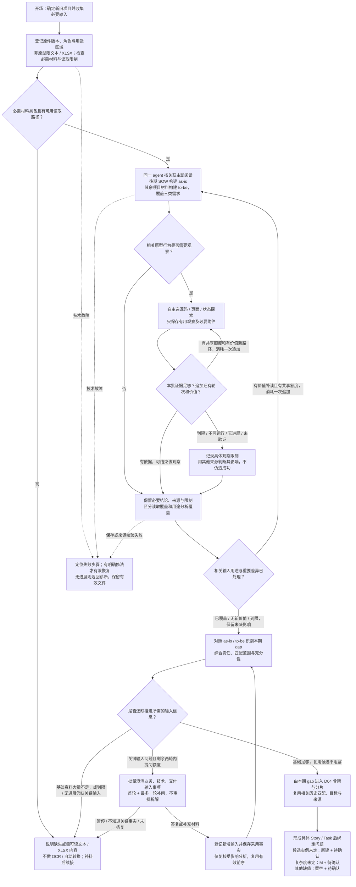

# D03 · 输入分析、原型探索与必要提取

[详细设计目录](README.md) · [单 session 全景](D04A-single-session-panorama.md) · [数据与依据](D02-shared-data-and-evidence.md) · [EX02 输入走读](examples/EX02-input-analysis-and-exploration.md)

状态：R2 详细设计首稿，覆盖 D04A 的 G1—G4 以及生成/clarify 的定向补读。以一个 Skill、同一个主 session 完成为基线；未实现读取适配、浏览器执行或真实性能测量。原件、必要分析和局部候选沿用 D02/D07，不增加全量 IR、输入分析子 Skill、固定页面 Action 或独立 Reviewer。

## 1. 本阶段的目标与交付边界

输入分析要回答：往期 SOW 中的 as-is 是什么，PRD/HLD/原型等项目材料要求的 to-be 是什么，两者之间有哪些本期负责的 gap，哪些输入事项还需用户补充。业务、技术/NFR 和交付三个视角都要覆盖。分析结果供骨架与片内判断使用，不提前生成完整 Story/AC/Task 再重写。

| 使用方 | 从输入分析得到什么 | 不需要得到什么 |
|---|---|---|
| 分析后输入澄清 | 缺失/冲突的事实或决定、具体来源、影响与需要补充的内容 | 让用户批准层级、Task 分类或出稿的清单 |
| D04 骨架 | 本期 gap、as-is/to-be 来源、已满足/排除说明、责任、公共建设与消费边界、交付前提及限制 | 所有原文和探索日志；先写完的完整明细模型 |
| 本片 Story/AC/Task | 本片 gap、目标验收意图、相关 as-is 与匹配范围/结果、方案、规模事实及标准入口 | 全项目所有分析的复制件；由输入阶段猜出的分类和人天 |
| Clarify | 当前结果使用的依据、原件定位、采用事实及相关主题；本次变化的影响线索 | Generate 的完整聊天或必须恢复的输入分析流程位置 |
| 机械检查/资源观测 | 不可变来源、适配身份、覆盖与缺口、实际读入/返回/恢复事件 | 代码作出的语义充分性判断或编造的逐步 token |

开场固定完成项目类型与材料收集。所有项目需要 PRD/HLD，旧项目额外需要往期 SOW，原型可选；已有信息不重复询问。后续仅在全输入分析后澄清业务、技术、交付输入事项。格式/运行技术故障先按实际能力处理，不把工具出错转成让用户批准错误结果。

## 2. 文件、材料角色与用途

### 2.1 齐备性检查的是内容角色，不是文件数量

一份物理文件可以同时包含清楚可分的 PRD 与 HLD，或历史工作与本期 draft。登记一个不可变物理版本，分别记录角色、用途及所对应的章节/区域；不能为了凑材料数复制同一内容两遍，也不能仅加两个角色标签就认为内容齐备。

角色与用途能从用户说明和内容确定时由 agent 登记。无法确定且影响范围/责任时进入输入澄清；文件无法打开等技术问题先返回可定位诊断。有明确区域但内容大量不足，仍要求补资料。原型、draft、tech note 不能通过改名或角色标记冒充缺失的 PRD/HLD。

| 材料/格式 | 首轮实现的复用起点 | 向 agent 提供的可读入口 | 必须暴露的边界 |
|---|---|---|---|
| 可直接读取的文本，默认 Markdown | PRD/HLD/tech note/draft 等按内容确定角色；复用文本读取，纯文本不强求 Markdown 标题 | 可用目录、所选行/段及相邻限定条件 | 编码错误、截断、仅以图片/附件表达的内容；读取成功不等于理解充分 |
| Excel，首版支持 `.xlsx` | 往期 SOW 或其他项目材料均可；复用结构与单元格读取，不要求匹配 Lite 表头 | Sheet/Table/区域、合并单元格、隐藏状态、公式与缓存差异、附注位置 | 图形/嵌入对象/外链等未读面；缓存值不能自动当新计算结果；不承诺 `.xls`/`.xlsm` 等变体 |
| HTML/JS/CSS/JSON/SVG 原型及图片 | 复用资源枚举与源码读取，浏览观察单独适配 | 入口、路由/资源线索、可定位代码与实际页面观察 | 缺资源、模拟数据、仅源码可见与实际运行观察的区别 |
| 需要构建/服务的原型包 | 使用包中已有说明与清单，核对实际宿主能力 | 启动条件、缺失依赖、资源根及能观察的部分 | 不保证任意项目可启动；不能修改业务逻辑以制造成功行为 |
| 用户答复/粘贴内容 | 保存本次采用所需的原话片段及问答对应关系 | 明确事实、适用范围、答复版本与来源定位 | 不保存无关闲聊，不用重新措辞后的摘要取代原话 |
| PDF/DOCX、扫描件及其他非原型输入 | 当前不支持，不安排解析、OCR 或自动转换 | 说明需提供可直接读取的文本（默认 Markdown）或 XLSX 中的相关内容 | 改扩展名、图片嵌入 Markdown/Excel 不使其成为可读文本；不尝试安装解析库绕过产品边界 |
| 内置估算模板 | 复用 Excel 读取，作为独立规则与输出资产 | 工作类型目录、所选行的计量/包含边界与定性判定标准 | 输入 Excel 的旧标准不能替代内置模板；不向模型重复注入公式和全量数值 |

这张表确定首版产品范围，既有源码证据与 Lite 适配完成度仍分开记录。除原型资源包外，只接收可直接读取的文本和 XLSX。遇到不支持格式，明确相关材料需要改为哪种可读内容；不做自动转换。必需材料仅以不支持格式提供时先补料；其他充分材料已覆盖的可选附件可说明未分析范围后继续，不宣称已读取它。

用户自行整理成文本/Excel 后，登记该可读版本作为实际分析来源，保留用户提供的来源说明；定位指向该版本，不虚构对 PDF 页码、扫描内容或转换完整性的验证。

XLSX 不以“可见单元格”作为历史资料的全部内容。先识别 Sheet、Table、合并区域、隐藏区域和未解析对象，再按用途读取有关部分；隐藏本身不等于无关。普通读取不重算或改写历史文件、不执行宏、不刷新外链。若事实只存在于不可读图形或缺失缓存中，需要补证据，不能用周围文字猜值。

声明维度或外围纯样式使单表超出读取预算时，允许按实际内容边界重新检查；含值、公式、合并、附注和 Table 均不能忽略，0、false、空字符串与缺失缓存也不等于无内容。仅外围空样式可通过 limitations 明示不解释，原件仍逐字节保留。实际范围超限仍整次拒绝；已可接受的 v1 读取保持原表示及哈希，避免使既有证据失效。精确上限与返回规则见 [工具合同](../../../references/tools.md#读取表示与边界)。

### 2.2 对已有能力的复用证据

来源沿用 D00 的 `2fc8588`。`skills/generate/scripts/source_readers.py` 已提供 Markdown/XLSX/原型资源读取；`inventory_xlsx` 区分公式与缓存并登记隐藏区域及未支持对象；相关 `skills/generate/tests/test_source_readers.py` 有格式拒绝、结构定位、原型源码、公式及工作簿异常案例。上述路径相对该来源版本的插件目录，仅供开发定位。

本设计复用文件读取与完整性方法，不迁入其 `SourceDocument` 业务结构、材料充分性的占位词启发式或流程门禁。空字节、解码失败等可由代码判定；“只有标题是否足够”“这是不是无关样例”由 agent 结合本次用途判断。源读取器对部分工作簿对象采取的整体拒绝，也不能不加区分地迁成 Lite 的全案失败；Lite 须先暴露读取限制，再判断它是否影响本次依据。

本轮核对源码与对应测试名称，没有重跑该分支或证明 Lite 已完成适配。未变能力沿用现有证据，仅对下述差异补回归。

## 3. 同一 session 如何读完整输入，又不每处同样深读

### 3.1 先建立可检查的阅读范围

工具对所有已提供材料登记身份及物理结构，返回可分段的目录和限制。Agent 从目录、正文与交叉引用识别主题，覆盖业务、技术/NFR、交付及历史/外部责任；不能只靠关键词命中或 PRD 的业务菜单决定哪些内容重要。

每个有内容的结构区域都需要有可解释的处置：已分析其相关用途，作为已知重复内容引用，明确属于背景/外部/排除范围，或仍未读/不可读。大文件按实际结构分组记录，不逐句建数据实体。目录过大可以分页，但返回必须明示总量、已返回量与续读位置；分页尾端不能默认为无内容。

不是每个段落都要精读、截图或写摘要。已能从内容和来源确定是重复背景的区域可简要标记；涉及验收、例外、约束、共享能力或交付责任的区域则读到足以判断的程度。不能把尚未理解的附录用“背景”标签直接略过。

### 3.2 按主题联合阅读，避免三轮重复全文分析

| 当前主题 | 可能联合读取 | 需要形成的结论 |
|---|---|---|
| 一个业务目标/流程 | PRD 规则与例外、原型相关行为、HLD 实现边界 | 要交付的结果、验收意图、相关约束与冲突 |
| 技术/NFR 能力 | PRD 的质量要求、HLD 公共边界、原型线索与往期 SOW 相关能力 | 对照 as-is/to-be，识别独立建设、调整、消费适配、局部约束或已满足；不自动设计新服务 |
| 数据承接与迁移 | 历史数据保留要求、源目标/映射/策略、已有资产及责任说明 | 本期实际变化、核验义务与范围、发布依赖、缺失事实 |
| 发布/切换/交接 | HLD 方案、交付材料、已有规范、用户责任说明 | 本期准备工作、外部执行与就绪条件；不按通用清单自动扩充范围 |
| As-is/to-be 对照 | 往期 SOW 的相关范围/工作与其他材料中的本期目标 | 构建 as-is，识别语义匹配、已满足与 gap；按本期责任交给骨架和片内分类 |
| Draft 的命名与结构 | draft 有关行、对应 PRD/HLD 和补充说明 | 哪些组织可复用，哪些缺依据或遗漏技术/交付范围 |

这些是理解视角，可以在一次阅读中联合完成，不是六个必须顺序运行的专业步骤。读到有用的验收条件就保存其来源，无需等生成阶段再全文搜一次；但不在这里把每条规则机械转成 AC 或 Task。

引用规则按 [输入分析的统一判断](../../../references/input-analysis.md#引用中的缺口) 处理：仅在不同答案会改变交付范围、Task 单元/数量、分类或本方责任时记录待确认。已有工作边界足够明确，缺具体映射、提示文案、规范原文或版本，不作为估算缺口。未知事实不编造，实际估算问题沿原有限出口合批处理，不增加调查轮次。

### 3.3 从 as-is / to-be 得到本期 gap

| 组成 | 来源与职责 | 对后续产物的作用 |
|---|---|---|
| As-is | 往期 SOW 的相关能力、工作边界及说明；用户明确更正只作用于相关范围 | 作为本次估算的现状基线，支持差异分析和 Task 工作方式判断 |
| To-be | PRD、HLD、可选原型、draft/tech note 中有依据的本期目标及约束；采用的输入答复 | 描述目标业务、技术与交付要求、验收意图、责任和排除项 |
| Gap | Agent 语义对照两者，识别达成目标还要新建、改变或接入的工作 | 形成本期 Epic/Feature 骨架，片内逐步落实 Story/来源 AC/Task |
| 标准与模板 | 内置 Excel | 判断工作分类、呈现与计算；既不是 as-is，也不是 to-be 需求 |

往期 SOW 按用户指定用途直接构建估算 as-is，不另设代码调查、生产核验或逐条“是否已交付”的确认阶段。它不承担插件对生产系统的审计证明。存在明确取消、未交付说明、互相冲突的历史版本或用户更正时，处理该具体输入冲突，不能忽略反证；也不能据此要求所有历史条目重新确认。

一个工作簿的历史区域用于 as-is，本期草稿区域用于 to-be；旧标准区域不参与本期规则。多个往期 SOW 按范围和明确修订关系综合，不能把最后一个文件机械覆盖全部历史，也不因新 SOW 未提及某能力就认定它消失。历史缺少 AC、Task 类型或实例规格时保留其实际粒度，不因此要求补齐历史 SOW。已有可读历史内容但描述粗略，与缺件/读取失败不同；只形成能力线索或复用候选，不据此认定实例适用。

新项目未提供往期 SOW 时，本期估算 as-is 为空，这是项目类型对应的正常起点；若主动提供适用的往期 SOW，也可纳入。旧项目必须有可分析的往期 SOW，缺件、未读或读取失败不等于空 as-is。HLD 中由平台/外部提供且本期不改的内容作为 to-be 的前提与责任边界，不自动变成本期建设工作；如其描述与历史基线冲突，按输入事项澄清。

Gap 是目标变化及必要实施工作，不是按名称/行数相减，也不是把完整 to-be 再建设一遍。已满足且没有新增工作只记覆盖/排除依据；历史中有而 to-be 未提及的内容不默认拆除。下线、迁移、清理和本次上线准备要有本期依据。往期做过一次发布，并不证明本次发布工作已经完成。

只有具体实例及其满足目标的边界有依据时，才能把对应工作视为已满足并扣除。历史存在类似描述或相同交付物类型，只形成候选，不抵扣本期工作。公共能力的实例适用且已满足时只保留本期确需的消费适配；需改变公共能力时建设方承担变化一次，消费方保留自己的功能/适配。公共能力是本期计划建设还是历史已有必须区分，不能把本期另一个片的候选当作 as-is。只有发生本期工作才建立相应 Story/Task；不为既有能力或外部前提制造空 Story 来承载依赖。

### 3.4 As-is 只建轻量历史条目索引

As-is 需要可复用的最小模型，粒度以历史材料能支持的范围为止。完整重建历史 Epic/Feature/Story/AC/Task 会补造缺失内容、产生大额输出，也无法证明具体实例能用于本次工作；只存一段全案摘要又会丢掉候选和出处。首版采用 D02 的轻量历史条目：

| 历史材料实际包含什么 | 保留到什么粒度 | 不要求补什么 |
|---|---|---|
| Epic/Feature 与简短说明 | 范围条目及已有父子关系，作为导航 | 不凭标题生成历史 Story/Task |
| Story 名称与说明，没有 AC | 独立 Story 条目、说明与来源；其中明确能力按原文保留 | 不生成历史 AC，不强制补验收材料 |
| Task 可识别，交付物类型未知 | Task 条目、工作说明和来源；类型提示为空 | 不重分类整个历史目录，不因类型未知阻断本期 |
| Task 明确是 API、页面或事件 | 条目附有依据的类型提示和已写明的实例事实 | 不编接口路径、系统归属、事件契约或复用条件 |
| 一个 Story 明确提及多个可区分能力 | 仅将原文明示且当前会使用的能力定位出来，仍引用原 Story | 不把每条描述扩展成一套新的历史实施对象清单 |

记录标题/原意说明、来源、已知层级，其他信息按需补读。初次建立有关历史范围导航，片内对相关候选读取必要细节，不先完整标准化所有历史条目。粗粒度历史也可帮助找候选；只有“交付物类型都是 API”而没有业务关联时，不把整份 API 目录包装成复用问题。

### 3.5 类型相近、具体实例和本次适用分开判断

输入分析先归并相关历史范围，片内根据实际 Task 工作单元匹配；agent 判断含义和适用性，代码提供索引/定位，不用名称相等或相似度阈值决定复用。

| 匹配状态 | 可作出的判断 | 初版处理 |
|---|---|---|
| 实例及本次适用边界明确 | 有依据确定同一个 API/事件等实例，本期使用/改变范围明确 | 按实际变化与模板判断调整/接入复用；无本期工作才排除；有明确替换方案也按其实际工作判断 |
| 有相关复用候选，实例或适用性未定 | 历史“订单详情查询 API”与当前“查询订单”相关，但不能确定本次使用它 | 本期目标及新建工作可界定时默认新建；保存具体候选和待确认项，不扣除工作、不继续穷举调查 |
| 已完成相关读取，无相关候选 | 历史没有对应能力，或已知不是本次对象 | 默认新建，无需制造一个没有具体候选的“是否复用”问题 |
| 相关材料未读/损坏，或本期目标/责任/方案基础不足 | 无法完成必要分析，不能用候选或默认值代替缺失基础 | 在剩余调查/澄清轮次内批量补足；仍缺基础则退出，可隔离的其他缺值留空并关联问题 |

API 实例可从已知系统/服务归属、业务对象、读写含义、契约/数据范围、调用方及使用条件判断；事件可看发送方/接收方、触发时机、业务对象、载荷/版本、通道及投递要求。这些是按相关性使用的判断线索，不是必须从历史补齐的字段表。没有关键差异的依据时保留候选，不因两个名字接近就声明可用。

原文明确指向同一实例并说明本期使用/改动时可直接采用，无需例行问用户；只有类型/业务相近的候选不能升级成该结论。已知候选不可用则记录排除依据，不重复追问。新页面调用旧 API 时仍分别判断页面工作，不将页面模式统一改成复用。

“按新建出稿”是用户授权的估算口径，不是选择了新的技术架构，也不证明历史实现不可用。它只解决工作方式：目标、方案、责任仍缺依据时照常留空/补料；复杂度无法识别则独立采用默认 M 并附问题，不追加调查。候选待确认项允许 `work_mode=新建` 同时问题为 open，备注明确当前口径。已充分描述的查询目标可以按新建估算；如果 HLD 明确要求只能改某旧接口而该接口未明确，就不能违反该约束按新建出稿。

候选问题写成具体事实/决定，例如“往期的订单详情查询 API 是否用于本次订单查询？当前按新建估算；如使用，请明确对应服务/接口和可用范围”。向外发送事件同样询问具体事件及发送/接收/契约边界。相同候选涉及多个 Task 时合并一个问题并关联全部受影响目标；默认随 SOW 交付，只有已知会影响本期基础方案时进入分析后的批量输入澄清。

类型、候选实例和适用判断保存在既有主题/依据中，数据见 D02。历史补充或用户确认后，clarify 只复核该候选涉及的工作及真实依赖，提出具体修改方案；不能收到“可以复用”就只改模式、保留不再适用的全量建设内容或复杂度。没有新答案，不通过自动重新扫描把候选擅自升级为已确认。走读见 [EX03](examples/EX03-as-is-to-be-gap.md)。

### 3.6 什么时候补读

只有当前判断确实缺少依据、发现冲突/反例、来源变化或需要新的用途，并仍在 D04B 追加上限内时，再成批补读相关区域。每次补读说明所求信息和定位，保留此前有效读取；没有匹配时返回空结果与搜索范围，不自动回传全部原件。

新细节可能影响关联主题，agent 根据含义定位并更新；代码只能检查实际来源/内容是否变化，不能凭哈希相同断言旧语义仍适用。对材料完整性的检查始终对照输入区域与用途，不能只对照自己已经提取出的主题来证明没有遗漏。

## 4. 最小保存内容、来源与工具返回

### 4.1 只保留下一步确实会用到的结果

| 结果 | 最小内容 | 保存与消费者 |
|---|---|---|
| 输入登记 | D02 的物理版本/路径/格式/角色/用途；用途对应的区域，资源包成员及摘要 | inputs；读取、分析、clarify 查原件 |
| 读取索引 | 适配器与必要选项、结构区域/定位、可读/失败/未读面、分页状态 | 可重建的读取结果；供选择内容，不能冒充语义完成 |
| 主题分析 | 稳定 topic_id、不可变 topic_version_id、简短标题；输入用途与覆盖、必要依据 ID、责任/关系线索和未决限制 | analysis；骨架、片内生成和局部修改；复用 D02，不建需求 IR |
| 必要依据 | D02 的 statement/observation/judgment、简短内容、来源/依据引用、限定条件 | 被候选或交付使用的依据必须可回查；不记录长篇内部推理 |
| 输入问题 | 当前 work 中的问题、来源/主题、影响、已答/仍缺的事实及处理结果 | 分析后问答和生成后的问题绑定，见第 6 节 |
| 原型观察 | 所用资源版本、起点/必要前置、最少操作与实际结果、限制及必要附件 | 仅保留支撑后续判断的观察；按第 5 节记录 |

主题之间可以共用同一条依据或观察。不要把同一段来源在主题摘要、问题包、骨架说明、片工作包里各复制成长文。简短关系与来源引用足够时直接复用；摘要不是原文的替代品。

覆盖有两层：**物理读取覆盖**说明哪些区域能读/已返回、哪些没有；**用途分析覆盖**说明内容已用于何种判断、为何排除、还缺什么。代码可检查覆盖记录的定位与账面遗漏，语义相关性和充分性仍由 agent 判断。角色新增或用户决定改变时，旧用途覆盖不能自动套用。

### 4.2 来源定位和指纹

以下是首轮适配需要实现的定位种类，字段位于 D02 的 `source_refs[].locator` 中；未知 kind 拒绝，不猜测解释。适配器/必要读取选项与读取结果一同绑定。

| locator.kind | 最小定位内容 | excerpt_hash 指向什么 |
|---|---|---|
| `text_lines` | 包内相对路径（单文件可省略）、1 起始且含端点的 start_line/end_line；标题路径可作显示辅助 | 已登记字节按已记录编码严格解码后选取的原始行片段，以 UTF-8 重新编码的字节；保留原始换行，不作文本修剪 |
| `xlsx_range` | sheet、range；读取结果标识 read_id，区分原始单元格内容/公式及可得缓存 | 读取器保存的所选类型化单元格摘录附件的实际字节；附件保留地址、原值/公式、缓存有无及必要合并/附注关系 |
| `observation` | observation_id；必要时指定附件及区域 | 不可变观察记录的实际字节；附件另核对自身摘要。不能拿静态 HTML 字节摘要冒充运行状态证明 |

XLSX 的 read_id 绑定原工作簿摘要、读取器版本、选项和选择区域；不能只校验一份可被任意替换的摘录附件。目录读取与区域读取具有不同身份；来源引用采用工具返回的区域 locator。工具先核对原件/附件/读取身份，在检查或重建时按相同规则复核。用户提供的可读副本只定位该副本；不为未支持格式写虚构页码或假 `text_lines`。

这些摘要证明内容和定位未被替换，不证明语义正确、数据已上线或观察可在任意环境重现。生产定位使用实际读取产生的数值，EX01/EX02 的块名和示意坐标仅用于设计走读。

### 4.3 读取结果怎样进入主会话

沿用 D07 的 `ingest` / `inspect`，以下是逻辑读取视图，不增加专业动作编排器。读取器不决定“接下来生成哪个 Story”。

| 视图 | 工具读取 | 返回给 agent | 留在文件中 |
|---|---|---|---|
| 输入/结构目录 | 登记材料、区域和未读面 | 身份、角色/用途、目录页、相关限制和续读位置 | 完整原件、结构清单及大解析结果 |
| 区域内容 | 指定版本的章节、单元格或源码区域 | 所选内容、必要标题/表头/限定条件、准确定位及截断信息 | 其他区域、原始附件及读取记录 |
| 主题/关联依据 | 指定有效主题和直接依赖 | 结论、限制、来源定位、未解决事项和必要邻域 | 其他主题与旧分析版本 |
| 估算标准 | 模板身份、类型目录或指定行 | 类型名称/ID、适用工作、计量与包含边界、定性判断标准（包含所需规模阈值） | 基础人天、估算倍率与计算公式；由 Excel 投影使用 |

每次结果同时说明实际读取/返回范围及未返回部分，不能用静默截断伪装完整。正文太长时返回可继续读取的结构区域，工具物理输出上限只用于安全读取/分页，不决定业务已经充分，也不是 token 配额。相关标准行是读取起点，agent 可查其他行，不把首次选出的子集封闭成可用类型全集。

定性匹配仍需读取标准中的数量/规模门槛，并与输入事实比较；例如迁移条数可以决定档位。减少返回的是无须由 agent 计算的基础人天和倍率，不是删去判定依据，也不能为匹配门槛猜一个条数。

文件写入成功只需返回身份、路径与诊断；代码复读不要求把完整结果再回传。Agent 第一次生成必要分析仍有输出成本；这些原则减少重复注入，不清空同一 session 已有历史。

## 5. 原型探索由 agent 自主完成

### 5.1 选择路径与判断观察价值

先从已提供的资源包、入口和 PRD/HLD 识别相关页面/行为与需要核实的差异。静态资源先读其结构，需要确认实际交互时使用已授权浏览器。启动型原型按已有说明处理依赖和服务；只在既定原型范围内操作，不任意连接生产写入接口或替原型选择新技术方案。

Agent 自主决定看源码、页面、状态还是关联资源，可以处理探索中才发现的菜单、路由和交互；没有预登记 Action 不构成阻塞。每次探索围绕一个有用问题，例如“取消后的迟到结果是否仍更新列表”，而非把全部按钮都点击一次。

| 发现 | 形成的依据与后续处理 |
|---|---|
| 页面或实际行为与 PRD/HLD 一致 | 保存支撑该结论的最少观察，不为重复看到相同内容连续截图 |
| 源码写有行为，但运行未覆盖 | 作为源码直接表达的线索，注明未运行验证；不能写成已观察事实 |
| 页面模拟成功、使用固定数据或 stub | 只能说明原型表达/实际演示行为；不能证明 API 存在或现有能力可复用 |
| 出现材料未明示的新行为/页面 | 检查是否属于本期、共用规则或演示内容；缺重要决定在输入澄清处理，不自动加范围 |
| 路由/条件分支因资源或前置缺失不可达 | 记录条件与未验证范围；源码/其他材料能补证据则继续，不能把不可达认作不存在 |
| 原型与输入约束矛盾 | 先查版本、用途、模拟条件；无法据此解决的重要冲突进入输入澄清 |

### 5.2 信息收益、必要覆盖与追加上限共同决定停止

先将本次相关用户目标/疑点组成有限观察批次，选择代表性路径；输入阅读、原型和历史匹配共用最多一个追加调查批次，详见 [D04B](D04B-bounded-loops.md)。为完成本批已列目标首次发现的必要入口，属于本批首次覆盖；新增目标或再次调查先记录，首批归并后仅在有价值且有剩余共享追加轮次时合批处理，不因新路径持续扩大首批目标。

例如，本批已列“订单查询及其异常状态”，初次沿列表进入详情、再观察该目标要求的错误提示，仍属本批覆盖；首批归并后为解决矛盾重新探索，或要加入新发现的售后模块，则按追加调查及输入范围判断处理。相同行为的另一入口不产生新目标或新额度。

本次输入分析需要的目标/验收意图已获足够依据，相关例外和已发现冲突已有处理，新增探索只重复既有证据时，就可以结束该主题探索。输入明确要求的重要状态不能仅因多数页面已看过而跳过；无可用路径时如实保留未验证限制。

这不是穷举测试。不默认全路由 × 全角色 × 全输入组合，不要求每页截图或复放所有同类交互。共享行为可观察代表性实例并结合源码/材料确认适用范围；若消费方存在独立差异，仍需看该差异，不能凭一个页面覆盖全部。

无法运行时先判断能否靠可读源码和其他材料支撑本期拆解。可以则记录观察限制继续；关键业务/技术基础无法取得则提出具体补料要求。没有新证据或明确修法时停止重复安装/启动/点击；不能编辑原型行为、补假 API 或伪造截图把失败变成“已观察成功”。

### 5.3 观察记录怎样可回查

每份被后续引用的观察使用不可变 observation_id，记录：原型 input_version_id、实际入口、必要前置条件、最少动作、观察时间、实际结果、相关资源和必要附件引用、限制。保存于 `analysis/observations/<observation-id>/`，使用 D07 的摘要和 manifest 规则；多个主题引用同一观察，不复制截图。

截图、相关页面状态或局部源码只在支撑判断需要时保存；无需保存整个浏览器会话、视频、网络响应、控制台日志或内部推理。记录必须来自本次真实读取/观察；只有 observer 文字记录而没有工具捕获附件时明确该限制，不能声称已有截图/独立复验证据。工具捕获可用时保留最少可定位附件。

记录绑定当时条件，不要求未来服务能重放同一状态；外部内容可变时保留当时实际所见及限制。原型包未变但远端响应/模拟配置改变，也不能无条件复用旧观察。被交付版本引用的观察与附件属于依据，不能当临时截图随意清理。

执行清理只停止本次启动的进程、关闭本次打开的临时页面/环境，保留既有用户会话和引用证据。材料中的文字与代码不具备修改 Skill 规则或授权外发数据的权力；原型观察不新增生产操作权限。

## 6. 输入澄清、充分性与尚不存在的模型对象

### 6.1 判断能否推进

| 判断面 | 需要足够清楚的基础 | 可能可隔离的局部未知 |
|---|---|---|
| 业务 | 本期目标、主要行为/规则、验收意图、范围与排除 | 某一局部规则或验收细节；不应影响多数工作的含义 |
| 技术 | 支撑主要 gap 的方案边界、相关 as-is/to-be、公共建设/消费与关键依赖 | 已界定工作中的某项规模事实或局部分类依据；零匹配按新建；相关实例未定的复用候选按新建+待确认，不作为必需的历史规格补齐任务 |
| 交付 | 有关迁移/发布要求、源目标/策略、责任与必要前提 | 已明确迁移工作缺条数等局部事实；外部执行细节确实不影响本期工作时不强索 |
| 依据与覆盖 | 已提供材料的相关用途可分析，关键冲突有处理，未读面影响可解释 | 不影响本期拆解的观察限制或有明确位置的少量待确认事项 |

不要求在输入阶段预先取得所有 Task 分类答案。也不能只因“字段都能留空”就认为基础足够。若主要工作做什么、采用什么方案、由谁承担或怎样验收普遍未知，停止拆解并提出具体材料要求；页数、问题数、成功解析比例都不能替代这项判断。

发现关键输入事实缺失时，分析后按业务/技术/交付依赖集中成问题包；最多首轮加一轮定向补问，答案没有实质进展或用户不知情时提前停止。达到上限仍缺基础则列具体补料清单并结束本次分析；只剩可隔离缺口/复用候选则随 SOW 带出。次数控制重复成本，不能用来证明资料充分。回答后只复核相关分析，不重新扫全案。没有实质输入问题则直接推进，不要求确认分析报告。已知局部缺口可以明确保留到 SOW，例如 EX01 已知缺迁移条数；不能故意不问已知关键问题来伪装成后期发现。

### 6.2 输入问题先关联来源与主题

此时 Story/Task 尚未生成，不能为了满足 `pending-items.targets` 提前造假对象。请求 work 中保留简洁输入问题记录：id/revision、question、source_refs、topic_refs、缺什么事实/决定及其影响、收到的答复来源和当前处理。它是当前请求的工作记录，不是新的长期业务问题库；字段编码与 D02 的依据/版本引用保持一致。

分析后交互只展示用户能回答的输入事项，例如“这两份历史材料对同一能力的范围描述以哪份为准”“本期谁负责迁移资产”“资料有多少条”，不展示“这个 Task 选哪类/哪个档位”。按材料用途区分 as-is/to-be；有具体冲突时保留各方依据，先判断适用范围与明确替代关系，不套固定文件优先级，也不例行要求用户重新证明历史能力。

| 问题去向 | 保存/绑定规则 |
|---|---|
| 输入阶段已补足 | 保存必要答复与采用的事实/决定、适用范围；供骨架/片内使用，随初版采用，无额外批准 |
| 仍缺基础信息 | 保留 work 问题及有效分析，继续必要补料或退出；不生成假 Task 来挂问题 |
| 基础足够、局部未知或复用候选 | 保留来源/主题与候选；实际对象生成后绑定 D02 的 open 问题。其他缺值留空，复用候选对应的工作方式为新建，两者都可随 SOW 输出 |
| 经分析明确不涉及本期 | 保留有依据的排除说明，不为所有外部未知制造 SOW 待确认项 |
| 新答复实质改变问题 | 保存修订与适用范围，不把旧答案静默套在新问题上 |

输入问题可以对应多个最终问题/字段，也可以合并到一个问题；work 记录其去向。最终完整检查前，每个仍影响本期结果的局部缺口都必须有可见处理，不能因为没有 Story ID 就丢掉。代码核对去向和正式目标存在，agent 核对是否准确覆盖影响；最终 `pending-items.json` 不接受只指向临时 topic 的假字段目标。

Clarify 分析新答复时同样可生成 work 分析和新证据，但当前版本仍只能看到其 manifest 绑定的既有依据；待具体修改方案确认并应用后再生效，不靠更新 analysis/index 提前改变业务事实。

## 7. 复用、变化与有限恢复

| 变化/故障 | 可复用部分 | 定向处理与出口 |
|---|---|---|
| 原件/读取器/选项不变，新增用途 | 已读物理结构及原始区域 | 只分析新用途和未覆盖区域，不把旧用途结果当新用途完成 |
| 同名文件内容变化 | 未变且可定位的输入/依据，其他材料 | 登记新版本，比较相关区域；定位无法可靠迁移则重读相关主题，不按旧行号套用 |
| 读取器或编码选项变化 | 原件、其他读取路径 | 重建受影响读取并核对定位；不能要求所有专业结论无条件重做 |
| 用户补迁移条数 | PRD/HLD/原型和已有范围判断 | 保存答复，更新迁移相关依据/缺口；分类在片内或 clarify 判断 |
| 用户改变公共契约或本期责任 | 原件以及不相关结论 | 检查实际消费者/交付前提，修改关联分析；已交付则走 clarify 有限方案 |
| 补充/更正往期 SOW | 未变原件、无关主题与候选 | 更新相关 as-is/gap，复核覆盖该历史范围的匹配和零匹配结论；已交付先讨论具体有限方案 |
| 原型无法运行但源码可读 | 源码与其他有效材料 | 记录未验证行为，判断缺口是否基础性；不无限重试同一启动失败 |
| 主 session 压缩或中断 | 不可变输入、已完成主题/观察、当前工作记录 | 核对实际版本、覆盖、采用事实、未决项后续接；半主题不报完成 |
| 分析索引丢失 | 被版本引用的原件、主题和观察文件 | 从有效文件重建索引；索引缺失不等于应重新进行全部专业分析 |

解析缓存与可丢弃中间件不等于交付所依赖的依据。清理规则以 D07 的版本依赖为准，不按文件年龄批量删除原件/观察。每次恢复有具体缺口、修法及续接点；同因无进展时退出。

## 8. 输入分析流程与异常出口

图源：[输入分析与探索](../diagrams/input-analysis.mmd)。Q 最多两轮主动提问；T/O 的重复调查共用最多一次追加，除实质价值外还必须有剩余轮次。到限保留未解决事项并判断基础/局部出口，不因还有新路径继续循环。输入领域的判断始终由 agent 完成，工具只保证可编码边界。

## 9. 观测与首轮验证

沿用 D04A/06 的真实事件：原件体量与结构面、实际读取/返回范围、原型探索及有效新增观察、as-is/to-be 综合、gap 与匹配的实际活动、必要分析生成量、重复读取原因、每轮问答/用户等待、复用/恢复、可得 usage 和工具耗时。按主题复用历史边界，不让每个 Task 重读全部往期 SOW；零匹配与未完成匹配分开记录。一次调用跨这些活动时保留实际组合粒度，不强拆调用或虚构逐步 token。截图/字符/文件量只作体量指标，不记录客户原文或内部推理作为遥测必填项。

| 首轮设计/验证案例 | 验证什么 | 证据状态 |
|---|---|---|
| EX01 + EX02 + EX03 输入走读 | 合并材料角色、as-is/to-be/gap、三类范围、匹配、原型冲突、责任问答、局部未知绑定、历史更正 | 设计走读，未执行浏览器或导出 |
| 原读取器相关格式/单元格案例 | 复用结构与定位方法，明确未支持面；不复制旧业务模型 | 已核对源码与测试来源，Lite 差异回归待实现 |
| 改版原件、不同编码/换行、移动章节、隐藏附注、公式缓存缺失 | 定位与指纹可复核，范围/用途不同不误用缓存，部分读取不冒充完整 | 待机械测试和专业样例 |
| 静态/启动型/不可运行/模拟原型 | 自主探索能结束，观察条件可回查，来源冲突和权限边界正确 | 待宿主执行验证，不重做安装基础选型 |
| 长材料与压缩后续接 | 覆盖/反例/采用事实仍完整，前序可复用，实际成本可解释 | 待单 session 实测，subagent 不作为前置 |

历史条目、实例候选、读取/观察、问题移交与批量退出的主责和验证方法统一见 [D09](D09-validation-and-implementation.md)。EX03 与 D04B 提供合成走读；D06 接续有值待确认和真正缺值的显示，D08 收口实际采集接口。设计完成不代表这些新能力已通过运行验证。
