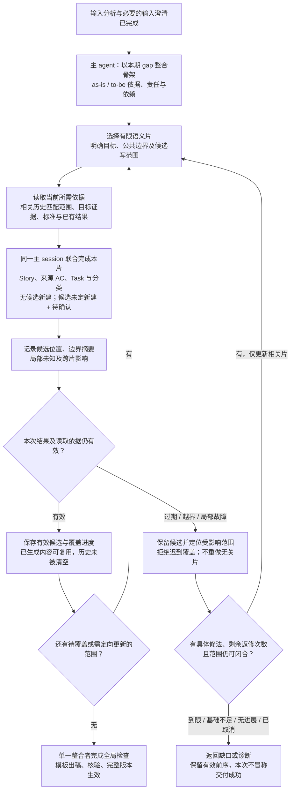

# D04 · 骨架、分片与执行上下文

[详细设计目录](README.md) · [输入与模型](D02-shared-data-and-evidence.md) · [文件工具](D07-tools-storage-and-recovery.md) · [贯穿样例](examples/EX01-generate-clarify.md)

状态：R2 执行设计稿。以一个 generate Skill、一个主 session、无 subagent 为分析基线，先看 [D04A 单 session 输入输出全景](D04A-single-session-panorama.md)，再讨论本篇的骨架和分片。子上下文与并发仅保留为有条件的优化候选，尚未决定采用；输入适配、输出实算与真实性能仍待验证。

## 1. 现在确定什么，哪些留给实测

先说清从开场到 Excel 的输入输出，以及业务所需信息、文件数据和实际模型上下文的区别。分片大小、是否隔离上下文和是否并发，在这份全景及实际开销基础上决定，不因宿主提供子 agent 就预选执行方式，也不先写一个固定 Action 图。

| 现在明确的设计 | 后续需用证据决定的参数/适配 |
|---|---|
| 输入分析结果怎样形成骨架；三类需求怎样覆盖 | 各格式的提取与定位质量，原型探索工作包 |
| 以交付目标、证据关联和工作边界分片 | 典型材料下一个工作包多大最合适 |
| 无 subagent 时同一主会话完成全流程，片内自主判断 | 单会话在哪里增长；简单读取/输出改进和自然压缩是否已经够用 |
| 若以后采用委派，候选须分开写，统一整合 | 是否需要隔离、隔离哪个活动；有收益后再验证并发与宿主适配 |
| 原件与有效结果落文件，失败只影响相关片 | 真实缓存复用、上下文压缩、过期候选与故障注入 |

## 2. 骨架从哪里来

骨架是 agent 对**as-is 与 to-be 之间本期负责的 gap**的组织结果，不是从 Excel 行、工作类型目录或 PRD 目录机械生成的标题树。先分析输入与补足必要输入事项，再形成覆盖业务、技术和交付的 Epic/Feature 及关键边界。

| 使用的输入/分析 | 要判断什么 | 骨架中的结果 |
|---|---|---|
| PRD、可选原型及业务输入答复 | 本期业务目标、流程/能力、角色、验收意图；背景与排除范围 | 业务 Epic/Feature 的交付目标及来源 |
| HLD、PRD 的 NFR、原型技术线索及技术输入答复 | 目标公共能力、业务局部约束、与历史 as-is 的变化、消费关系 | 技术范围及归属；公共建设与接入边界，或局部约束 |
| PRD/HLD 的数据承接、迁移/发布材料与交付输入答复 | 数据和上线要求、本期/外部责任、就绪前提 | 交付 Epic/Feature、外部依赖及明确排除项 |
| 往期 SOW，旧项目必需 | 构建 as-is，与目标按含义及工作边界匹配 | 本期 gap、已满足说明和匹配依据；不重复建设历史能力 |
| 可选 draft、tech note | 有依据的既有组织建议、补充约束 | 可复用的层级或线索；与当前材料冲突时按输入事项处理 |
| 模板工作标准 | 工作的计量与包含边界 | 提醒 agent 识别独立工作和重复范围；不按目录自动造需求 |

全输入分析不要求主会话装入全部原文。读取/探索可以按主题完成，主 agent 汇总有来源的结论、限制和冲突，判断整体充分性；不能只拼摘要而完全丢失回查原件的能力。

上游读取、主题覆盖、原型观察与充分性的具体边界见 [D03](D03-input-analysis-and-exploration.md)。复用其中已经保存的验收意图、公共责任和交付前提，不在骨架阶段重做相同分析。仍影响本期的局部输入问题先关联主题；实际 Story/Task 生成后绑定准确字段，完整整合前核对去向，不能因上游问题当时没有 Task ID 而遗漏。

组织骨架时，agent 围绕相近的交付目标归组，再检查业务、技术、交付三个视角是否被覆盖。输入不必直接写出“Epic”“Feature”标题，agent 可以概括标题；没有依据的需求、方案或责任不能因常见就补入。

### 2.1 骨架的最小内容

骨架及覆盖索引保存在本请求 work 区，复用 D02 的 Epic/Feature 身份和主题引用，不增加新的长期业务层级：

- Epic/Feature：标题、本期 gap 对应的交付目标、as-is/to-be 来源定位。
- 本期/外部/明确排除的责任和边界；已满足无需工作的说明、仍未知的输入限制。
- 公共能力提供什么、谁使用、公共建设归哪处、消费方承担什么。
- 必要的交付前提，例如资料承接与查询、发布就绪之间的关系。
- 覆盖索引：哪些目标待拆解，哪些已有可用候选，哪些因新依据需定向更新。

骨架不提前生成完整 Story、AC 和 Task 清单再重新“分片生成”一次。已有验收意图作为来源保留；具体 Story/AC/Task 在片内联合形成。骨架也不要求用户批准；generate 分析后的用户交互仍只针对输入相关事项。

片内验收整理统一遵循 [generate-slices](../../../references/generate-slices.md#目标与验收属于谁) 的SOW定义：用简短条目约定交付后的能力、可验证结果和关键边界，技术/交付Story同样适用。不展开Given/When/Then、完整字段规格或测试步骤；引用规范注明实际版本，详细约束留原材料与证据，精简不改变必要工作或关键承诺。公共建设和业务消费各有归属，只有独立成果才拆Story。此规则用于现有片内编写和一次语义合并，不增设阶段、自动评分或数量门禁。

Epic/Feature 与 work 中的片索引不是两个分别维护的范围来源：片索引引用骨架中的对象和输入主题。合并后的当前模型成为正式业务数据，生成片编号不进入长期业务层级。

### 2.2 何时足以开始分片

主 agent 能解释各片的目标和不应重复承担的工作，关键责任和公共契约有依据，局部未知能明确隔离，就可以开始。这里的“公共契约”只是从 HLD/输入提取的能力边界、使用方式和责任摘要，不新增必须编写的技术设计文档。

如果责任、目标接口含义或存在冲突的历史边界尚不明确，先按输入问题规则处理。无相关候选时按新建推进；有相关候选但实例未定且本期工作可界定时按新建+待确认，不为寻求复用而阻塞骨架。不能让多个 worker 各猜一套方案。后片发现骨架不准确时允许定向补正：只标记实际依赖变化的片，不能因骨架修订号变化让全部片失效。

## 3. 分片基于什么

**一片是一组可以在有限上下文中联合说清楚的交付工作。** 它需要足够的本地依据，能形成相应 Story/AC/Task，又不必重新决定大量其他片的范围。

| 分片依据 | 做法 | 需要避免的结果 |
|---|---|---|
| 交付目标与强关联 | 同一业务行为、公共能力或交付专题可放一起；紧密相关内容可以跨 Feature | 人为拆开后反复来回解释同一规则 |
| 证据集中程度 | 大量共享同一段规则或状态逻辑的内容优先同片 | 每片重读同一批大材料，复制整套上下文 |
| 依赖是否已明确 | 有稳定使用边界的消费方可独立拆；尚需共同决定边界的内容先联合处理 | 依赖未定仍并发，各自补猜或重复计量 |
| 工作量与不确定性 | 大 Feature 可按可区分的目标拆小；几个很小且同上下文的 Feature 可合片 | 一个 Feature 必须一片，或按固定 Story/页数硬切 |
| 重复和共享义务 | 公共建设有唯一归属；页面/API 等消费工作按模板判断是否内含 | 按 AC 数重复建 Task，或每个消费片都计公共实现 |

不先按“Story 1—10 一片”分配，因为完整 Story 尚未形成。第一轮可按 Feature 内的目标、输入主题、范围锚点和已明确的依赖安排；片内再形成具体 Story/Task。一个生成片可含几个 Story，一个很大的 Feature 可有多个生成片。

局部已知工作尚未拆成 Task 时，按 D02 保留对象级 open 问题并设 unestimated_work=true；已有 Task 不能代替尚未拆明的义务；插件不根据金额判断范围或估算状态。骨架目标不能因没有生成工作行而丢失。全部本期 gap 已有依据确认为空时，不造占位 Epic/Feature/Story/Task，保留完整分析与排除依据并按 D06 输出“本期无新增工作”；资料不足的空模型不能走这个出口。

切片结束的条件是其目标已有可复用的候选或明确局部缺口，来源/归属/分类解释齐备，结构可检查；不是必须把所有字段填满。如果目标本身过大，先更新片安排，保留已形成的可独立结果，不把半片包装成完成。

### 3.1 用 EX01 说明

EX01 的 5 个 Story、7 个 Task 很小，实际可以由主会话一次完成。为了说明分片边界，可把相同关系在较大材料中的处理分为：

| 示意片 | 覆盖目标 | 读取的主要依据 | 写出的专业候选 |
|---|---|---|---|
| A：公共客户端 | 统一错误、手动重试和迟到响应处理的公共实现 | P-N1、H-N1/H-N2 | S-03、AC-05、T-05 |
| B：查询功能 | 资料/公告查询及其公共客户端消费 | P-B1/P-B2、P-N1、H-B1、公共边界摘要 | S-01/S-02、相关 AC、T-01—T-04；不重复构建客户端 |
| C：迁移与发布准备 | 资料承接、核验及本期发布方案 | P-D1、H-D1—H-D3、A1 | S-04/S-05、相关 AC、T-06/T-07、条数待确认项 |

材料更多时，B 还可拆成资料和公告两个片。若 HLD 已说明公共契约，A 与 B 的 SOW 拆解可同时进行，不必等 A 的 Task 清单出来，更不必等程序库真实开发完成。C 的责任和方案已明确时也可独立处理；如果 B 的验收取决于一个尚未确定的迁移范围，则先解决该关联边界。

这是**SOW 分析的依赖**。客户实施时“先迁移再上线”不自动等于“编写上线 SOW 必须等迁移 SOW 全部完成”。

片内复杂度用当前材料能判就判，无法识别立即默认 M 并附待确认，不回读/搜索补档位证据；默认值与缺口一起保存，后续用户确认或调整。已有明确档位/已知 X 不被默认覆盖。片内把目标 gap 细化到实际 Task，再复用历史条目/匹配：无相关候选默认新建；相关候选实例适用未明时新建+待确认；只有实例及变化有依据时才判断调整/复用，或排除已满足的工作。历史只保留可识别的层级/说明，不要求补 AC 和 Task 类型。新页面调用旧公共能力时，页面和公共能力分别判断，不能全填接入复用。匹配范围、来源与结果引用到 D02 分类依据，不新增匹配 Action 或历史全量资产库。详见 [D03](D03-input-analysis-and-exploration.md) 和 [EX03](examples/EX03-as-is-to-be-gap.md)。

## 4. 分片、session 与模型调用不是一一对应

用户只进入一次 generate。基线由同一主会话负责用户交互、全局范围、逐片专业工作、整合和最终交付。以下同时列出未来可能比较的子上下文方式；用户不需要为每片手动创建新聊天。

| 组织方式 | 适用情况 | 主要代价/限制 |
|---|---|---|
| 主会话顺序处理 | 小项目、片很少、紧密相关；能保持简洁上下文 | 调用和交接开销低，但历史会逐步累积 |
| 主会话 + 独立子上下文，顺序处理 | 原文/探索较多，片内推理容易挤占全局上下文；片间需接续 | 隔离局部噪声，增加启动、传入公共背景及回传成本 |
| 主会话 + 少量独立子上下文，并发处理 | 至少有多个真正独立、边界已明确且写集合不冲突的片 | 可缩短等待；重复背景、竞争和合并可能增加总 token |

首次目标遍历、重新分片、片内修正和跨片整合都服从 [D04B](D04B-bounded-loops.md)。正常首次覆盖按有限目标推进，重复补正使用共享次数；不能通过不断拆片、换 worker 或刷新版本号避开上限。

当前只采用第一行作为分析基线，完整活动见 D04A。后两行是待评估方式，不能仅以“项目较大”就选择委派；先定位探索历史、生成量、重复回读、合并、压缩恢复及 Excel 的实际成本，再判断是否值得隔离。若进入该实验，再从少量 worker 验证，而非默认固定团队或为每个 Task 启动 worker。

一个切片内部可以多轮调用工具和模型；一个上下文也可以顺序处理几个相关小片。只有继续复用当前上下文比换新更合适时才复用，例如上一片的相关资料仍有价值且噪声少。片内临时补读不意味着新开 session，独立不相关的下一片则不应继承所有探索历史。

这里的独立子上下文指宿主的委派执行能力，不是插件创建新的用户项目或要求用户管理额外任务。宿主可呈现子 agent 的进度，主会话仍负责收集结果和结束本次 generate。

## 5. 工作所需信息与实际上下文

### 5.1 当前工作需要什么

当前工作需要输入/规则版本、已采用的用户事实、骨架摘要、覆盖进展、公共责任与依赖、结果位置及需要整合的差异。完整模型和详细候选在文件里；按索引读必要部分可以减少新注入，但不能保证同一主会话只剩这些内容。无 subagent 时，早期阅读、前片 AC/Task 的生成、工具写入参数和修正都可能留在历史。D04A 第 3—5 节明确每步输入输出和累积边界。

全局索引也会随项目增长。完整索引保存在磁盘，工作包只带全局约束摘要、相关邻域和覆盖计数；必要全局覆盖检查由工具读取索引，并把缺失/重复/冲突的候选范围交给主 agent 判断。压缩上下文不能把“读不到的范围”算作已完成。

### 5.2 若采用子上下文，需要的工作包

以下仅规定选用委派时的边界，不构成当前流程必需的交接文档。单 session 也需要相同的业务信息，但可以直接读取已有来源与当前片，不必每片另写一份相同背景。

| 工作包内容 | 用途 |
|---|---|
| 请求/片/本次尝试身份、片目标和相关 Epic/Feature | 知道本次只负责什么，返回可定位 |
| 全局必要约束及已采用事实 | 保持业务/技术/交付边界，不猜方案或新增审批 |
| 本片 gap、相关 as-is/to-be、匹配范围/结论、原文定位与未读区/冲突 | 复用相关历史分析，零匹配与未完成匹配分开；避免把摘要当完整原文 |
| 公共契约与计量归属、直接相关片的必要结果 | 消费已有边界，不重复公共建设 |
| 模板身份、适用标准读取入口及已选相关标准 | 定性匹配；可按需查其他标准，不注入整本 Excel |
| 本片已有候选（恢复时）、输出位置、合法未知和完成条件 | 复用有效前序，只写自己的候选并返回必要结果 |

工作包不复制全部父会话、全量 analysis/model、其他片的私有草案或每次失败的完整日志。需要补证据时按定位补读；不为了省上下文删掉影响判断的限制。标准子集只是读取起点，worker 仍可查表，不得因未在子集里就漏工作。

子 agent 返回：工件位置、覆盖目标、简洁的结果/边界摘要、待确认项、跨片影响及执行诊断。完整专业结果写文件；主会话只在合并需要时读取内容，不让每个 worker 再输出一遍整份模型。主 agent 不重复做已委派的同一份专业分析。

### 5.3 真正的新上下文与恢复

**同一 session 不再显式传入原文，不等于原文已从历史中删除。** 写文件或换片只能减少下一次新注入的内容；历史压缩/裁剪取决于宿主。独立上下文还要确认其启动方式，完整 fork 父历史会继续携带已有负担。

宿主支持精简启动时，子 agent 只接收工作包，不默认 fork 全部父历史。当前可见 Codex 子 agent 工具合同提供 `fork_context` 选择；这只是此宿主的能力证据，不是跨宿主兼容保证。系统指令和宿主自动注入仍可能存在，不能宣称子上下文零启动成本。

主会话发生压缩或重启时，从请求索引恢复版本、已覆盖目标、有效候选、运行尝试及未决事项。依赖实际内容仍相同才复用，不因会话换了就重生成。子 agent 的噪声不回灌主会话；失效和失败保留最小诊断，不能把重开上下文当成新的自动重试额度。

## 6. 若选择隔离，再按边界评估并发

本节为备选设计。当前全景及单 session 基线不依赖 worker，也不要求先实现并发工具、调度器或回传协议才能完成 generate。

| 判断项 | 可并发的情况 | 需要先处理的情况 |
|---|---|---|
| 语义前提 | 依赖的公共范围/接口已从输入明确 | 多片都依赖同一个未定的方案或责任 |
| 专业写集合 | 各片拥有不同的候选对象和交付目标 | 需要同时修改同一 Story/Task 或争夺公共计量归属 |
| 读取 | 可以共享同一份不可变输入、模板和公共边界 | 一边读取，一边把原件/已采用决定改成不同含义 |
| 执行资源 | 工具支持独立操作、宿主允许并发 | 共用一个有状态浏览器页面、文件转换资源或其他不可并用会话 |
| 预期收益 | 片足够大且独立，交接开销有机会被抵消 | 很小的片、重复背景占比高、并发导致频繁范围协调 |

“读取同一个 HLD”不意味着不能并发；“写不同文件”也不证明语义独立。主 agent 做上述专业判断，代码检查可编码的身份、字节、路径和写集合边界。生成片依赖不编译成固定的业务工作流 DAG。

### 6.1 文件、身份与合并

所有 worker 只写 `work/generate/<request-id>/slices/<slice-id>/<attempt-id>/` 的候选。公共骨架、覆盖索引、最终合并模型和 current 由主 agent 通过工具统一维护。独立目录隔离候选文件，逻辑对象归属仍须另行检查；宿主文件权限不等于天然隔离，不能只信 worker 声称“没越界”。

每个尝试绑定其实际读取的输入/规则/公共边界摘要；片内新对象按 D02 的 ID 规则产生，不能每片都从 S-001 重复编号。主 agent 可逐份接纳返回的有效候选并继续安排其他片，不需要等待整批最慢者才处理已完成结果；最终交付仍须覆盖全部本期范围或合法局部未知。

提供方的 Story 尚未生成时，消费片不能猜它的正式 ID。跨片关联先在 work 中用已知 Feature/输入主题定位并说明关联含义；提供方候选返回后，主 agent 将其绑定为 D02 的正式 Story 关系。片内检查只证明局部结构及已知引用合法，未绑定关联属于未完成工作；全局合并必须处理完这些关联，不能把它们伪装成已通过最终引用检查。这样无需先生成完整 Story 清单来支持并发。

合并时工具检查身份、引用、实际写范围及读取依据是否仍有效；主 agent 检查覆盖、公共义务、跨片验收与重复计量。对冲突只读相关范围和证据，不让合并 agent 重新写一遍所有 Story/Task。真正的新公共工作可以先作为跨片建议返回，由主 agent 界定归属，再局部补正。

若宿主子 agent 使用隔离工作区，工件按宿主支持方式回传到本请求候选区并校验内容，不能假设任意路径在主会话可见。并发只加速候选准备，Excel 最终投影与版本激活仍走 D07 的单写者协议。

### 6.2 并发中的变化与失败

| 情况 | 有限处理 |
|---|---|
| 一个片晚发现公共边界需要改变 | 主 agent 定位依赖该边界的片；停止/标记相关尝试，补正后只重做受影响部分，无关片继续 |
| 片完成时相关输入已经变化 | 保留候选为过期结果，不能激活；有价值内容按新边界定向复用 |
| 旧尝试晚到，已有新尝试或请求已取消 | 按请求、片、尝试和依赖身份拒绝覆盖；实际成本仍记原尝试 |
| 不同片输出同一公共 Task | 按义务与来源确定唯一归属；不只按标题去重，不把重复项全部计费 |
| 某片无法闭合、信息基础不足 | 汇总具体输入缺口并按 generate 异常出口返回；不能让并发成功片掩盖全案缺失 |
| 宿主没有子 agent 或无法保证必要的隔离/回传 | 回到同一工作包协议下的串行执行；说明能力限制，不暗中启动自有模型服务 |
| 宿主取消不能中断运行工具 | 遵守 D07 的实际取消生效边界，不承诺未取得的即时停止能力 |

若首版采用委派，只允许主 agent 一层委派，worker 需要扩大任务时回报，不递归派生团队。完成的 worker 及时结束或释放；并发容量沿用宿主允许范围和实际验证的设置，不能无限生成子 agent。

## 7. 当前单 session 的分片关系图

图源：[骨架、分片与上下文](../diagrams/generate-context.mmd)。全流程输入输出和用户接入见 D04A 时序图。本图没有上下文隔离；换片和落盘不等于清空历史，局部修正循环也不是反复全量审查。

## 8. 速度与 token 怎么评估

分片控制单次需要理解的范围，子上下文隔离噪声，并发减少独立工作的等待，三者作用不同。独立会话要重复加载公共背景，并发还增加协调与可能的返工，因此不能把并发默认等同于省 token。

记录骨架形成、工作包准备、片内分析/分类、候选检查、等待、局部返修、合并和 Excel 的实际用时。保留每次尝试的输入来源、工作包规模、缓存命中、返回内容大小和实际可得 usage；同一次模型调用跨片时不分摊虚假的逐片 token。并行历时与各片累计耗时分别呈现，不相加冒充总历时。

首轮先分析并测量主上下文串行，以及必要读取、简洁返回、候选复用和有限整合的改进。只有仍有明确的局部噪声或增长瓶颈时，才比较相应活动的独立子上下文；并发放在隔离与独立性成立之后。输入、模型配置、模板和覆盖要求保持一致，包含业务/技术/交付范围及异常/局部未知；观察首次可用 Excel 用时、总 token、观测完整度、缺项和返修范围。不得为了凑三种方案而先实现委派。

先根据结果决定默认粒度与并发设置，不预设“每片固定若干 Story”“分 session 一定省 token”或“并发必须快若干倍”。埋点用于解释成本和后续优化；不将这些实验转成用户逐次批准资源的流程。

## 9. 宿主证据与剩余验证

核对日期：2026-09-09。OpenAI 官方文档说明 Codex 可委派子 agent 并收集结果，支持由适用的项目/Skill 指令触发；建议向主会话返回摘要，并提醒并发写入的冲突和多 agent 的额外 token 成本。[官方子 agent 文档](https://learn.chatgpt.com/docs/agent-configuration/subagents)

当前会话的工具合同还表明可选择是否 fork 父历史；本次只读取合同，没有启动 worker 做 Lite 实验。该证据不自动证明其他宿主、插件安装副本的子 agent 能读同一文件、携带所需 Skill、回传工件或暴露逐调用 usage。

后续先补单 session 的读取返回、候选复用、主会话压缩后恢复与真实 usage；若决定实验委派，再验证精简启动、工件可达、资源争用和迟到尝试。模型选择沿用宿主配置，不在此阶段另选廉价模型或新增 agent SDK。

对应场景 AN07/AN10—AN13/AN21—AN22/AN27—AN29、FS01/FS07/FS11/FS13、OB04/OB07—OB12，见 [D09](D09-validation-and-implementation.md)。D03 继续细化输入读取，D05 处理后续反馈形成的新切片；后续 clarify 不按这里的生成片边界整片重跑。
