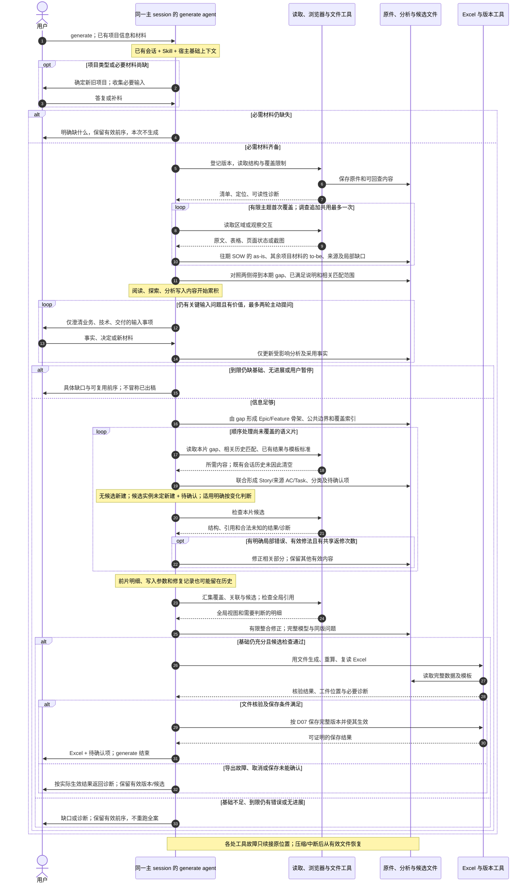

# D04A · 单 Skill、单 session 的输入输出全景

[详细设计目录](README.md) · [D04 骨架与分片](D04-generate-and-context.md) · [D02 数据](D02-shared-data-and-evidence.md) · [D07 文件工具](D07-tools-storage-and-recovery.md)

状态：R2 分析基线。先假定整个 generate 由一个 Skill 指导同一个主 session 完成，不引入 subagent，也不主动换会话。本文逐项追踪工作所需信息、文件产物和进入会话的内容，再提出待验证的优化顺序；没有实际运行 Lite、测量 token 或选定上下文隔离方案。

## 1. 基线与三个不同的“输入”

一个 generate 可以有多次模型调用、工具调用和必要的用户答复。下面的步骤是便于分析的活动分类，不是新增 Python 状态机、固定 Action、一次步骤一次调用或逐步批准。阅读顺序与片内专业动作仍由 agent 决定；合理地保存文件、使用现有确定性工具属于基线，不假设每一步故意重读全部材料。

| 概念 | 指什么 | 对上下文的含义 |
|---|---|---|
| 步骤的业务输入 | 作出本次判断所需要的事实、对象、标准和限制 | 是当前需要的信息，不等于宿主实际给模型的全部内容 |
| 工具的文件输入/输出 | Python、解析器或浏览器处理的原件、数据、工作簿及工件 | 工具读完整文件不等于模型看到完整文件；是否进入会话取决于返回内容及宿主附加信息 |
| 模型的实际输入/输出 | 宿主指令、Skill、保留历史/压缩结果、本轮消息、工具参数与返回内容、模型生成内容 | 决定当次上下文与实际 usage；前一步不再需要的内容仍可能留在历史里 |

**分片限制专业工作范围，文件保存保证可复用与可恢复，两者都不会自动删除同一 session 的历史。** 同样，把一份 Skill 拆成多个参考文件只改变加载时机；如果最终全部读入同一会话，已读内容仍可能累积。

开始 generate 的会话还可能已有用户前面的讨论、粘贴材料或工具输出。基线记录这一实际起点，不能一律假设空白会话。未加载的设计文档和文件目录不自动算作模型已读内容。

## 2. 原始材料分别怎样参与

| 来源 | 首次分析要提取什么 | 后续在什么地方使用 | 不能替代的依据 |
|---|---|---|---|
| PRD，必需 | 目标、角色、业务规则、验收意图、NFR、交付要求与排除项 | 充分性、骨架、Story/AC、Task 工作边界、覆盖核对 | 产品目标不能自动证明技术方案和现有能力 |
| HLD，必需 | To-be 技术方案、目标与外部前提、公共能力/消费关系、约束、迁移与发布责任 | 技术/交付范围、Task 工作方式与复杂度所需事实、跨片关系 | 没写清的方案和责任不能由 agent 补猜 |
| Prototype，可选 | 资源关联、界面、可观察交互与状态、模拟/未验证行为 | 与 PRD/HLD 对照、来源 AC、具体功能和变化规模 | 可点击或模拟成功不证明后端已实现；未观察不代表不存在 |
| 往期 SOW，老项目必需 | As-is 的能力、工作边界和来源 | 与 to-be 对照 gap；复用历史匹配支持 Task 工作方式 | 已匹配不等于必有工作或必选复用；未读/失败不等于零匹配 |
| Draft / tech note，可选 | 有依据的层级建议和补充约束 | 输入分析、骨架组织、局部补读 | 只有 Epic/Feature 标题通常不足以支持来源 AC 和有效拆解 |
| 用户答复/补充材料 | 材料外事实、输入含义、业务/技术/交付决定及适用范围 | 修正关联分析、骨架、片内判断；后期局部问题留给 clarify | 回答事实不等于批准任意拆解，也不应反复询问已答项 |
| 内置 Excel 模板 | 可填写结构、工作类型目录、包含边界、方式/复杂度/集成标准 | 接收时检查可用性，分析时必要参考，片内定性匹配，最后投影与计算 | 目录不是需求清单；数值与公式留给模板，agent 不另算人天或 UAT |

非原型输入仅可读文本（默认 Markdown）与 `.xlsx`；PDF/DOCX、扫描件等暂不支持，需提供可读内容。往期 SOW 构建 as-is，其余项目材料构建 to-be，内置模板独立提供规则。

原件保持不变。物理解析、结构恢复和用途分析区分开；同一物理内容可支持多个用途，不要求先转成一套完整 IR。按 D02 保存必要事实、观察、判断、来源定位和覆盖限制。

## 3. 无 subagent 的全过程输入输出

“文件结果”是成果归属，不要求每行另建一个文件、产出长报告或增加工具端点。路径布局沿用 D07；临时分析不提前成为正式 SOW。下列 G 编号仅用于本文观察活动。

| 活动 | 本次判断需要的输入 | 同一 agent 做什么；代码做什么 | 文件结果及下一步用途 | 本步新增到会话的内容 |
|---|---|---|---|---|
| G0 加载入口与运行准备 | 用户意图、已有会话、generate 指令、项目位置、运行环境/模板状态 | Agent 识别入口；工具检查或复用安装、文件和模板能力 | 请求身份、能力诊断、模板身份；供后续稳定读写 | Skill、工具说明、必要诊断；若把安装全日志返回也会进入历史 |
| G1 固定开场 | 已知项目类型和已给材料 | 确定新/旧项目；收集 PRD、HLD，旧项目另要往期 SOW，原型可选；已有信息复用 | 项目类型、输入清单、缺失材料说明；缺必需材料先补齐 | 必要问题和答案、材料路径；用户直接粘贴的长原文也在此进入 |
| G2 登记与物理读取 | 全部已给文件/资源包、用途、已有版本和解析结果 | 工具保存版本、恢复可支持的章节/表格/单元格/资源结构；agent 看覆盖和异常 | `inputs` 版本/资源索引、可回查内容、解析覆盖与限制；供语义阅读 | 清单、结构目录、需要阅读的区域与错误；磁盘上的全部解析文本不必自动回传 |
| G3 材料阅读与原型探索 | PRD/HLD/历史/draft 的相关区域；可选原型资源与浏览器状态 | 同一 agent 阅读和观察，提取 as-is/to-be 的业务/技术/交付依据、验收意图、共享边界和疑点；工具执行读取/浏览 | `analysis` 中有来源的必要结论、观察及未覆盖区域；原件继续可查 | 原文摘录/表格、源码、页面状态/截图、探索动作、分析写入内容；通常最容易出现大量临时历史 |
| G4 综合输入与按需澄清 | G3 结论、来源差异、缺口、用户已有答复 | 对照 as-is/to-be 找三类 gap 与责任；只问输入相关事实、冲突与决定；回答后增量复核，基础仍不足则补料/退出 | 已采用事实/决定、as-is/to-be/gap、相关匹配范围/结果、未决问题及充分性结论；基础足够才生成 | 综合判断、问题、每轮答案、新材料和受影响分析；不生成待用户批准的拆解方案 |
| G5 形成骨架 | 已形成的本期 gap、验收/方案依据、责任、共享边界、已满足/排除项和局部未知 | Agent 组织业务/技术/交付 Epic/Feature，说明公共建设归属、消费方和交付前提 | work 中的 Epic/Feature 骨架及覆盖/关系索引；供分片与最终覆盖核对 | 骨架和边界的生成内容；不提前写完全部 Story/AC/Task |
| G6 选择当前片 | 骨架、未覆盖目标、证据关联、已完成候选及公共责任 | Agent 选择可联合说清的一组目标；工具读取相关数据；小项目可一片完成 | 当前目标、涉及对象/来源、相关依赖与进度；只作为本请求工作索引 | 当前片安排、相关证据和此前结果；已有历史不随换片清空 |
| G7 片内联合拆解 | 当前目标、业务/技术/交付依据、验收意图、共享与消费边界 | Agent 联合形成 Story 标题、来源 AC/备注、实际 Task 名称和工作范围；明确责任与关系 | 本片 Story/AC/Task 候选、引用、跨片关系建议、局部未知；供分类及核对 | 新的专业内容、必要补读和局部判断；不输出全部推理过程作为交付物 |
| G8 四项定性匹配 | 本片工作内容、相关 as-is/to-be 与已有匹配、规模与集成依据、模板目录和有关标准 | Agent 匹配工作类型名称、工作方式、复杂度、集成类型；工具提供标准；无候选新建，候选实例未定则新建+待确认，复杂度未定按 M 并附问题，其他缺值留空 | 同一候选中的分类、简短分类依据与待确认项；无 agent 估数 | 目录/标准读取、分类和依据写入；可与 G7 交错完成，不是第二遍独立生成 Task |
| G9 本片检查与保存 | 本片候选、所用标准/来源/骨架、必要关联对象 | Agent 针对内容自查；代码检查结构、已知引用和合法未知；保存有效候选和覆盖进度 | 可复用候选、局部检查结果、待绑定关联和进度；有未完成范围回 G6 | 工具参数中的候选/修改、返回的诊断、必要修正；若回显整份候选，会再新增一份 |
| G10 跨片整合 | 全部候选、输入覆盖、骨架、关系、公共义务、问题与有效依据 | 工具组合数据/核对身份引用；agent 核对三类范围、内容关联、遗漏和重复计量；只修有关部分 | 完整 SOW 模型、已绑定关系、同版问题/决定；供导出 | 必要全局视图、冲突/未覆盖范围、相关明细及修正；不能只看“各片成功”或只比标题 |
| G11 模板投影与交付核验 | 完整模型、问题/决定、模板、展示映射、输出条件 | 代码读全量数据、填模板、调用计算引擎、复读；agent 处理可定位诊断及必要可见性核对 | 候选 `sow.xlsx`、投影映射、摘要及核验结果；局部未知明确显示，不能冒充完整总量 | 文件位置、检查摘要/诊断、必要显示样本；Excel 单元格/公式不必整表读回模型 |
| G12 完整版本生效与返回 | 已核验的一致候选、请求/基线与有效条件、可得资源记录 | 工具按 D07 保存完整版本并切换 current；agent 返回 Excel、待确认项和简洁说明 | 正式同版模型/问题/依据/Excel/摘要；generate 结束，供用户及独立 clarify | 保存结果和最终答复；不在聊天里重写一份完整 SOW，不增加定稿 |

相关历史边界与匹配判断在 G3/G4 保存，G8 只对实际 Task 细化必要匹配，不让每个 Task 重读整本历史 SOW。零匹配保留已查范围；新历史输入会影响相关零匹配，不能只依赖命中记录恢复。它们沿用主题/依据文件，历史使用 D02 的轻量条目，可只有说明而无 AC/类型；不增加 as-is/to-be 两套完整模型或固定匹配 Action。D04B 对追加调查、主动补问、重分片和返修统一计数，恢复不能重新获得已用轮次。

G3 的读取按主题、材料关联与实际发现推进，不必分成“业务全文 → 技术全文 → 交付全文”三轮。G2 物理可读不等于 G3 语义已分析；G3 保存摘要也不等于 G4 跨材料一致。G7/G8 是一组专业工作里的两个观察角度，不增加实体、Owner 或交接门禁。

## 4. 执行到各处，真正需要什么，历史又留下什么

| 位置 | 当前仍然必要的工作信息 | 已不必逐项参与当前判断、却可能仍在历史中的内容 |
|---|---|---|
| 输入综合完成 | As-is/to-be/gap、匹配范围及结论、责任、冲突与覆盖限制、已采用答复，及原文回查入口 | 原型点击过程、重复页面状态、被排除的历史工作详情、解析噪声与已解决的问题往返 |
| 骨架完成 | Epic/Feature、共享归属与消费关系、交付前提、局部未知和输入覆盖 | 已读原文、形成骨架的尝试、先前已被修订的结论 |
| 第 k 片处理中 | 全局必要约束、本片资料、适用标准、直接相关的已完成对象 | 前 k−1 片的详细 AC/Task、各自写入参数、修正记录及无关标准；尚未压缩时仍可能都在 |
| 所有片已保存 | 各片有效结果、覆盖与公共边界、需要整合的关系 | 全部片的形成过程、失败候选、重复标准和反复工具回显 |
| 全局整合 | 全范围义务与候选内容的可检查视图、关联邻域、明确疑点与来源 | 除有效结果外的完整过程历史；若再读回所有 JSON，还会新增重复内容 |
| Excel 与保存 | 有效数据身份、输出条件、诊断、必要展示与提交结果 | 大部分专业过程历史；对工具执行重算已无直接帮助 |

这里没有承诺全局整合永远只需一段很短的摘要。项目变大时，全局目标、公共能力和关联也会增长。机械检查可处理全量文件，语义覆盖仍需 agent 阅读足以判断的范围与明细；仅压成数量、ID 或标题可能藏住重复工作和遗漏。按目标/依赖邻域组织读取是后续优化候选，但需要证明没有漏掉原骨架之外的输入义务。

## 5. 哪些内容确实进入模型，哪些不必进入

| 操作 | 模型侧成本与边界 |
|---|---|
| 工具在磁盘上解析整本材料并返回目录/定位 | 解析有工具时间；模型只看到宿主实际返回的内容及相关调用，不等于整本已进入，也不等于语义已经分析 |
| Agent 阅读原文、页面状态或截图 | 返回的文本/多模态内容进入当前判断与可能的历史；字符数、文件大小不能直接当成精确 token |
| Agent 生成 JSON、Markdown 或补丁写文件 | 新业务内容需要模型生成。即使工具返回只有“成功”，生成参数本身已有输出成本，后续是否保留由宿主决定 |
| 工具根据候选文件机械合并、写表、复制或检查 | 可以不让模型再生成同样的已有内容；代码只能处理已确定规则，不能借此替代语义判断 |
| 同一候选写入后又被工具全文回显/全文读取 | 可能形成额外输入及历史重复；本地复读校验并不要求全文回传模型 |
| Agent 写一段“仅记住摘要”，或换到下一片 | 新增一段摘要/指令，不是程序删除前史；可靠记忆仍需文件与实际宿主压缩机制配合 |
| 宿主确实压缩/裁剪上下文 | 活跃上下文可能变小，但已发生的消耗不会消失；后续还可能补读、恢复和误用过期结论，需观察 |

因此必须分开测量：**新增材料量、当次活跃上下文、累计 input/output token、工具用时和请求历时**。缓存是否命中按宿主口径记录；缓存命中不代表历史内容不存在，也不能把累计 input 当作某一时刻的上下文占用。

一个仅用于解释的理想化模型：若每个片都新增 d 单位历史、后续 n 个片每片恰好调用一次模型，且所有旧历史完整保留，则先前片在后续输入中重复出现的量为 `d × n × (n−1) / 2`。实际存在多轮工具、压缩、裁剪、缓存与多模态，因此不能用这个式子预测真实 token、费用或用时。它只解释为什么“每片只新增一点”仍可能造成累计读取增长。

## 6. 单 session 时序：所有语义活动都在同一条生命线上

图源：[单 session 输入输出时序](../diagrams/generate-single-session.mmd)。此图表现成果依赖、问答和主要循环，不规定 agent 必须逐箭头调用一个工具。主 session 从头到尾只有一个；保存文件、分片以及 Python 进程都没有创建新的模型上下文。

## 7. 异常同样有输入输出和上下文代价

| 情况 | 本次新增输入 → 输出 | 恢复范围与额外历史 |
|---|---|---|
| 必需材料缺失/不可读 | 缺失或诊断 → 具体补料要求及已登记输入 | 不进入拆解；补足后复用有效解析，不重复索取已给材料 |
| 关键输入答复不完整或互相冲突 | 新答复/新来源 → 关联分析、仍未决问题 | 继续必要输入澄清或暂停；旧问答仍可能在历史里，当前采用事实须明确 |
| 后期局部证据不足 | 本片字段与缺失依据 → 空值、备注、定位明确的待确认项 | 随 SOW 交付，不新增逐片问答或默认分类；大范围基础不足则停止 |
| 后片发现共享边界错误 | 具体新依据及相关关系 → 有限骨架/片修正和失效标记 | 只补有关对象，保留其余候选；旧候选留在历史时不能误认当前 |
| 结构/引用/工具失败 | 定位诊断和当前候选 → 局部修正或具体退出结果 | 有新依据/明确修法才恢复；不把换片或压缩视为重新获得无限重试 |
| Excel 重算/复读失败 | 计算引擎或工作簿诊断 → 修复工件或失败说明 | 复用已正确模型，仅处理导出问题；不让全文日志淹没必要错误信息 |
| 宿主压缩/中断 | 实际保留上下文及请求文件 → 当前工作位置、有效结果和必要补读 | 核对版本、覆盖、用户事实、失败状态与未决项；不凭摘要宣布此前全部成功 |
| 保存响应丢失/取消 | 请求身份与实际磁盘状态 → 已生效或未生效的可证明结果 | 遵守 D07 生效点，不再完整生成；无法确认时先诊断，不擅自回滚 |

Clarify 仍是独立入口。其业务输入来自当前版本、用户反馈、有关来源和标准；产物依次为有限修改方案、确认后候选及更新 Excel。它不需要加载 generate 的聊天历史。用户若在原会话调用 clarify，旧历史也不会因换 Skill 自动消失；是否从新会话发起只影响实际上下文起点，不改变共享文件与确认协议。

## 8. 从全景得出的优化顺序

先保留以上无 subagent 基线。**现在能确定的是增长来源和待验证边界，不能据此断言哪个环节实际最贵，也不先选“项目大就开子 agent”。**

| 顺序 | 要验证的问题与做法 | 能改善什么 | 做不到什么/要付出的代价 |
|---|---|---|---|
| 1 记录真实基线 | 观察 G0—G12 实际活动、返回量、重复读取、生成量、工具/模型时间和可得 usage | 确认成本在探索、生成、合并、压缩还是 Excel | 步骤编号不是调用 ID；宿主没给逐调用数据就保留未知 |
| 2 减少无用新增 | Skill 只放入口与核心规则；按需读专题；解析/检查默认返回必要结果，消除候选全文回显、全表回读、重复长报告 | 减慢历史增长，减少重复输入/输出，通常也便于定位问题 | 不删除已进入的历史；不能裁掉真实失败或未覆盖区域 |
| 3 复用已形成内容 | 事实按定位复用；Task/AC 联合形成一次；代码组合已确定候选，修改只发必要差异，整合按覆盖和关联补读 | 降低重复分析、重写与回读；不必先加新 agent | 全局语义检查仍需足够内容；索引、摘要和检索本身也有成本 |
| 4 验证单 session 的长期表现 | 在宿主自然压缩前后检查版本、范围、决定、未决项和恢复读取；结合已存在的文件索引续接 | 判断保持同一会话能否稳定完成典型/大材料项目 | 插件写摘要不等于控制宿主压缩；不为了实验擅改用户全局配置 |
| 5 才评估局部隔离 | 单 session 仍在某类局部工作积累大量噪声时，比较只隔离该活动的成本与效果 | 可能隔离原型探索或长材料的临时过程，也可能隔离较大的生成片 | 子 agent 的启动、重复背景、回传/整合和恢复另有成本；全局状态仍会增长 |
| 6 最后评估并发 | 隔离已有收益且出现独立工作等待时，再比较有限并发 | 有机会降低请求历时 | 不保证减少总 token；引入资源竞争、迟到结果和范围协调 |

第 2/3 项可以作为工具与指令设计的简洁原则，不必先开发完整检索平台、摘要流水线或新持久化工作流。每项实现后看真实收益，避免为了省 token 增加更贵的摘要、管理和校验步骤。第 5/6 项当前只是候选，使用时遵守 D04 的条件边界。

从信息依赖看，值得观察的两个收敛位置是 **G4/G5 之后**和 **G9 片结束之后**。前者已把阅读/探索转换为有来源的输入结论与骨架，后者已有可复用的片结果和覆盖进度；大量形成过程不再是后续判断的必要输入。若宿主在附近压缩，可以从这些既有文件恢复，不必另写全量交接报告。它们不是固定压缩门禁，也不表示插件可以随时清除前史；是否需要、何时发生及损失风险仍以宿主实测为准。

## 9. 后续采什么，怎样据此作决定

按 [06 观测](../06-observability-and-validation.md) 的真实事件边界记录：

- 活动/主题/片、实际调用身份、起止时间、成功/故障/重试及输入版本；同一调用跨步骤时保留组合归属。
- 工具读取区域和用途、实际返回文本量/图片数量与可得尺寸、已有内容重复返回情况、候选生成/修改量。它们是体量线索，不能代替实际 token。
- 宿主提供的 input/output、缓存及压缩信息；可用的活跃上下文指标与累计 usage 分开。不能自行采集隐藏推理，也不把客户原文/完整提示词作为遥测要求。
- 压缩或恢复后补读了什么、有无重复提问、过期结论、遗漏或全量返修；记录恢复与失败真实消耗。
- 模板解析、Excel 生成/重算/复读时间；如果瓶颈在这里，分 agent 不能直接解决该问题。

先在相同模型/输入/模板/业务技术交付覆盖要求下比较单 session 基线及简单改进；只有仍有明确瓶颈才增加局部隔离对照。小型、典型、大材料和探索较多的样本分别看，不仅看切片数量。记录首次可用 Excel 时间、总量/已知小计、质量与恢复范围，不以某次最快结果或少拆需求宣布成功。

[D03](D03-input-analysis-and-exploration.md) 已据此形成读取/返回、覆盖、原型探索和输入问题移交设计；D04 细化片内/合并视图，D07 承接确定性工具的小返回，[D08](D08-telemetry-and-performance.md) 已定义真实可采事件、覆盖和成本口径，并通过 EX06 记录有限宿主源形状探针；逐活动归属仍需真实执行验证。这些工作不以 subagent 适配为前置条件，也不为制造基线故意写一个重复回显全部内容的低效版本。

宿主事实核对于 2026-09-09：OpenAI Docs 说明 Skill 按需加载，选中后会读取完整 SKILL.md；这不能解释成流程结束前自动卸载已读参考资料。[官方 Skill 文档](https://learn.chatgpt.com/docs/build-skills)。Codex 配置文档定义了历史自动压缩阈值，表明压缩是宿主机制；本文未修改配置、测量触发行为或据此保证其他宿主相同。[官方配置说明](https://learn.chatgpt.com/docs/config-file/config-reference)。

对应场景 AN27/AN29、OB07/OB11/OB12 及各步骤已有异常；追踪归属见 [D09](D09-validation-and-implementation.md)。
