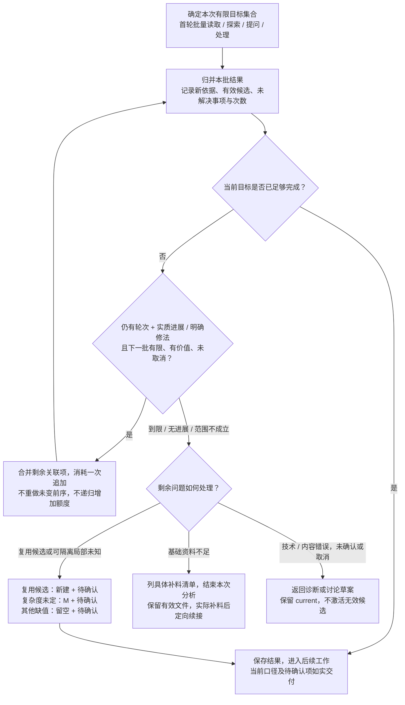

# D04B · 批量处理、环路上限与退出

[详细设计目录](README.md) · [D03 输入分析](D03-input-analysis-and-exploration.md) · [D04A 单 session 全景](D04A-single-session-panorama.md) · [D07 文件工具](D07-tools-storage-and-recovery.md)

状态：首版执行策略设计稿。下面的轮数是明确的默认起点，待真实样例验证其质量和开销，不是已测得的最优参数。本稿约束反复工作，专业路径仍由 agent 选择；未实现宿主强制中断或运行时计数。

## 1. 环路必须同时具备什么

仅有“有新路径就继续”或“资料还不足就继续问”不能作为完整循环条件。每个重复活动同时声明：本次问题/目标集合、批次范围、完成判据、最多追加次数、无进展出口、达到上限后的结果及可恢复位置。

区分两类循环：

| 类别 | 有限性来自哪里 | 做法 |
|---|---|---|
| 首次覆盖：读分页、遍历已登记输入、顺序生成各片 | 已登记的材料/目标集合和单调推进的游标 | 每项处理一次，批量取回；不用“最多两轮”截掉大型项目的正常首次覆盖 |
| 重复探索、补问、返修、扩大回查 | 明确的追加上限及实际进展 | 默认一次首轮加最多一次定向追加；达到上限按结果出口，不自动换名重开 |

一轮是对同一目标集合的一次批量计划、处理和归并，不是一次点击、一个模型调用或一条用户消息。拆成多个工具调用的同一批仍算一轮；增加别名、切片编号、worker 或 request_id 不产生新额度。首次覆盖中的新增发现，仅补齐本批已列目标的必要定位或路径；新增目标按相应活动的追加上限合批处理，不持续扩大首批目标，也不为每个入口递归开启一套新探索。

## 2. 首版环路清单与默认上限

复杂度定档不进入追加调查环路：使用本片已有材料和标准后仍无法判断，立即按 M 出稿并留一项待确认；不为补档位继续搜索、回读、重试或追问。若资料缺口改变的是范围、架构或责任等推进基础，仍按输入充分性处理；不能用默认 M 代选方案。下面的追加额度不是要求用满，也不适用于为复杂度补证据。

| 环路 | 首轮如何批量 | 默认追加上限 | 停止后的处理 |
|---|---|---|---|
| 开场材料收集 | 一次收集缺少的新旧项目信息、PRD/HLD、旧项目往期 SOW；已有内容复用 | 不反复催同一份材料；缺件列清单等待用户实际补充 | 保留原件，本次不进入依赖缺件的分析 |
| 材料目录/分页与首次阅读 | 同一版本返回目录、相关区域及未读面；按关联主题合并读取 | 正常游标有限推进，不允许相同游标/区域无理由重读 | 不可读或超出支持范围明确记录；必要内容未取得不能标完成 |
| 输入阅读、原型探索与历史匹配的补充调查 | 初次按目标和疑点汇总相关来源、代表性交互和候选，一次归并差异 | **整个输入分析最多 1 个追加调查批次**，由所有主题共用，不能每个主题各加一轮 | 基础足够则带局部问题；基础不足则列具体补料清单。复用候选按新建+待确认，不为证明可复用继续深挖 |
| 分析后的用户澄清 | 按业务/技术/交付依赖合并问题，只问输入事项；已知可隔离的复用候选不单独占一轮 | **首轮问题包 + 最多 1 轮补问，共 2 轮主动提问** | 仍缺基础则结束本次分析并列补料清单；仅局部缺口则出稿。未回答不算认可 |
| 生成片首次处理 | 按骨架目标选择有限片，联合生成 Story/AC/Task/分类，按文件复用有效前序 | 每个目标只首次生成一次；同一范围的重新安排最多 1 个批次 | 不能闭合则说明缺口并保留候选，不能不断细分产生新片冒充进展 |
| 片内/跨片内容修正 | 合并同根因和关联错误，先定位后一次修改；合并整合不重写全部模型 | **同一候选最多 1 轮修正；整个请求最多 2 个自动返修批次**，先到任一上限就停止追加 | 真未知按规则交付；内容/结构错误仍未解决则返回诊断，保留有效候选，不交付假成功 |
| Clarify 定位与方案讨论 | 一次收齐本条反馈的相关候选、事实缺口、实际 diff 和影响；共用依据合并讨论 | **首份具体方案 + 最多 1 轮主动修订**；定位扩展最多 1 批，应用中至多返回讨论 1 次，计入同一修订上限 | 未达成一致或又需扩大则保存讨论草案、保留 current；不自动连续试算/重提方案 |
| 工具重试、Excel 失败、机械复读失败 | 诊断同根因影响，复用合法候选，只重做失败工具步骤 | **同一操作/根因最多重试 1 次**，同时计入请求的 2 个自动返修批次；无明确改变条件则 0 次 | 返回具体诊断；重算或核验失败不能作为业务待确认绕过 |
| 串行误调用、响应丢失及中断恢复 | 先检查实际提交结果和已完成文件，不先重写 | 结果查询恢复至多 1 轮；持续繁忙/不可确定则退出，禁止忙等或无限 backoff | 已生效返回已有结果，未证实则如实报告；不重复激活或覆盖当前有效版本 |
| 观测记录失败 | 缓存可得事件并保留缺口，一次汇总去重 | 同一落盘/采集故障至多 1 次适用重试；不启动补齐 usage 的递归请求 | 业务继续，观测明确不完整；未知 token 不估填 |

这些上限分别限制不同活动，不能叠加成“调查两次 × 提问两次 × 每片修两次”。自动返修共用请求级计数；输入补充调查共用分析级计数。用户新答复引起的必要定向读取/重算属于该答复的处理，不自动恢复先前已耗尽的探索、补问或返修轮数。

材料真实新增时可读新增区域；不以“新材料”标签重扫未变原件。用户稍后提供实质补充或明确新修改目标，可以从保留位置续接，记录与前次的关系和新范围；不得由 agent 自行拆请求刷新上限，或主动邀请用户反复说“继续”规避停止。单纯宿主压缩、重启或故障恢复继承原次数和结果。

[D05](D05-clarify-and-change-scope.md) 将 clarify 的定位补读/补充合为一次扩展，不叠加 generate 的两轮问答。模板预览默认不执行，用户明确需要时每轮对已明确候选合批一次；已展示且独立闭合的子集只做机械提取，不算新一轮专业修订，真正改值/义务/边界则共用方案修订额度。每份专业方案最多一个严格子集槽，不嵌套或反复切换选择；提取失败使用同候选一次、请求共享两批的剩余机械返修额度。失败稿保留不可变引用，机械修法与专业 revision 分开，不能因技术故障耗掉唯一专业修订，也不能换身份刷新次数。

## 3. “有进展”与“仍值得继续”要同时成立

| 观察 | 是否允许用剩余追加轮次继续 |
|---|---|
| 新来源解开具体冲突，仍有已定位且影响结果的问题 | 可以，批量处理剩余关联项 |
| 找到新按钮/路由，但只是已覆盖行为的另一入口 | 不因此继续探索；复用共同行为说明 |
| API/事件类型相同，具体实例适用性没有依据 | 形成具体复用候选，按新建+待确认；不继续穷举旧实现 |
| 改问法、换搜索关键词，只重复已知结果 | 不算进展，提前结束该循环 |
| 用户回答了背景，但仍未补关键事实 | 不因回复存在就续问；还有明确可答问题且有剩余轮次才批量补问 |
| 用户明确不知道，或需要另行准备整份材料 | 当轮结束，列具体补料要求，不用更多问题代写方案 |
| 同一故障已定位且实际环境/输入修正 | 有剩余轮次才重试；仅再调用相同命令不算修法 |

取消优先结束本次执行；clarify 未确认方案不能进入应用。不得因剩余问题可以留空而越过取消或确认边界。

继续必须同时满足：问题仍影响本次结果、有具体有限的下一批内容、预期能改变判断、尚有追加轮次、未取消且仍在范围内。无进展立即停止，不必用满次数；即使仍有新路径，次数耗尽也不能继续。

## 4. 一批不能装下无限工作

次数限制只能控制反复，不能单独保证绝对用时或 token。每批开始先给出实际有限的待读区域、待观察目标、问题或待修对象集合；完成集合就归并结果，不在工具/脚本内部无限递归、轮询、抓取或自行重试。

工具返回只带必要区域与诊断，超长内容显式分页；原型按代表性用户目标观察，不枚举所有页面×角色×状态。历史先粗索引，相关候选再补局部实例信息；同一问题共享来源与问答，不为每个 Task 单独询问或重复比较全部历史。

每个可能等待的工具操作必须有超时和取消边界，不允许默认无限等待；具体超时沿用已验证适配，未知宿主路径由 D00/D07 验证。真实模型调用耗时和 token 若不能从宿主取得或中断，就不能声称插件已提供硬性总时长/token 上限。D08 继续据实际用量校准批次大小与轮数；不会通过改变业务事实或删掉必要覆盖来让数字变小。

## 5. 保存最少的续接信息

在请求 work 中保存一个小型活动记录：逻辑请求/目标集合、活动类别、本轮覆盖范围、已经使用的首轮/追加次数、上轮获得的有效依据或修法、剩余问题、退出原因与候选位置。记录结果摘要及引用，不存完整推理或所有浏览器日志。

代码可检查计数、相同来源/游标/操作重复、取消和工具超时，阻止自己的工具越过已知上限；agent 判断相关性、是否有信息收益和业务出口。这不是 `next/submit` 调度器，也不要求每个动作先领票。没有宿主级拦截时，纯 agent 阅读/提问上限由 Skill 指令遵守并在结果中核对，须实际演练，不能用一个 JSON 字段冒称强制保证。

观测仍独立负责真实耗时/token；循环计数属于本次执行的停止策略。记录实际轮数、批次处理量、重复原因、达到上限/无进展出口、复用量及 usage 可得性。一次模型调用跨活动时保留组合粒度，不平均摊分。

## 6. 通用环路图

图源：[批量处理与有界退出](../diagrams/bounded-loops.mmd)。它表达统一的停止判据，不能实现为替代 agent 专业工作的总流程引擎。

## 7. 首轮验证

先用设计样例检查：原型不断出现新入口、用户答非所问、两轮后仅剩复用问题、问题属于多个 Task、修复后又出同根因、换 session 计数丢失、嵌套工具重试、长期无回应、保存响应丢失。每个都须证明到限有出口、前序可用、未决事项未丢失。

再用真实单 session 测量首次覆盖成本、实际追加轮数、一次问题包解决量、候选复用与待确认数量、最终质量/用量。默认轮数要根据这些证据校准，不能为了消除停止出口而不断上调；先改进批量准备和首次处理质量。
