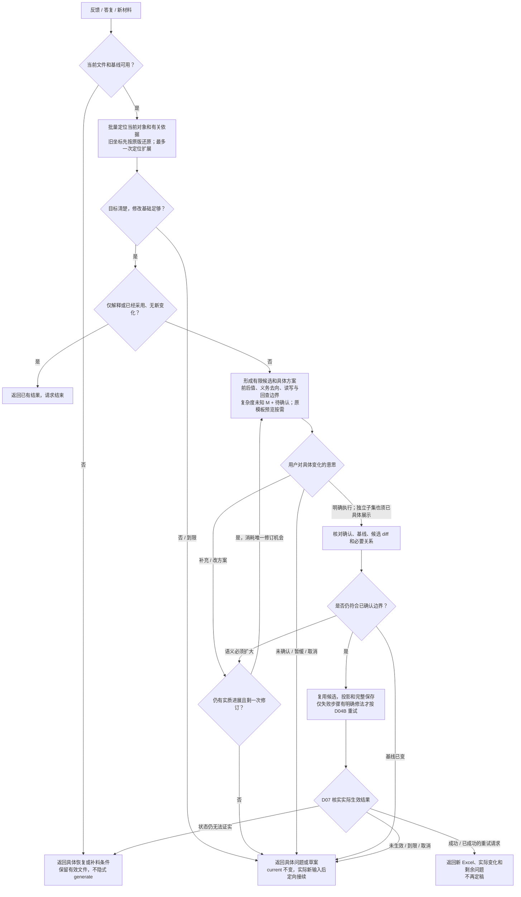
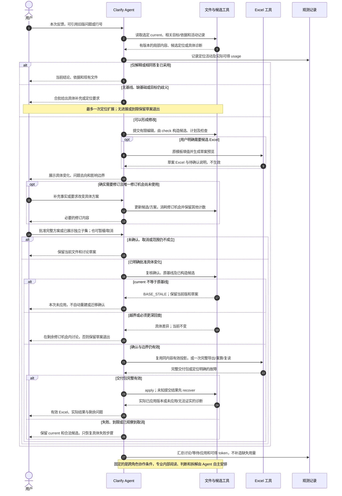

# D05 · Clarify 与有限修改

[详细设计目录](README.md) · [概要](../04-bounded-change-and-recovery.md) · [修改走读 EX05](examples/EX05-clarify-changes.md) · [数据 D02](D02-shared-data-and-evidence.md) · [环路 D04B](D04B-bounded-loops.md) · [保存 D07](D07-tools-storage-and-recovery.md)

状态：R3 详细设计稿。沿用快速出稿、文件共享和独立 clarify 的产品边界；EX05 为合成走读，未运行 Skill、应用版本或测得性能。本文定义语义修改与用户协作，D07 负责可靠保存，D06 负责 Excel，D04B 负责所有重复活动的停止策略。

## 1. 一次请求的结果与职责

Clarify 由同一位用户串行使用，从当前交付和本次反馈开始，尽快给出具体调整方案；用户确认后应用已形成的有限候选，返回新版 Excel 和独立待确认说明。回答一个问题、提出一个建议、要求解释和批准一个已展示方案是不同的意思，不能仅凭收到消息就更新有效 SOW；没有多个改稿请求的并行协调。

| 责任方 | 负责的判断或操作 |
|---|---|
| 用户 | 补事实、决定范围/方案或估算口径、选择有歧义的目标，确认实际调整方式 |
| Agent | 理解反馈、定位对象、判断影响、形成专业候选与简短方案；合批讨论、检查义务和停止无进展分析 |
| 代码工具 | 文件与版本读取、ID 分配、精确 diff、结构/引用/标准合法性、范围和基线核对、模板投影与一致生效 |

主会话仍是一个 Skill、一个 Agent，不默认引入 subagent。下文活动是输入输出和协作边界，不能实现成逐个 Action 才能推进的专业推理链。没有新的上游 Owner、Reviewer 或定稿步骤。

| 本次出口 | 用户得到什么 | 有效数据 |
|---|---|---|
| 解释或实际无变化 | 当前值及依据、已有文件位置，或说明该答复已经采用 | current 不变，不创建空版本 |
| 待定位、待补料或待方案确认 | 具体问题或可审阅方案，已保存的讨论草案 | current 不变；未采用答案只在 work |
| 用户确认且应用成功 | 新 Excel、实际变化、当前口径及剩余问题 | 完整新版本生效，请求结束 |
| 取消、到限、相关冲突或工具失败 | 有效文件位置、具体障碍、仍可复用的草案/候选 | 不激活半片；已生效后才收到取消则报告实际版本 |

## 2. 使用哪些输入，产生哪些结果

Clarify 不重新询问新旧项目或索要已经有效的 PRD/HLD。只缺一份无关原件不等于本次不能修改；本次确实依赖且无法恢复的依据缺失，则定向补料。

| 活动 | 最小输入 | 形成的结果 | 默认不加载 |
|---|---|---|---|
| 接收与恢复 | current/manifest、反馈及其引用版本；有关方案与活动记录 | 确定当前基线、反馈目标和已采用状态 | generate 聊天、全部历史版本 |
| 批量定位 | 相关问题/对象、projection 映射、标题/主题索引 | 可辨目标或一组需要用户选择的候选 | 全本 Excel、全部模型正文 |
| 局部影响判断 | 目标与父项、关系邻域、有关 PRD/HLD/原型/历史摘录和已应用决定 | 读取范围、写对象、保留边界、最深回查坐标 | 未变原件的重复解析、无关专业拆解 |
| 候选与方案 | 上述依据、模板有关标准、用户答复 | 专业内容候选、字段 diff、问题去向、条件及具体方案 | 另一次全量 Epic/Feature/Story/Task 生成 |
| 确认与应用 | 具体方案、用户确认、仍有效的基线与候选 | 必要检查、D06 交付包、D07 完整版本 | 对同一结果的重复审批或独立专业复评 |

新增输入沿用 D03：非原型仅可读文本（默认 Markdown）和 `.xlsx`；原型按资源包。新往期 SOW 提供 as-is，PRD/HLD/原型及当前补充提供 to-be 或对其的明确更正；用户答复只在明确适用范围内采用。历史文件内的旧标准不替换本版模板。

每条反馈在 work 中保留最小原话/来源、引用的问题修订或文件版本、定位结果及本次采用/暂缓的去向即可。它是请求工作记录，不是第三套稳定需求库；不为每句话创建永久业务实体。

## 3. 先批量定位，再补真正需要的信息

### 3.1 不同反馈如何定位

| 反馈形式 | 定位方法及停止条件 |
|---|---|
| 回答待确认项 | 比较问题 ID、revision、目标与当前处理；已解决且没有新含义直接返回原结果 |
| “资料迁移按 S”等自然语言 | 先查标题/类型与父层级；命中唯一且含义明确才用该对象。展示候选时附名称、所属 Story/Feature 和当前值，不要求用户学习 ID |
| “第 8 行”或截图中的名称 | 先确定 Sheet 和文件版本，再用同版 projection 反查。旧版坐标先还原旧对象，再判断它与 current 的关系，禁止直接套新行号 |
| 手改 Excel / BA draft / 新材料 | 当补充输入或修改意见读取实际相关区域；区分用户输入值与公式/布局差异，不用附件覆盖权威模型，也不承诺任意 Excel 无损回导 |
| 新增需求、整项删除或全局意见 | 先明确本期义务和归属。新增内容缺核心业务/技术/交付依据时补料，不用常见工作清单自行补方案 |

没有可用 Lite 模型/版本，只剩一份 Excel 时，说明所缺共享文件和恢复路径；也可由用户另以 draft 输入启动 generate。Clarify 不静默重建整份 SOW 来假装跨会话恢复成功。

旧对象已拆分时，lineage 只用于展示继承关系。旧答案不能自动广播到全部新对象；其事实若有清楚、仍成立的适用范围，由 Agent 形成相应候选，否则合批请用户定位。问题已改修订也按内容判断，不把 revision 不同机械当作一律无效，更不能忽略已改变的目标/前提。

### 3.2 让一次补充解决一组相关问题

先合并共同根因和共享来源，形成“已有依据—仍缺什么—为何影响这次修改”的问题包。定位歧义、实例适用和责任冲突可同批询问；不为每个 Task 开单独一轮，不给每个问题各自分配追加额度。

使用 D04B 的一次定位扩展。它包含需要的定向补读和澄清机会；问题包回复后只处理实际新增内容，不重读原材料。用户明确不知道、材料需要另行准备或同批没有实质进展，就保存草案退出。不把 generate 的两轮输入问答额度搬过来再叠加一套。

复杂度未知不占这个补问机会：新任务或本次变化无法定档，按 M 并附待确认；已有明确档位且依据未变则保留。用户确认默认 M，或直接决定按 S/L 估算，记录其实际决定，不反向编造规模。已知违反标准或触及 X/拆分的情况不能靠默认 M 掩盖。

## 4. 修改切片怎样划定

### 4.1 有限影响范围

Agent 一次读取目标及直接有关的关系/主题摘要，再按反馈判断必须读取、可能写入和保持不变的对象。关系邻域可分页，属于有限首次覆盖；不能递归展开所有可达对象。若仍有具体缺口，最多使用一次定位扩展；依然无法说明边界就返回补料或范围选择，不生成“所有相关对象”的开放授权。

计划中的读取集合可以大于写集合。读取公共客户端的所有已登记消费者摘要，是为了发现真实影响；内部实现变化不意味着每个消费者都要改。必要时核对有关主题/责任中的隐含联系，显式依赖图不是完整业务证明。

闭合检查只回答四件事：本次义务有没有去向；被改接口/责任有没有遗漏真正受影响方；有无重复建设/计量；保留对象的前提是否仍成立。为相关对象留下短说明即可，不创建永久的逐对影响矩阵。

| 情况 | 本片写入范围 | 保留边界 |
|---|---|---|
| 默认 M 确认为 M，或 M 改 S | 有关 Task 分类依据、必要值、对应问题与采用决定 | 不重新提取 AC、拆 Task 或复查整份历史 |
| 修改 AC，义务仍相同 | 该 AC 及其来源；确有工作变化的 Task/分类/说明 | 同 Story 其他 AC/Task 只在有关时写入，不按一条 AC 自动增一项 Task |
| 公共技术契约变化 | 公共建设及实际受影响的消费适配、依赖/依据 | 兼容且无需修改的使用方只读；公共建设仍单计 |
| 迁移/上线条件变化 | 有关交付 Story、真正依赖它的功能/发布条件与责任 | 不自动加入部署、演练、双写或额外测试活动 |
| 新历史命中原新建判断 | 有关 as-is/gap、具体实例/模式/内容与问题 | 包含旧零匹配的历史范围，不核验全量历史交付 |
| 纯显示问题 | D06 的有关投影/文件修复 | 不变更业务值；模型真实错误才另形成语义方案 |

### 4.2 回查边界和扩大处理

沿用概要中的四个责任坐标：0 输入/答复，1 分析与责任，2 交付对象/分类，3 Excel。每份方案写明起点、最深坐标、具体来源/主题和对象；深度是两者之差，不是可以循环几次。普通分类更正可以在层 2 完成；新答复更正事实的方案可包含层 0，但没有改写原件的权限。

进入应用后发现更深依据、更多对象或不同方案才成立，停止该候选的应用。若还剩唯一一次主动修订机会，合并全部已发现差异给用户；否则保留 current 和草案退出。不能由一个子问题再开启上游恢复环。

一个反馈确实影响全案时，要展示已识别的有限范围及能否分批。各批新旧前提可共存才能分别生效；不能共存则需要覆盖相依范围的一份完整方案，候选内部可分批准备，最终一致应用。用户没有选择该范围或资料仍不足时，保留当前有效版，明确此次修改未完成。

## 5. 确认前把专业内容做成可审阅的候选

Agent 按 P00 写有限编辑稿，交由 check/edits 在 work 复制基线、应用明确编辑并构造一份 D07 计划，不重输出全量模型或手填摘要。工具派生 `changes` 的前后值、实际 `write_set`、已选择依赖的 `read_set` 版本与可读方案；问题、决定、依据和 lineage 同样列入。Agent 决定专业依赖、问题去向、`read_boundary` 和业务条件，工具不推断这些语义。长文本保存在文件，方案只展示本次变化及必要上下文。

用户看到：本次目标、具体前后变化、涉及哪些 Story/Task、公共/交付影响、采用的分类与未决项、最深回查和暂缓范围。金额由原模板计算，插件不准备金额比较或完整性标签。工具在构造后合批检查候选/diff；格式错误不应拖到用户确认后才发现。确认后复用该候选，主要执行基线核对、必要检查和交付。

### 5.1 答复与确认

| 用户意思 | 处理 |
|---|---|
| 只给事实或首次提出改法 | 保存工作答复并形成具体方案；当前问题不提前关闭 |
| 对唯一已展示方案说“按这个执行” | 绑定该内容和基线，不重复询问相同确认 |
| 同时讨论多个备选后说“可以” | 需要明确所选方案；不把最新展示或推荐当自动选择 |
| 只执行已展示方案中明确的 A，B 暂缓 | A 已有完整前后值且能独立闭合时，形成对应子集计划，并以该明确执行消息作为确认；不再次确认同一组已展示变化。A 依赖 B 或需改值才能独立时，展示修订方案后再确认 |
| 确认同时加入新要求 | 受影响部分的旧确认不能覆盖新要求；合批形成有限修订，不能悄悄扩大 |
| 不回答、取消、只要讨论 | 不应用，不催定稿；保留有效文件与草案 |

首份具体方案加最多一次主动修订；应用中返回讨论、需要重新判断义务或改值的子集方案使用同一额度。对已经展示、独立闭合的明确子集做机械提取，不属于新一轮专业方案修订，但仍须核对实际 diff；不能借子集名义重新分析或扩大。没有语义变化的解释不重生成候选。用户实际提供新的目标或事实后可按 D04B 记录关系并定向续接；Agent 不能拆 request_id 来刷新计数。

### 5.2 模板预览按需进行

默认讨论展示专业内容与定性分类，不为每句聊天生成 Excel，也不分析金额差额。只有用户明确需要查看候选 Excel 时，对已经明确的一批有限方案执行一次 D06 原模板填值/重算，标为草案，用户直接查看模板结果；插件不自动枚举方案或根据金额选择方案。

缺失事实和分类照常进入独立待确认说明，不修改金额、公式或判定估算完整性。相同内容不重复预览，必要修订仍共用 D04B 额度。

候选预览已形成完整文件包，且候选、模板和基线均未变时，确认后可复用；否则按当前候选重新填表。确认记录本身不要求再跑专业分析，预览也不能代替用户对具体修改的确认。

## 6. 对象、问题和决定一起更新

### 6.1 拆合与归属

| 变化 | 身份及义务去向 |
|---|---|
| 改标题、局部 AC 或分类，义务未变 | 保留 ID；按实际变化更新依据和派生显示 |
| Task 仅移动到另一个 Story | Task 含义不变保留 ID，只改归属及有关依据；源/目标 Story 均进入边界检查，SIT/UAT 和汇总由模板派生 |
| Story 拆成新的独立交付 | 新 Story ID；原义务、AC、Task、问题、入/出依赖分别安排。未变的 Task/AC 可以迁移且保留自身 ID；一条验收义务被实质拆分时才创建新的 AC ID |
| 合并成新的交付或合并重复工作 | 合并对象新 ID，lineage 记录旧义务去向；仅标题相似不足以合并。独立 Task 不因父项合并而自动合并 |
| 退出本期或已有能力已完全满足 | 删除对应当前对象，lineage 说明原因和历史位置；保留真正消费/适配工作。空父项是否移除纳入方案，不自动递归清理 |

拆合时使用方案内的“原义务→新去向”短表，不新增永久 AC—Task 关系或实施对象层。共享实现保留一个 Task 父项；多个消费者通过 Story 依赖和自身有依据的适配表达。

lineage 增加 `from_version_id`，直接定位被替换对象所在的不可变版本。消费者是历史反馈定位和引用检查；继承旧 lineage 时保留原版本定位，不逐次改成最新基线，也不扫描全部历史猜对象。详见 D02 的最小数据修订。

### 6.2 部分答复与终态问题

仍有未决目标的问题保持 `open`，在 `current_handling` 明确已采用部分及剩余缺口；不新增 `partially_resolved` 状态。已采用部分作为有关字段的决定/依据保存。仅缩小同一问题的剩余范围时提升 revision 并保留去向；问题实质拆成不同事项则原项 `superseded`，新问题绑定实际目标。

确认 M 或不采用历史候选，业务分类值可能不变，但问题和采用决定改变，因此仍需要同版新交付。用户实际没有提供新含义且当前已经采用，则直接返回当前结果，不重复导出。

删除义务后原问题不能标为“已回答”；应按退出/替换标 `superseded`。所有 `open` 问题必须指向当前对象；保留的终态问题和历史决定若引用已退出对象，须能经 lineage 的 `from_version_id` 在确切历史版本验证。不存在的 ID 不能仅靠“历史”标签放行。原问题/答复修订仍保存在相应旧版本。

### 6.3 估算规则的边界

四项分类仍按模板，复杂度默认 M 的授权不扩展到未知方案、集成类型或任意人天。已有值依据被本次变化推翻时，计划明确是更正、默认 M、按允许的新建口径，还是保留真正空值和问题；不能在确认后顺手清空旧值。

工作方式比较本期目标与实际 as-is，不比较 SOW 草案前后文本。修改一个尚待新建的 Task，仍可能是新建工作；不能仅因为本次调用 clarify 就改成调整。交付现状确实发生变化时，使用该新事实重新判断相关工作。

Story SIT/UAT 是只读派生列（F/G，位于备注之后）。用户提出适用性意见时，先解释标准及相关 Task 分类；分类确有错误才形成相应修改。项目 clarify 不直接写这些公式值，也不把修改标准人天、倍率或模板目录混入普通内容调整；模板维护属于单独的明确范围。项目继续使用其绑定的模板版本，不因插件资产更新自动迁移。

## 7. 应用与异常出口

正常路径为：复用具体候选 → 核对相关基线/确认 → 必要检查 → D06 投影 → D07 一致生效。低成本的全局 ID/引用检查和完整 Excel 重算可以执行；它们不授权全量专业分析。

| 最早发现点 / 异常 | 必要处理与用户接入 | 保留与退出 |
|---|---|---|
| 入口无基线、文件不兼容或必要依据损坏 | 定向说明恢复条件；只使用已支持路径 | 当前能证实的文件与工作记录；不隐式 generate |
| 反馈定位歧义、旧问题含义已变 | 一次批量展示候选/冲突，必要时让用户选择 | 未选择不写候选值；到限保留草案 |
| 有合法局部未知 | 默认 M/新建或空值分别按既定规则进入具体方案 | 问题随同版交付，不为了消除问题反复补证 |
| 修改基础不足或相依范围不能闭合 | 明确所缺事实/方案或需要选择的范围 | 未改部分不是修改已完成；不交付不一致半套结果 |
| 过期草案、模板字节变化或 current 不再等于方案基线 | 停止旧候选应用，返回 BASE_STALE 或模板不兼容诊断 | 保留草案和当前有效文件；不区分相关/无关变化，不迁移旧确认 |
| 实际 diff 越界或值与方案不符 | 若是候选写入错误且原方案足以解决，按共享返修上限修该错误；若发现新义务，回具体修订 | 原版有效；错误不能转为用户待确认绕过 |
| 导出/重算/保存失败 | 复用合法候选，只处理明确失败操作；同因有修法才至多重试一次 | 无进展/到限退出，当前有效版保留 |
| 生效点不确定、提交繁忙 | D07 recover 查询一次实际结果，不忙等 | 已应用则返回原结果；未证实如实说明，不能再次盲写 |
| 取消或确认后新增意见 | 生效前拒绝已观察到取消的候选；新意见不自动写入正在应用的候选 | 生效后如需撤改，基于 current 形成新的有限修改，不倒退指针覆盖其他变更 |

正常使用只有同一人的串行请求，后续修改直接从最新 current 开始。发现意外基线变化时，不自动重建、合并或持续追赶；用户之后基于当前版续接明确修改时，才形成对应有限方案。保留短锁和幂等恢复只用于防止误调用与中断后的重复写入。

## 8. 流程与角色时序

图源：[Clarify 有限修改流程](../diagrams/clarify-change-scope.mmd)。图中的返回方案共用一次修订机会；不是每条回边各有一次。

图源：[Clarify 详细协作时序](../diagrams/clarify-change-sequence.mmd)。退出后的实质新输入是定向续接，不代表本次后台等待或自动反复提问。

## 9. 上下文与成本

首轮工作包只含本次反馈、选定版本、有关问题/对象、父级简要范围、直接关系与所需依据/标准、计划和剩余次数。跨会话或压缩后读取同一工作包，不把 generate 聊天或所有旧方案重新注入。修改范围本身很大时可以顺序处理已明确的有限部分；不据此默认开启子 agent 或并发写 current。

优先避免的开销是重复读输入、反复重提同一方案、每句答复都生成预览、确认后再生成一次候选。全文模型合成和完整公式重算可由工具在磁盘完成，stdout 只返回摘要、定位、diff 和必要诊断。文件落盘不等于主 session 历史已经减少，仍按 D04A 观察实际上下文。

为 D08 提供这些活动边界：接收到首次有效定位/补料反馈、定位与补读、具体方案准备、用户等待、按需模板预览、确认后检查/导出/应用、失败恢复。记录实际读取区域/对象数、候选写对象/字段数、方案修订、Office 调用、复用与退出原因；用时与 token 只按宿主真实可得粒度归因，不设置新的预算审批。

## 10. 验证与交接

[EX05](examples/EX05-clarify-changes.md) 走读默认 M、部分答复/确认、AC/拆合、公共技术和交付条件、历史匹配、过期反馈与有限恢复。每个分支从明确基线独立开始，列出保留对象；不是实际执行夹具或性能结论。

| 验证重点 | 最早验证方法 | 对应场景 |
|---|---|---|
| 无 generate 聊天、自由意见、旧版坐标/问题修订 | 交互样例 + 版本/映射夹具，歧义不得自动落值 | CL01—CL04、CL24、CL25 |
| 部分答复、具体子集确认、默认 M 与无实际变化 | 方案前后 diff + 用户语义走读，不新增问题状态或重复批准 | CL06—CL09、CL16—CL17、CL23、CL26 |
| 拆合/删除、历史引用、依赖重接和单一计量 | 合同 + 义务去向样例；不得仅验证 ID 存在 | AN08、CL18—CL20、CL27 |
| 新历史与实例、越界/过深、全局不兼容、改稿与实施模式区分 | 专业样例 + 有限读写和次数记录 | CL12—CL15、CL21—CL22、CL29 |
| 原模板预览复用及过期基线拒绝 | D06 文件往返 + D07 故障注入；基线不同时不复用候选 | CL05、CL10—CL11、CL28 |
| 串行保存、误重复调用、取消与中断恢复 | D07 实现故障测试，按实际生效点判定 | FS03—FS08、FS15—FS16、X02—X06 |

本稿只为 lineage 增加被替换对象的确切版本定位，并细化确认/子集及历史引用规则；不引入通用 patch DSL、独立冲突引擎或全量 IR。D02/D07 同步这些消费者所需合同。[D08](D08-telemetry-and-performance.md) 已承接观测粒度、去重、活动用时和最小比较实验；EX06 区分有限宿主只读证据与合成账例。D09 已收口设计衔接并安排 I1—I4；本专题首先由 I3 验证独立修改，I4 扩展复杂组合。D02 新增的 unestimated_work 同样受具体写集合与问题修订约束，不能只改标记掩盖尚未计量的义务。
