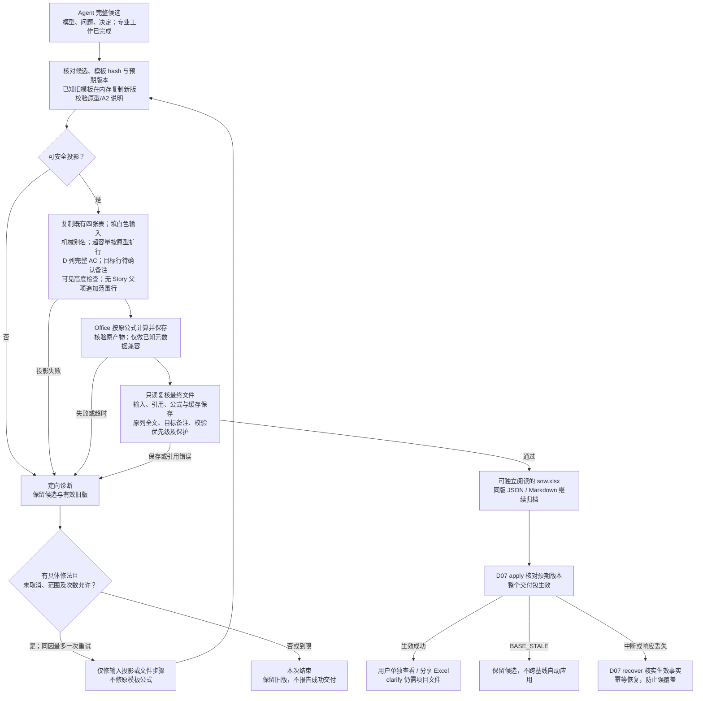

# D06 · Excel 投影与交付

[详细设计目录](README.md) · [模板概要](../05-excel-and-delivery.md) · [数据 D02](D02-shared-data-and-evidence.md) · [保存 D07](D07-tools-storage-and-recovery.md)

状态：当前活动合同按 I6.1 后的用户反馈收口为原四表原列投影，渲染实现为 `lite-render-v9`。 [I6.1](../../archive/validation/I6-self-contained.md) 记录当时 v5 两张说明表的实现与实测，历史值不改，也不证明本次提示有效；[EX04](examples/EX04-excel-projection.md) 仍是设计走读。模板仅窄改校验列公式与 A2 说明，新模板 SHA-256 为 `28d23be2b50e6abcb3abd81e97ebba3e9e696a8994e05dd9bda72987a1c8ab9e`（模板概要见 [05](../05-excel-and-delivery.md)）；已知旧模板兼容边界见第 5 节。

## 1. 责任与一次导出的输入输出

Agent 在同一主 session 完成专业分析，提供完整候选模型、待确认项和已采用决定。工具按文件读取候选，复制既有模板、填写白色输入，交给 Office 原样计算并保存，再复读文件。工具负责输入、文件、引用和公式保存正确，不裁决估算完整、部分或不可算，也不生成金额标签、金额差额或另一套算法。

| 输入 | 用途 |
|---|---|
| 同一候选的 `model.json` | Epic/Feature/Story/AC/Task、归属、依赖与备注；不从 Excel 反向重建业务模型 |
| `pending-items.json`、`decisions.json` | 只将 open 的问题与当前处理落到目标行；全部状态、决定与答复保留项目历史；字段有值不自动关闭问题 |
| 已检查的依据引用与候选内容摘要 | 核对采用依据，不将证据 ID 或外部路径自动追加备注，不在导出时重新做专业分析 |
| 本版本模板及投影器版本 | 读取 88 类标准、实际列、公式原型、表结构与格式；不复制计算口径 |
| `version_id`；可选同一基线的投影及变更摘要 | 同版标识、稳定显示别名和 clarify 修改说明；不跨基线重建或复用确认 |

输出为 `sow.xlsx`、`pending-items.md`、`projection.json`、`summary.md` 及导出检查记录。D07 将它们与模型、问题和决定保存为完整版本，再让版本生效。Excel 原列包含全部 AC、open 问题及必要备注，可单独阅读、评审和分享；Markdown 和 JSON 继续作为兼容、机器处理及项目归档，不是阅读 Excel 的前提。

正常路径一次填表、一次 Office 计算保存、一次最终文件复读。内容、模板、投影器、Office 身份、基线及相关选项完全相同，且最终字节和检查记录仍可核实时，可复用已准备文件；不完整的草案文件不能代替完整交付包。Clarify 按 D05 合批处理具体变化，不随每句回复自动导出。

generate/clarify 按单人串行使用。生效前保留最小预期版本核对；不匹配返回 `BASE_STALE` 并保留候选，不自动应用到新基线。中断、响应丢失和重复调用按 D07 核实已生效事实并幂等恢复。此边界不改变同一 session 的专业策略，也不排除未来片内 worker 优化的独立探讨。

## 2. 原四张表与原列

输出只有 `01-需求故事`、`02-任务清单`、`03-工作量汇总`、`90-估算标准`；取消 `04-待确认事项`、`05-完整说明`。保留 Table、列、标准与参数位置，校验列及说明采用第 5 节模板原型。

| 位置 | 投影方式 |
|---|---|
| `01-需求故事` / `SOWStoryTable` | 每个 Story 一行，重复填写 Epic/Feature，不合并数据行；完整 AC 在 D，必要备注在 E；无 Story 的未拆明父项按第 4 节追加范围行 |
| `02-任务清单` / `TaskTable` | 每个 Task 恰好一行，父 Story 使用同版显示名；必要备注在 G |
| `03-工作量汇总` | 原 `ProjectSummaryTable` 和 A12:C20 的 `ProjectParameterTable` 保持原样 |
| `90-估算标准` / `TaskStandardTable` | 原 88 类标准、复杂度细则和 SIT/UAT适用全部保留 |

白色业务输入保留手填能力，灰色公式列延续保护。手改 Excel 不更新项目模型、问题状态或版本摘要；clarify 仍需项目 JSON、依据和版本文件，独立查看不等于无损回导。

### 2.1 精确写入映射

表名、实际表头和列位置共同核对。模型 `work_type_name` 匹配标准表的 `工作类型`，写入 Task 表的 `工作类型名称`，不能混用这两个机器表头。

| 模型来源 | Sheet / 列 / 表头 | 写入规则 |
|---|---|---|
| Story → Feature → Epic.title | 01 / A / 需求 | 按父关系取值；长文按第 6 节处理 |
| Story → Feature.title | 01 / B / 子需求 | 按父关系取值 |
| Story.title | 01 / C / 故事 | 第 3 节的显示名 |
| Story.acs | 01 / D / 验收条件 | 完整验收正文逐条编号换行；无 AC 时真正留空，编号不代替 AC 身份 |
| Story.notes、目标 open 问题 | 01 / E / 备注 | 正常为空；已确认且必要的交付边界说明来自 notes，问题另按第 4 节合并，不写回模型 notes |
| Task.story_id | 02 / A / 所属故事 | 使用同版父 Story 显示名，禁止再次独立拼名 |
| Task.name | 02 / B / 任务名称 | 第 3 节的显示名 |
| Task.work_type_name | 02 / C / 工作类型名称 | 精确目录名或合法空白 |
| Task.work_mode | 02 / D / 工作方式 | 新建 / 调整 / 接入复用，或合法空白 |
| Task.complexity | 02 / E / 复杂度 | S / M / L；无法识别为 M 并附问题 |
| Task.integration_type | 02 / F / 集成类型 | 内部集成 / 外部集成，或有业务依据的空白 |
| Task.classification_basis、Task.notes、目标 open 问题 | 02 / G / 备注 | 非新建工作方式、非 M 复杂度的判断原因；必要说明及问题按第 4 节投影 |
| 模板公式 | 01 / F:J；02 / H:L | SIT/UAT、任务列表、人天原样保留；J/L 校验采用新版模板原型，不写死结果 |

依赖、Task 列表和 evidence_refs 保留各自结构字段，不自动复制到备注；不追加证据 ID 或外部路径。特有责任例外及安全别名原名等确有必要的说明可以保留，正常 notes 为空。分类列只写合法值或空白。

## 3. 内部身份、机械别名与行号

### 3.1 显示名分配

内部关联始终使用 ID。Story 和 Task 的显示名分别在工作簿内唯一；Epic/Feature 同名不代表同一对象。

1. 安全的普通短名称原样展示。比较时使用保守的 NFC、大小写折叠及首尾空白比较键发现碰撞；只比较，不改原业务文本。
2. Clarify 优先保留同一基线中同 ID、原名未改且仍合法的别名。新增对象不能夺用既有别名；历史版本保留自己的映射。
3. 新增或改名对象按稳定 ID 排序分配。同名安全标题可追加 `〔短身份码〕`；含 `~`、`*`、`?`、换行，以 `=`、`<`、`>` 开头，过长或无法保证在原名称匹配函数中字面匹配的关联名，直接使用 `S-短身份码` / `T-短身份码` 等纯机械别名。身份码取稳定 ID，必要时延长到可区分长度，不添加“管理端”“新版”等业务含义。
4. 关联显示名最多 120 个 UTF-16 单元，包含后缀；这是显示上限，不是业务输入限制。任何改用别名的原名完整保存在既有备注，超过单格物理限额按第 6 节诊断。原模型标题保持不变。
5. 对全部显示名、父关联和 ID 反查做唯一性检查。无法安全分配是投影错误，不能合并对象。规则版本导致的别名变化记录为投影变化，不冒充业务改名。

120 是保守的首版显示上限，避免接近现有名称匹配函数的长度边界；具体字符语义仍须在后续适配验证中覆盖。现有只读规范来源保留：[Microsoft COUNTIF 文档](https://support.microsoft.com/en-us/excel/get-started/use-the-countif-function-in-microsoft-excel)。该来源不授权修改公式。

### 3.2 特殊名称通过输入别名处理

已读模板中，部分名称匹配已处理 `~`、`*`、`?`，Story 校验 J 列的 COUNTIF 和汇总 B7 的 SUMIF 仍直接使用名称。输出必须适配这些实际公式共同支持的输入，不为未转义位置增加转义表达式、等号 criteria 或其他公式修复。

例如原名 `查询*?~订单` 使用同版安全别名，Story C 列和其全部 Task A 列使用相同值；原名从 E 列备注可完整读取。这样全部名称引用一致，原公式保持不变。数据验证和最终文件复读同样以这一映射核对。目录名称从当前模板原值读取，不能为绕过问题重命名标准。

业务字符串强制写为文本，绝不拼接进公式；机械别名与文本安全是两项独立要求。模板原型不兼容时给出具体诊断，不通过改公式或另建计算规则放行。

### 3.3 排序与反馈

按模型已有 Epic/Feature/Story 和 Story 内 Task 顺序投影，不重新做业务排序。新增或删除可使后续行移动；clarify 的专业写集合仍按 ID，物理行位移不构成上游返修。

“第 8 行”须绑定版本与 Sheet，并按最终 `projection.json` 反查。用户重排/手改后，旧坐标不再可信，需读取附件或结合名称、归属核对。行号、显示名、短码不能跨版本代替稳定 ID。

## 4. open 问题只在实际目标行显示

由同版 `pending-items.json` 取 open 问题，将真实 `question` 和 `current_handling` 完整写入目标行备注，以“待确认：”开始；有必要的其他备注接在其后。多个问题逐项表达，不用 UUID 或“有待确认项”替代正文。resolved/superseded 问题不投影到 Excel，其关闭过程、依据、完整采用答复与决定记录留项目 JSON/MD 历史；仍影响当前交付的结论由 Agent 更新到对应业务字段。无问题且无必要说明时备注真正为空。

| 目标 | Excel 位置与范围 |
|---|---|
| Story | 本 Story 的 E 备注 |
| AC | 所属 Story 的 E 备注，明确标记 D 中第几条 AC；D 保留全部已知 AC |
| Task / Task 字段 | 仅本 Task 的 G 备注，不自动上卷；若影响 Story 范围或 AC，由 Agent 显式追加相应 target |
| Epic/Feature 且有 Story | 仅实际受影响的 Story 行；专业 targets 按真实影响绑定，不扩散到无关 Story |
| 未拆明 Epic/Feature 且无 Story | 在 01 表正常 Story 行之后追加范围行，仅填实际 Epic/Feature 与 E 中问题；不存在的层级、Story、AC、人天留空，不伪造 Story/Task |

范围行沿用原表与公式原型，映射到实际 Epic/Feature ID；不生成新业务对象。Story 容量计算包含范围行，校验列显示待确认；没有 Story 的公式结果保持空白，不填零人天。若 Epic 下已有 Feature，只按实际未拆明范围投影，不重复造同一范围的父级占位行。

复杂度未知仍为 Task E=M+具体问题；候选实例未定仍为新建+问题。`unestimated_work` 仅说明未计量的业务范围，不参与金额/SIT/UAT 计算。输入不足走补料出口，不能靠范围行把基础不足伪装成可交付 SOW。

`pending-items.md` 保留所有状态及稳定 ID 锚点，供项目历史和机器定位；Excel 阅读不依赖该文件。

### Story 备注内容与来源

专业编写规则集中在 [备注与问题的目标](../../../references/generate-slices.md#备注与问题的目标)，Generate 与 Clarify 共用。已确认且必要的范围、责任或外部前提说明，由 Agent 根据 PRD/HLD 明确陈述或用户已确认答复写入 `Story.notes`；可观察的验收成果写入 AC。仅影响工作量评估的未知保存为问题，按真实影响绑定 Story/AC 或 Task；不影响估算的开发/验收细节既不创建问题，也不转存 notes。投影器只组合 `notes` 与目标 open 问题，不识别语义、不补写前提，也不从 Task 自动推断 Story 是否待确认。

原有字段和投影机制已经承载上述分工；内容取舍属于 Agent 的专业判断，不新增语义门禁或额外检查轮次。仅有必要已确认说明的 Story 沿用普通校验，有目标 open 问题的 Story 显示“待确认”。安全别名所需原名仍按第 3 节完整保留。

### Task 判断原因

从同版 `classification_basis` 按 `fields` 选择非新建 `work_mode` 和非 M `complexity` 的 `rationale`，在 G 列标明维度及当前值，例如“工作方式（调整）判断原因：沿用现有接口，本期增加筛选条件”。原因由 Agent 依输入或用户决定编写，投影器不分析、摘要或编造；新建和 M 不额外展示原因，未知工作方式继续由问题表达。完全相同的原因正文只写一次，并合并适用维度标签；其他分类原因不单独复制。

open 问题及当前处理保持备注首段，随后写适用原因和必要说明。只有原因时沿用普通校验；存在 open 时显示待确认。原因不写回 `Task.notes`，`projection.objects[].fields` 将 `classification_basis` 定位到 G；原因的非法字符/物理超限诊断指回该字段，沿既有额度修复。Clarify 改回新建/M 时不再投影已不适用的原因，历史数据及旧 Excel 保留。

## 5. 模板窄改与已知旧版本兼容

模板继续独占人天、金额、SIT/UAT、参数和取整。I6.2 已调整 Story J / Task L 的校验公式原型及 A2 说明；I6.3 仅进一步更新 Task A2 的备注指引，全部公式不变：空行返回空；该行备注以“待确认：”开始时显示“待确认”，优先于已有校验；否则执行原校验公式。正常空行与仅含真实父项的问题范围行须区分。校验提示不控制人天、金额、SIT/UAT 或汇总，不新增金额状态或差额算法。

新项目绑定随插件发布的新模板及其实际 hash。运行兼容两个已知旧 SHA-256：`7b96f9d2d6f6f6175c4d99d875ee3cf0743df3d6884d64258271993432299919` 和 `6abc55d44bc66476a60c2251e18c0dfdb66709e07539c246dfdec3a0373f5332`：在内存副本中，从随插件新版模板仅复制校验列公式原型及 A2 说明后投影，公式不硬编码在 Python。保留旧项目模板原字节及项目、候选、prepared/projection 中实际项目 `template_hash`；其余模板返回 `VERSION_INCOMPATIBLE`。不自动重建项目或改写旧项目身份。

工具复读实际输入、公式原型、Table 元数据和 Office 保存结果；金额缓存原样保存。合法分类留空、默认 M、复用 open 及未拆明工作都按业务合同表达，不从缓存反推范围完整或问题关闭。已知值漏写、非法分类和父关系错误仍须诊断；投影器不修复模板中的其他公式。

## 6. 扩行、长内容与文本安全

### 6.1 保留预留容量，超容量才扩行

基础数据区为 Story 第 5—64 行、Task 第 5—204 行。容量内保留模板现有 `SOWStoryTable` A4:J64 和 `TaskTable` A4:L204，不因对象少缩表。未使用的预留输入保持空白，公式保留；不因有公式就把空行当业务对象。

超过 60 个 Story/范围行或 200 Task 时，一次扩展到所需行数。延续原公式原型、样式、行高和锁定，更新必要的 Table ref/autoFilter、公式引用范围、数组公式 ref、数据验证、条件格式及打印范围；保留冻结与重复表头。相对 A1 引用只作对应平移，不改变公式计算语义，也不新增汇总表达式。

任务列表 H 的数组公式须保留其公式类型与 ref。Table 计算列元数据沿用模板与首行一致的 A1 原型，不改成另一套公式表示。原型无法安全扩展时返回技术诊断，不能修原模板公式或把结果写死。支持的 Office 对文件的保存转换只可保留已验证的等价表示；发现公式/保护/引用损坏即保留候选并退出，不以重写公式补救。

### 6.2 原列全文与物理限额

AC 全部保存在 D，备注保存在 E/G，其他长文本仍存原列；安全关联名按第 3 节使用别名，原名留备注。保留原有顺序、空白和标点；Excel 将 CRLF/CR 显示为 LF，项目归档保留原字节。新输出只将原 D 列宽设为 88、顶对齐并换行，原字体/字号保持；模板资产不改。复读按投影值核对列宽：Office 会以自身默认字符宽度重新表达整表列宽，因此接受各列比例一致的整表换算（Windows 实测约 0.91），单列变化或各列比例不一致仍判为布局篡改。AC 行高按中文/英文显示单位、显式换行及长编号段落的空格换行估算，备注和任务列表保留已验证的较保守余量。AC 正文及换行安全余量能容纳于 409 点时，可缩减最多 12 点的底部留白以满足上限，正文、字号及原换行余量不缩减；正文及换行余量本身预计超过 409 点时返回 WORKBOOK_LAYOUT_OVERFLOW，不生成裁切的成功文件；诊断给原对象/字段和实际 Sheet/单元格。H 为模板派生任务列表，定位所属 Story、field=null，不虚构 Story.tasks 字段。保留候选/current，不摘要、不搬列、不加说明表或续行协议，也不根据行高强制拆 Story/AC。

单格上限为 32767 个 UTF-16 单元，按最终写入文字（含编号和备注组合）检查。超过物理限额时返回实际对象/字段定向 diagnostic，保留完整候选，交由 [D04B](D04B-bounded-loops.md) 现有有界修复处理；无可保真修法则退出，不静默截断、删义务或改报业务待确认。不设更低字符门禁、AC 数量门禁或摘要算法。

任务列表 H 保留原公式、数组属性与 Office 原样结果；TaskTable 已保存全部任务行，不自动向 Story 备注追加 Task 清单。新输出 `details=[]`，不生成 `details.md`。

### 6.3 文本安全与复读

所有业务文本强制按 OOXML 字符串写入，包括以 `=`、`+`、`-`、`@` 开头的内容和类错误码文本，保留真实前导单引号，不执行输入公式。写前核对 XML 字符合法性及物理长度；无法表示时按对象/字段诊断，不删字符。复读直接核对原列全文、顺序、备注目标、实际单元格位置及布局，无外部正文入口。

## 7. 投影文件与导出结果合同

`projection.json` 只保存身份和位置映射，不复制整份模型、长文本、人天值或项目金额 status。字段由 I1.3 首次消费，数据合同继续为 `lite-projection-v1`；本次仅将渲染实现修订为 `lite-render-v9`：

| 字段 | 内容 |
|---|---|
| `schema_version`、`version_id` | 映射协议和所属交付版本 |
| `projector_version`、`template_hash` | 使用的投影器与原模板身份 |
| `model_hash`、`pending_items_hash`、`decisions_hash`、`workbook_hash` | 实际输入和最终工作簿字节摘要，不循环包含自身 |
| `objects` | `object_id`、种类、sheet/table、rows 数组、`display_name`、字段单元格位置；Epic/Feature 可对应多行，AC 保留 D 单元格条目与 AC ID |
| `pending_items` | `pending_item_id`、`path`（固定 `pending-items.md`）、`anchor`、`targets`；target 保存 `object_id`、`field` 和本版单元格位置，无行时位置为空；问题状态从同版问题数据读取；path/anchor 继续用于归档兼容 |
| `details` | 新输出固定为空数组；保留 v1 历史字段合同，不新增分段协议 |

问题文件的字节摘要由 `manifest.json` 统一登记；新输出不含 `details.md`。manifest 同时绑定 projection、summary、最终 Office 身份、候选摘要和检查记录。既有 pending path/anchor 保留项目历史定位，resolved/superseded 的 Excel cells 为空；open 的 cells 对应实际行。所有位置按最终文件复读，不用预期行号代替，也不写本机绝对路径。

`summary.md` 只说明 `version_id`、范围概况、本次已应用变化、待确认数量与入口、当前默认字段处理、保留的未拆明业务范围、交付文件位置、机械检查结果和当时可得的观测摘要。它不展示金额、估算状态或数值差额；用户在 Excel 查看原模板结果。

`render` 沿用 D07 信封，返回 `prepared_ref`、`version_id`、`workbook_ref`、`projection_ref`、`summary_ref`、`pending_items_ref`、`details_ref`、`office_identity`、`verification_ref`、`pending_count`。文件引用沿用 `{path, sha256}`；`pending_items_ref` 指 Markdown 阅读文件，`details_ref` 新输出为 null，`pending_count` 只计 open 问题。删除 `estimate_status` 及任何分费用 `complete/partial/unavailable` 字段，不以别名重建同义状态。详细诊断存检查文件，stdout 保持小摘要。

P00 保留 render.result 和 v1 字段形状；新 prepared.files/manifest 保存 `pending-items.md`，不增加 `details.md`，`details=[]`。旧 applied 的文件和映射保持原样。交付机械成功由原信封及检查表达，不等于金额或专业语义结论。

## 8. Office 复读、失败与恢复

`lite-render-v9` 纳入 render attempt 身份，投影 Schema 不变。旧 applied 版本及其历史内容保持不变，恢复按原成功事实处理，不就地升级。v8 及更早不满足当前布局的成功预览，沿既有一次 render 返修额度重新投影，保留旧文件及计数。旧 prepared 或预览不能仅因旧成功收据、路径或相同 Schema 绕过当前核验；复用及 apply 必须满足本节新增的独立可读要求，不能沿用旧验证器放行不满足四表原列合同的文件。v8 已成功且通过当前完整复核的 prepared 仍可复用，无需为版本号变化重算；v8 因底部留白误拒绝的失败 attempt 可在具体实现修复后沿既有一次返修继续。新渲染仍受原有限返修额度约束，不删除失败历史或重置计数。

参考 D00 已跑通的 openpyxl 写入、Office 隔离目录/配置和 OOXML 复读方法。Office 在独立临时目录打开候选、计算原模板公式并保存，不接管用户正在编辑的工作簿。不默认生成第二份工作簿比较金额，也不运行 Python 数值复算。

每次必要检查包括：候选摘要未变；每个 Story/Task 恰好投影一次；未拆明父项范围行完整；AC 与必要备注原列全文不丢；open 只在准确目标行，历史问题不在 Excel；原四表、Table、公式/数组、引用、格式和保护按本合同保存；校验优先级与模板原型一致；Office 产物及缓存属于本次输入。业务覆盖和重复建设检查属于 D04，不在 render 重跑模型评审。

Office 保存后先核验原始产物，再完成下述已验证的保存兼容处理；随后只读复读并绑定最终字节，不再使用普通 `openpyxl.save` 改写导致缓存丢失。不设置金额预期类型或空值传播门禁；原模板对合法未知输出的空白/提示保留。若需修本次输入投影、文本或文件引用，修后重新让 Office 计算保存并重新绑定文件；只允许有具体修法的有限重试。原模板公式缺陷不在自动修复范围。

I1.3 的真实 LibreOffice 往返发现两类固定保存差异：Table 名称、列和引用保留，但计算列的 `calculatedColumnFormula` 元数据被省略；整列数据验证范围被裁至已使用区域之后约 1,000 行。原单元格公式仍在，这两类差异仍会影响后续手填，不能仅凭退出码为零放行。

因此引擎适配允许一次有限 OOXML 兼容处理：在核验原始产物的 Table 身份、列、公式、校验规则及缓存后，仅从本次已验证候选恢复上述缺失的计算列元数据和符合已知裁剪模式的数据验证范围。处理前后核对单元格公式、类型和值/缓存没有变化；不整体替换 Table 或保护设置，不修改单元格公式，不修复未知损坏。Table 丢失、保护或规则损坏、非等价公式和其他范围变化仍失败。最终核验及摘要绑定发生在这次处理之后；复用和 apply 不再修改文件。这个适配细节复用旧插件经验，并收窄旧版整体恢复元数据的范围，不改变原模板计算权威。

复读同时比较行可见性、字体名称和主题字体。当前引擎另有已实测的只读接受例外：仅前三张 Sheet 的固定说明 A2，允许 `Calibri/minor` 保存成 `Arial Unicode MS/无 scheme` 或 `Noto Sans SC/无 scheme`，其文本、其余字体属性和字体主题必须不变。两者并非相同有效字体，这是限定单元格和具名字体对的已知替换；只接受这两个名称，不恢复字体、不安装字体，也不修改模板。业务单元格、其他字体对、主题变化或隐藏行仍返回 `WORKBOOK_INVALID`。

列宽比较按整表唯一换算因子判定：各列比例须彼此一致（极差不超过 0.002），且为 1.0 或落在实测平台换算区间（Windows LibreOffice 约 0.91，macOS 为 1.0）。单列变化或不一致的缩放仍返回 `WORKBOOK_INVALID`。

| 失败或条件 | 保留与出口 |
|---|---|
| 合法局部未知、默认 M、复用 open | 保留相应值/空白和问题，继续正常文件投影，不判断金额状态 |
| 业务基础不足 | 专业阶段返回资料要求和已有分析，不交空壳 SOW |
| 候选结构、分类或来源错误 | 定位字段并保留其他成果，修复范围受 D04B 限制 |
| 模板结构/公式原型不兼容 | 返回具体差异，保留候选和原有效版，不改模板或猜公式 |
| Office 缺失、超时、退出异常或产物/缓存保存丢失 | 保留合法模型与诊断，没有成功 Excel 不报告交付完成 |
| 正文预计超出可见高度 | WORKBOOK_LAYOUT_OVERFLOW 定位原对象/字段/单元格，候选与有效版保留；不调用 Office、不通过改 AC 义务凑版面 |
| 别名、输入、原列正文、元数据或公式保存损坏 | 只处理可明确修复的投影/保存问题；不因原模板金额结果改公式或补业务值 |
| 请求取消或已被新反馈替代 | 不激活迟到候选，已取消请求不自行恢复 |
| apply 前预期版本不匹配 | 返回 `BASE_STALE`，不自动重建到新 current，不沿用跨基线确认 |
| 保存中断、响应丢失或重复请求 | 按 D07 核实旧版或已成功新版，幂等恢复，不重复生效或无因重算 |

同原因至多一次有具体变化的重试，计入全请求最多两批自动修复；没有进展或到限就结束。Office 进程超时与取消用经验证的适配。原生 Excel 打开、保存后重开及代表性显示检查属于适配回归，不要求每次请求操作桌面 UI。

图源：[Excel 投影与交付](../diagrams/excel-projection.mmd)。机械交付的先后不规定 Agent 专业活动的内部调度。

## 9. 后续实现验证与交接

既有手工模板证据见 [05](../05-excel-and-delivery.md)。下表是当前验证要求；I1.3 的实现和执行结果只证明当时范围，不能把 EX04 走读、I6.1 或旧阶段通过当作本次 v9 结果。

| 组合 | 验证重点 |
|---|---|
| EX01 初版与复杂度调整版 | 对象/字段/归属正确；默认 M+问题；原公式保持，Office 保存的输入和缓存对应本版 |
| EX03 候选与局部未知 | 新建值和 open 问题共存；缺失字段留空，工作簿内完整问题可达，无金额状态或补值门禁 |
| 未拆明工作与无 gap | 前者完整保留业务提示且不接入计算，后者有充分业务依据；资料不足不能用空表冒充 |
| 通配符、criteria 运算符、大小写/Unicode 同名、长名、移动/删除 | 机械别名唯一且可反查，所有父引用一致，COUNTIF/SUMIF 原公式未改，完整原名可达 |
| 0/1、60/61 个 Story/范围行，200/201 Task | 容量内不缩表，超容量按原型扩行，末行/数组 ref/校验/保护/打印一致 |
| 长 AC、备注、任务列表及公式起始文本 | 原列全文、32767 UTF-16 边界、409 点行高上限及字段诊断；公式列不被正文覆盖 |
| 无问题、多个目标及问题状态变化 | 无必要说明时备注留空；open 问题+处理以待确认前缀落目标行；AC 标条目，Task 不自动上卷，显式多目标各自展示；resolved/superseded 问题仅项目历史 |
| 新模板、已知旧模板与未知 hash | 新模板定向变更校验/说明；旧模板内存兼容且原字节/hash 不变；未知模板拒绝，不重建项目 |
| 旧 applied 与旧 prepared | 保留历史版；旧准备包不得绕过 v9 判断原因及四表原列核验，失败历史和额度不重置 |
| Office 保存、重开、缓存或 Table/保护丢失 | 检查最终文件和原生兼容性；原样缓存保存，不以金额结果替代文件证据 |
| 预期版本不符、中断、响应丢失和重复请求 | `BASE_STALE` 防误覆盖，完整包一次生效，幂等恢复，不自动跨基线重建 |

用时记录映射/写入、Office、复读、apply；同一物理调用不重复计数，不按行数估 token。正常路径不逐 Sheet 截图注入主 session；布局回归或具体异常才做必要视觉检查。

跨文件合同见 [D02](D02-shared-data-and-evidence.md)、[D05](D05-clarify-and-change-scope.md)、[D07](D07-tools-storage-and-recovery.md)、[P00](../../archive/implementation/P00-contracts-and-fixtures.md)、[P01](../../archive/implementation/P01-reliable-delivery.md) 和 [D09](D09-validation-and-implementation.md)。自主取舍见 [AD33](../13-self-review-and-decisions.md#ad33--四表原列与验收成果)。实现实测由主 Agent 在 validation 单独记录；原样例修订不等于 fresh generate 评测。
