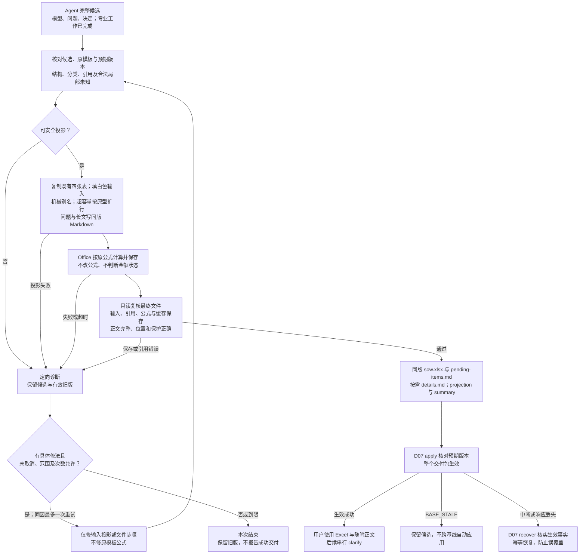

# D06 · Excel 投影与交付

[详细设计目录](README.md) · [模板概要](../05-excel-and-delivery.md) · [数据 D02](D02-shared-data-and-evidence.md) · [保存 D07](D07-tools-storage-and-recovery.md)

状态：按 Q2 最新决定重写的详细设计稿。模板实际列、Table 和原公式是投影依据；[EX04](examples/EX04-excel-projection.md) 是设计走读，自动投影与扩行仍未实现。本设计不编辑基础模板资产，其 SHA-256 保持 `6abc55d44bc66476a60c2251e18c0dfdb66709e07539c246dfdec3a0373f5332`。

## 1. 责任与一次导出的输入输出

Agent 在同一主 session 完成专业分析，提供完整候选模型、待确认项和已采用决定。工具按文件读取候选，复制既有模板、填写白色输入，交给 Office 原样计算并保存，再复读文件。工具负责输入、文件、引用和公式保存正确，不裁决估算完整、部分或不可算，也不生成金额标签、金额差额或另一套算法。

| 输入 | 用途 |
|---|---|
| 同一候选的 `model.json` | Epic/Feature/Story/AC/Task、归属、依赖与备注；不从 Excel 反向重建业务模型 |
| `pending-items.json`、`decisions.json` | 生成问题阅读文件、当前处理和本版已采用答复；字段有值不自动关闭问题 |
| 已检查的依据引用与候选内容摘要 | 展开已有来源定位；不在导出时重新做专业分析 |
| 本版本模板及投影器版本 | 读取 88 类标准、实际列、公式原型、表结构与格式；不复制计算口径 |
| `version_id`；可选同一基线的投影及变更摘要 | 同版标识、稳定显示别名和 clarify 修改说明；不跨基线重建或复用确认 |

输出为 `sow.xlsx`、`pending-items.md`、按需 `details.md`、`projection.json`、`summary.md` 及导出检查记录。D07 将它们与模型、问题和决定保存为完整版本，再让版本生效。问题文件与被引用的长文文件是正式交付的一部分。

正常路径一次填表、一次 Office 计算保存、一次最终文件复读。内容、模板、投影器、Office 身份、基线及相关选项完全相同，且最终字节和检查记录仍可核实时，可复用已准备文件；不完整的草案文件不能代替完整交付包。Clarify 按 D05 合批处理具体变化，不随每句回复自动导出。

generate/clarify 按单人串行使用。生效前保留最小预期版本核对；不匹配返回 `BASE_STALE` 并保留候选，不自动应用到新基线。中断、响应丢失和重复调用按 D07 核实已生效事实并幂等恢复。此边界不改变同一 session 的专业策略，也不排除未来片内 worker 优化的独立探讨。

## 2. 四张表保持既有结构

项目输出仅复制基础模板，不新增列、Sheet、汇总、参数、隐藏 agent 字段或公式体系。原表头、说明、标准与参数位置保留，版本和问题概况写在同版说明文件中。

| 位置 | 投影方式 |
|---|---|
| `01-需求故事` / `SOWStoryTable` | 每个 Story 一行，重复填写 Epic/Feature，不合并数据行；AC 保留顺序，F:J 公式列保留 |
| `02-任务清单` / `TaskTable` | 每个 Task 恰好一行，父 Story 使用同版显示名；H:L 公式列保留 |
| `03-工作量汇总` | 原 `ProjectSummaryTable` 和 A12:C20 的 `ProjectParameterTable` 保持原样；不增加部分金额或状态展示 |
| `90-估算标准` / `TaskStandardTable` | 原 88 类标准、复杂度细则和 SIT/UAT适用全部保留；不以历史 SOW 替换 |

白色业务输入保留手填能力，灰色公式列延续保护。手改 Excel 不自动更新问题状态、插件模型或版本摘要，后续修订仍通过 clarify。已交付文件有外部正文引用时，分享时需带上同版文件。

### 2.1 精确写入映射

表名、实际表头和列位置共同核对。模型 `work_type_name` 匹配标准表的 `工作类型`，写入 Task 表的 `工作类型名称`，不能混用这两个机器表头。

| 模型来源 | Sheet / 列 / 表头 | 写入规则 |
|---|---|---|
| Story → Feature → Epic.title | 01 / A / 需求 | 按父关系取值；长文按第 6 节处理 |
| Story → Feature.title | 01 / B / 子需求 | 按父关系取值 |
| Story.title | 01 / C / 故事 | 第 3 节的显示名 |
| Story.acs | 01 / D / 验收条件 | 原文逐条编号换行；无 AC 时真正留空，编号不代替 AC 身份 |
| Story.notes、问题/依赖/正文定位 | 01 / E / 备注 | 保留原文，追加明确分隔的引用段；不写回模型 notes |
| Task.story_id | 02 / A / 所属故事 | 使用同版父 Story 显示名，禁止再次独立拼名 |
| Task.name | 02 / B / 任务名称 | 第 3 节的显示名 |
| Task.work_type_name | 02 / C / 工作类型名称 | 精确目录名或合法空白 |
| Task.work_mode | 02 / D / 工作方式 | 新建 / 调整 / 接入复用，或合法空白 |
| Task.complexity | 02 / E / 复杂度 | S / M / L；无法识别为 M 并附问题 |
| Task.integration_type | 02 / F / 集成类型 | 内部集成 / 外部集成，或有业务依据的空白 |
| Task.notes、相关问题/正文定位 | 02 / G / 备注 | 保留原文，追加问题编号与当前处理说明 |
| 模板公式 | 01 / F:J；02 / H:L | SIT/UAT、任务列表、人天及校验原样保留，禁止写死结果或覆盖为正文入口 |

依赖备注按 `uses` / `delivery_precondition` 表达“使用……”和“交付前提……”，引用目标 Story；不复制目标 Task 或人天。历史/外部能力只显示已有依据，不为导出补造 Story。分类列只能写合法值或空白，正文入口放在备注，不能用链接文字替代分类值。

## 3. 内部身份、机械别名与行号

### 3.1 显示名分配

内部关联始终使用 ID。Story 和 Task 的显示名分别在工作簿内唯一；Epic/Feature 同名不代表同一对象。

1. 安全的普通短名称原样展示。比较时使用保守的 NFC、大小写折叠及首尾空白比较键发现碰撞；只比较，不改原业务文本。
2. Clarify 优先保留同一基线中同 ID、原名未改且仍合法的别名。新增对象不能夺用既有别名；历史版本保留自己的映射。
3. 新增或改名对象按稳定 ID 排序分配。同名安全标题可追加 `〔短身份码〕`；含 `~`、`*`、`?`、换行，以 `=`、`<`、`>` 开头，过长或无法保证在原名称匹配函数中字面匹配的关联名，直接使用 `S-短身份码` / `T-短身份码` 等纯机械别名。身份码取稳定 ID，必要时延长到可区分长度，不添加“管理端”“新版”等业务含义。
4. 关联显示名最多 120 个 UTF-16 单元，包含后缀；这是显示上限，不是业务输入限制。任何改用别名的原名完整保存在既有备注，放不下时进入 `details.md` 并给出入口。原模型标题保持不变。
5. 对全部显示名、父关联和 ID 反查做唯一性检查。无法安全分配是投影错误，不能合并对象。规则版本导致的别名变化记录为投影变化，不冒充业务改名。

120 是保守的首版显示上限，避免接近现有名称匹配函数的长度边界；具体字符语义仍须在后续适配验证中覆盖。现有只读规范来源保留：[Microsoft COUNTIF 文档](https://support.microsoft.com/en-us/excel/get-started/use-the-countif-function-in-microsoft-excel)。该来源不授权修改公式。

### 3.2 特殊名称通过输入别名处理

已读模板中，部分名称匹配已处理 `~`、`*`、`?`，Story 校验 J 列的 COUNTIF 和汇总 B7 的 SUMIF 仍直接使用名称。输出必须适配这些实际公式共同支持的输入，不为未转义位置增加转义表达式、等号 criteria 或其他公式修复。

例如原名 `查询*?~订单` 使用同版安全别名，Story C 列和其全部 Task A 列使用相同值；原名从 E 列备注或 `details.md` 可完整读取。这样全部名称引用一致，原公式保持不变。数据验证和最终文件复读同样以这一映射核对。目录名称从当前模板原值读取，不能为绕过问题重命名标准。

业务字符串强制写为文本，绝不拼接进公式；机械别名与文本安全是两项独立要求。模板原型不兼容时给出具体诊断，不通过改公式或另建计算规则放行。

### 3.3 排序与反馈

按模型已有 Epic/Feature/Story 和 Story 内 Task 顺序投影，不重新做业务排序。新增或删除可使后续行移动；clarify 的专业写集合仍按 ID，物理行位移不构成上游返修。

“第 8 行”须绑定版本与 Sheet，并按最终 `projection.json` 反查。用户重排/手改后，旧坐标不再可信，需读取附件或结合名称、归属核对。行号、显示名、短码不能跨版本代替稳定 ID。

## 4. 待确认事项是同版文件

`pending-items.md` 总是存在，由同版 `pending-items.json` 和 `decisions.json` 投影。每项以稳定问题 ID 生成文件锚点，包含编号、状态、全部目标对象/字段、问题原文、当前处理、来源定位、已采用答复及本版工作簿位置。多个 targets 逐项保留；没有工作簿行的对象级目标仍按 ID 列出，不能为定位创建空壳 Story。

open 优先，resolved / superseded 随后，组内按稳定 ID。无问题时明确写“无待确认事项”，不伪造问题。既有 Story E / Task G 备注以普通文本引用，例如 `待确认 P-01，见 pending-items.md#pending-P-01`；实际锚点来自问题 ID，不以名称拼接。文件开头标明 `version_id`，所有链接为同版相对路径。

| 情况 | 文件与输入表达 |
|---|---|
| 复杂度无法识别 | Task E 填 M；备注及问题说明授权默认，待用户确认/调整，不回查定档证据 |
| 候选 API/事件实例未定 | 工作方式填新建，问题列出候选与需确认事实，不另建假想复用 Task |
| 无相关历史候选 | 正常新建，不制造通用复用问题 |
| 非集成 Task | 集成类型为空，保留不适用依据，不增加虚假问题 |
| 已知部分 AC | D 列保留已有 AC，备注说明待补内容；不以“待确认”冒充 AC |
| 已确认但尚未 apply | 有效版本保持旧文件和旧值；讨论候选留在 work |

`unestimated_work` 只表示已有依据的某部分业务工作尚未形成可计量 Task。它在问题文件中说明涉及范围和当前处理，不创建无依据 Task，不接入 Story/SIT/UAT/项目公式，不生成金额状态，也不驱动金额门禁。业务基础严重不足仍由专业阶段停止拆解；导出工具不能靠默认值绕过它。

来源只展开已登记 evidence_refs 的材料名、章节/行或 Sheet/区域、答复标识及必要限制，不新增判断。不导出本机绝对路径、整份来源材料、工具日志或 agent 推理。业务字段自身的完整正文按第 6 节保留；说明文件在同版目录内可达。

## 5. 原模板独占全部计算

输出直接保留模板现有 Task、Story、SIT/UAT、项目汇总和校验公式。金额缓存由 Office 实际计算并原样保存；Python、JSON 和 Agent 不计算、不调整金额，不生成修改前后金额差额。

投影器不增加必要输入保护、不把空白转换为零或不可用、不改写 SIT/UAT 三态逻辑、不设计完整/部分汇总、不生成金额标签。原公式对合法输入产生的数值、空白、提示或错误值按原样保存，不能据此给候选贴金额状态或触发改数、补值、修公式。文件检查报告可记录原样观察，但只判断是否发生输入漏写、引用或公式保存损坏。

金额结果与业务问题相互独立：复杂度默认 M、复用 open、合法分类留空及 `unestimated_work` 都按业务合同记录，不从缓存反推问题是否关闭。已知值未写入须修投影；非法分类、父关系错误仍须诊断。没有本期 gap 必须来自充分业务依据，不能由空表或零缓存推断。

模板和参数值不由投影器修改。允许的工作簿变化只有白色输入、必要文字布局和超容量按原型扩行所需的结构引用调整。金额完整性门禁、缺值公式保护、三态改写、公式修复和新增费用公式均不属于本合同。

## 6. 扩行、长内容与文本安全

### 6.1 保留预留容量，超容量才扩行

基础数据区为 Story 第 5—64 行、Task 第 5—204 行。容量内保留模板现有 `SOWStoryTable` A4:J64 和 `TaskTable` A4:L204，不因对象少缩表。未使用的预留输入保持空白，公式保留；不因有公式就把空行当业务对象。

超过 60 Story 或 200 Task 时，一次扩展到所需行数。延续原公式原型、样式、行高和锁定，更新必要的 Table ref/autoFilter、公式引用范围、数组公式 ref、数据验证、条件格式及打印范围；保留冻结与重复表头。相对 A1 引用只作对应平移，不改变公式计算语义，也不新增汇总表达式。

任务列表 H 的数组公式须保留其公式类型与 ref。Table 计算列元数据沿用模板与首行一致的 A1 原型，不改成另一套公式表示。原型无法安全扩展时返回技术诊断，不能修原模板公式或把结果写死。支持的 Office 对文件的保存转换只可保留已验证的等价表示；发现公式/保护/引用损坏即保留候选并退出，不以重写公式补救。

### 6.2 长文只有一个文件锚点映射

普通输入换行并在模板布局内调整必要行高。内容超过单元格容量或无法正常读全时，`details.md` 为该对象/字段保存完整原文及稳定锚点，原白色单元格保留明确标注的原文片段和 `details.md#...` 入口。长标题使用第 3 节的安全别名，入口放在备注。正文不由模型改写，不隐性截掉空白、标点或顺序。

一项长字段对应一个正文区段即可，不建设片段表、续页 Sheet 或分段坐标协议。AC 保留条目顺序及 AC ID；显示处理不创造新 AC。Markdown 的格式包装与原文字段分开，复读按原字段核对，不能把显示片段当完整原文。问题长文直接写在 `pending-items.md`，无需再复制到 details。

任务列表 H 是公式列，即使显示不全或原公式达到文本容量，也保留公式和 Office 原样结果。完整列表按已有 Task 关系写入 `details.md`，在 Story E 备注引用；TaskTable 的所有任务行保留。不把 H 改成任务数、位置公式或静态清单，也不覆盖其他公式列。

现有只读限制来源保留：[Microsoft Excel 限制](https://support.microsoft.com/en-us/excel/excel-specifications-and-limits)。单元格 32,767 字符、行高 409 点说明存入成功不等于可读；完整正文因此随交付文件保存，不靠无限缩小字体。

### 6.3 安全写入与拒绝隐性丢失

业务输入强制按 OOXML 字符串写入，包括以 `=`、`+`、`-`、`@` 开头的内容及类错误码文本。保留真实前导单引号；不靠盲目添加单引号改变原文或父名称。引用使用工具生成的相对文件名与锚点普通文本，不自动生成 HYPERLINK 公式、远程外链或采用输入提供的公式。

写前检查长度与 XML 字符合法性，避免写入库静默截短。长文按上一节处理；仍无法安全表示或超出可支持规模时给出对象/字段诊断并保留候选，不偷偷删除字符、拆义务或把技术损坏记为待确认。复读同时检查单元格片段、完整文件正文和返回位置。

## 7. 投影文件与导出结果合同

`projection.json` 只保存身份和位置映射，不复制整份模型、长文本、人天值或项目金额 status。字段如下，均为待实现合同：

| 字段 | 内容 |
|---|---|
| `schema_version`、`version_id` | 映射协议和所属交付版本 |
| `projector_version`、`template_hash` | 使用的投影器与原模板身份 |
| `model_hash`、`pending_items_hash`、`decisions_hash`、`workbook_hash` | 实际输入和最终工作簿字节摘要，不循环包含自身 |
| `objects` | `object_id`、种类、sheet/table、row 或 rows、`display_name`、字段单元格位置；Epic/Feature 可对应多行，AC 保留 D 单元格条目与 AC ID |
| `pending_items` | `pending_item_id`、`path`（固定 `pending-items.md`）、`anchor`、`targets`；target 保存 `object_id`、`field` 和本版单元格位置，无行时位置为空；问题状态从同版问题文件读取 |
| `details` | `object_id`、`field`、`path`（固定 `details.md`）、`anchor`、`cells`（显示入口的单元格位置）；无长文为空数组，不保留 continuations/片段坐标协议 |

长文和问题文件的字节摘要由 `manifest.json` 统一登记；无 details 时不生成空正文文件。manifest 同时绑定 projection、summary、最终 Office 身份、候选摘要和检查记录。所有位置按最终保存文件复读，不以写入前预计行号冒充实际位置。文件路径和锚点可离线解析，不写本机绝对路径。

`summary.md` 只说明 `version_id`、范围概况、本次已应用变化、待确认数量与入口、当前默认字段处理、保留的未拆明业务范围、交付文件位置、机械检查结果和当时可得的观测摘要。它不展示金额、估算状态或数值差额；用户在 Excel 查看原模板结果。

`render` 沿用 D07 信封，返回 `prepared_ref`、`version_id`、`workbook_ref`、`projection_ref`、`summary_ref`、`pending_items_ref`、`details_ref`、`office_identity`、`verification_ref`、`pending_count`。文件引用沿用 `{path, sha256}`；`pending_items_ref` 指 Markdown 阅读文件，`details_ref` 无文件时为 null，`pending_count` 只计 open 问题。删除 `estimate_status` 及任何分费用 `complete/partial/unavailable` 字段，不以别名重建同义状态。详细诊断存检查文件，stdout 保持小摘要。

P00 同步安排：render.result 采用上述字段；prepared.files/manifest 增加 `pending-items.md` 与按需 `details.md`，原 JSON 输入绑定保留；projection 使用问题文件锚点和最简 `details` 映射；summary 只保留业务与交付摘要。交付机械成功仍由原信封及检查结果表达，不等于金额结论。

## 8. Office 复读、失败与恢复

参考 D00 已跑通的 openpyxl 写入、Office 隔离目录/配置和 OOXML 复读方法。Office 在独立临时目录打开候选、计算原模板公式并保存，不接管用户正在编辑的工作簿。不默认生成第二份工作簿比较金额，也不运行 Python 数值复算。

每次必要检查包括：候选摘要未变；每个 Story/Task 恰好投影一次；已知输入、AC 和正文未丢；别名、父关联、问题和正文入口同版可达；四张表、Table、原公式/数组类型、引用、格式和保护按本合同保存；Office 的保存产物和缓存可读且属于本次输入。公式视图与缓存视图用于核实保存事实，不从金额值判定估算完整性。业务覆盖和重复建设检查属于 D04，不在 render 重跑模型评审。

Office 保存后以只读方式复读并绑定最终字节，不再使用普通 `openpyxl.save` 改写导致缓存丢失。不设置金额预期类型或空值传播门禁；原模板对合法未知输出的空白/提示保留。若需修本次输入投影、文本或文件引用，修后重新让 Office 计算保存并重新绑定文件；只允许有具体修法的有限重试。原模板公式缺陷不在自动修复范围。

| 失败或条件 | 保留与出口 |
|---|---|
| 合法局部未知、默认 M、复用 open | 保留相应值/空白和问题，继续正常文件投影，不判断金额状态 |
| 业务基础不足 | 专业阶段返回资料要求和已有分析，不交空壳 SOW |
| 候选结构、分类或来源错误 | 定位字段并保留其他成果，修复范围受 D04B 限制 |
| 模板结构/公式原型不兼容 | 返回具体差异，保留候选和原有效版，不改模板或猜公式 |
| Office 缺失、超时、退出异常或产物/缓存保存丢失 | 保留合法模型与诊断，没有成功 Excel 不报告交付完成 |
| 别名、输入、正文链接、元数据或公式保存损坏 | 只处理可明确修复的投影/保存问题；不因原模板金额结果改公式或补业务值 |
| 请求取消或已被新反馈替代 | 不激活迟到候选，已取消请求不自行恢复 |
| apply 前预期版本不匹配 | 返回 `BASE_STALE`，不自动重建到新 current，不沿用跨基线确认 |
| 保存中断、响应丢失或重复请求 | 按 D07 核实旧版或已成功新版，幂等恢复，不重复生效或无因重算 |

同原因至多一次有具体变化的重试，计入全请求最多两批自动修复；没有进展或到限就结束。Office 进程超时与取消用经验证的适配。原生 Excel 打开、保存后重开及代表性显示检查属于适配回归，不要求每次请求操作桌面 UI。

图源：[Excel 投影与交付](../diagrams/excel-projection.mmd)。机械交付的先后不规定 Agent 专业活动的内部调度。

## 9. 后续实现验证与交接

既有手工模板证据见 [05](../05-excel-and-delivery.md)。下表是未来实现的验证要求，本轮只改设计文档，不生成工作簿或修改/执行测试。走读预期不能当作实际验证通过。

| 组合 | 验证重点 |
|---|---|
| EX01 初版与复杂度调整版 | 对象/字段/归属正确；默认 M+问题；原公式保持，Office 保存的输入和缓存对应本版 |
| EX03 候选与局部未知 | 新建值和 open 问题共存；缺失字段留空，独立问题可达，无金额状态或补值门禁 |
| 未拆明工作与无 gap | 前者完整保留业务提示且不接入计算，后者有充分业务依据；资料不足不能用空表冒充 |
| 通配符、criteria 运算符、大小写/Unicode 同名、长名、移动/删除 | 机械别名唯一且可反查，所有父引用一致，COUNTIF/SUMIF 原公式未改，完整原名可达 |
| 0/1、60/61 Story，200/201 Task | 容量内不缩表，超容量按原型扩行，末行/数组 ref/校验/保护/打印一致 |
| 长 AC、备注、任务列表及公式起始文本 | 文本安全、原文完整、details 入口可达，公式列没有被正文或位置公式覆盖 |
| Office 保存、重开、缓存或 Table/保护丢失 | 检查最终文件和原生兼容性；原样缓存保存，不以金额结果替代文件证据 |
| 预期版本不符、中断、响应丢失和重复请求 | `BASE_STALE` 防误覆盖，完整包一次生效，幂等恢复，不自动跨基线重建 |

用时记录映射/写入、Office、复读、apply；同一物理调用不重复计数，不按行数估 token。正常路径不逐 Sheet 截图注入主 session；布局回归或具体异常才做必要视觉检查。

跨文件同步由各自写集合负责人处理：[D02](D02-shared-data-and-evidence.md) 的问题/长文映射及业务提示语义；[D05](D05-clarify-and-change-scope.md) 的同基线复用与非金额修改说明；[D07](D07-tools-storage-and-recovery.md) 的文件清单、返回字段和最小版本核对；[P00](../implementation/P00-contracts-and-fixtures.md) 按本文第 7 节同步字段；[P01](../implementation/P01-reliable-delivery.md) 与 [D09](D09-validation-and-implementation.md) 的文件/公式保存验收。上述文档不得再要求新增 Sheet、金额保护、金额状态或差额算法；本文件不标记后续实现已完成。
