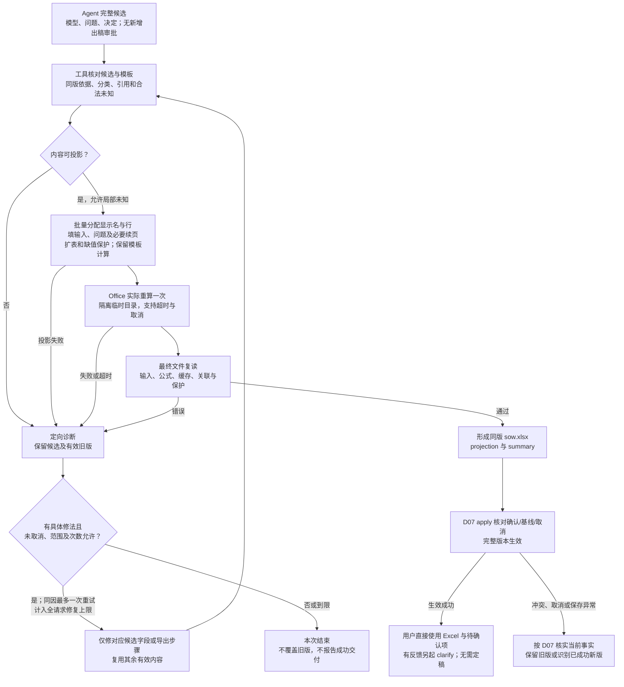

# D06 · Excel 投影与交付

[详细设计目录](README.md) · [模板概要](../05-excel-and-delivery.md) · [数据 D02](D02-shared-data-and-evidence.md) · [保存 D07](D07-tools-storage-and-recovery.md)

状态：R2 详细设计稿。已读取当前模板的实际列、公式、Table 与验证规则，并核对 D00 所列既有 Excel 实现；[EX04](examples/EX04-excel-projection.md) 是投影走读。本文确定输出合同与差异验证，不代表投影器、扩行或新输出工作簿已经实现。当前基础模板已增加 SIT 适用列；问题/续页、缺值汇总和自动投影仍为待实现设计。

## 1. 责任与一次导出的输入输出

Agent 提供完整候选模型、待确认项和已采用决定。工具按文件读取一次候选，完成映射、填表、Office 重算与复读，返回文件位置、结果状态和定向诊断。这里没有新的专业判断、出稿审批或逐行模型调用。

| 输入 | 用途 | 不负责的事情 |
|---|---|---|
| 同一候选的 `model.json` | Epic/Feature/Story/AC/Task、归属、依赖与备注 | 不从 Excel 反向重建业务模型 |
| `pending-items.json`、`decisions.json` | 可见问题、当前处理方式和本次已采用答复 | 不因字段有值就自动关闭问题 |
| 已检查的依据引用与候选内容摘要 | 复用 D02 检查结论，生成简短来源定位 | 不重新理解 PRD/HLD、探索原型或匹配历史 |
| 本版本模板及投影适配版本 | 读取标准、参数、公式原型、表结构与格式 | 不复制一套 Python 人天算法 |
| `version_id`；可选基线投影与本次变更摘要 | 同版标识、稳定显示别名、clarify 修改说明 | 不以旧行号或旧公式缓存代表新结果 |

输出为 `sow.xlsx`、`projection.json`、`summary.md` 及导出检查记录。D07 将它们与模型、问题、决定一起保存为完整版本，最后切换 current。重算完成只表示候选已准备，不能自行让版本生效。

正常路径一次填表、一次 Office 重算、一次最终文件复读；不默认另生成一份参考工作簿重复重算。跨引擎比较、故障注入和变化输入实算放在适配回归中。发生真实失败时才按 D04B 的共享次数处理。

Clarify 的讨论试算按 [D05](D05-clarify-and-change-scope.md) 按需合批，不随每句回复自动运行。完整候选试算已产生符合本合同的交付包，且模型/问题/决定、模板/规则和应用基线均未改变时，可复用最终文件及绑定的检查；只有局部试算或内容/基线变化时仍需完整导出。不能把旧候选的金额或缺少其他已生效修改的工作簿作为当前结果。

## 2. 输出副本的可见结构

保留基础模板的四张表、业务输入列与标准/参数位置。新增内容只进入项目输出副本，不预埋隐藏 agent 列。原模板仍可独立手填。

| 位置 | 输出设计 |
|---|---|
| `01-需求故事` | 每个 Story 一行，重复填写 Epic/Feature 名称，不合并数据行；AC 按原条目顺序换行；计算列受保护 |
| `02-任务清单` | 每个 Task 恰好一行，使用父 Story 的实际显示名；共享建设只在所属 Story 下计一次 |
| `03-工作量汇总` | 汇总区扩为 A4:D8，显示“工作量项 / 完整人天 / 已知部分人天 / 说明”；A12:C20 参数表保持原位置和原值 |
| `04-待确认事项` | 总是存在。集中显示问题、对象/字段、当前处理方式、来源定位、状态及已采用答复；零问题时明确写“无待确认事项” |
| `05-内容续页` | 仅当 AC、备注、长标题、问题或任务列表超出正常可读范围时生成。保存完整分段内容和返回定位，不参与估算 |
| `90-估算标准` | 原有 88 类标准、复杂度细则和 SIT/UAT适用全部保留可见，不从历史 SOW 替换 |

工作表顺序为 01、02、03、04、按需 05、90。保留现有视觉语言、白色输入和灰色公式；问题与未完整估算采用明确文字及适度强调，不只靠颜色区分。公式保护延续，非密码安全边界。输出 Excel 可直接阅读，业务输入保留手填能力；手改不自动更新插件文件、问题状态或版本摘要，插件修订仍走 clarify。

第 2 行说明加入短版本号和本版状态，覆盖原模板“打开后完成重算”的交付说明：交付前已经重算。汇总顶部直接显示未解决问题数量，以及是否含按新建出稿的复用问题。数量是对象/问题计数，不是 token 或人天预算。不要把“估算完整”写成“需求已全部确认”。

### 2.1 精确写入映射

表名、实际表头和列位置共同校验，不以仅有同名 Sheet 判定模板兼容。以下为当前模板的真实表头；模型 `work_type_name` 映射标准中的 `工作类型`，不要把概要中的自然语言名称当机器表头。

| 模型来源 | Sheet / 列 / 表头 | 写入规则 |
|---|---|---|
| Story → Feature → Epic.title | 01 / A / 需求 | 按父关系取值 |
| Story → Feature.title | 01 / B / 子需求 | 按父关系取值 |
| Story.title | 01 / C / 故事 | 第 3 节的显示名 |
| Story.acs | 01 / D / 验收条件 | 原文内容逐条编号换行；无 AC 时真正留空，编号不代替 AC 身份 |
| Story.notes、相关问题/依赖定位 | 01 / E / 备注 | 保留原备注，追加明确分隔的“待确认 / 依赖”投影段，不写回模型 notes |
| Task.story_id | 02 / A / 所属故事 | 使用同版父 Story 显示名，禁止再次独立拼名 |
| Task.name | 02 / B / 任务名称 | 第 3 节的显示名 |
| Task.work_type_name | 02 / C / 工作类型名称 | 精确目录名或合法空白 |
| Task.work_mode | 02 / D / 工作方式 | 新建 / 调整 / 接入复用，或合法空白 |
| Task.complexity | 02 / E / 复杂度 | S / M / L；无法识别为 M 并附问题 |
| Task.integration_type | 02 / F / 集成类型 | 内部集成 / 外部集成，或有语义的空白 |
| Task.notes、相关问题定位 | 02 / G / 备注 | 保留原文，追加问题编号与必要当前口径 |
| 模板公式 | 01 / F:J；02 / H:L | SIT/UAT、任务列表、人天及校验只由模板公式投影，禁止写死计算结果 |

依赖备注按 `uses` / `delivery_precondition` 分别表达“使用……”和“交付前提……”，引用目标 Story；不再复制目标 Task 或人天。历史/外部能力只显示已有依据中的说明，不为导出补造 Story。

## 3. 内部身份、显示名称与行号

### 3.1 显示名分配

内部关联始终使用 ID。模板名称关联要求 Story 在工作簿内唯一、Task 在工作簿内唯一；Epic/Feature 同名不代表同一对象。

1. 普通短名称原样展示。比较别名时采用保守的 NFC、大小写折叠及首尾空白比较键；只用于发现潜在碰撞，不规范化原业务文本。
2. Clarify 优先保留基线中同 ID、原名称未改且仍合法的显示名。新对象不能夺用旧别名；删除的别名不影响历史版本定位。
3. 新增/改名对象按稳定 ID 排序分配。冲突时使用“原名〔短身份码〕”；不由工具添加“管理端”“新版 API”等未经输入支持的业务含义。码来自稳定 ID，必要时在本批延长到可区分长度，不循环询问用户。
4. 用于名称关联的显示文本限定为最多 120 个 UTF-16 单元，完整标题另存模型；过长时保留可读前缀、截短标记与身份码，在续页展示完整原文。换行等不适合作为关联名的内容同样转为短显示形式，并保存原文。
5. 为全部实际显示名和父关联再做一次唯一性/反查检查。无法无歧义分配是投影错误；不要合并对象。旧对象因显示规则版本升级发生别名变化，要记录投影差异，不冒充业务改名。

120 是首版保守显示上限，包含后缀；不是输入标题长度限制。它为通配符转义后的 criteria 留出空间。Excel 的 COUNTIF 对超过 255 字符的匹配串可能返回错误结果，并具有通配符语义，见 [Microsoft COUNTIF 文档](https://support.microsoft.com/en-us/excel/get-started/use-the-countif-function-in-microsoft-excel)。实际大小写/Unicode 边界仍做双引擎差异回归，不能把 Python 比较等同于全部 Excel 字符语义。

### 3.2 所有关联都使用字面匹配

模板已在 Story UAT、Story 人天及部分验证中处理 `~`、`*`、`?`。此次读取发现，Story 校验 J 列的 COUNTIF 和汇总 B7 的 SUMIF 尚直接使用名称；不能把 UAT 适用正确当作整本关联正确。

输出适配统一检查公式与数据验证中的名称 criteria。对 criteria 使用先转义 `~`、再转义 `*`/`?`，并加等号的模式；直接数组相等比较保留字面语义。标准类型名称参与 criteria 时也需兼容检查。普通业务字符串绝不拼入公式正文，而是写入文本单元格后由公式引用。

对应完整性保护与显示修订属于版本化的模板投影适配，不改变数量、倍率或取整口径。若不认识公式原型则报不兼容，不能靠全局字符串替换碰运气。

### 3.3 排序与反馈

按模型既定 Epic/Feature/Story 顺序、Story 内 Task 顺序投影，不为 Excel 重新做业务排序。新增或删除会使后续行移动；clarify 的业务写集合仍按 ID，派生行位移不构成上游业务返修。

“第 8 行”必须绑定版本与 Sheet；按 `projection.json` 反查。文件被用户重排/手改后，旧坐标不再可信，读取附件或结合名称/归属核对。行号、显示名和短码都不能跨版本直接代替稳定 ID。

## 4. 待确认项与可追溯阅读

`04-待确认事项` 顶部 A1 为标题，A2 为版本与问题说明；`PendingItemTable` 从 A4:I 开始，列为：编号、状态、涉及内容、待确认事项、当前处理方式、来源定位、已采用答复、关联位置、尚未拆明工作。I 列由 D02 unestimated_work 投影为“是/否”，是可见的事实状态，非估算结果；不写入基础手填模板或增加隐藏辅助列。

一项问题一行，多个 targets 在“涉及内容”中逐项列出对象显示名和字段；关联位置列指向首个目标，完整目标范围由投影映射保存，长内容走续页。open 优先，resolved / superseded 随后，组内按稳定 ID；状态/答复与同版 JSON 一致。无问题时表内只保留空样式行，不伪造一项已关闭问题。

| 情况 | 必须看到的内容 |
|---|---|
| 复杂度无法识别 | Task 复杂度为默认 M；备注引用 P 编号并写明当前口径；待用户确认/调整，正常按 M 估算，不额外回查定档证据 |
| 候选 API/事件实例未定 | 工作方式保持新建；问题列出具体历史候选、需要确认的适用事实，当前处理写明按新建估算；其他分类齐备则正常计算 |
| 无相关历史候选 | 正常新建，不制造通用的“是否复用”问题 |
| 非集成 Task | 集成类型为空，不增加虚假问题；依据在文件中保留 |
| 已知部分 AC | D 列保留已有 AC，备注说明仍有哪项验收输入待补；不填“待确认”来冒充一条 AC |
| 已确认但尚未 apply | 仍展示旧版问题和旧值；讨论候选只在 work，不能进入已交付 Excel |

尚未拆明工作以 D02 的对象级问题表示；不是另加一条没有依据的 Task。其 open 状态和 I 列的“是”共同参与完整性公式；Story 受自身及父 Feature/Epic 的对应问题影响，项目受全部此类问题影响。对多目标问题，由同版 projection 将已知目标映射为相关问题行的直接单元格引用，公式检查状态/标记，不解析问题文字、拼接后的对象名或 Python 写出的 complete 标签。相关引用随问题排序、关闭和目标变化重建；已存在适用 Task 仍使 Story SIT/UAT 为是，其余存在未拆明工作时不能判为否。

来源定位由已有 evidence_refs 展开为材料显示名、章节/行或 Sheet/区域、用户答复标识及必要限制。判断只引用其依据并标明判断性质；不导出本机绝对路径、整份客户原文、工具日志或 agent 推理。详细依据仍在本地同版可达文件中。

普通对象行不堆叠所有来源摘录；待确认项附足够定位，summary 说明使用的材料版本和本次主要变化。用户只拿走 Excel，也能看到完整业务内容、当前估算口径和待答问题；文件目录用于后续细粒度追溯与修改，不成为阅读前提。

## 5. 缺值如何传到人天与汇总

### 5.1 计算与完整性分别表达

**完整性按金额所需的输入判定，不按 open 问题总数判定。** AC 文本未知、默认 M 的复杂度问题或按新建出稿的复用问题，不自动使已有定性分类的金额不可算；当前工作边界也未确定的实质缺口，则不能仅因几个分类有值就称范围完整。

模型身份/父关系/分类合法性由 `check` 保证。模板继续拥有数值和运算；输出适配只增加必要缺值/未拆明工作保护、字面关联及明确的部分结果展示。允许的结构损坏、非法枚举和公式错误均为零，不进入“业务待确认”放行路径。

| 结果 | 可计算条件及未知传播 |
|---|---|
| Task 基础人天 H | 类型、方式有效，标准对应单元格确实是可用数值；不存在的/不适用方式不能因空单元格转成 0 |
| Task 复杂度系数 I / Task 人天 J | 档位有依据或采用授权默认 M，相关参数有效；J 继续使用模板现有相乘及取整，缺必要量则留空 |
| Task SIT K | 标准 SIT适用明确为否时为真实 0；为是时需要内部/外部属性、复杂度及对应参数；类型未明时保守留空，不沿用当前模板“F 空白就 0” |
| Story SIT F / UAT G | 分别按标准 SIT/UAT 标记汇总，保持“任意适用即是；全已知不适用且无对应未拆明工作才否；其余未知”；无 Task 留空，禁止输入覆盖 |
| Story 人天 I | 有 Task、这些 Task 的 J 全部为数值，且没有覆盖本 Story 的 open 未拆明工作，才按原故事取整；否则留空，已知 Task 金额保留 |
| 项目直接开发 B5 | 所有当前 Task 的 J 可算，且没有 open 未拆明工作（含父级对象问题），才显示完整值；继续按 Task 原值求和，不改成 Story 向上取整值之和 |
| 项目 SIT B6 | 全部当前 Task 的 SIT 已知，且没有 open 未拆明工作（含父级对象问题），才显示完整值；内部/外部分组汇总再分别取整，沿用原口径 |
| 项目 UAT B7 | 没有 open 未拆明工作、每个当前 Story 的 UAT 已知，且所有“是”的 Story 中 Task 人天完整；“否”的 Story 即使有其他不影响适用性的估算缺项也不影响 UAT。使用适用 Story 下全部 Task 的未做 Story 取整的人天，按原模板计取 |
| 项目总量 B8 | B5/B6/B7 都是完整数值才求和，不把空白当 0；不新增总量取整 |

未拆明工作缺少可计量 Task，可能改变开发/SIT/UAT 贡献；首版保守阻止相应 Story 及项目完整值，C 列继续按已知 Task/Story 贡献计算并列明未覆盖对象。它与某个已知 Task 的分类缺值分别校验。全部 gap 已确认为空时，当前业务数组为空、无未拆明工作问题，模板输出完整 0 并注明无新增工作；缺材料/缺读取证据不得据空数组判定为 0。

类型未知时，即使专业分析暂认为非集成，输出公式也不把缺失类型当作可查标准；SIT 暂不可完整判定，仍关联原类型问题，不另问一次 UAT/SIT。类型一旦补足，公式自行更新。这是保守的输出依赖，不修改 `not_applicable_fields` 的已有业务依据。

真实 0 与未知不同。标准/参数明确允许的数值 0 保留；应存在却缺失或类型非法的参数是模板故障。空白预留行按业务身份列识别，不因有公式而计入任务数。已有 Epic/Feature 却缺少对应工作内容必须在 D04 整合时显露，不能在投影中消失。无 Task 的非空 Story 只有在对应工作缺口已合法记录时才能带出，并阻止受影响完整估算；不能默认为已完成。全部 gap 确认为空时，允许无工作行并注明本期无新增工作；缺资料产生的空模型不能走此出口。

Story SIT适用只表达包含系统集成工作，不把整 Story 的开发人天当 SIT 计费基数。SIT 支持仍按当前 Task 内/外部集成类型及复杂度计算，UAT 仍沿用原 Story 范围口径。默认 M 是可计算的当前口径，不加入未估算清单；其他真正缺值仍受保护。

### 5.2 已知部分与未知范围

汇总 C5:C8 只在对应 B 不完整时显示部分金额，完整时留空，避免重复展示相同数值：

| 已知部分 | 计算范围 | 说明列要求 |
|---|---|---|
| C5 直接开发 | 当前 J 已可算的 Task | 列明未估算 Task/工作未明 Story；若一个都不可算，留空，不显示“已估算 0” |
| C6 SIT | 已明确内部/外部且 K 可算的贡献，沿用分组取整；已知非集成贡献为 0 | 指向未知类型/集成属性/档位的 Task；全无可判定项则留空 |
| C7 UAT | 已判为“是”的 Story 中已可算的 Task 贡献，沿用原模板 UAT 口径；已知“否”贡献为 0 | 未知适用性 Story 与适用 Story 下不可算 Task 都列入未覆盖范围；全无可判定贡献则留空 |
| C8 合计 | 各费用类别已有完整值时取 B，否则取 C 的已知部分 | 明确为已知部分合计，不是完整报价；一项可计算贡献都没有则留空 |

完整值和已知部分共享同一套模板运算：适配器从同一个模板原型生成 B/C 两个互斥展示表达式，完整性条件直接读取所需输入，不让 B/C 相互引用形成循环，也不平行维护两套倍率或公式口径。具体公式表达式在迁入适配时随模板原型固定，并进行所有输入齐备时与基础模板结果等价的差异回归。输出适配不得新增基础人天或支持费口径。

已知部分的取整和范围变化意味着“新完整值减旧小计”不是修改增量。Clarify 真正比较同口径且均完整的结果时才能展示数值差额；否则说明本次补齐范围与可比项。

备注/说明中的对象清单是本版快照，数字完整性必须由真实单元格输入驱动，不能只依赖 Python 写入的 `complete=true`。不得从校验提示文字、单元格颜色或问题数量解析估算逻辑。校验列可保留模板的“必填项缺失”等诊断，工具结合模型与问题区分合法未知、漏写已知值、非法值及公式故障。

### 5.3 模板适配的有限范围

当前标准哈希和兼容性见 [05](../05-excel-and-delivery.md)。适配版本只允许：名称字面匹配、H/J/K 等结果的必要输入保护、Story/项目完整性保护与部分金额展示、表扩行及内容续页引用。数值、标准 ID、工作方式支持范围、S/M/L、UAT 标记和参数保持模板来源。

基础模板和投影适配共同被版本清单绑定：模板提供唯一数量规则，适配对已识别公式原型作明确变换。参数值变化只读取新模板；公式结构不再兼容则报错。Agent 无权临时写公式以放行候选；不要导出第二份可独立修改的标准/参数资产。

## 6. 扩行、长内容与文本安全

### 6.1 表的尺寸与公式

基础数据区为 Story 第 5—64 行、Task 第 5—204 行。输出从干净模板副本构建，各表数据行数取 `max(1, 实际对象数)`；缩减多余预留行时只清理对应表尾的输入/公式/格式范围，不删除跨表内容。超出原容量时一次扩展到本次所需大小，不逐行调用 agent，也不拆成多本 SOW。

扩展同时维护 Table ref/autoFilter、公式和数组公式范围、计算列元数据、数据验证、条件格式、打印区域/重复表头、行高、冻结与锁定。普通 A1 公式相对平移；数组公式需保留其公式类型及 ref，不能当字符串随意复制。当前任务列表 H 是数组公式，应单独覆盖首/中/末行与跨容量测试。

Table 计算列元数据使用与首行一致的 A1 原型，按既有修复保留对应形式。汇总各行公式不同，不为整列写一个 calculatedColumnFormula。Office 可能改写 Table/公式表达，须按已验证适配规则核对并保留正确元数据，不能把无损 ZIP 打开或 LibreOffice 实算当作 Microsoft Excel 不会要求修复的证明。

数据验证可保留模板已有全列输入范围；实际单元格格式/公式只生成表内所需行，避免格式铺满整张 Sheet。未来用户手动扩表的保护/公式继承与生成器扩表分别验证，未证明前不承诺手工无限扩行。

### 6.2 完整内容不能靠缩小字体塞入单元格

普通内容换行显示并按实际字体/列宽估算行高；需要续页时只做机械分段，不调用模型改写、删减或新增义务。Excel 单元格可容纳 32,767 个字符，但行高最多 409 点，见 [Microsoft Excel 限制](https://support.microsoft.com/en-us/excel/excel-specifications-and-limits)；字节未丢并不代表读者能看全。

`05-内容续页` 使用可见表 `ContentContinuationTable`：编号、对象/字段、段序、完整内容、返回位置。按原段落/AC 边界优先切分，单段过长时再切，不丢空白、标点或顺序；具体可读分段阈值随字体/列宽在差异样例中校准，且必须低于格式上限。原单元格保留可读原文片段及“完整内容见……”链接。AC 对应同版 AC ID 与各段位置，不把分段当成新增 AC。

任务列表超过公式/显示容量时，原 H 单元格改用该投影版本支持的“任务数及完整清单位置”显示公式，续页按当前 Task 关系列全；金额/UAT仍引用 TaskTable，绝不因列表长而丢 Task。完整公式类型与这一显示降级均须回归。所有续页是阅读副本，不拥有业务或估算权威。

### 6.3 安全与拒绝隐性丢失

所有业务输入强制按 OOXML 字符串写入，覆盖以 `=`、`+`、`-`、`@` 开头的内容及类错误码文本；不得自动生成外链/公式。保留真实前导单引号，不能盲目添加单引号后改变名称匹配或原文。内部链接由工具用已分配坐标构造，不直接采用输入提供的公式。

检查写前长度和 XML 字符合法性，避免写入库静默截短。无法表示的字符或超过可支持工作簿规模时给出具体对象/字段诊断，保留候选；不偷偷删除、拆义务或把技术损坏记成业务待确认。分段后可重组核对原文，来源原件始终保留。

## 7. 投影文件与导出结果合同

`projection.json` 不复制整份模型、长文本或任何人天值。最小字段如下，均为待实现合同：

| 字段 | 内容 |
|---|---|
| `schema_version`、`version_id` | 映射协议和所属交付版本 |
| `projector_version`、`template_hash` | 使用的投影规则与模板 |
| `model_hash`、`pending_items_hash`、`decisions_hash`、`workbook_hash` | 实际输入和最终文件字节摘要；不循环包含自身摘要 |
| `objects` | object_id、对象种类、sheet/table、row 或 rows、display_name、字段单元格映射；Epic/Feature 可对应多个 Story 行，AC 对应 D 单元格条目及按需续页段 |
| `pending_items` | 问题 ID、状态、sheet/row、目标对象/字段位置；多目标不得丢失 |
| `continuations` | 对象/字段或问题 ID、原文摘要、有序片段坐标及返回坐标；不用截短文字充当原文 |

`manifest.json` 保存 projection 等文件自身摘要，并绑定最终 Office 引擎身份、适配版本、候选输入摘要和检查记录。所有反查均以最终保存文件为准；不能用填表前预计行号冒充 Office 后实际位置。

`summary.md` 由同版已知信息生成简短说明：范围概况、仍待确认事项、当前可完整估算的类别、未覆盖范围、clarify 已应用的有限变化和文件位置。若展示金额，只读最终缓存并带上完整/部分标签，不由 agent 心算。Excel 中必须有同等必要信息，不让 summary 成为补齐误导总量的补丁。

`render` 沿用 D07 信封，payload 传候选文件定位/内容摘要、模板、目标版本及可选基线投影；result 返回产物定位/摘要、引擎身份、每类估算 `complete/partial/unavailable`、问题数和诊断定位。`complete` 只指当前输入口径的估算。详细未覆盖对象和检查记录存文件，stdout 不回传整本工作簿或整个模型。D07 的 `apply` 核对真实产物，不根据这些标签直接放行。

## 8. 重算、检查、失败与恢复

复用 D00 中已跑通的 openpyxl 写入、Office 隔离目录/配置、实际重算和 OOXML 复读方法。旧版存在再次生成参考工作簿并逐缓存比较的实现；Lite 不把它带入正常请求，而在适配回归中证明公式变换与结果，再对每次最终文件检查结构、输入和期望结果类型。

每次必要检查包括：候选摘要未变；每个 Story/Task 投影恰好一次；输入和 AC/续页完整；父关联、问题和反查同版；公式/元数据/保护在允许变换内；已知输入的缓存为正确类型，合法未知保持预期空白；公式错误不被 IFERROR 掩盖；完整性和可见状态一致。语义覆盖与重复建设属于 D04，不在 render 重跑模型评审。

实际 Office 在独立临时目录计算，不能接管用户正在编辑的工作簿。重算后以公式视图和缓存视图复读，必要 OOXML 元数据修复必须保留新缓存；若再次改变任何计算输入/公式，则原缓存失效，进入有原因的修复/重算次数。普通 `openpyxl.save` 之后不能假定之前缓存仍在。`fullCalcOnLoad` 只是打开行为设置，不代替交付前实算。

内容/模板/适配/引擎及有关选项完全一致、最终文件摘要和校验记录可核实时，可以直接复用已验证候选。不得只按 request_id 或路径命中旧缓存。clarify 的有限业务变更可以使整本 Excel 物理重建/重算，正常仅一次；这不授权重新分析无关 Story。

| 失败或条件 | 保留什么、怎样退出 | 用户参与 |
|---|---|---|
| 合法局部未知/复用 open | 继续导出，按第 5 节显示完整/部分结果和问题 | 本次不追问，用户之后可 clarify |
| 候选结构、分类或来源错误 | 定位本片字段，保留其他成果；具体修复受 D04B 限制 | 不让用户修插件错误；改变业务义务时才回具体方案 |
| 模板结构/标准/公式不兼容 | 返回明确差异，保留候选和原有效版 | 不临时猜公式或另建估算标准 |
| Office 缺失、超时、退出异常或缓存不可信 | 保留合法模型，诊断环境或计算问题；本次没有成功 Excel 就不报告交付完成 | 仅真实环境操作需要时说明具体动作 |
| 关联、元数据、文本或显示检查失败 | 只修投影/格式；没有明确修法或到限即结束 | 不重拆所有 Story/Task |
| 重算期间收到新反馈或取消 | 不激活迟到候选；新意见按 D07 核对相关基线 | 已取消请求不自行恢复 |
| apply 前基线变化/保存失败 | 按 D07 保持原版，或 recover 核实已成功新版 | 不重复发起整案 generate |

同原因至多一次有具体变化的重试，并计入全请求最多两批自动修复；不是每个导出子步骤各送两次。没有进展提前停止。超时与取消使用经验证的进程适配；不能因为导出确定性就给它无限等待。原生 Excel 打开、保存后重开及代表性显示回归在适配变更时执行，不要求每次运行打开桌面 UI。

图源：[Excel 投影与交付](../diagrams/excel-projection.mmd)。它描述机械交付的确定性先后，Agent 前面的专业活动仍自主；失败回查只是有限范围，不是整案回退。

实际编码与早期验收见 [I1.3/I1.5](../implementation/P01-reliable-delivery.md)，共用候选/准备包见 [P00](../implementation/P00-contracts-and-fixtures.md)。

## 9. 差异验证与后续交接

已有手工模板 UAT/保护和 Office 基础证据见 [05](../05-excel-and-delivery.md)，不重复做基础可行性选型。D06 的新增输出规则必须在首个可运行 generate 之前完成差异验证；设计表和合成走读不计作通过。

| 组合 | 验证重点 |
|---|---|
| EX01 初版及复杂度调整版 | 5 Story/7 Task、公共建设单计；迁移默认 M+待确认照常估算，改 S 后只改变相关派生结果 |
| EX03 API/事件候选 | 新建非空与 open 并存，算一次当前口径；确认复用前不自动减量 |
| 未知类型 / 集成属性 / 模式，及默认 M 的复杂度，与适用/不适用 Story 混合 | 分费用完整性和已知部分；真实 0、未知、空行区别；UAT 使用未做 Story 取整的人天 |
| 通配符、大小写/Unicode 同名、长名、重命名/移动/删除 | 关联、校验、UAT 金额同时正确；ID/问题反查与新行一致，不误改其他对象 |
| 0/1、60/61 Story，200/201 Task 及较大实际样本 | 缩表/扩表、末行/数组公式/保护/下拉/打印；无 gap 与资料不足不能混用 |
| 长 AC、公式起始文本、类错误码文本、非法字符、超长任务列表 | 原文完整与安全，续页可读/可回查，实际公式错误仍拒绝 |
| 重算成功但丢 Table/保护/缓存，或内容修复提示 | OOXML 和双视图检查；支持的 Microsoft Excel 正常打开、保存后重开，不能只看退出码 |
| 导出中断/迟到/重复请求 | 复用合法候选、一次完整版本生效、失败次数继承，不重复语义生成或无因重算 |

用时分别记录映射/写入、Office、复读、apply；同一物理调用不重复计入总量。机械工具没有模型调用时不虚构 token，但宿主输入/输出仍由实际 usage 记录；不根据 XLSX 行数估 token。正常路径不默认逐 Sheet 截图注入主 session；布局变化的回归及运行时发现的具体异常才做相应视觉检查。

[D05](D05-clarify-and-change-scope.md)/[EX05](examples/EX05-clarify-changes.md) 已补具体字段、拆合/归属、依赖及有限方案，明确试算复用和失效边界。D08 已定义观测口径与性能实验，Excel 工作量、真实重算时间和复用进入相应活动记录。D07 接受这里的产物/完整性合同；D09 追踪场景与实际证据。剩余 G05/G06/G09 是适配验证任务，本文没有把它们标为实现完成。
