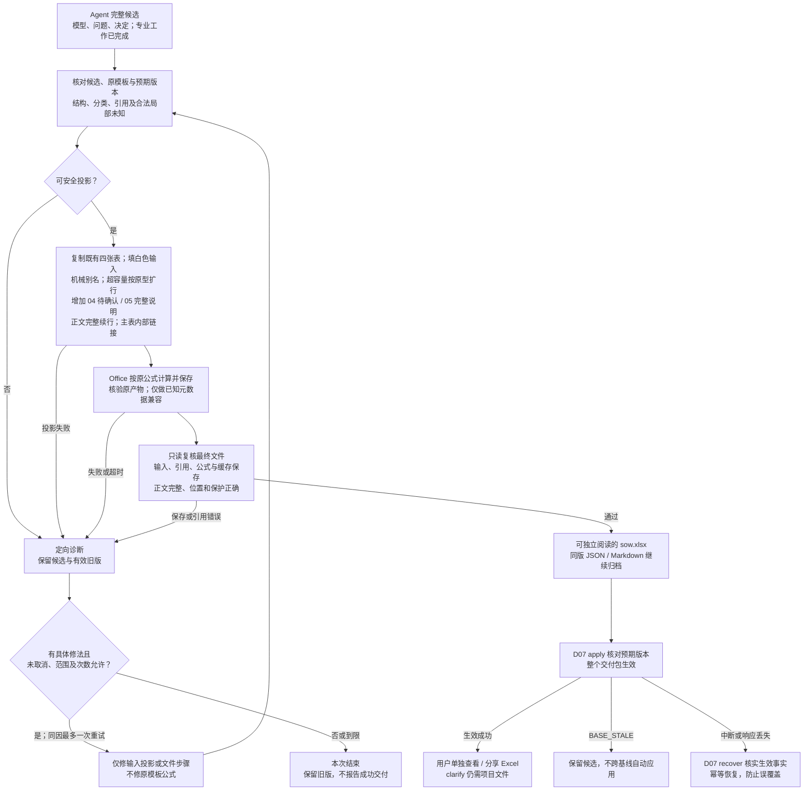

# D06 · Excel 投影与交付

[详细设计目录](README.md) · [模板概要](../05-excel-and-delivery.md) · [数据 D02](D02-shared-data-and-evidence.md) · [保存 D07](D07-tools-storage-and-recovery.md)

状态：I1.3 的历史投影实现及验证见 [I1 验证](../../validation/I1-reliable-delivery.md)。当前合同按用户最新要求改为 Excel 独立可读，覆盖先前“输出仅四张表、正文依赖外部 Markdown”的限制；I6.1 的实际实现与检查见 [增量记录](../../validation/I6-self-contained.md)，不沿用旧阶段的通过结论。模板实际列、Table 和原公式是投影依据；[EX04](examples/EX04-excel-projection.md) 保持设计走读身份。本设计不编辑基础模板资产，其 SHA-256 保持 `6abc55d44bc66476a60c2251e18c0dfdb66709e07539c246dfdec3a0373f5332`。

## 1. 责任与一次导出的输入输出

Agent 在同一主 session 完成专业分析，提供完整候选模型、待确认项和已采用决定。工具按文件读取候选，复制既有模板、填写白色输入，交给 Office 原样计算并保存，再复读文件。工具负责输入、文件、引用和公式保存正确，不裁决估算完整、部分或不可算，也不生成金额标签、金额差额或另一套算法。

| 输入 | 用途 |
|---|---|
| 同一候选的 `model.json` | Epic/Feature/Story/AC/Task、归属、依赖与备注；不从 Excel 反向重建业务模型 |
| `pending-items.json`、`decisions.json` | 生成工作簿内的问题、当前处理和本版已采用答复，并保留同版归档文件；字段有值不自动关闭问题 |
| 已检查的依据引用与候选内容摘要 | 展开已有来源定位；不在导出时重新做专业分析 |
| 本版本模板及投影器版本 | 读取 88 类标准、实际列、公式原型、表结构与格式；不复制计算口径 |
| `version_id`；可选同一基线的投影及变更摘要 | 同版标识、稳定显示别名和 clarify 修改说明；不跨基线重建或复用确认 |

输出为 `sow.xlsx`、`pending-items.md`、按需 `details.md`、`projection.json`、`summary.md` 及导出检查记录。D07 将它们与模型、问题和决定保存为完整版本，再让版本生效。Excel 自身包含全部 AC、待确认及必要完整正文，可单独阅读、评审和分享；Markdown 和 JSON 继续作为兼容、机器处理及项目归档，不是阅读 Excel 的前提。

正常路径一次填表、一次 Office 计算保存、一次最终文件复读。内容、模板、投影器、Office 身份、基线及相关选项完全相同，且最终字节和检查记录仍可核实时，可复用已准备文件；不完整的草案文件不能代替完整交付包。Clarify 按 D05 合批处理具体变化，不随每句回复自动导出。

generate/clarify 按单人串行使用。生效前保留最小预期版本核对；不匹配返回 `BASE_STALE` 并保留候选，不自动应用到新基线。中断、响应丢失和重复调用按 D07 核实已生效事实并幂等恢复。此边界不改变同一 session 的专业策略，也不排除未来片内 worker 优化的独立探讨。

## 2. 原四张表保持结构，输出增加两张可见说明表

基础模板资产不变。输出保留原四张表的表头、列、Table、公式、标准与参数位置，仅按原型扩展必要数据行；另生成可见的 `04-待确认事项` 和 `05-完整说明`。两张说明表只投影已有内容，不增加计算、隐藏字段或永久业务实体；没有问题或长文时也保留表及明确空状态。

| 位置 | 投影方式 |
|---|---|
| `01-需求故事` / `SOWStoryTable` | 每个 Story 一行，重复填写 Epic/Feature，不合并数据行；AC 保留顺序，F:J 公式列保留 |
| `02-任务清单` / `TaskTable` | 每个 Task 恰好一行，父 Story 使用同版显示名；H:L 公式列保留 |
| `03-工作量汇总` | 原 `ProjectSummaryTable` 和 A12:C20 的 `ProjectParameterTable` 保持原样；不增加部分金额或状态展示 |
| `90-估算标准` / `TaskStandardTable` | 原 88 类标准、复杂度细则和 SIT/UAT适用全部保留；不以历史 SOW 替换 |
| `04-待确认事项` | 全部问题、当前处理、状态、目标、既有来源定位及实际已采用答复；长内容以可读续行完整展开 |
| `05-完整说明` | 长标题、AC、备注及任务列表按原顺序逐字完整展开；短字段直接保留在主表 |

白色业务输入保留手填能力，灰色公式列延续保护。手改 Excel 不自动更新问题状态、插件模型或版本摘要，后续修订仍通过 clarify。工作簿内的正文入口只指向本工作簿位置，不出现 `details.md#...` 或 `pending-items.md#...` 外部引用。Clarify 仍需原项目 JSON、依据和版本文件；独立查看 Excel 不等于支持无损回导。

### 2.1 精确写入映射

表名、实际表头和列位置共同核对。模型 `work_type_name` 匹配标准表的 `工作类型`，写入 Task 表的 `工作类型名称`，不能混用这两个机器表头。

| 模型来源 | Sheet / 列 / 表头 | 写入规则 |
|---|---|---|
| Story → Feature → Epic.title | 01 / A / 需求 | 按父关系取值；长文按第 6 节处理 |
| Story → Feature.title | 01 / B / 子需求 | 按父关系取值 |
| Story.title | 01 / C / 故事 | 第 3 节的显示名 |
| Story.acs | 01 / D / 验收条件 | 原文逐条编号换行；无 AC 时真正留空，编号不代替 AC 身份 |
| Story.notes、问题/依赖/正文定位 | 01 / E / 备注 | 保留原文，追加明确分隔的引用段；不写回模型 notes |
| Task.story_id | 02 / A / 所属故事 | 使用同版父 Story 显示名，禁止再次独立拼名 |
| Task.name | 02 / B / 任务名称 | 第 3 节的显示名 |
| Task.work_type_name | 02 / C / 工作类型名称 | 精确目录名或合法空白 |
| Task.work_mode | 02 / D / 工作方式 | 新建 / 调整 / 接入复用，或合法空白 |
| Task.complexity | 02 / E / 复杂度 | S / M / L；无法识别为 M 并附问题 |
| Task.integration_type | 02 / F / 集成类型 | 内部集成 / 外部集成，或有业务依据的空白 |
| Task.notes、相关问题/正文定位 | 02 / G / 备注 | 保留原文，追加问题编号与当前处理说明 |
| 模板公式 | 01 / F:J；02 / H:L | SIT/UAT、任务列表、人天及校验原样保留，禁止写死结果或覆盖为正文入口 |

依赖备注按 `uses` / `delivery_precondition` 表达“使用……”和“交付前提……”，引用目标 Story；不复制目标 Task 或人天。历史/外部能力只显示已有依据，不为导出补造 Story。分类列只能写合法值或空白，正文入口放在备注，不能用链接文字替代分类值。

## 3. 内部身份、机械别名与行号

### 3.1 显示名分配

内部关联始终使用 ID。Story 和 Task 的显示名分别在工作簿内唯一；Epic/Feature 同名不代表同一对象。

1. 安全的普通短名称原样展示。比较时使用保守的 NFC、大小写折叠及首尾空白比较键发现碰撞；只比较，不改原业务文本。
2. Clarify 优先保留同一基线中同 ID、原名未改且仍合法的别名。新增对象不能夺用既有别名；历史版本保留自己的映射。
3. 新增或改名对象按稳定 ID 排序分配。同名安全标题可追加 `〔短身份码〕`；含 `~`、`*`、`?`、换行，以 `=`、`<`、`>` 开头，过长或无法保证在原名称匹配函数中字面匹配的关联名，直接使用 `S-短身份码` / `T-短身份码` 等纯机械别名。身份码取稳定 ID，必要时延长到可区分长度，不添加“管理端”“新版”等业务含义。
4. 关联显示名最多 120 个 UTF-16 单元，包含后缀；这是显示上限，不是业务输入限制。任何改用别名的原名完整保存在既有备注，放不下时进入 `05-完整说明` 并给出工作簿内部入口。原模型标题保持不变。
5. 对全部显示名、父关联和 ID 反查做唯一性检查。无法安全分配是投影错误，不能合并对象。规则版本导致的别名变化记录为投影变化，不冒充业务改名。

120 是保守的首版显示上限，避免接近现有名称匹配函数的长度边界；具体字符语义仍须在后续适配验证中覆盖。现有只读规范来源保留：[Microsoft COUNTIF 文档](https://support.microsoft.com/en-us/excel/get-started/use-the-countif-function-in-microsoft-excel)。该来源不授权修改公式。

### 3.2 特殊名称通过输入别名处理

已读模板中，部分名称匹配已处理 `~`、`*`、`?`，Story 校验 J 列的 COUNTIF 和汇总 B7 的 SUMIF 仍直接使用名称。输出必须适配这些实际公式共同支持的输入，不为未转义位置增加转义表达式、等号 criteria 或其他公式修复。

例如原名 `查询*?~订单` 使用同版安全别名，Story C 列和其全部 Task A 列使用相同值；原名从 E 列备注或 `05-完整说明` 可完整读取。这样全部名称引用一致，原公式保持不变。数据验证和最终文件复读同样以这一映射核对。目录名称从当前模板原值读取，不能为绕过问题重命名标准。

业务字符串强制写为文本，绝不拼接进公式；机械别名与文本安全是两项独立要求。模板原型不兼容时给出具体诊断，不通过改公式或另建计算规则放行。

### 3.3 排序与反馈

按模型已有 Epic/Feature/Story 和 Story 内 Task 顺序投影，不重新做业务排序。新增或删除可使后续行移动；clarify 的专业写集合仍按 ID，物理行位移不构成上游返修。

“第 8 行”须绑定版本与 Sheet，并按最终 `projection.json` 反查。用户重排/手改后，旧坐标不再可信，需读取附件或结合名称、归属核对。行号、显示名、短码不能跨版本代替稳定 ID。

## 4. 待确认事项在工作簿内完整可读

`04-待确认事项` 由同版 `pending-items.json`、`decisions.json` 和已登记依据投影。每项包含问题原文、当前处理、状态、全部目标对象/字段、已有来源定位、实际已采用答复及本版工作簿位置。没有已采用答复时明确未采用，不用决定 ID 或“已解决”代替答案；多目标及无工作行的父对象也完整列出，不为定位创建空壳 Story/Task。

open 优先，resolved / superseded 随后，组内按稳定 ID；显示用可读序号、问题和目标名称，不能用 UUID 待确认标签代替问题正文。主表既有 Story E / Task G 备注提供当前处理和工作簿内部位置及可点击入口。多个问题逐项定位，单元格只能承载一个链接时，优先指向完整正文或相关说明区段，其余实际位置仍逐项以可读地址保留。无问题时写“无待确认事项”。

| 情况 | 工作簿与输入表达 |
|---|---|
| 复杂度无法识别 | Task E 填 M；备注和问题表说明授权默认及待确认事项，不回查定档证据 |
| 候选 API/事件实例未定 | 工作方式填新建，问题表列出候选与需确认事实，不另建假想复用 Task |
| 无相关历史候选或非集成 Task | 正常新建或保留不适用空值，不制造问题 |
| 已知部分 AC | D 列保留已有 AC，备注定位待补事项；不以“待确认”冒充 AC |
| 已确认但尚未 apply | 有效版本保持旧文件和旧值；讨论候选留在 work |

`unestimated_work` 只说明已知业务工作尚未形成可计量 Task，保留其范围和当前处理，不接入公式或金额门禁。来源只展开已有 evidence_refs 的材料名、章节/行或 Sheet/区域、答复定位及必要限制；不输出本机绝对路径、整份来源、工具日志或新判断。长问题、处理、目标、来源和答复按第 6 节以可读续行完整保留。

同版 `pending-items.md` 仍生成并保留稳定 ID 锚点，供兼容和项目归档；工作簿阅读不依赖该文件。

## 5. 原模板独占全部计算

输出直接保留模板现有 Task、Story、SIT/UAT、项目汇总和校验公式。金额缓存由 Office 实际计算并原样保存；Python、JSON 和 Agent 不计算、不调整金额，不生成修改前后金额差额。

投影器不增加必要输入保护、不把空白转换为零或不可用、不改写 SIT/UAT 三态逻辑、不设计完整/部分汇总、不生成金额标签。原公式对合法输入产生的数值、空白、提示或错误值按原样保存，不能据此给候选贴金额状态或触发改数、补值、修公式。文件检查报告可记录原样观察，但只判断是否发生输入漏写、引用或公式保存损坏。

金额结果与业务问题相互独立：复杂度默认 M、复用 open、合法分类留空及 `unestimated_work` 都按业务合同记录，不从缓存反推问题是否关闭。已知值未写入须修投影；非法分类、父关系错误仍须诊断。没有本期 gap 必须来自充分业务依据，不能由空表或零缓存推断。

模板和参数值不由投影器修改。原四张表仅允许白色输入、必要文字布局和超容量按原型扩行所需的结构引用调整；新增两张说明表只承载文本与内部链接，不启用工作表保护；手工改动不回写项目数据。金额完整性门禁、缺值公式保护、三态改写、公式修复和新增费用公式均不属于本合同。

## 6. 扩行、长内容与文本安全

### 6.1 保留预留容量，超容量才扩行

基础数据区为 Story 第 5—64 行、Task 第 5—204 行。容量内保留模板现有 `SOWStoryTable` A4:J64 和 `TaskTable` A4:L204，不因对象少缩表。未使用的预留输入保持空白，公式保留；不因有公式就把空行当业务对象。

超过 60 Story 或 200 Task 时，一次扩展到所需行数。延续原公式原型、样式、行高和锁定，更新必要的 Table ref/autoFilter、公式引用范围、数组公式 ref、数据验证、条件格式及打印范围；保留冻结与重复表头。相对 A1 引用只作对应平移，不改变公式计算语义，也不新增汇总表达式。

任务列表 H 的数组公式须保留其公式类型与 ref。Table 计算列元数据沿用模板与首行一致的 A1 原型，不改成另一套公式表示。原型无法安全扩展时返回技术诊断，不能修原模板公式或把结果写死。支持的 Office 对文件的保存转换只可保留已验证的等价表示；发现公式/保护/引用损坏即保留候选并退出，不以重写公式补救。

### 6.2 长文使用工作簿内可读续行

短字段直接填写并换行。超过单元格容量或可读行高的标题、AC、备注和任务列表，在 `05-完整说明` 按对象/字段及原有顺序保存完整字面内容，分成正常字体、列宽和行高下可读的续行。主表保留明确标注的片段或机械别名，并提供内部位置和可点击入口；分类值和公式列不改为链接文字。`04-待确认事项` 的长问题及相关字段同样以续行展开。

续行只处理显示，不由模型概括、改写、删字或重新拆义务。保留空白、标点、AC 顺序、Task 关系与原始名称；Excel 内将 CRLF/CR 显示为 LF 换行，续行标记与正文分开，按顺序拼接能还原换行规范化后的完整原文。AC ID 继续保存在项目映射中；原始换行字节由归档保留。不新增 AC、Task 或永久片段实体，也不增加 projection 分段协议。无长文时 `05-完整说明` 明确说明没有需要续行的内容。

任务列表 H 保留原公式、数组属性及 Office 原样结果。列表可能显示不全时，按已有 Task 关系在 `05-完整说明` 完整列出，并从 Story E 备注链接；TaskTable 所有任务行仍保留。不把 H 改成任务数、位置公式或静态清单。

现有只读限制来源保留：[Microsoft Excel 限制](https://support.microsoft.com/en-us/excel/excel-specifications-and-limits)。单元格 32,767 字符、行高 409 点说明存入成功不等于可读；不能把整段长文塞进另一高行或靠无限缩小字体解决。必要的 `details.md` 仍保存同版原文及既有锚点，供兼容和归档。

### 6.3 安全写入与拒绝隐性丢失

业务输入及所有续行强制按 OOXML 字符串写入，包括以 `=`、`+`、`-`、`@` 开头的内容及类错误码文本；保留真实前导单引号。工具生成工作簿内部 hyperlink/location 元数据，不新增 `HYPERLINK` 公式、远程或 Markdown 外链，也不执行输入提供的公式。

写前检查长度与 XML 字符合法性，避免静默截短。无法安全表示或超出支持规模时给出对象/字段诊断并保留候选，不删字符、改义务或伪装为业务待确认。复读核对主表片段、逐字正文、续行顺序、可读布局和实际内部跳转目标；只证明 Markdown 全文存在不算通过。

## 7. 投影文件与导出结果合同

`projection.json` 只保存身份和位置映射，不复制整份模型、长文本、人天值或项目金额 status。字段由 I1.3 首次消费，数据合同继续为 `lite-projection-v1`；本次仅将渲染实现修订为 `lite-render-v5`：

| 字段 | 内容 |
|---|---|
| `schema_version`、`version_id` | 映射协议和所属交付版本 |
| `projector_version`、`template_hash` | 使用的投影器与原模板身份 |
| `model_hash`、`pending_items_hash`、`decisions_hash`、`workbook_hash` | 实际输入和最终工作簿字节摘要，不循环包含自身 |
| `objects` | `object_id`、种类、sheet/table、row 或 rows、`display_name`、字段单元格位置；Epic/Feature 可对应多行，AC 保留 D 单元格条目与 AC ID |
| `pending_items` | `pending_item_id`、`path`（固定 `pending-items.md`）、`anchor`、`targets`；target 保存 `object_id`、`field` 和本版单元格位置，无行时位置为空；问题状态从同版问题数据读取；path/anchor 继续用于归档兼容 |
| `details` | `object_id`、`field`、`path`（固定 `details.md`）、`anchor`、`cells`（显示入口的单元格位置）；无长文为空数组；path/anchor 继续用于归档兼容，不新增 continuations/片段坐标协议 |

长文和问题文件的字节摘要由 `manifest.json` 统一登记；无 details 时不生成空正文文件，但两张可见说明表仍存在。manifest 同时绑定 projection、summary、最终 Office 身份、候选摘要和检查记录。既有 path/anchor 字段不改成工作表坐标，工作簿内位置与链接由渲染器生成并复核。所有位置按最终保存文件复读，不以写入前预计行号冒充实际位置。文件路径和锚点可离线解析，不写本机绝对路径。

`summary.md` 只说明 `version_id`、范围概况、本次已应用变化、待确认数量与入口、当前默认字段处理、保留的未拆明业务范围、交付文件位置、机械检查结果和当时可得的观测摘要。它不展示金额、估算状态或数值差额；用户在 Excel 查看原模板结果。

`render` 沿用 D07 信封，返回 `prepared_ref`、`version_id`、`workbook_ref`、`projection_ref`、`summary_ref`、`pending_items_ref`、`details_ref`、`office_identity`、`verification_ref`、`pending_count`。文件引用沿用 `{path, sha256}`；`pending_items_ref` 指 Markdown 阅读文件，`details_ref` 无文件时为 null，`pending_count` 只计 open 问题。删除 `estimate_status` 及任何分费用 `complete/partial/unavailable` 字段，不以别名重建同义状态。详细诊断存检查文件，stdout 保持小摘要。

P00 同步安排：render.result 采用上述字段；prepared.files/manifest 增加 `pending-items.md` 与按需 `details.md`，原 JSON 输入绑定保留；projection 使用问题文件锚点和最简 `details` 映射；summary 只保留业务与交付摘要。交付机械成功仍由原信封及检查结果表达，不等于金额结论。

## 8. Office 复读、失败与恢复

`lite-render-v5` 纳入 render attempt 身份，投影 Schema 不变。旧 applied 版本及其历史内容保持不变，恢复按原成功事实处理，不就地升级。旧 prepared 或预览不能仅因旧成功收据、路径或相同 Schema 绕过当前核验；复用及 apply 必须满足本节新增的独立可读要求，不能沿用旧验证器放行缺少说明表的文件。新渲染仍受原有限返修额度约束，不删除失败历史或重置计数。

参考 D00 已跑通的 openpyxl 写入、Office 隔离目录/配置和 OOXML 复读方法。Office 在独立临时目录打开候选、计算原模板公式并保存，不接管用户正在编辑的工作簿。不默认生成第二份工作簿比较金额，也不运行 Python 数值复算。

每次必要检查包括：候选摘要未变；每个 Story/Task 恰好投影一次；已知输入、AC 和正文未丢；别名、父关联、问题和正文入口同版可达；原四张表、Table、原公式/数组类型、引用、格式和保护按本合同保存；两张说明表可见且空态、完整正文、续行顺序和内部链接正确，阅读无需外部 Markdown；Office 的保存产物和缓存可读且属于本次输入。公式视图与缓存视图用于核实保存事实，不从金额值判定估算完整性。业务覆盖和重复建设检查属于 D04，不在 render 重跑模型评审。

Office 保存后先核验原始产物，再完成下述已验证的保存兼容处理；随后只读复读并绑定最终字节，不再使用普通 `openpyxl.save` 改写导致缓存丢失。不设置金额预期类型或空值传播门禁；原模板对合法未知输出的空白/提示保留。若需修本次输入投影、文本或文件引用，修后重新让 Office 计算保存并重新绑定文件；只允许有具体修法的有限重试。原模板公式缺陷不在自动修复范围。

I1.3 的真实 LibreOffice 往返发现两类固定保存差异：Table 名称、列和引用保留，但计算列的 `calculatedColumnFormula` 元数据被省略；整列数据验证范围被裁至已使用区域之后约 1,000 行。原单元格公式仍在，这两类差异仍会影响后续手填，不能仅凭退出码为零放行。

因此引擎适配允许一次有限 OOXML 兼容处理：在核验原始产物的 Table 身份、列、公式、校验规则及缓存后，仅从本次已验证候选恢复上述缺失的计算列元数据和符合已知裁剪模式的数据验证范围。处理前后核对单元格公式、类型和值/缓存没有变化；不整体替换 Table 或保护设置，不修改单元格公式，不修复未知损坏。Table 丢失、保护或规则损坏、非等价公式和其他范围变化仍失败。最终核验及摘要绑定发生在这次处理之后；复用和 apply 不再修改文件。这个适配细节复用旧插件经验，并收窄旧版整体恢复元数据的范围，不改变原模板计算权威。

复读同时比较行可见性、字体名称和主题字体。当前引擎另有一个已实测的只读接受例外：仅前三张 Sheet 的固定说明 A2，允许 `Calibri/minor` 保存成 `Arial Unicode MS/无 scheme`，其文本、其余字体属性和字体主题必须不变。两者并非相同有效字体，这是限定单元格和精确字体对的已知替换；不恢复字体、不安装字体，也不修改模板。业务单元格、其他字体对、主题变化或隐藏行仍返回 `WORKBOOK_INVALID`。

| 失败或条件 | 保留与出口 |
|---|---|
| 合法局部未知、默认 M、复用 open | 保留相应值/空白和问题，继续正常文件投影，不判断金额状态 |
| 业务基础不足 | 专业阶段返回资料要求和已有分析，不交空壳 SOW |
| 候选结构、分类或来源错误 | 定位字段并保留其他成果，修复范围受 D04B 限制 |
| 模板结构/公式原型不兼容 | 返回具体差异，保留候选和原有效版，不改模板或猜公式 |
| Office 缺失、超时、退出异常或产物/缓存保存丢失 | 保留合法模型与诊断，没有成功 Excel 不报告交付完成 |
| 别名、输入、正文链接、元数据或公式保存损坏 | 只处理可明确修复的投影/保存问题；不因原模板金额结果改公式或补业务值 |
| 请求取消或已被新反馈替代 | 不激活迟到候选，已取消请求不自行恢复 |
| apply 前预期版本不匹配 | 返回 `BASE_STALE`，不自动重建到新 current，不沿用跨基线确认 |
| 保存中断、响应丢失或重复请求 | 按 D07 核实旧版或已成功新版，幂等恢复，不重复生效或无因重算 |

同原因至多一次有具体变化的重试，计入全请求最多两批自动修复；没有进展或到限就结束。Office 进程超时与取消用经验证的适配。原生 Excel 打开、保存后重开及代表性显示检查属于适配回归，不要求每次请求操作桌面 UI。

图源：[Excel 投影与交付](../diagrams/excel-projection.mmd)。机械交付的先后不规定 Agent 专业活动的内部调度。

## 9. 后续实现验证与交接

既有手工模板证据见 [05](../05-excel-and-delivery.md)。下表是当前验证要求；I1.3 的实现和执行结果只证明当时范围，不能把 EX04 走读或旧阶段通过当作 I6.1 结果。

| 组合 | 验证重点 |
|---|---|
| EX01 初版与复杂度调整版 | 对象/字段/归属正确；默认 M+问题；原公式保持，Office 保存的输入和缓存对应本版 |
| EX03 候选与局部未知 | 新建值和 open 问题共存；缺失字段留空，工作簿内完整问题可达，无金额状态或补值门禁 |
| 未拆明工作与无 gap | 前者完整保留业务提示且不接入计算，后者有充分业务依据；资料不足不能用空表冒充 |
| 通配符、criteria 运算符、大小写/Unicode 同名、长名、移动/删除 | 机械别名唯一且可反查，所有父引用一致，COUNTIF/SUMIF 原公式未改，完整原名可达 |
| 0/1、60/61 Story，200/201 Task | 容量内不缩表，超容量按原型扩行，末行/数组 ref/校验/保护/打印一致 |
| 长 AC、备注、任务列表及公式起始文本 | 文本安全、原文完整、可读续行及内部链接可达，公式列没有被正文或位置公式覆盖 |
| 无问题/长文、长问题/已采用答复、多个目标 | 两张说明表始终可见；空态真实；正文、处理、状态、目标、来源定位和实际答复完整，不以 UUID 或外链代替 |
| 旧 applied 与旧 prepared | 保留历史版；旧准备包不得绕过 v5 独立可读核验，失败历史和额度不重置 |
| Office 保存、重开、缓存或 Table/保护丢失 | 检查最终文件和原生兼容性；原样缓存保存，不以金额结果替代文件证据 |
| 预期版本不符、中断、响应丢失和重复请求 | `BASE_STALE` 防误覆盖，完整包一次生效，幂等恢复，不自动跨基线重建 |

用时记录映射/写入、Office、复读、apply；同一物理调用不重复计数，不按行数估 token。正常路径不逐 Sheet 截图注入主 session；布局回归或具体异常才做必要视觉检查。

跨文件同步由各自写集合负责人处理：[D02](D02-shared-data-and-evidence.md) 的问题/长文映射及业务提示语义；[D05](D05-clarify-and-change-scope.md) 的同基线复用与非金额修改说明；[D07](D07-tools-storage-and-recovery.md) 的文件清单、返回字段和最小版本核对；[P00](../implementation/P00-contracts-and-fixtures.md) 按本文第 7 节同步字段；[P01](../implementation/P01-reliable-delivery.md) 与 [D09](D09-validation-and-implementation.md) 的文件/公式保存验收。上述文档区分未改的原四张表与输出新增的两张说明表，不再要求外部 Markdown 才能阅读 Excel，也不增加金额保护、金额状态或差额算法；I6.1 的验证和决定记录由实施阶段补充。
