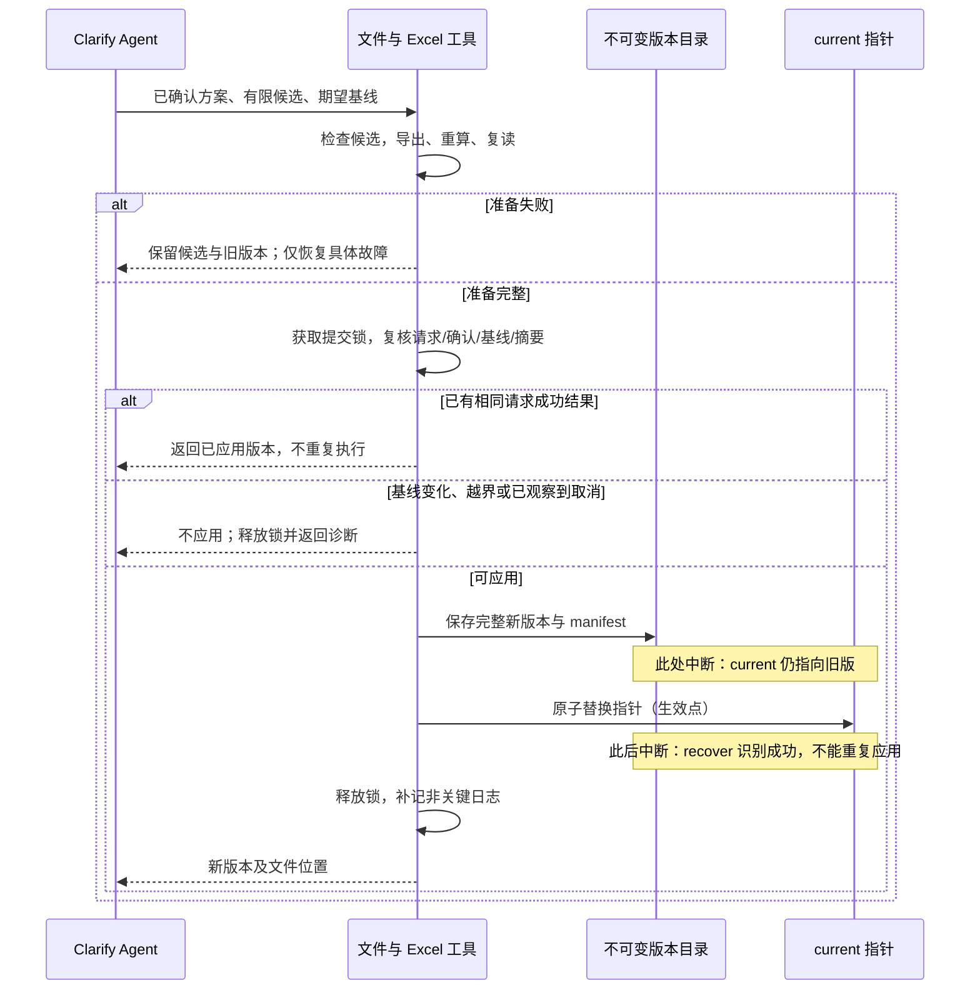

# D07 · 最小工具、存储与恢复合同

[详细设计目录](README.md) · [技术基线 D00](D00-technology-stack.md) · [数据 D02](D02-shared-data-and-evidence.md)

状态：按单人串行、原模板计算的用户决定收口。I1.1 候选校验及 I1.2 文本/分析登记、定向查询、存储与恢复接缝已有实现，当前可调用范围见[工具合同](../../../references/tools.md)，验证与限制见 [I1 记录](../../validation/I1-reliable-delivery.md)。I1.3 已接入真实 Excel 核验及 Generate apply，并通过回归与原生检查，独立审阅及定点复核已通过；D05 的具体修改/确认仍待 I3。本文件包含后续设计合同，不能将所有设计操作视为已经可用。

## 1. Agent 与工具的调用关系

宿主 agent 选择下一项专业活动、阅读哪些材料、怎样探索原型、如何生成/修改切片。两个 Skill 使用下列机械能力；工具返回文件、检查结果或诊断，不返回下一项专业 Action。没有 `next/submit` 领域运行器。

沿用 D00 的 Python 3.12、uv 和已验证的 Excel/Office 实现方法。源码迁入 Lite 后移除旧模型和流程耦合，运行时只读取 Lite 安装目录及当前项目。文件路径从已加载 Skill 所在位置和显式项目路径解析；不写死本机 checkout。

Agent 可在本请求 work 目录写草案；版本目录由工具独占生成和激活，Skill 不通过直接改 current 绕过检查。产品用法是同一个人串行生成、查看和修改，不支持同时讨论/准备多个改稿请求。只保留防止过期草案或重复调用误覆盖的版本检查和短提交锁，没有跨请求自动合并或重建机制。

## 2. 六项机械操作

逻辑操作保持以下六项，CLI 统一为 `python scripts/lite.py --request <request.json>`；具体 payload、版本和错误信封见 [P00](../implementation/P00-contracts-and-fixtures.md)。各操作按实施任务逐项接入，实际支持范围以上述工具合同为准。大参数通过 UTF-8 JSON 请求文件传递，大结果存文件并返回定位；不把整份 PRD/模型反复塞进命令行或 stdout。

| 操作 | 主要输入 | 输出 | 写入范围与失败边界 |
|---|---|---|---|
| `inspect` | 项目、版本/请求、对象或主题选择器、分页参数 | 版本身份、所选对象/关系/问题/依据定位；总匹配数与未返回数量 | 只读；不因没有匹配就返回整个项目 |
| `ingest` | 本请求、输入路径、明确的材料用途/区域；按需登记已有观察与附件 | 不可变输入版本、结构/区域索引、可读内容、必要观察身份与限制 | 只写输入/读取工件及本请求分析依据；新输入/观察不自动改变当前 SOW |
| `check` | 已有候选/方案，或指定基线的有限编辑稿 | 机械构造的候选、具体计划/可读 diff，及结构/引用/范围诊断 | 只在 work 复制基线、应用 Agent 明确给出的编辑并派生元数据；不猜值、不关闭未明确处理的问题、不应用当前版 |
| `render` | 已检查候选、模板版本、目标候选目录 | 重算并复读的 sow.xlsx、projection.json、独立待确认和必要说明，及检查结果 | 写本请求候选文件；失败保留模型，不能让不完整文件成为成功输出 |
| `apply` | 本请求、候选包、期望基线、入口；clarify 加确认方案引用 | 已应用版本及文件位置，或未应用的明确诊断 | 验证完整性后写不可变版本并切换 current；不自动扩充业务写集合 |
| `recover` | 本请求或已知结果标识 | 已应用结果，或仍为草案/可修复/不兼容的诊断与文件位置 | 先核实事实；不根据“文件已存在”自动激活候选，不选择下一项专业任务 |

`inspect` 的对象选择器同时支持精确 ID、关系端点、问题状态及标题检索。标题模糊命中返回少量候选与所属层级，让 agent 定位；无权自行消歧。关系邻域返回查询条件、成员及所读版本；零结果也保留查询范围。串行使用下按整版身份检查，不维护字段/关系级并发冲突摘要。

首次 `ingest` 在已知项目类型和显式项目目录下初始化 project.json、请求 work 与内置模板的不可变副本，再登记输入；复用已存在的有效项目和模板，不新增 setup 用户阶段。项目类型未定先按 D01 交互，初始化不猜值；已有身份/模板冲突返回诊断，不覆盖用户项目。部分输入失败保留已登记有效内容，不产生 current。

`ingest` 还接纳本请求 work 中的分析候选（主题、必要依据和真实观察）：只验证结构、来源/摘要和路径，再保存为不可变 analysis 工件，返回身份/定位；它不代做语义分析，不把登记等同于当前 SOW 已采用。`apply` 的 manifest 才绑定本版采用的依据。原件、分析候选两种 payload 分别验证；不把业务 model.json 当输入登记绕过 apply。

`ingest` 对非原型材料只支持可直接读取的文本（默认 Markdown）及 `.xlsx`，复用 D00 的读取能力；PDF/DOCX、扫描件及其他格式返回不支持与所需可读内容，不执行 OCR、自动转换或安装解析库。原型按资源包独立处理，浏览器不可用时说明观察限制。材料角色独立于物理格式：往期 SOW 用于 as-is，其余项目材料用于 to-be，模板用于规则；工具不作语义 gap 或匹配裁决。

具体输入角色/用途区域、读取视图、定位与覆盖见 [D03](D03-input-analysis-and-exploration.md)。`inspect` 可按有效输入/读取/主题/观察身份读取有关区域，并返回准确范围、未读面和续读位置；不因局部缺口回传整个项目。浏览器操作由 agent 使用宿主工具自主完成，`ingest` 只登记真实观察和必要附件，不决定点击顺序或代造观察事实。

`check` 不调用模型做语义修复；`render` 不生成 Story 或计算另一个人天版本。两者可以复用内容摘要完全一致的检查结果，`apply` 核对实际字节后接纳，避免重复全量解析。不能只信 agent 写下的 `valid=true`。

[D06](D06-excel-projection-and-delivery.md) 定义按原模板填值、独立待确认/长内容文件和投影合同。正常一次 Office 重算、最终文件复读；不默认额外生成参考工作簿。result 只返回文件定位/摘要、引擎身份及问题/诊断，不返回分费用完整性或金额标签。模板自己计算，工具不改公式、不补金额、不按业务待确认项控制汇总。输入变化会使旧缓存失效；合法缺值不等于 Office 运行或文件写入失败。

分片候选检查与完整交付检查的范围必须区分并记录：局部检查可以指出仍待其他片提供身份的关联建议，但不能把片内通过当作完整引用闭合。D04 的主 agent 负责将这些建议绑定到正式对象；render/apply 只接纳全部必要引用合法的完整模型。[分片与上下文设计](D04-generate-and-context.md) 同时限定 worker 写各自尝试目录，公共索引、合并与生效由单一整合者处理。

### 2.1 统一请求与结果信封

请求共有 `protocol_version`、`request_id`、`project_path`、`operation`、`payload`；操作专有字段放 payload，未知协议版本拒绝。一个用户请求跨工具调用与上下文续接使用相同 request_id；真正新的意见使用新请求。可附 D08 定义的非业务 observation_context（execution_id、activity_ids、slice_ids）；标签缺失不阻断业务，工具仍自动计时并保留未归属项。该上下文不决定下一动作或重置 D04B 计数。

结果共有 `ok`、`request_id`、`operation`、`result`、`diagnostics`。诊断包含稳定 `code`、具体目标、简短原因和仍保留的文件位置。成功可以有业务未知或观测不足提示；技术失败不能包装成待用户确认的业务项。

| 诊断类 | 处理责任 | 自动继续的条件 |
|---|---|---|
| `INPUT_UNAVAILABLE` / `FORMAT_UNSUPPORTED` | Agent 说明材料/能力缺口 | 有替代可读材料或适用读取器才继续相关读取 |
| `CANDIDATE_INVALID` | Agent 修正本片的结构或引用 | 有明确修法且保持既定语义和范围 |
| `BASE_STALE` / `SCOPE_EXCEEDED` | 保留过期草案或定位越界编辑 | 基线变化直接停止旧候选应用，不自动换基线；越界只修明确写入错误，语义扩大回具体方案 |
| `CALCULATION_FAILED` / `WORKBOOK_INVALID` | 工具适配与 Agent 故障定位 | 有针对性修法才恢复导出/计算；不重生成业务内容 |
| `WRITE_BUSY` / `IO_FAILED` | 本地存储工具 | 写者释放或 I/O 原因解决；不启动持锁等待用户的循环 |
| `REQUEST_CANCELLED` | 本次请求结束 | 迟到候选不得自行激活；后续由新请求明确恢复 |
| `VERSION_INCOMPATIBLE` / `EVIDENCE_MISSING` | 诊断版本/证据 | 有已支持恢复路径；不静默转换业务含义 |

错误码用于定位，不用于展开“下一阶段”列表。检查工具输出不能指挥 agent 为了消除业务未知自动编一个值。

## 3. 文件职责与权威

```text
.ai-sow-lite/
  project.json
  inputs/index.json
  inputs/originals/<input-version-id>/...
  inputs/readings/<read-id>/...
  template/<template-hash>/sow-template.xlsx
  analysis/index.json
  analysis/topics/<topic-version-id>/...
  analysis/observations/<observation-id>/...
  versions/<version-id>/
    model.json
    pending-items.json
    decisions.json
    projection.json
    sow.xlsx
    pending-items.md
    details.md  # 仅有超长内容时
    summary.md
    manifest.json
  current.json
  work/generate/<request-id>/...
  work/clarify/<request-id>/...
  telemetry/...
```

原件、模板和已被版本引用的分析不可变，索引只提供检索路径。每个版本的 manifest 列出文件相对路径/字节摘要、schema/投影器版本、使用的输入/依据/模板身份、基线版本、请求身份和应用内容摘要。只有这里列出的依据能解释该版结果；不能通过可变 analysis/index 偷换旧事实。

`readings` 保存必要读取记录与类型化摘录，绑定原件、读取器、选项和选择范围；可重建的非引用缓存与正式依据分开。`observations` 保存 D03 的不可变观察及必要附件，多个主题可共用。凡交付依据实际引用的读取/观察工件与附件都进入 manifest 的可达依赖范围，不能清理后只留一个无法复核的哈希。这里不保存默认全量浏览器日志或另建专业执行引擎。

`current.json` 只含当前 version_id 和 manifest 摘要。读者先读指针，再读取其指向的不可变版本；过程中即使指针更新，该次读取仍使用选定版本，不能每读一个文件就重新取 current。工具输出返回版本身份，避免模型、问题和 Excel 混版。

`project.json` 保持项目身份及少量设置。材料登记、候选检查和工作保存不是新一套有效业务版本；generate 成功才产生首个完整版本，clarify 讨论只写 work。

`projection.json` 是 D02/D06 的 ID/行/名称、字段及独立问题/长内容定位映射，绑定最终工作簿摘要和投影版本；不新增 Excel Sheet、列或公式。manifest 同时绑定实际 Office 身份、文件写入版本和最终检查记录。pending-items.md 与按需 details.md 是本版正式可读附件，随 Excel 交付；临时 Office 文件和可重建预览不是稳定业务结果。

历史匹配保留实际 as-is 主题/区域、候选范围及所读版本；“未匹配”也有来源范围。用户在后续串行请求提供新历史材料时，Agent 只对有关 gap/模式复核，不沿用旧零匹配结论或使全项目失效。这里不需要跨请求并发失效图。

## 4. Clarify 方案与读写边界

方案保存于请求 work 区，最小内容为 `plan_id`、`revision`、`base_version_id`、`change_summary`、`changes`、`read_set`、`write_set`、`read_boundary`、`conditions`、`unresolved_items`、`confirmation`。只记录一个本次修改方案，不为每个专业步骤建立审批包。

| 内容 | 精度要求 |
|---|---|
| `read_set` | Agent 选择依赖后由工具记录 selector 与 observed_version；来源和模板按不可变身份核对，不构造细粒度并发合并摘要 |
| `write_set` | 可新增/改写/删除的稳定对象 ID 与字段；问题、决定、分类依据和 lineage 也属于写集合 |
| `changes` | 已确定字段的前后值及拟增删义务；例如复杂度 默认 M → S。专业文字候选应在确认前形成可审阅内容，不能只批准“修改这个 Story”后任意替换含义 |
| `read_boundary` | 最深可回查的依据/分析/对象坐标，及允许的主题/来源；“读原件”不代表可重写原件或重开全案设计 |
| `conditions` | 方案成立所依赖的事实，例如映射/源目标/回滚条件不变；无需复制所有项目事实 |
| `confirmation` | 所确认方案内容摘要、用户明确执行意思的最小记录或可访问消息引用；不保存整段聊天 |

EX01 的写集合明确包含 T-06.complexity 及对应 classification_basis、P-01.status/resolution、D-02；派生 Excel、投影和摘要随之重建。不能以“这是元信息”绕过修改边界，也不把整本重算误认为全项目专业分析。

检查同时验证边界与已确定的变化值：方案说补 S，实际填 M，即使字段没有越界也不能应用。专业文字是否仍符合确认的义务由 agent 核对，代码不能以 diff 范围正确代替语义正确。`changes` 使用稳定 ID 和字段寻址，不依赖数组下标；新增/删除对象记录对应内容或其候选文件引用。

确认绑定业务变化、写集合、关键条件和回查边界。导出路径及不在绑定内容内的展示格式可机械修正；已绑定专业文字、方案、旧值、责任或对象变化都重新核对具体确认，不能以措辞修复绕过摘要。技术检查用于防止内容漂移，不形成每阶段 Owner/Reviewer 门禁。

有限编辑构造沿用 P00 的 check/edits：Agent 只写明确的新值/增删、问题/决定去向、依赖选择和边界；工具从当前基线复制完整文件并生成实际 diff、read_set/write_set、计划和可读展示。专业方案经用户确认后复用同一候选。它只是既有 check 内的机械接缝，不生成下一项任务，也不要求 Agent 重写全量模型或手填摘要。

[D05](D05-clarify-and-change-scope.md) 定义确认前形成具体候选、部分选择和模板预览复用。用户明确只执行已展示且独立闭合的子集时，派生对应有限计划；confirmation 同时保留展示方案定位、所选变化及用户执行意思，绑定实际子集内容摘要，不复用完整方案摘要冒称全部获准。子集需要新的义务/值或改变条件才能成立时，必须先展示修订，不能由工具自行裁剪依赖。确认后复用专业候选；同内容、同模板、同基线的完整有效投影可复用，不完整的草案文件不能代替完整投影；内容变化需重新准备，基线过期直接退出。

Lineage 按 D02 的 from_version_id 精确读取历史对象。检查区分当前引用与允许的历史引用：open 问题和活动依赖指向当前模型，退出对象的终态问题/历史决定须有可解析的 lineage/历史版本。manifest 的可达依赖覆盖相应历史记录，继承时不把原出处改成当前基线；当前模型的正常读取不因此回传全部历史。

文件摘要采用实际字节的 SHA-256；计划内容采用版本化的规范 JSON 摘要，不规范化业务文本。已确认方案原件及基线保持不变，应用只能面向该基线；规范化细节在 P00 固定，不能把渲染后的 Markdown 当稳定机器摘要。

### 4.1 基线变化

正常后续请求从最新 current 开始，用户串行完成讨论与应用。旧草案、手动文件替换或误开的重复调用若造成 current 与预期不一致，立即返回 BASE_STALE，保留草案和当前有效文件，不再区分相关/无关变化。

不自动重建候选、不迁移旧确认、不持续追赶新版本。用户之后基于当前版提出或续接明确修改时，复用仍适用的输入与意图，形成当前基线上的有限方案。短锁只保护一次文件生效，不跨讨论持有；没有并行改稿的正常路径或自动合并验收。

## 5. 一次完整版本如何生效

目标是应用级一致性：current 总是指向完整版本。**多个文件不是一个文件系统事务**，因此先准备不可变版本，最后只替换一个指针。以下协议首版限定在支持本地原子替换及所选锁机制的普通本地目录；网络盘/同步盘不能未经故障实验就宣称同等保证。

Generate 首次生效要求期望基线为 null 且锁内 current 仍不存在；clarify 要求当前完整基线和有效具体确认。已有 current 时再次要求 generate，先按 D01 区分重复取结果、修改当前方案或另建方案；不能以 generate 名义绕过 clarify 覆盖现版。同请求已成功的幂等命中优先返回已有版本。

1. 先检查相同请求是否已有已应用结果，命中则直接返回，避免重复导出。否则在本请求 work 中保存候选模型、问题、决定和依据引用，完成必要检查。
2. 复用同内容、模板、规则及应用基线的完整有效投影；否则生成 Excel、真实重算、复读公式/结果/关联/保护，生成投影和说明。检查绑定实际内容摘要；不在写锁中进行 Office 重算。
3. 准备带唯一 version_id 的完整候选目录，生成并核对 manifest。目标与 versions 在同一文件系统，避免跨盘 rename 假原子。
4. 获取项目提交锁，核对请求尚可应用、确认适用、期望 current、读依赖和完整文件摘要。对同请求检查是否已经成功。
5. 将完整候选放入不可变 versions 目录；若版本目录已存在，仅在内容完全一致时复用，不能覆盖。写完并按平台能力刷新相关文件，再准备临时 current 指针。
6. 在锁内以本地原子替换切换 current。**这一步是生效点。** 指针此前旧版有效，此后新版有效；任何后续日志失败都不能把已应用结果报告成“未应用”。
7. 释放锁，返回版本和文件。必要日志可补记；recover 可仅凭 manifest 和 current/版本链核实成功。

平台适配采用操作系统释放型的跨进程锁，进程退出后释放；不要仅以锁文件年龄判断另一写者死亡。Windows/Unix 的实现与崩溃、断电持久性保证要在迁入后分别测试；若无法获得所需锁或原子替换能力，应明确拒绝应用，不能默默退化成无锁覆盖。



图源：[完整版本生效时序](../diagrams/detailed-save-sequence.mmd)。锁内重复检查只防止过期或误重复调用覆盖；正常串行重复请求在准备前快速命中已有结果。

## 6. 幂等、取消与恢复

### 6.1 幂等不等于只看请求名称

请求在实际应用前封存不可变业务意图摘要：generate 绑定交付候选，clarify 绑定已确认的具体方案。正常讨论及允许的方案修订发生在封存前，不能在第一句反馈时锁死未来内容；manifest 保存 request_id、base_version_id、意图摘要和最终应用内容摘要，编码见 P00。重试使用相同 ID：

- 同请求已成功且意图一致：返回原版本，即使响应丢失；若 current 后来已有更新，也不能把 current 倒回该版本。
- 同 ID 但业务意图不同：拒绝误复用，需新的请求/方案；不按最后一次 payload 覆盖。
- 尚未成功：允许在同一意图内修正序列化、原公式保存等自身写入问题，内容摘要随候选更新；仍须通过范围、确认与基线检查。
- 用户新会话以新 ID 重复答复已解决问题：先读问题与已应用决定；若没有实际变化则说明已有结果，不凭自然语言相似度再执行一次；有新含义正常讨论。

不能依赖提交之后才写成功标记才能识别成功。版本 manifest 提前保存请求身份，current 生效后即可证明结果；孤立的完整版本目录则不能证明它曾生效。

### 6.2 取消的可保证边界

宿主在应用前观察到取消，则记录本请求不可继续并拒绝激活迟到候选；不自动把任务搬到后台。应用工具需要在生效点前再次检查已收到的取消信息。

真实限制必须保留：宿主如果不能把取消事件传给正在运行的工具，就不能承诺按用户点击的墙钟时刻阻止文件切换。若取消发生在生效点之后，结果已经应用，返回事实，不静默倒回旧版。D00/D08 的宿主能力矩阵需实测信号、进程中断及工具调用边界，不能仅靠一个 `cancelled` 字段宣称任意时刻都可撤销。

### 6.3 恢复表

| 中断/失败点 | 有效内容 | 恢复动作 |
|---|---|---|
| 分析或 generate 一片未完 | 原件、适用主题及完成片；current 如有不变 | 从覆盖索引读取未完成范围；半片不计完成 |
| clarify 只形成部分修改 | 原版本 | 子结果留草案；全片完整才可应用 |
| Excel 失败，模型有效 | 原版本及合法候选 | 只修导出、计算或文件核验；无新修法则退出 |
| 候选目录完整，未切指针 | 原版本；新目录仍未应用 | 检查确认/取消/基线后显式恢复同请求；不自动晋升孤儿目录 |
| 指针已切换，响应/日志丢失 | 新版本 | recover 核实 manifest，返回原结果 |
| current 指向工件缺失/损坏 | 不能将该指针视为可用交付 | 报损坏；同版恢复须匹配原 manifest 摘要。重建字节不同则需可辨的修复版本，不能直接改不可变目录或把旧版冒充新结果 |
| 误重复调用、过期草案或非预期版本替换 | 当前已有效版本 | 释放短锁并返回 WRITE_BUSY/BASE_STALE，保留草案；不自动衔接另一个请求 |
| 新旧格式不兼容 | 旧文件保留 | 只运行已支持升级路径；没有升级器就明确限制 |

### 6.4 环路计数与超时

[D04B](D04B-bounded-loops.md) 是停止策略来源：请求 work 保留活动范围、轮次、上次进展/修法、退出原因及续接点。初次覆盖的游标与追加调查/修复计数分开；工具检查自己可见的计数、重复操作、取消和超时，不决定下一个专业动作。默认同一操作/根因重试一次，请求自动返修共用两批上限；无实际修法不重试。

外层工具调用和内部 Office/浏览器/进程重试须合并计算，禁止各自重复两次形成相乘。数据保存失败无法可靠确认剩余次数时先查询已有记录；仍不能判明则保留诊断退出，不按计数为零继续。结果查询不触发再次修改；同一游标、持续繁忙和未知提交状态不得忙等。

宿主重启、压缩或委派继承当前逻辑活动计数；agent 不能换 ID 绕过上限。Skill 可规定自身提问/分析次数，工具只强制可观察边界；没有宿主拦截的纯模型活动及无法取消的既有进程，必须明确强制能力限制。可得计时/usage 单独记录，不虚构硬性 token 上限。

## 7. 开销、保留与检查安排

大模型文件可以整体保存在磁盘，inspect 按 ID/主题输出必要片段；不要求为了上下文分片而立刻引入数据库。manifest/源摘要、关系索引和检查结果可复用；当前版本读取时不默认扫描所有历史版本和全部原件。发生完整性异常时再扩大机械检查范围。

工具在执行边界记录单调时钟用时、请求/操作/尝试身份、结果、输入输出规模及缓存是否复用。模型 token 只能从宿主真实 usage 接收；没有就记录未知，工具执行时长不能换算 token。日志失败不阻断已完成业务，摘要指出观测缺口。字段、源版本/能力、时钟域、累计/调用去重与跨活动归属以 [D08](D08-telemetry-and-performance.md) 为准；[EX06](examples/EX06-telemetry-accounting.md) 区分真实只读探针与合成账例。telemetry 按请求、执行段与写者分文件；报告可重建，交付摘要只保存当时截止点。迟到 usage 只更新独立观测报告，不修改已交付 summary、Excel、manifest 或 current；收尾有界，不等待日志齐全再交付。

首版不自动清理用户输入、已交付版本或它们引用的证据；临时 Office 目录执行结束即清理，失败诊断只保留必要信息。未应用 work 的保留/清理提供显式、可识别范围，取消不等于删除用户资料。此策略先保正确性，不实现复杂历史回收服务；磁盘规模实测后再决定策略。

实现前置检查聚焦：源版本迁入独立安装、原模板填值保留、有限编辑构造、读写范围、应用生效点、过期基线拒绝、重复请求及取消信号。详细归属见 [D09](D09-validation-and-implementation.md)。没有要求重放旧插件专业流程来证明这些新协议。
