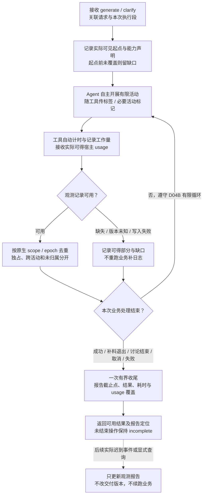
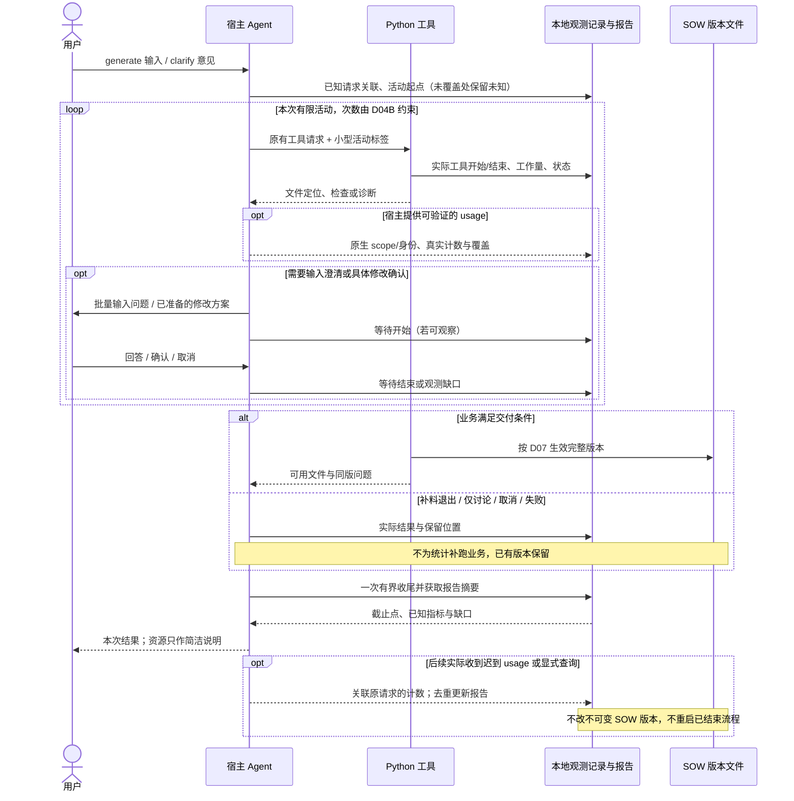

# D08 · 观测与性能

[详细设计目录](README.md) · [观测目的](../06-observability-and-validation.md) · [单 session 全景](D04A-single-session-panorama.md) · [EX06 计量走读与探针](examples/EX06-telemetry-accounting.md)

状态：I1.4 的本地工具观测和 I2.3 的版本绑定原生响应采集已完成，实际 Generate 接入、重放、回归和独立审查通过。实现状态见 [I1](../../validation/I1-reliable-delivery.md) 与 [I2 验证](../../validation/I2-generate.md)，字段编码见工具合同。逐活动 token 和完整宿主能力仍有缺口，不能把本设计的目标当作全部已实测。

I1.1 的两轮探针补充了 EX06 最初的 `token_count` 观察；I2.2 又取得完整 Generate 的 `token_usage_record`、实际工具和文件记录。I2.3 复用这些精确来源，响应加总与 turn/thread 累计核对一致。当前生产者版本、实测计数和未验证项以 [宿主验证](../../validation/host-support.md) 为准；精确活动归属和宿主模型中断仍未验证，G12 保持开放。

## 1. 目标和首版边界

需要看清一次 generate/clarify 各项活动的用时、token 及重复工作，再汇总同一项目的多次请求，指导读取、上下文、生成、修改和 Excel 操作的优化。活动标签沿用 D04A/D05 的专业边界，由 agent 标记主题与切片；记录活动不要求 agent 按固定 Action 链执行。

首版采用**工具自动计时、专业活动少量标记、宿主真实 usage 适配、本地 JSONL 与派生报告**。不增加模型运行器、后台服务、数据库、外部仪表盘或第二套业务状态机。观测缺失不阻断 SOW，报告必须暴露缺口；这是一种降级能力，不代表已经满足逐步 token 的目标。

速度控制仍由 [D04B](D04B-bounded-loops.md) 的有限覆盖、合批、追加/返修次数和无进展退出承担。这里记录其效果和成本，不设 token 配额、预算审批或自动删减业务范围。

## 2. 宿主数据从哪里来

### 2.1 当前证据与接入选择

| 来源 | 已有证据 | 首版使用方式与尚缺证据 |
|---|---|---|
| Lite Python 工具边界 | I1.4 已接入业务 CLI 的实际生命周期、用时/字节及重建报告；观测自身不递归计量 | 工具自动记录自身用时、状态、输入输出规模与重试身份；进程外的等待和模型时间另记 |
| Agent 的活动标记 | Skill 可表达当前活动、范围和完成点 | 与已有工具请求一起记录，必要时独立写轻量标记；是标记被接收的时间，不能追溯成精确模型启动时间 |
| Codex App Server usage 通知 | 官方接口有 usage 更新；本机 CLI 生成的类型含 thread/turn、total/last 和 token 明细 | 协议存在不等于普通 Skill 能订阅桌面当前流；待验证接入、计数语义、结束覆盖及对应关系，不为采集另启动一个 agent |
| Codex hooks | 官方提供会话、部分 turn、工具及结束等元数据；transcript 格式明确不是稳定接口 | 待在目标宿主验证后，可用于活动/工具关联；不能把 hooks 当完整模型调用账本，不能只用父 session ID 区分子任务 |
| 当前 Codex 会话记录 | I2.3 对生产者 0.153.4 的 token_usage_record 实现 response_absolute 适配；实际 31 条响应与两轮累计一致，重放身份不变 | 只接受显式来源和固定 thread/turn 绑定，范围仍为 partial；未知版本降级。不能默认扫描聊天目录、自动扩展 turn 集合或把尾部 last 当本活动消耗 |
| Codex OTel | 官方列出请求、工具事件及 usage 指标；需要显式配置 | 非首版默认依赖，本轮未启用/实测；若后来采用，先验证事件身份、覆盖及隐私过滤，直方图不能冒充逐调用明细 |
| 其他宿主，包括 Claude Code | Claude 原生 manifest 和临时插件发现已验证；实际调用因本机 OAuth 撤销失败 | 执行及 usage 未验证，先显示工具计时和 usage 未知；不复用 Codex 的字段/去重假设 |

官方依据：[App Server](https://learn.chatgpt.com/docs/app-server) 描述客户端事件接口；[Hooks](https://learn.chatgpt.com/docs/hooks) 描述元数据、工具覆盖和 transcript 稳定性限制；[高级配置](https://learn.chatgpt.com/docs/config-file/config-advanced) 描述可选 OTel 和事件/指标。以上仅证明文档所述能力，不证明当前插件已接通。当前版本探针的具体范围与结果见 [EX06](examples/EX06-telemetry-accounting.md#1-真实只读探针与限制)。

优先接已验证的宿主事件；兼容读取器只消费精确会话的新事件和已保存游标，不全量读取客户对话。未知版本、字段变化、权限拒绝或计数语义未验证时，保留可得数据和诊断，不尝试猜结构。不能仅凭文件存在，把实验性读取升级为安装必需条件。

### 2.2 能力声明必须按项给出

每个适配器输出来源/生产者版本、实测范围，以及 `request_usage`、`call_identity`、`activity_attribution`、`tool_lifecycle`、`interrupt_signal` 各自的 `verified` / `partial` / `unavailable` / `unverified`。验证范围绑定实际宿主及版本；安装的 CLI 和桌面会话生产者不是同一个版本时分别记录。模型名称、上下文窗口或字段名称可读，不等于相应计量语义已验证。

G12 保持开放：**真实请求的边界累计差值、迟到结束事件和活动关联仍需宿主执行验证**。设计收口可以继续，但不能把“token 有字段”当作逐步埋点完成。

## 3. 身份、活动与时间

### 3.1 一个请求可包含多段实际执行

| 身份/关系 | 定义 |
|---|---|
| `request_id` | 沿用 D07；一次逻辑 generate 或 clarify。必要回答和恢复不另造请求来重置 D04B 次数 |
| `execution_id` | 同一请求内的一段实际执行；宿主恢复或进程重启可新建，关联前段，不表示业务重新开始 |
| `activity_id` / `parent_activity_id` | 如输入分析、生成某片、合并、方案讨论、导出；父子是包含关系，标签不控制下一动作 |
| `operation_id` / `attempt_id` | 机械操作及真实尝试；同一幂等查询/事件重放不制造新尝试，真实重新执行保留成本 |
| `host_session_id` / `host_turn_id` / `host_call_id` | 宿主实际提供才填；缺失为 null，不能以活动 ID 替代物理模型调用 ID |
| `activity_ids` / `slice_ids` | 一次调用可能覆盖多个活动/切片；没有精确拆分依据时保留组合范围 |

Generate 返回文件或要求补材料后结束当次处理；用户离线评审不保留执行 span。后续明确恢复可关联原请求和新执行段，后续新意见用独立 clarify 请求；项目视图同时展示请求、续接和交付关系。终止/恢复语义以 D01/D07 为准，观测不擅自续跑。

开场回答、输入澄清或方案确认期间，只有宿主/记录器真实观察到的等待边界才计入已知等待。宿主停止而没有记录后续区间时，记为未观测间隔，不能把它全部解释为用户思考或 agent 工作。

### 3.2 时间口径

| 指标 | 计算条件与含义 |
|---|---|
| 实际工具用时 | 同一次执行、同一单调时钟域内的 end − start；进程被杀缺 end 时不补造完整用时 |
| 请求自然历时 | 可对齐起止的墙钟差；跨恢复要展示中间未观测间隔。时钟跳变导致不可信时标未知 |
| 已观测处理时段 | 实际执行区间的并集，包含区间内模型、排队和工具等待；不是 CPU 时间 |
| 已知用户等待 | 成对等待区间的并集；不能重复扣除重叠等待，未成对部分单列 |
| 活动历时 | 实际标记的起止；包括子活动。父活动与子活动不可累加成总历时 |
| 工具/模型累计耗时 | 可识别的实际调用耗时之和；并行时可能大于历时。无模型生命周期数据则模型耗时未知 |
| 排除子活动后的历时 | 仅在子区间完整、可对齐且均处父区间内时，用父历时减子区间并集；不能简单减子时长之和 |
| 首个有用反馈/首个可用文件 | 从有证据的接收点到具体问题包、方案或已核验文件；普通进度消息不算有用反馈 |
| Clarify 响应 | 接收到具体方案、确认收到到新文件分别展示；讨论后放弃也保留已发生成本 |

每个时钟事件记录 UTC 与可得的 `monotonic_ns`、`clock_domain`。只在已证实同域的记录之间相减；不能跨进程/重启直接减单调值。没有可靠对齐时仍可报告各进程完整时长，跨进程区间并集为未知。末条日志时间不是失联操作结束时间，负时差不能悄悄裁成零。

首次入口标记之前的宿主加载、Skill 加载和模型处理可能没有被观察到；报告从哪个边界开始计量。若后续能从宿主得到真实请求接收点，再补该范围，不能假装首个 Python 工具覆盖了之前的工作。

## 4. 最小事件与文件合同

### 4.1 只保存归因所需的数据

| 字段组 | 内容与约束 |
|---|---|
| 事件信封 | `schema_version`、`event_id`、`event_type`、`request_id`、`execution_id`、`producer_id`、`sequence`、`observed_at`；重放保留原事件身份 |
| 执行关联 | 第 3 节身份、入口、活动类别、关联来源/对象的内部 ID、基线/结果版本；无需客户标题或正文 |
| 生命周期 | `start` / `end` / `milestone` / `gap`，状态、实际时钟、可得结束原因；未结束操作保持 incomplete |
| 用量观察 | 来源/生产者/适配版本、原生 scope、计数 epoch、源事件/序号或游标、观察形式、字段及覆盖边界；详见第 5 节 |
| 工作量与重复 | 读取区域/字节、返回字节、对象数、候选写入字节、缓存命中、关联重试、D04B 批次/计数和退出原因；缺失不估填 |
| 诊断 | 稳定缺口类、受影响范围、是否可重建；保留字段级事实，不保存完整错误转储 |

`event_type` 仅需 `lifecycle`、`usage`、`work`、`gap` 四类。事件结构不复制 SOW Schema、用户确认方案或业务状态；报告查询按这些关联回到相应文件。

不记录完整提示词、工具参数/返回、用户原文、隐藏推理、凭据、本机绝对路径。来源定位在项目内用既有内部 ID；宿主 ID/游标只存项目本地，导出样例和公共报告再替换。兼容读取器即使需要接触 transcript，也只持久化白名单计量字段，不复制原始聊天。OTel 如含输出片段，不能仅关闭 prompt 就认为脱敏完成。

### 4.2 文件布局与轻量接入

```text
telemetry/<request-id>/
  context.json
  events/<execution-id>/<producer-id>.jsonl
  cursors/<source-id>.json
  report.json
  report.md
```

`context.json` 保存已知请求/宿主关联、活动标记和适配能力声明；不作为业务恢复或 D04B 次数的权威。每个写者一个事件文件，顺序追加，避免多个进程竞争一行；游标原子更新。消费者先耐久保存事件再推进游标，崩溃后允许重放并去重。文件中断尾行未完成和中间损坏分别报告，不能吞掉后标为完整。

D07 信封可附非业务 `observation_context`：`execution_id`、`activity_ids`、`slice_ids`。工具自建 operation/attempt 身份并记录边界；缺标签仍执行并计入未归属项。尽量随原有调用携带小标签；纯语义活动才用起止/里程碑标记，不每次思考调用一次埋点命令。标记失败不导致业务请求失败，也不把恶意路径/非法业务参数当作观测降级放行。

I1.4 用 `result.observation` 返回 recorded/degraded、简短 gaps 和报告定位，业务结果与退出码保持独立。输入输出字节仅指规范化业务信封及加入 observation 前的响应，不代表原始材料大小或宿主传输字节，不能换算 token。具体事件、标记和报告字段见 [工具合同](../../../references/tools.md)。

宿主适配器和报告器是内部辅助能力，不新增“获取下一任务”接口。`inspect` 可返回已生成报告定位和简短完整度。常规收尾只做一次有界增量读取/汇总；未到的 usage 留缺口，不为等最终计数忙等，不在业务完成后自动开启后台会话。

内部大活动标记入口与调用编码见 [P00](../implementation/P00-contracts-and-fixtures.md#纯语义活动怎样埋点)，由 I1.4 实现、I2.3 接实际宿主验证；没有原生事件时才使用，观测时刻不冒充精确模型耗时。它不新增专业流程动作或改变业务状态。

Skill 对请求、主要专业活动、首次有用反馈、用户等待及可用文件的真实边界尽力记录；已有工具调用复用 observation_context，纯语义边界合批写最少标记。不逐思考或逐 Task 往返。标记缺失就记录缺口，不补写过去时刻；“尽力”表示观测故障不阻断业务，不表示正常情况下可省略全部阶段标记。

### 4.3 与交付版本分离

`report.json/md` 是可重建视图，包含 `as_of`、来源事件集合摘要、口径/适配版本、各指标覆盖与诊断。Markdown 同步展示截止点、来源事件摘要、每项范围/归属/依据，区分请求合计和共享分组，避免人工重复相加。各报告文件以临时文件加替换避免半份文件，但 JSON/Markdown 不是多文件事务；失败时保留原报告并返回缺口。迟到事件可在后续真实回调或显式查询时更新报告，但不触发专业重做。

已交付 `versions/.../summary.md` 的资源说明只代表当时快照，注明计量截止点并指向项目报告。迟到 usage **不改已交付模型、Excel、manifest、summary 或 current**，不制造新业务版本。若尾段最终答复的 usage 当时未到，快照明确尚未覆盖最终答复。

纯观测 I/O/适配失败返回一次简短缺口，业务照常处理；业务文件也写不下时仍按 D07 的真实 I/O 失败处理。观测自动重试遵守 D04B，不为了补齐日志重跑模型/Office。遥测写入不递归为自己发遥测；埋点命令造成的真实宿主 token 仍在总量里，记录器自身时间/字节可用外层一次汇总观察。

I1.4 报告单次读取最多256个文件、10,000行和8 MiB，目录枚举最多768项，单事件64 KiB，指标最多2,000项；达到物理上限标 READ_LIMIT/REPORT_LIMIT 和部分覆盖。这些是观测自身的工作量边界，不是业务 token 配额。真实中断只记录 interrupted 并原样传播，不据此推断业务未生效；已应用事实仍由 D07 恢复检查。

## 5. Token 接纳、去重与归属

### 5.1 先确定原生范围和语义

每条 usage 保存 `source_kind`、`source_schema_version`、`scope_kind`、`scope_id`、`counter_epoch`、`observation_kind`（单次调用绝对值 / 累计快照 / 明确增量）、`native_event_id` 或稳定游标，以及来源实际给出的计数。`coverage_start/end` 和结束是否完整只在有证据时填写，不能把观察到的 UTC 等同于 usage 覆盖边界。

宿主未提供的原生身份/版本保持 null；适配器自己的版本与观察到的格式特征另记，不能冒充宿主 schema 版本。epoch 仅在验证过的计数连续范围内成立，宿主重启本身不证明计数从零开始。

I2.3 的 response_absolute 保存一个原生响应的绝对观察，按已绑定来源、thread/turn/response 去重，同响应同值重放不加总，冲突与失败后缀保留未知；turn/thread 累计只作交叉核对。该分支不跨 epoch 相减，允许原生 epoch=null；既有累计差值仍需要可信起点和 epoch，不放宽其合同。响应身份和来源文件 EOF 均不能单独证明物理调用或整个 Skill 请求完整。

原生线程、turn、调用和 Lite 请求是不同范围。只有调用 ID 确实存在时，才能按物理调用去重；没有调用 ID 的累计快照必须按原生 scope、epoch 和顺序处理，不能每条回调造一个调用。会话混入其他请求或并行任务时，未能隔离的用量保留宿主范围，不能全部归本项目。

### 5.2 汇总规则

| 情形 | 处理 |
|---|---|
| 同一调用累计/最终/重复回调 | 同一身份只保留相应最新权威修订；按源序号/修订关系判断，不能按到达顺序盲覆盖；真实另一次尝试另计 |
| 累计快照 | 只在同 scope/epoch、语义一致、顺序可靠、有起点且区间归属成立时求差；取到线程总计不能直接当本请求总计 |
| 缺起点/终点 | 缺起点不能反推本请求；缺终点只报已覆盖区间，不填零。开始标记晚到同样产生缺口 |
| 回调乱序/计数减少 | 保留原记录；可确认乱序则按源顺序处理；确认为 reset 切新 epoch；不明则该区间未知，不取 max(delta, 0) 掩盖问题 |
| 父级总数与子调用 | 选一个覆盖范围作为汇总基准，子项作为分解；不能相加。仅在覆盖/口径相同且互斥时计算未归属余量 |
| 两个来源重复覆盖 | 同一范围选择一种已验证权威来源，另一种只作核对；无法消除重叠时不做跨源求和 |
| 一次调用或差值跨活动 | 保存活动集合与一次总量，放“跨活动共享”；不按时间、字符或 Task 数分摊，更不向每片各计全额 |
| 缓存/推理明细 | 按来源定义判断是否 input/output 的子集；未经验证的 cache-write 等字段保留原义，不参与自创合计 |
| 取消、失败与重试 | 已发生调用均保留；失败本身不代表 usage 为零。相同结果回读不重复计旧调用，当前补读仍有成本 |

`total_tokens` 若来源提供且语义明确，使用该值；不再加 input/output/缓存/推理。不提供 total 时，仅在来源明确 input/output 互斥且覆盖完整时求和，并标记 derived。字段不一致产生诊断，不能自动修成看似合理的数字。账户剩余额度百分比、候选文件大小、字符数、模型上下文窗口都不能替代实际 token。

### 5.3 报告同时表达完整性和归因能力

每项指标包含 `value`（无可得值为 null）、`unit`、`scope`、`basis`、`coverage`（complete/partial/unknown）、`attribution`（exclusive/shared/unassigned）与诊断。`complete` 只针对声明的范围；完整 turn 不能写成完整 Skill 请求。

报告分别列请求已知用量、可独占归属的活动、跨活动共享量、未归属量及未知区间。若请求总量完整而步骤分解不完整，直接说明“总量完整、步骤归因部分”。若连调用分母都未知，不给伪造的百分比覆盖率。

累计 input 包含历史重复输入，不是活跃上下文或峰值上下文；压缩不抵消已消耗 token。上下文优化同时看后段调用 input、可得缓存明细、压缩/补读、实际返回量及质量，不用文件变小直接宣布节省。

## 6. 采集与异常流程



图源：[采集与降级](../diagrams/telemetry-accounting.mmd)。这里循环表示观察正在发生的业务活动，不是观测器发起下一专业任务。



图源：[角色与时序](../diagrams/telemetry-sequence.mmd)。A→O 的宿主 usage 箭头表示经适配器接收，agent 不自己填写数值；未验证接入时这条消息不存在。

## 7. 怎样用数据推动优化

用户摘要只展示本次结果、主要等待/执行口径、已知 token 与缺口、报告定位；不在每个业务问题里插入费用提示。开发者报告按活动列出时间、usage 粒度、读取/返回量、生成量、批次、复用、修复及原因。项目报告汇总全部请求，包括退出和取消；覆盖重叠的宿主用量不能跨请求重复累计。

| 实验 | 要保持和检查的内容 | 优先回答的问题 |
|---|---|---|
| 小型与典型 generate | 同一输入/模板/模型/宿主版本；三类义务、来源 AC、公共单计、合法未知、可用 Excel | 输入、生成或 Excel 谁占主要用时；首次有用反馈是否及时 |
| 大材料/公共依赖多的 generate | 一主 session；有限读取、各片及合并；相同范围和检查义务 | 后段上下文/重复读写是否明显增长，是否值得缩减返回或隔离 |
| Clarify 默认 M 确认、单字段及公共跨片修改 | 相同具体意见、范围、确认规则及新文件可用性 | 定位、讨论/等待、确认后应用分别多贵，是否重读无关材料 |
| 输入不足、取消、Office 失败/恢复 | 真实结果分类、已有文件仍可用、次数继承、未知区间 | 是否及时退出、是否重复模型/Office 工作；不能把快速失败当快速成功 |
| 观测自身开销 | 同一夹具与采集范围；可独立测量时比较记录开启/关闭 | 记录器、hooks、回显及汇总是否增加明显延迟/token |

先选小型和典型各一个可复用夹具，正常 generate 与一个 clarify 场景各做少量配对重复；可先三次观察波动，这不是显著性或 p95 结论。输入/模板/模型/规则版本、实际配置、起始会话负担、缓存冷热、观测覆盖和质量结果随样本保存。仅发现波动或具体风险再扩大，不为统计默认跑一整套昂贵重复。

比较原 ai-sow 时优先利用已有可比记录，明确范围、模型和交互差异；缺逐活动明细就只比较可得项，不重跑旧全流程来补一张完美表。不以 Task 数量或待确认项少作为质量提升；尤其不能靠漏掉技术/NFR、迁移上线、公共接入或缺失 usage 宣称 Lite 更快。

优化顺序按实测占比决定：减少重复原文返回和候选回显 → 复用有效读取/检查/试算 → 调整过大的切片与合并读取 → 必要时评估局部上下文隔离 → 最后评估独立片并发。后两项分别核算启动、重复背景、回传、合并及返修，不预设并发省 token。瓶颈若在 Office 或进程等待，就直接改对应工具路径。

## 8. 交接与验证

[EX06](examples/EX06-telemetry-accounting.md) 给出累计差值、共享归属、重试/重复、等待/并行、取消/迟到和未知版本的合成账例，以及本轮真实只读证据。数字演算正确不等于宿主适配器已经正确运行。

D07 接纳非业务观测上下文与独立文件目录；D04A/D05 提供专业边界；D04B 保持循环停止权威；D09 安排事件夹具、宿主边界探针及有质量对照的实际运行。新增 OB14—OB19 提前覆盖起止不全、计数 epoch、时钟、采集开销、迟到报告和宿主版本差异。

D09 已归并尚未验证的宿主能力、Excel 差异和文件协议，并安排 I1—I4：从 I1 开始工具计时/事件夹具，I2 起接真实宿主 usage，I4 作有质量对照的性能实验，不继续扩充独立概念层。每步 token 的宿主归因缺口保留为显式技术事项，不能在设计稿里宣告解决。
