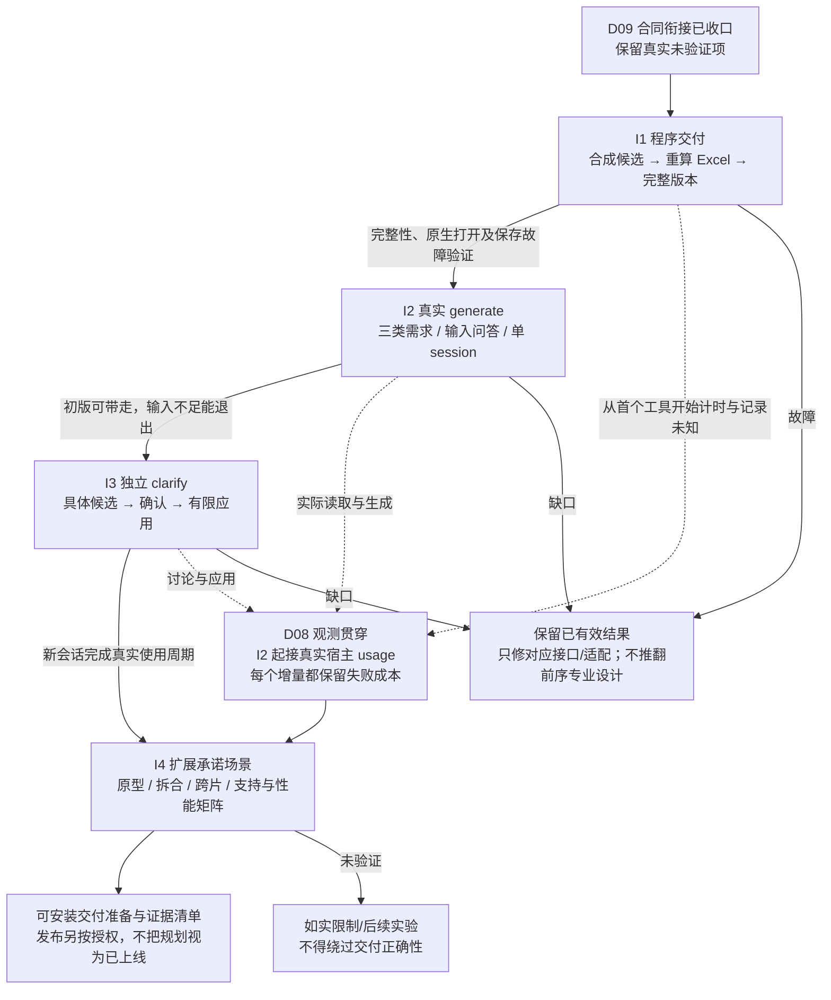

# D09 · 设计一致性收口与最小实现增量

[详细设计目录](README.md) · [完整场景目录](../08-scenario-catalog.md) · [路线图](../11-detailed-design-roadmap.md)

状态：本轮设计一致性收口与实现规划已形成；D00—D08 的最小合同修订见第 6 节，四个实现增量见第 7 节。已补 EX07 合成反例与场景主责；没有 Lite 运行时、真实 Skill 使用周期或性能验证完成的声明。

## 1. 证据分层，避免把设计当运行结果

| 标记 | 已证明什么 | 不代表什么 |
|---|---|---|
| 源证据 | D00 定位的 ai-sow 实现/测试已覆盖该原能力；或当前 Lite 手填模板已有验证 | Lite 新接口、新文件协议或新输出适配已经通过 |
| 设计走读 | 合成材料能解释输入、问答、对象、未知、修改范围及异常出口 | Agent 实际执行会得到同样结果，或 Excel 已重算正确 |
| 待差异回归 | 原能力可复用，但 Lite 改变的边界需要测试 | 从零重新选择依赖或重做所有基础可行性 |
| 有限探针 | EX06 只读检查发现了当前宿主 usage 数据载体和版本/身份限制 | 已接通采集器、完整记录请求或精确归到每个活动 |
| 待新能力验证 | 旧能力没有适用证据，例如本协议中断恢复、当前宿主 usage 稳定适配 | 因为使用了某个库/字段就已可用 |

R0 走读依据为 [EX01](examples/EX01-generate-clarify.md)、[D01](D01-interaction-and-outcomes.md)、[D02](D02-shared-data-and-evidence.md)、[D07](D07-tools-storage-and-recovery.md)。逐项真实执行结果以后记录平台、来源版本、夹具、检查范围和剩余限制；不在文档中先填“通过”。

## 2. 场景主责与最早检查点

下表将现有 163 个场景各分配一个主责专题，跨专题协作仍按路线图。最早增量指该机制首次必须有验证；I1—I4 定义见第 7 节，基础/复杂组合可以先后补证据，不能把早期失败留到 I4。范围端点包含在内；情景细节以原场景目录为准，不在这里复制 163 段文字。D00—D08 已有正文，D04A 是单 session 分析基线，D04B 统一环路约束；D09 持续汇总验证和实现证据。

验证方法：**交互演练**用于用户输入/确认；**专业样例**用于范围、AC、分类和计量；**机械测试**用于可编码合同、差异和恢复；**原生实算**用于 Excel；**事件夹具/实测**用于观测。专业结果按义务与依据检查，不按措辞或固定 Task 数判通过。

| 场景 | 主责 | 最早增量 | 最早检查点 | 触发样例/方法 | 保留与恢复范围 |
| --- | --- | --- | --- | --- | --- |
| IN01—IN03、IN13、IN15 | D01 | I2 | 接收 | EX01 去掉 HLD、改成老项目或仅 draft；交互演练 | 登记输入，补必需材料，不伪造 SOW |
| IN04—IN05、IN17 | D03 | I2；原型 I4 | 输入分析 | 不可读区域、冲突、多用途 Excel；读取差异+专业样例 | 原件和有效用途分析，定向补读 |
| IN06—IN09、IN14 | D01 | I2 | 分析后澄清 | EX01 A1 部分回答/改前提；交互演练 | 已答事实，关联分析续接 |
| IN18 | D01 | I2 | 分析后提问前 | EX01 问题包混入拆解/分类/出稿审批；交互演练 | 只问输入相关的业务/技术/交付事项；保留分析，专业结果由 agent 负责 |
| IN20 | D03 | I2；原型 I4 | 接收与可读性 | EX03 的 PDF/扫描件变体；交互+读取边界 | 请求可读文本/XLSX，不自动转换，保留其他有效输入 |
| IN21 | D04B | I1 工具 / I2 活动 | 输入问答继续前 | EX03 两轮后基础不足/仅剩候选；交互演练 | 无第三轮主动提问，按基础或局部出口处理 |
| IN19 | D03 | I2；原型 I4 | 角色与用途登记 | EX02 合并 PRD/HLD、历史/draft 工作簿；读取+专业样例 | 一个物理版本、多区域用途，不豁免必需材料内容 |
| IN10—IN12 | D01 | I2 | 分片/返回 | EX01 P-01、大面积未知、用户离开；交互演练 | 局部问题随文件；基础不足保留草案退出 |
| IN16 | D04 | I2 | 工作方式匹配 | 新项目用旧资产、老项目新能力；专业样例 | 只重查对应 Task 起点 |
| AN01—AN05 | D03 | I2；原型 I4 | 探索/现状读取 | 假数据、动态 UI、损坏原型、历史跨表；读取差异+专业样例 | 保留读取限制；补相关资源/事实 |
| AN06、AN09、AN14—AN15 | D04 | I2 | 片内分类/自查 | 标准缺口、无依据 AC、未知规模；专业样例 | 相关字段/任务局部修正，合法未知不猜值 |
| AN07、AN11—AN13 | D04 | I2 | 骨架/分片/合并 | EX01 公共建设，加跨片遗漏；专业样例 | 已完成无关片复用，补有明确义务的范围 |
| AN08、AN16—AN18 | D02 | I1 合同 / I2 语义 | 联合拆解 | AC 多对多含义、PoC、同对象不同工作、拆合；合同+专业样例 | 身份/义务/来源有去向，不新增实施对象层 |
| AN10、AN19—AN20 | D03 | I2；原型 I4 | 读取与上下文交接 | 摘要漏反例、变用途、变内容；读取差异+专业样例 | 保留原件，局部失效，不全量 IR 重建 |
| AN21—AN26 | D04 | I2 | 全输入分析/骨架 | EX01 及 NFR 局部约束、未知后端变体；专业样例 | 三类范围、责任和来源 AC，公共建设单计 |
| AN27—AN28 | D04 | 条件实验；首版不启用委派 | 分片与工作包准备 | 父历史继承、同源独立片、公共建设/消费并发；宿主探针+专业样例 | 精简上下文，已知公共边界先行，未形成正式 ID 的关联待合并绑定 |
| AN29 | D04 | I2 | 单 session 换片/压缩恢复/合并 | D04A 基线中旧候选与新事实共存；专业样例+宿主实测 | 以有效文件恢复，保留覆盖及公共归属，语义整合不只看标题/片状态 |
| AN30—AN31 | D03 | I2；原型 I4 | 区域读取/原型探索与复用 | EX02 隐藏附注、缓存缺失、模拟/不可达状态；机械+宿主+专业样例 | 定位/版本/观察条件可回查，必要补读，停止无进展探索 |
| AN32—AN33、AN37 | D03 | I2；原型 I4 | As-is/to-be 与匹配 | EX03 零匹配、未读/损坏、多历史范围；专业+读取案例 | 无候选新建，相关候选实例未定新建+待确认；真实读取/基础缺口在上限内处理，不逐条核验历史交付 |
| AN34—AN36 | D04 | I2 | Gap 骨架与片内分类 | EX03 新页面/旧能力、已满足、当前发布；专业样例 | 区分实际工作单元，既有无工作不计入，新交付不因历史同名被漏掉 |
| CL21 | D05 | I3 基础 / I4 复杂修改 | 新历史输入的影响定位 | EX03 补历史后新建改调整/移除；专业+diff | 包含旧零匹配的范围依赖，只应用确认的有限变化 |
| AN38—AN40 | D03 | I2；原型 I4 | 历史建模/实例匹配 | EX03 稀疏历史、API 与事件候选；专业+读取样例 | 层级可不齐、无历史 AC/类型也可索引，实例未明按新建+待确认 |
| AN41—AN43 | D04B | I1 工具 / I2 活动 | 追加调查/批次准备 | 新入口不断出现、重复游标、每主题各加轮；交互+活动记录 | 首次有限覆盖可完成，追加额度共享，到限有明确出口 |
| CL22 | D05 | I3 基础 / I4 复杂修改 | 复用答复与方案修订 | EX03 含糊可复用、范围反复扩大；交互+diff | 不直接改模式，具体方案后确认，到限保留 current/草案 |
| CL01—CL04 | D05 | I3；复杂组合 I4 | 入口/定位 | EX01 新会话、缺当前模型、自由意见、同名；交互演练 | 旧版有效，只读相关对象 |
| CL05—CL07 | D05 | I3；复杂组合 I4 | 讨论 | EX01 A2 未确认、部分答复、已有方案试算；交互+原生实算 | 讨论草案，当前不变 |
| CL08—CL11 | D07 | I1；确认应用 I3 | 应用前 | 取消、确认、相关/无关基线更新；交互+机械故障注入 | 保留旧版/先成功者，复用适用确认 |
| CL12—CL15、CL18—CL20 | D05 | I3 基础 / I4 复杂修改 | 方案/实际 diff | EX01 公共契约变化、双写、跨片修改；专业+机械测试 | 不部分生效；有限新方案，深度扩大可见 |
| CL16—CL17 | D01 | I3 | 方案/返回 | 仅说明变更、修改后离开；交互演练 | 同版问题与文件，无定稿 |
| XL01—XL02 | D04 | I2 | 匹配/分析后澄清 | 读取/本期约束未解决；专业样例 | 真缺口留空/补料；无候选新建，候选实例未定新建+待确认 |
| XL03—XL08、XL10—XL13 | D06 | I1 | 投影/计算/显示 | EX04 未知类型/集成属性、默认 M 待确认、长 AC、公式起始文本；原生实算+机械测试 | 合法模型复用，恢复导出或相关公式适配 |
| XL09 | D03 | I2；原型 I4 | 输入登记 | BA draft、手改 Excel 作为意见；读取差异+交互演练 | 不替换权威模型，不承诺无损回导 |
| XL20 | D06 | I1 | 有值待确认的投影 | EX03 新建值与复用 open 问题；合同+原生实算 | 问题可见且不误报缺值，按当前口径计一次，未知分类仍不可完整估算 |
| XL14—XL19 | D06 | I1 | 投影/重算 | 模板已知/未知类型、移动删除、通配符、扩行、技术 Story；差异回归+原生实算 | 标准公式、保护和关联不被破坏 |
| XL21—XL24 | D06 | I1 | 别名/汇总/最终文件 | EX04 同名长名、分费用取整、空工作与缓存变体；机械差异+原生实算 | 身份不合并、部分不冒充完整、真实零与空白分开、最终文件可验证 |
| FS01—FS08、FS11 | D07 | I1；确认应用 I3 | 检查/应用/恢复 | EX01 中断变体、双写者、迟到候选；机械故障注入 | 旧版或已成功新版，明确生效点，无无进展循环 |
| FS09—FS10 | D03 | I2；原型 I4 | 探索前/读取 | 原型真实写入、材料内嵌操作指令；宿主边界演练 | 仅在授权内读取/观察，不泄露材料 |
| FS12 | D00 | I1 | 迁入适配 | 复制 Lite 到独立目录；迁入冒烟 | 移除旧流程耦合，插件内自包含 |
| FS13 | D07 | 条件实验；首版不启用委派 | 生成片返回与合并 | 重叠对象、过期公共边界及旧尝试晚到；机械故障注入 | 独立候选目录不替代逻辑检查；只更新相关片，不激活过期/未闭合结果 |
| FS14 | D03 | I2；原型 I4 | 输入问题移交/完整候选检查 | EX02 IQ-03 到正式字段的绑定、丢失和压缩变体；合同+专业样例 | 保留 work 问题去向，正式目标准确，不预建假对象或提前生效 |
| FS15 | D07 | I1；确认应用 I3 | 恢复/内部重试 | 计数丢失、worker/请求改名、嵌套 Office 重试；机械+宿主演练 | 继承已用次数，内外尝试合计，不恢复成首轮 |
| FS16 | D04B | I1 工具 / I2 活动 | 自动修正前 | 候选修过一次、请求已有两批返修；故障演练 | 到限不再修，不伪装业务未知，保留有效结果 |
| OB13 | D08 | I2 | 批次/调用成本汇总 | 单批无限扩张、拆请求虚降用量；事件+实测 | 处理量/轮数/调用用量同看，不声称未经支持的硬时长/token 上限 |
| OB01—OB06、OB09 | D08 | I1 事件 / I2 宿主 | 采集/聚合 | 整次/累计/晚到 usage、跨片调用、并行、用户等待；事件夹具+宿主实测 | 原始可用事件留存，去重与未知分开 |
| OB07—OB08、OB10 | D08 | I2 基线 / I4 对照 | 分析/性能比较 | 大材料重复读、范围或采集遗漏；匹配输入对照实验 | 保留必要范围与证据，不能以漏项宣称提速 |
| OB11 | D08 | 条件实验；首版不启用委派 | 执行方式比较 | 主上下文串行/子上下文串行/小并发；同口径实测 | 启动、重复背景、回传、合并与返修成本可见，历时与总 token 分开评价 |
| OB12 | D08 | I2 基线 / I4 对照 | 单 session 基线与优化选择 | 文件写入/回显/回读、压缩和 usage 粒度；D04A 对照观察 | 区分实际上下文、累计 usage 与文件体量；先简单改进，不预选子 agent |
| X01 | D06 | I1 | 初版交付 | EX01 v1 / EX04；交互+原生实算贯穿 | 可用已知内容、未估算范围，无定稿 |
| X02 | D05 | I3 | 跨会话讨论 | EX01 A2 草案；交互贯穿 | 答案不提前生效，问题仍 open |
| X03—X06 | D07 | I3 | 应用与恢复 | 越界、旧候选、响应丢失、取消及晚到 usage；机械故障注入 | 不激活半片，不回退别人新版本，成本不漏记 |
| X07 | D04 | I2 | 分析至交付 | EX01 三类范围；专业+交付贯穿 | 公共建设单计、消费与交付义务完整 |
| CL23 | D05 | I3；复杂组合 I4 | 默认档位的确认/调整 | EX04 直接确认 M 或指定 S/L；交互+有限 diff | 不必补造规模；确认后只改有关值/依据/问题 |
| XL25 | D06 | I1 | 标准及 Story 适用性 | 当前模板 SIT/UAT；结构+Office 实算+原生打开 | 系统集成标准、三态聚合、公式保护和原计费口径 |
| CL24—CL29 | D05 | I3 基础 / I4 复杂修改 | 定位/方案/应用前 | EX05 旧坐标、部分答复与子集、拆合/历史引用、失效试算和改稿模式；交互+合同+Office 差异 | 精确定位和义务去向、有限 diff、历史可达、有效确认与缓存复用 |
| OB14—OB19 | D08 | I1 事件 / I2 宿主 | 接纳/归属/报告及适配启动 | EX06 边界快照、混合范围、时钟/缺 end、采集开销、游标重放/迟到、版本差异与多源重叠；事件夹具+受控宿主探针 | 原生范围和完整度真实；不重跑业务补日志、不改交付版本、不误归或重复计量 |
| XL26 | D06 | I1 | 完整候选/投影 | EX07 已有 Task + 未拆明工作、父对象缺工作行；合同+原生实算 | D02 标记经可见问题表参与公式，部分不冒充完整，缺口关闭/退出需有效方案 |
| FS17—FS18 | D07 | I1；确认应用 I3 | 首次 ingest/首次 apply | EX07 半途初始化、分析登记、重复 generate 和空基线竞争；机械+交互 | 有效输入/模板复用，登记不等于生效，首次 generate 不覆盖 current |

每个后续测试实例在此主责下补记：实际触发输入、预期可见结果、保留工件、恢复读写范围、观察到的开销和证据状态。当前表中“方法”是计划，不能据此把整个场景标成已执行。

## 3. EX01 的检查清单与成本边界

| 检查 | 设计走读结论 | 实现时怎样证明 | 不需要重复做什么 |
|---|---|---|---|
| 三类范围 | 业务、公共技术、迁移和上线进入同一层级；例中 5 Story/7 Task | 以范围义务和来源评估实际输出；允许合理拆分差异 | 不要求输出复刻例中标题/顺序/数量 |
| 公共建设与接入 | 程序库独立建设一次；两个页面内含接入，模式各按新页面判断 | 核对包含边界与依赖，不重复计公共实现及内含核验 | 不引入多父 Task 或逐 AC 建 Task |
| 充分性 | 责任先问；条数缺口可局部隔离 | 换成源目标/责任不足的负例，必须停止或补问 | 不用问题数或页数阈值 |
| 默认与空值 | T-06 complexity 默认 M 并附问题；非集成 Task 的 integration_type 空白但不适用 | 默认 M 可估算且问题保持 open；真实类型/集成缺值仍保护 | 不为定档反复找证据，不用默认口径编造方案/事实 |
| Clarify | 只变一个分类字段、相关依据/问题/决定与派生文件 | 从文件启动新会话；实际 diff 精确匹配写集合 | 不加载 generate 聊天，不重拆全部范围 |
| 保存 | 旧版/新版以指针替换区分 | 在准备、版本目录完成、指针替换前后注入中断 | 不重做 Excel 基础可行性来代替存储协议测试 |
| 用时与 token | 定义可观察活动，尚无真实用量结论 | 记录实际粒度、覆盖和未知；有旧明细才作同口径比较 | 不伪造逐片 token，也不为补旧明细强制重跑全部旧流程 |

EX01 不是性能基准本身；它首先是范围和修改语义夹具。正式性能样本需要小型、典型、大材料和公共依赖较多的项目形态，同时保持业务、技术、交付覆盖。

[D04A](D04A-single-session-panorama.md) 补充同一 generate session 内的输入输出与上下文累积走读，也不是一次真实性能运行。先观察该基线与简单读取/输出改进，子上下文和并发样例仅在后续决定评估时执行；不把其能力验证列为首次串行出稿的强制前置。

[D03](D03-input-analysis-and-exploration.md)/[EX02](examples/EX02-input-analysis-and-exploration.md) 已补充格式能力边界、多用途、输入充分性、来源/观察与 work 问题移交的设计走读；未读取真实 EX02 材料或执行其原型。后续用实际可读夹具和宿主事件补证据，不能把示意观察标成测试通过。

[EX03](examples/EX03-as-is-to-be-gap.md) 补充粗粒度历史条目、API/事件的候选与实例区分、有值待确认及有限修改；[D04B](D04B-bounded-loops.md) 给出各环路的默认上限、批次范围和恢复要求；它同样是合成走读，不是已经执行的匹配/Excel 测试。零匹配引用历史范围，新增材料也要能使相关旧结论进入复核；不是只检查已有匹配边。

[D05](D05-clarify-and-change-scope.md)/[EX05](examples/EX05-clarify-changes.md) 为 CL24—CL29 增补旧版坐标、部分/旧答复、具体子集确认、拆合与历史引用、试算失效及改稿模式的设计走读；D02 新增 lineage.from_version_id 的消费者和校验边界。尚未形成运行时 Schema、修改夹具或宿主执行证据。

## 4. 技术证据复用与仍需验证的差异

[D06](D06-excel-projection-and-delivery.md)/[EX04](examples/EX04-excel-projection.md) 已读取模板事实并走读行/字段/问题和分费用输出，发现需同步处理 Story 校验与 UAT 金额公式中的名称 criteria。当前没有实际生成 EX04 工作簿；其完整值/已知部分、别名和续页均待差异实算与原生打开验证。正常运行一次重算的设计也不是已测性能结论。

| 能力 | 当前证据 | Lite 后续工作 |
|---|---|---|
| Python/uv/依赖自举 | D00 指定来源版本与安装测试 | 迁入后的路径、插件身份、独立副本冒烟；不重开语言选型 |
| Excel 写入、Office 重算方法 | D00 的 workbook/office 实现及测试 | 移除旧合同耦合；测试 Lite 列映射、空值、问题视图、扩行和实际打开 |
| Lite 手填模板/UAT | 现有资产及模板测试、原生打开/保存记录 | 保留类型标准和锁定公式；投影与扩行后再作差异回归 |
| 输入读取 | D00 的 Markdown、历史 XLSX、原型资源读取证据 | 文本/XLSX 索引、as-is/to-be 用途、匹配范围和局部失效；PDF/DOCX、扫描件等明确不支持，不做自动转换 |
| 宿主交互、原型观察、取消 | 可用工具不等于所有宿主行为相同 | 实测目标宿主的问答、读文件、浏览器与取消传播，形成首版矩阵 |
| 版本协议/幂等 | 本次 D07 设计，没有 Lite 实现证据 | 新能力测试，覆盖生效点、竞争、旧答案、重复与丢响应 |
| 逐活动 usage | EX06 有限只读探针已看到原生协议/当前记录字段，生产者版本不同；非逐活动计量实证 | 验证精确请求边界、事件身份/epoch、取消晚到和活动关联；D08 按实际粒度降级，G12 保持开放 |

自动 SOW 交付必须通过 D06 的“合法未知仍能可靠实算并清楚显示”验证。当前手填模板的 SUM 可能吞掉空白；不能只加一行“有待确认”后继续把原总数叫作完整总量。这个差异须在首个可运行 generate 之前解决，不能拖到最终测试阶段。

## 5. 观测合同与证据边界

[D08](D08-telemetry-and-performance.md) 已给出事件、时钟、usage 接纳/去重、独立文件和报告合同；[EX06](examples/EX06-telemetry-accounting.md) 的第 1 节是有限真实只读探针，其余是合成计量走读，均不是 Lite 性能运行。关键边界为：

- 一个 generate 或 clarify 请求独立计量；用户离线评审不属于前一请求。
- 记录首次有用反馈、首版 Excel、clarify 方案、确认后应用；用户等待、工具耗时与模型活动分别可见。
- 工具计时来自实际时钟；阶段标签由 agent 标记大活动，不把每个内部动作编成状态。
- usage 若只有请求级或一次调用跨数片，保留它覆盖的实际范围。不能分摊成伪造的逐片/逐工具数值。
- 失败、讨论放弃和重试也有成本；父子 span 或累计/最终回调不得重复累计。
- 不设默认 token 配额或预算审批；D04B 已定义批次/轮数和无进展停止策略，观测记录其效果，二者分别负责。后续根据真实明细校准批量质量与次数，不靠无限放宽次数消除问题。

性能对照同时记录材料/规则版本、宿主/模型配置、语义覆盖、来源覆盖、未估算范围和观测完整度。缺旧明细时仅报告可比较项；不凭感觉宣称某步骤节省百分之多少。

## 6. 设计一致性收口

本轮检查的是消费者能否使用上一步实际提供的结果，以及正常、合法未知、错误、取消各自的出口。下表的“闭合”只指设计合同衔接，不代替运行验证。

| 检查点 | 收口结论 | 权威与最早验证 |
|---|---|---|
| 用户与 agent 决定权 | Generate 只问开场必要信息及分析后的输入事项；专业拆解自主完成，后期局部未知随文件；clarify 确认已准备的具体方案 | D01/D05；I2/I3 真实交互 |
| 原件到可复用分析 | ingest 同时有原件登记和分析候选登记两种明确 payload，验证后保存不可变工件；登记不使当前 SOW 提前采用新事实 | **本轮补齐** D07 操作归属，D02/D03 定义内容；I1/I2 |
| 项目与模板初始化 | 首次 ingest 复用已知类型/目录初始化，已有项目只复核；无 setup 用户阶段，没有初始化即生效的 current | **本轮补齐** D01/D07；I1 |
| 三类需求与 as-is/to-be | 往期 SOW 为稀疏 as-is，PRD/HLD/可选原型为 to-be；业务、技术/NFR、交付均按本期 gap 拆分，公共建设单计 | D03/D04；I2 的三类义务夹具 |
| 默认与空值 | 复杂度未知 M + 问题，不可 null；新建默认只按已约定匹配语义使用；类型/方式/集成属性的真实缺值另行表达；类型未匹配时不要求编造 standard_id | **本轮消除通用 null 表述歧义**，D02/D04；I1/I2 |
| 已知 X 与无法拆明工作 | 不把已知超出标准的工作塞进 M；有限拆分仍无法形成合法 Task 时保留工作义务和缺口。严重基础不足仍退出 | D02/D04B，EX07；I1/I2 |
| 已有行不等于完整范围 | open 问题的 unestimated_work 标明仍未形成 Task 的已知义务；D06 输出可见列和单元格引用驱动完整性，已有 Task 可算也不能吞掉它 | **本轮补齐数据→公式接口**，D02/D06、XL26；I1 |
| 真正无 gap | 充分输入与已分析范围支持无新增工作时允许空业务数组和完整 0；缺材料/读取失败不得用空数组冒充该出口 | D01/D04/D06，EX07；I1/I2 |
| ID、显示名与局部修改 | 新生产 ID 用 UUID4 批量本地生成；原 ID 保留，同名不合并；Excel 别名与行号只在同版 projection 中反查 | **本轮明确 ID 方法**，D02/D06；I1/I3 |
| 当前版本和重复 generate | 同请求成功先幂等返回；首次 generate 的锁内基线必须为空；修改现版走 clarify，独立新方案用明确的新目录 | **本轮补齐写入前置条件**，D01/D07、FS18；I1/I2 |
| 问题、答复与确认 | 已答未应用留 work；默认 M 的确认可只变依据/问题；部分答复、子集、拆合保持义务和历史定位；标记/问题修订也属写集合 | D02/D05/D07；I3 起验证，I4 扩展组合 |
| 标准与估算权威 | 四项定性分类由 agent 提出，SIT/UAT 由标准和公式派生；D06 只作已列明的公式投影适配，基础值和取整不进入 Python 估算副本 | D06；I1 先作差异实算，之后才接真实 generate |
| 有限循环与上下文 | D04B 的计数不因换片/压缩/恢复重置；一主 session 的文件化不能宣称清空历史；没有新增 Action runner | D04/D04A/D04B/D07；I1 工具边界、I2/I3 宿主演练 |
| 观测与业务生效 | 实际时间/usage 与业务版本独立；总量/活动归属、共享/未知分开，晚到只改报告 | D08/EX06；I1 计时/事件夹具，I2 起验证宿主接入 |
| 插件边界与旧能力复用 | 仅迁入 D00 已定位的机械方法和适用测试，移除旧 Schema/门禁耦合；Lite 安装包不读其他插件 | D00；I1 独立目录，I2/I3 Skill 安装副本 |

[EX07](examples/EX07-design-consistency.md) 展开工作缺口、无 gap、初始化和重复 generate 反例。新增 unestimated_work 只有一个消费者目的：让尚未形成工作行的义务进入 D06 完整性保护。它不新增需求层级、复杂度状态机或一套金额算法。D02 的字段清单与 EX01 的局部数据样例已同步；基础手填模板本轮未改。

本轮没有发现需要推翻已定流程或重新选择技术栈的冲突。设计进入实现的条件已经明确；G05/G06/G08/G11/G12 等仍保留为实算、宿主及文件协议的验证事项，不因文档收口而关闭。

## 7. 最小实现增量

选择按可验收结果推进：**I1 从合成候选得到可靠 Excel → I2 真实 generate → I3 新会话 clarify → I4 覆盖剩余承诺范围并形成性能对照。** I1 是程序交付通道，I2 才能宣称 agent 生成；I3 才闭合用户使用周期。各增量是开发验收边界，不是用户的新阶段或审批环节。

先把所有解析、状态和监控组件横向做齐，会延后第一份结果；直接写一个最简 Skill 再补可靠性，会把未知汇总和保存错误带到用户面前。所选次序先验证最难撤回的交付事实，同时从 I2 开始观察真实语义和成本。

| 增量 | 可独立验收的结果 | 必须包含的风险验证 | 本增量不作的能力承诺 |
|---|---|---|---|
| **I1 可靠程序交付** | 一个真实文本依据包和完整合成候选，经 Lite 检查→投影→实际重算→完整版本保存，生成可直接阅读的 Excel；可按请求恢复 | 合法未知/M/工作未拆明、SIT/UAT、同名/安全文本、必要扩行与长内容、计算失败、首次生效和指针两侧中断；工具耗时/未知 usage | 候选是测试数据，尚未证明 agent 会拆解或已优化 token |
| **I2 首个真实 generate** | 在主 session 中从 PRD/HLD、老项目历史 XLSX 得到含业务/技术/交付范围的初版；输入问答及待确认项真实可用 | 必需输入/格式、有限合批/补问、默认 M、候选实例、新建/调整/复用、公共单计、无 gap 与基础不足；真实输入/活动计量 | 不把不带原型的首个夹具通过当作原型探索已通过；无 subagent/并发承诺 |
| **I3 首个独立 clarify** | 不提供 generate 聊天，只凭文件定位答复/意见，准备具体方案，确认后改相关字段/AC/备注与问题并返回新 Excel | 默认 M 不改值的确认、新事实补值、过期/部分回答、无实际变化、取消、基线变化、越界拒绝、响应丢失；讨论/应用成本分开 | 首个单字段成功不代表拆合、跨片和任意反馈全部通过 |
| **I4 首版范围与性能收口** | 扩展原型/draft/复杂历史和拆合/跨片修改案例，输出实际宿主/平台能力矩阵与质量相当的性能基线；准备可安装包 | I1—I3 协议复用；验证复杂组合、部分子集、历史引用、原型有限探索、全部目录场景的已测/限制/后续归属，以及采集自身成本 | 不因这一增量结束就声称多宿主全平台可用、达到某百分比提速或逐活动 token 已齐全 |

I4 不是首次做异常测试：I1 已防止不完整文件生效，I2 已检验语义充分性和停止，I3 已检验修改/确认；I4 只扩展尚未覆盖的输入和组合，并核实支持声明。尚未实现的分支必须明确拒绝或报告适用限制，不能用空实现或通用成功结果暂时放行。

### I1 · 合成候选到可靠 Excel

- [ ] 从 EX01、EX04、EX07 制作真正可读的合成 Markdown、实际行定位/摘要和候选 JSON；用真实模板标准身份，去掉 example_block、示意哈希和未定义引用。夹具由人可读输入独立审阅，不要求真实 agent 输出逐字等同。
- [ ] 创建 Lite 自己的 Python/uv 依赖声明及锁文件，迁入文本/标准读取和已验证 Office 方法。支持 D07 信封、ingest 初始化/分析登记、有限 inspect、check/render/apply/recover；未到本增量的专业能力没有伪实现。
- [ ] 实现 D02 结构/引用/问题检查，以及 D06 的字段映射、别名、问题/续页、公式保护和真实重算。先以全部分类齐备的输出对比基础模板数值，再验证缺值、未拆明工作、空范围及扩行；不能在 Python 重写计算公式来得到测试期望值。
- [ ] 从第一次可写版本起实现 D07 生效协议、首次空基线、幂等和观察到的取消。分别在完整候选准备后、指针切换前后注入中断；重试只能返回正确版本或保留草案，不能依赖事后成功日志。
- [ ] 同步本地工具计时与 D08 最小事件文件/报告；EX06 的重复、计数 epoch、未知与迟到夹具直接验证聚合。无宿主 usage 时仍输出诚实覆盖，事件记录故障不让业务重复执行。
- [ ] 从独立复制的 Lite 目录、另一个普通本地项目目录运行，实际重算后在 Excel 原生检查新增输出布局/元数据与保护。输出同版模型、问题、决定、依据、projection、Excel、manifest/current 和报告；保留迁入证据及差异结果。

**退出判据：** 同一候选的输入值、引用、问题与输出一致；完整/部分/未知不会混淆；文件可打开；中断只留下旧有效版或已生效新版；不读取旧插件/仓库根目录。源码迁入不是重新跑旧 Owner 流程，复制冒烟不替代 Lite 新合同测试。

### I2 · 真实 generate，不提供预制业务模型

- [ ] 编写 `skills/generate/SKILL.md` 及按需专业参考；从已加载 Skill 解析插件路径，随必要工具调用准备环境，复用已给项目类型和材料。只把实际原件/用户答复传入，测试时不把 I1 预制候选喂给 agent。
- [ ] 接通实际文本/XLSX 的有限读取、出处/覆盖、稀疏历史和输入问题移交；主 agent 形成 gap 骨架，逐片联合 Story/AC/Task 并整合，不写 Python 拆解/充分性启发式。
- [ ] 用 EX01 三类义务及 EX03 老项目变体分别检验公共单计、实例未明新建+问题、明确实例按变化判断、复杂度未知 M、其他合法未知、来源 AC 和无 gap；输出措辞/片数允许合理变化，义务和依据必须完整。
- [ ] 做一组批量问答与有限退出演练：缺 PRD/HLD/历史、不支持格式、首轮部分答复、补问到限、晚期基础不足、重复 generate。检查实际工具/问答记录和保留文件，不只检查 Skill 文本含某条规则。
- [ ] 在第一个真实请求就验证 D08 可得起点/终点、原生 scope 与活动标记，记录工具/模型时间和 usage 的真实缺口。不得为了凑完整明细另启动模型运行器；G12 有多少证据就报告多少。
- [ ] 制作可加载 generate 的开发插件副本及两宿主一致的元数据；在实际使用的宿主验证入口发现和独立运行。尚未加载执行的宿主标未验证；此时是内部增量，不宣布两入口产品已完成或发布。

**退出判据：** 用户完成允许的输入交互后能拿走可用 SOW 和待确认项，不需回来定稿；语义结果与输入可追溯，严重不足有诚实出口，已知基线成本和观测限制可查看。

### I3 · 文件独立的反馈修改

- [ ] 编写 `skills/clarify/SKILL.md`，只加载当前文件和本次反馈。先用默认 M 确认不改值、M→指定档位、AC/备注修正三个反馈证明两入口可以独立工作。
- [ ] 实现 D05 的实际候选、精确 changes/read_set/write_set/read_boundary、方案摘要和确认绑定；问题修订、unestimated_work、依据与决定都纳入差异，未确认候选不能改变当前版。
- [ ] 确认后复用有效候选，应用与导出前检查真实 diff；在相关/无关 current 变化、已观察取消、越界、计算失败、指针后丢响应的变体中证明旧版/新结果和确认语义正确。
- [ ] 覆盖已解决问题的重复答复、部分答复、旧问题修订和无实际变化；不重做无关范围，不把 SOW 文本改动判成实施模式“调整”。用户未确认/离开时保存讨论草案，有限修订到限结束。
- [ ] 用只含 I2 交付目录的另一会话/测试工作区完成一次实际使用周期，原聊天不可作为必要输入；测具体方案等待、已观察用户等待、确认到新文件，并保留失败和放弃成本。

**退出判据：** 用户能按既定用法完成 generate→离线查看→clarify→更新 Excel；实际语义差异与已确认范围相等，必要派生变化完整，无重复应用和全项目重拆。

### I4 · 承诺范围覆盖与有依据的优化

- [ ] 扩展 EX02 的静态/可运行原型、假数据/不可达状态、文本及 XLSX 多用途、BA draft 和复杂历史；在既定有限探索内验证来源和缺口，不添加 PDF/OCR 支持。原型运行有副作用时沿用用户授权边界。
- [ ] 扩展 EX05/EX07 的拆合/历史引用、公共与交付变化、具体独立子集、试算失效和未拆明工作补齐/退出；复杂分支在其首次可用前验证，不用人工约定绕过程序合同。
- [ ] 按第 2 节矩阵清点各场景：已验证、由已验证机制覆盖且有适用理由、首版明确限制、条件性后续实验。保留 AN27/AN28、FS13、OB11 的委派/并发条件身份；首版单 session 不必为了勾满表实现 subagent。
- [ ] 按 D08 开展少量配对性能运行，先小型/典型 generate 和单片 clarify，再按发现的问题扩展大材料。记录质量、缓存冷热、起始上下文、读取/生成/修复和观测覆盖；先改重复读写/回显/重算，只在证据支持时评估隔离/并发。
- [ ] 核对目标宿主、实际计算引擎和本地文件系统的支持矩阵；复用适用的旧安装/Excel 证据，补 Lite 路径/锁/输入/模板差异。准备 README、插件 manifest、独立副本检查及两份 marketplace 同步变更；安装、发布和远程变更另按实际授权执行，本轮规划不进行这些写入。

**退出判据：** 两入口在声明范围内可用，关键失败能有限退出；用户能识别未支持格式/宿主能力/存储路径。性能报告必须说明基线和限制；没有合格逐步 usage 证据时保留 G12，不将降级标为完整满足目标。

图源：[实现增量与最早验收](../diagrams/implementation-increments.mmd)。图中故障出口是开发修复范围，不是用户运行时的重试循环；运行时仍按 D04B 控制。

## 8. 文件职责与实施范围

下列路径相对 Lite 插件目录，都是**拟创建/适配位置**，当前并不存在运行时代码。先按职责维护少量模块；出现实际规模问题才拆文件，不预建通用任务总线、插件框架或仓储抽象。D07 六项操作是公共接口，[P00](../implementation/P00-contracts-and-fixtures.md) 固定跨任务必须一致的最小函数接缝，模块内部 helper 随实际需要组织，不增加专业步骤协议。

| 位置 | 职责及输入/输出 | 首次使用 |
|---|---|---|
| `pyproject.toml`、`uv.lock`；`scripts/bootstrap.sh`、`scripts/bootstrap.ps1` | D00 的 Python 3.12 / uv 0.11.7 / jsonschema 4.26.0 / openpyxl 3.1.5 / pytest 8.4.1 基线；只准备实际所需依赖，复用旧自举方法并去旧身份 | I1 程序环境；I2 宿主调用 |
| `scripts/lite.py`；`runtime/ai_sow_lite/cli.py` | 从安装路径加载本插件运行时，接 D07 JSON 请求文件并返回小信封；分派 ingest/inspect/check/render/apply/recover，不返回下一专业 Action | I1 |
| `contracts/model.schema.json`、`contracts/pending-items.schema.json`、`contracts/decisions.schema.json`、`contracts/evidence.schema.json` | D02 的稳定内容和最小引用；Schema 只做可编码约束，候选需要的输入/分析定位复用 D03 | I1；I3 覆盖修改分支 |
| `runtime/ai_sow_lite/contracts.py`；`contracts/protocol.schema.json`、`contracts/artifacts.schema.json`，I3 再接 `contracts/change-plan.schema.json` | P00 的严格 JSON/摘要、调用与文件工件、具体方案编码；随首次消费者实现，不独立建设合同平台 | I1/I3 |
| `runtime/ai_sow_lite/validation.py` | 候选/引用/分类/null/工作缺口/历史引用和 D05 真实 diff 检查；输入是文件与实际模板，输出定位诊断 | I1/I3 |
| `runtime/ai_sow_lite/inputs.py` | 原件登记、文本/XLSX 有限读取、真实定位/摘要、用途/结构和分析候选登记；不作 gap 判断 | I1 文本与标准；I2 XLSX；I4 原型观察扩展 |
| `runtime/ai_sow_lite/project.py` | 项目初始化、work、不可变依据/版本、manifest/current、锁/幂等/恢复；给出应用事实，不拥有业务阶段状态机 | I1；I3 确认/基线变体 |
| `runtime/ai_sow_lite/workbook.py`、`runtime/ai_sow_lite/office.py` | D06 的模板投影/名称/问题/续页、公式原型适配，及既有隔离重算/复读/超时；输出最终同版文件和 projection | I1 |
| `runtime/ai_sow_lite/telemetry.py` | D08 工具计时、白名单事件、来源/epoch、聚合报告；业务失败和观测缺失分别处理 | I1；I2 起增加已验证宿主适配 |
| `skills/generate/SKILL.md`、`references/input-analysis.md`、`references/generate-slices.md` | 主入口、输入/原型专业分析、gap 与三类拆解、有限循环及小返回；引用本插件工具说明与标准读取入口 | I2 |
| `skills/clarify/SKILL.md`、`references/clarify-changes.md`、`references/tools.md` | 文件定位、具体方案/确认、有限读写与修改；两入口共用 D07 工具合同，专业流程独立 | I3；工具说明自 I1 建立 |
| `tests/fixtures/` 与 `tests/` 下的 `test_contracts.py`、`test_inputs.py`、`test_workbook.py`、`test_project.py`、`test_telemetry.py` | 从 EX01—EX07 制作真实合成输入/候选/事件及独立预期；按触发场景验证，不以实现内部函数调用次数代替结果 | I1 起随能力增加 |
| `tests/support/smoke_plugin.py`、`tests/test_clarify.py` | 独立目录程序交付及有限修改的实际前后文件、幂等/竞争/故障；宿主交互演练另外保留脱敏证据 | I1 独立复制；I3 修改 |
| `.codex-plugin/plugin.json`、`.claude-plugin/plugin.json`、`README.md`、`LICENSE`、`NOTICE`、`CHANGELOG.md` | 安装包身份/自包含、入口与真实支持范围；版本和两宿主元数据一致，不把未完成入口发布为可用 | I2 开发包，I3 两入口，I4 交付准备 |

这里不要求将所有概念拆成 Python 类。多用途、确认方案、版本清单等结构按 D02/D03/D07 的实际消费者落 Schema/文件；没有必要独立校验的内部值可保留普通数据结构，不为每个名词建立框架。模板原件继续使用现有资产，不重新复制旧版隐藏列。

程序入口拟统一为 `python scripts/lite.py --request <request.json>`；调用时使用已安装插件的绝对脚本路径和该插件隔离 Python，项目路径在信封内。仅这一薄入口读取参数；大内容在项目文件中。命令将在 I1 实现后才可执行，本稿不把它写成当前用户安装步骤。

## 9. 最早验证、支持声明与性能

| 能力/风险 | 最早须有的证据 | 未满足时的处理 |
|---|---|---|
| 数值权威与合法未知 | I1 完整输入的模板等价实算、null/M/未拆明工作变体、空工作与真实 0、SIT/UAT 混合/未知、最终缓存和原生打开 | 停在候选并修对应投影，不先用“用户打开会重算”交付 |
| 保存/幂等/本地锁 | I1 生效点前后及响应丢失故障；I3 加确认、相关/无关基线和竞争 | 不接受无锁覆盖；保留已有效文件。普通本地目录以外先不承诺同等保证 |
| 语义质量与有限循环 | I2 三类义务、来源 AC、候选匹配和问答/批次实际演练；I3 有限修改；I4 复杂组合 | 修首次分析/批量质量，不无限加轮；基础不足有退出，局部未知仍可出稿 |
| 宿主 usage 和取消 | I1 事件算例；I2 的受控真实源/请求/活动关联、起止与取消传播 | 使用 D08 分项降级；不把 CLI 类型存在或单字段读取当逐步采集完成 |
| 原型与辅助 draft | I4 前有真实资源与浏览观察/不可达变体，draft 同完整 PRD/HLD 配套 | 无浏览能力说明限制，不猜交互；PDF/DOCX/扫描件继续不支持，不扩大首版范围 |
| 跨平台与多宿主 | 保留 D00 来源适用证据，并核验 Lite 安装路径、Office、锁、问答/取消和 usage 差异 | 首个开发验收使用当前可实测环境；目标平台/宿主分别标验证状态，不据 root CI 或 manifest 推断全支持 |
| 性能优化 | 从 I1/I2 起采基线；I4 质量相当、范围/来源/模型/缓存与观测口径明确的配对结果 | 无数据不报提升百分比；逐活动有缺口也不取消其验证目标。先优化已测瓶颈 |

首版性能结论须同时给出结果类型、首个有用反馈、文件/方案/应用时间、可得 token、未知范围和质量检查。失败/补料/取消成本保留；不能拿更快退出与成功交付比较，也不能靠少拆 NFR/交付、忽略工作缺口或少记 usage 获得假提升。

新增代码先跑与改动最近的合同/故障/投影测试；公式与布局变化要实际 Office 重算及原生检查。首次成功的 generate/clarify 各做一次必要真实宿主演练；只有新改动、失败或不确定性再扩大或重跑。纯文档、适用旧能力不反复跑昂贵全流程。

I1 创建依赖/测试后，开发验证命令为 `uv sync --project plugins/ai-sow-lite --locked`、`uv run --project plugins/ai-sow-lite --locked pytest plugins/ai-sow-lite/tests -q`，并运行该插件的独立副本 smoke。当前没有 Lite pyproject/运行时，这些是未来增量的验收入口，不可当作本轮已执行结果。仓库检查仍按根贡献指南执行；不借原 ai-sow 测试通过宣称 Lite 新行为已通过。

## 10. 本轮完成范围与执行起点

本轮完成 D00—D08 的设计衔接核对、上述最小合同修订、EX07 反例、163 个场景的主责分配和四个实现增量。技术栈与用户使用方式保持既定方向；没有创建 Lite Skill、Schema 或运行时代码，没有修改模板，也没有安装/发布插件或提交 Git。

下一项可执行工作是 **I1：从可读合成依据与候选，形成真实重算、可恢复的同版 Excel 交付通道**。验收从最容易影响结果可信度的未知汇总和文件生效开始，工具计时同步接入。I1 完成后接真实 generate，不再先增加一轮没有消费者的概要设计。

[P00—P04](../implementation/README.md) 已将以上增量细化为14项局部实施任务，定义共用机械接口、真实夹具和验证命令；[REVIEW](../REVIEW.md) 汇总设计与本次文档清单。统一 review 后执行起点为 I1.1，不再需要先写另一份执行路线图。没有把专业活动拆成代码 Action，也没有开始实现；首版能力/性能是否达到预期由对应实际证据决定。
