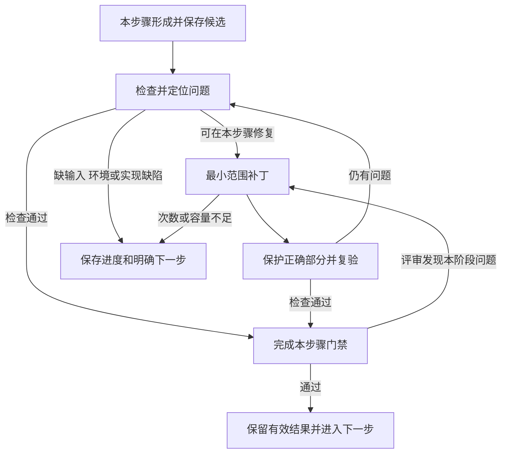

# 候选修复与持续推进：整体设计

- 状态：受限 Patch、Owner 接入、恢复、派生结果、portable proof 与确定性指纹已实现局部验证；真实模型、Office/浏览器、完整 E2E 仍未执行。
- 范围：`ai-sow:generate` 内生成、机械校验、专业评审和工件步骤；Greenfield、Brownfield 共用。
- 权威基线：[插件设计](AI_SOW_PLUGIN_DESIGN.md)、[领域约定](CONTEXT.md)、[阶段封存合同](../skills/generate/references/stage-seal.md)。
- 验证边界：当前只声明 unit/local-integration 结果；E2E、完整套件、copy smoke 与真实成本等待单独确认。

## 1. 目标与选定方案

目标是允许候选有错，插件能定位问题、限定修复、保留有效部分、复验并持续推进。失败次数与消耗有上限；中断和暂停后的下一步由项目记录决定，不依赖聊天历史。一次首版全绿不能证明该能力。

采用逐步收敛：**每一步完成自己的生成、检查、局部修复和复验，满足交付条件后再向前推进。** 流程层负责顺序、预算与断点恢复。下游消费已通过的上游成果，自动跨阶段回退不在本设计范围内。

所有步骤复用同一修复基础：**Owner 授权修改范围，模型提交受限增量补丁，程序合并与复验**。保留当前 Owner、调度器、Attempt、checkpoint 和发布机制，把修复接到这些机制中。

| 方案 | 优点 | 主要问题 | 决定 |
|---|---|---|---|
| 完整候选重写，再检查保留约束 | 接近当前实现 | 重复输入/输出大；模型容易改写正确部分；失败后上下文继续膨胀 | 只保留为旧合同兼容路径 |
| 模型提交任意 JSON 路径 patch | 输出较小 | 模型仍决定写权限；数组位置不稳定；容易跨 Owner、误删引用 | 不采用 |
| Owner 发放受限修改槽位，模型只填写补丁 | 写权限可强制执行；正确内容无需重写；容易保留独立进度 | 需要精确诊断、对象定位、合并证明和版本化接入 | 采用 |

共同机制负责绑定、定位、补丁、保留、事务和计量；专业判断继续归属各 Owner。它不发展为读取配置就能决定业务规则的通用编译器。

必须成立的约束：

1. 错误 raw、失败 Attempt 和用量不回写，也不伪装为成功结果。
2. 补丁只改变授权槽位；未授权部分从基线直接继承，模型不能提交它们的替代值。
3. 一次错误补丁不能撤销更早的有效局部结果或保护基线。
4. 局部通过、阶段 PASS、工件通过、用户批准是不同事实，不能相互替代。
5. 下游只读已封存上游成果；本步骤的修复不得改写上游内容、ID 或 checkpoint。
6. 同一冻结输入内，当前未封存工作的纠错保留 run 和已有结果；输入变化与已封存成果继续遵守现行合同。
7. 用户仍只使用现有公开入口与操作，不增加面向用户的 Repair Skill 或内部确认步骤。

## 2. 每一步收敛，流程持续向前

| 责任 | 工作内容 | 完成条件 |
|---|---|---|
| 当前步骤及其 Owner | 保存候选、检查、局部修复、复验；在阶段边界完成独立评审 | 本步骤义务满足，所属阶段的门禁在交接前通过 |
| 流程层 | 发放当前动作，保存状态和预算，消费有效结果，恢复未完成步骤 | 当前结果可供下一步使用，按既定顺序继续 |



图中门禁按既有步骤和阶段合同执行：工具步骤使用其机械检查，阶段交接执行完整校验和 fresh 独立评审。不会为每次工具调用或局部补丁另加一次专业评审。恢复继续处理未完成工作，不重做已通过的前缀。

前一步负责把自己承诺的内容交付完整；后一步负责自己的专业细化。例如 Story 的验收意图必须在 Story 阶段明确，Task 的工作拆分和估算归属则由 Task 完成。下游需要形成新的实施细节，不自动构成上游问题。

| Module | 承担的职责 |
|---|---|
| 各 Owner，包括 Prior、Prototype 的所属 Owner | 发现本职责内的问题；确定修改槽位、必要上下文与复验规则；判断业务含义 |
| `candidate_repair` | 对象定位、绑定验证、受限合并、保护检查和局部进度证明 |
| `contracts` / `models` | 定义版本化数据结构；不导入修复执行器或专业编译器 |
| `action_ledger` / `run_events` | 保存原始候选、Attempt、用量和幂等事实 |
| `orchestrator` | 发放下一动作、保存和恢复进度、执行预算限制；不决定业务修改 |
| `final_review` | 本阶段 fresh 独立评审、问题关闭与 checkpoint 校验 |
| `package_renderer` / `generation_store` | 工件步骤接续、完整验证、精确批准和不可变发布 |

共同接口保持为：Owner 给出诊断和计划，修复模块返回合并结果及保护证明，Owner 执行专业复验。实现仍在 `skills/generate/`；插件级 `runtime/` 保持现有诊断和安全项目 I/O 职责。公共状态继续使用现有 `ACTIVE / WAITING_INPUT` 与相应安全终态，不增加跨阶段修复状态机。

## 3. 候选与有效局部结果

每个逻辑工作分别维护四种引用，不能用一个“latest result”混装：

| 引用 | 含义 |
|---|---|
| 原始提交 | 宿主收到的精确 bytes、hash、执行与用量；可能不能解析 |
| 工作候选 | 由已验证的独立修复组连续合并得到，尚可能有其他未关闭问题 |
| 保护基线 | 已知有效对象/字段及已成功修复部分；后续只有新的具体诊断才能授权改变 |
| 已封存成果 | 通过完整阶段门禁的 checkpoint，或通过工件门禁并获得批准的 generation |

保护基线用于当前未封存工作。该阶段后续评审发现具体问题时，Owner 可基于新的 finding 授权相应字段；此前的授权不能自动延续到新问题。阶段封存后，其成果成为下游只读输入。

首版 Schema 有局部错误时，安全解析且通过局部 Schema 的独立对象可被登记为待整体验证的保护片段。跨对象约束没有通过时，不能宣称这些对象已经业务有效。非法 JSON 不用正则或猜测方式提取所谓正确前缀；只保留已独立验证的其他工作结果，格式恢复限定在失败的输入片段或逻辑工作。

格式恢复是明确的例外：一个片段完全无法解析、内部没有可认证保护对象时，可授权重建该片段，仍保留其 raw 与外部全部有效结果；不能借此获得整个阶段或整个项目的替换权限。正常、可解析候选始终走槽位补丁。

失败补丁保存为单独的试验候选，不覆盖工作候选。下一轮从工作候选和仍有效的保护片段出发，同时引用紧邻失败用于诊断；不会把越界的最后一次 raw 当作唯一新基线。

### 3.1 对象定位

- 有唯一 `localKey` 的对象使用 Owner/集合/localKey 定位；最终业务 ID 仍由 `stable_ids` 控制。
- 无业务 ID 的说明行、关系行和工件检查项分配内部 `repairObjectId`。它绑定首次登记候选、集合与原 occurrence，并保存对象 hash；沿该候选链保持稳定。
- 重复 localKey 或重复内容仍是不同 occurrence，不能只按内容 hash 合并；重复身份本身形成诊断。
- JSON Pointer 是向人展示的位置，不作为模型可自由指定的写地址。程序从当前对象索引解析槽位，拒绝失效位置和基线漂移。
- 内部修复 ID 不进入业务 SOW，也不成为新的公开业务实体。

## 4. 诊断产物：从一个报错变成可执行的问题集合

拟议 `DiagnosticReport` 至少绑定输入、候选、Owner、检查器版本和完整性状态，包含：

| 字段 | 要求 |
|---|---|
| `issueId` / `code` | 同一修复链内由规则、对象和义务稳定标识；时间戳、措辞变化不制造新问题 |
| `subjects` / `paths` | 精确对象、字段、缺失证据 ID、引用的两端或出错步骤 |
| `observed` / `expectedConstraint` | 当前违反了什么约束；给出约束，不替模型编造业务答案 |
| `evidenceRefs` / `dependencyRefs` | 指向冻结来源和必要上下文，带 hash |
| `repairOwner` / `repairClass` | 由哪个 Owner 处理，属于数据、证据、格式、执行、工件或实现问题 |
| `causedBy` | 区分根因与依赖它的衍生报错，防止按每个症状重写下游 |
| `checkedDomains` / `blockedChecks` | 已检查范围与尚无法检查的部分，不能把未检查当通过 |

检查器在结构允许的前提下汇总全部独立问题。遇到致命结构错误时，明确哪些检查受阻；能够安全检查的其他组继续检查。诊断分页可以限制单次返回大小，但完整问题清单必须落盘且可定位读取。

例如证据覆盖检查一次给出完整的 missing、duplicate、unassigned、already-used 集合；保留检查一次列出所有越界对象/字段。不能只返回 `/unextractedEvidence/0` 后让模型逐轮撞出其余错误。

证据“未装入 packet”和“冻结输入里不存在”分开处理：前者按引用补读，后者等待真实输入或决策。执行日志中的自然语言不授权扩大写集合。

## 5. Owner 发放 RepairPlan

拟议 `RepairPlan` 是不可变的授权文件，绑定：

- run、input revision、原逻辑工作、当前工作候选 hash、触发诊断与必要 Review；
- Owner 与新修复合同版本；
- 待关闭问题、独立修复组、每组读集合和写槽位；
- 槽位的操作种类、目标对象、允许字段、值的 Schema、预期旧 hash、引用和新增对象额度；
- 必须保留的对象/集合摘要、复验规则、依赖范围以及原预算关联。

模型不能提出自己的授权。它可以报告“现有槽位不足”和具体证据，由 Owner 重新诊断并生成后继计划；新计划保留前序和累计计数，不从模型建议直接扩大权限。

保护比较使用基线冻结的规范化规则和对象 hash；不能通过换规范化版本、改中文措辞或重新分组来掩盖无关修改。旧文件保持原字节；新组合候选整体 hash 可以变化，但未授权字段及其稳定身份必须相等。

修改范围区分四层：

1. **直接写集合**：问题字段或待补对象。
2. **必要关联写集合**：如删除/拆分 Task 后必须改变的 Task 引用；每条变化都有因果依据。
3. **复验集合**：本阶段内可能受影响但不允许修改的邻居、覆盖域、总量约束，以及对只读上游的引用。
4. **只读保护集合**：其余对象、ID、checkpoint 与有效证据。

读了某个对象不等于可以写它；需要复验也不等于需要重新生成它。无法确定依赖时扩大检查范围，不能扩大模型写权限。

### 5.1 槽位与操作

仅支持封闭操作：修改授权字段、向授权集合追加对象、删除明确对象、执行 Owner 批准的原子 root 变换。修改引用通过明确的字段槽位；不提供任意路径、整份文档替换或通配符权限。

合并/拆分是一个 Owner 内的原子组，明确输入 roots、输出命名空间、需要重连的引用和必须守恒的义务。程序分配/核对稳定身份；语义发生实质变化的对象不能借补丁复用旧 ID。

补齐遗漏证据时，允许追加处置或向明确实体添加这些缺失证据的引用；原有理由、已覆盖证据和其他实体字段默认只读。无需为“追加说明”赋予“替换全部说明”的权限。

## 6. PatchResult：模型只返回增量

下面是拟议结构的脱敏示意，不是当前可执行合同：

```json
{
  "repairPlanSha256": "<计划哈希>",
  "baseCandidateSha256": "<工作候选哈希>",
  "groupId": "coverage-gap-group",
  "operations": [
    {
      "slotId": "append-missing-disposition",
      "value": {
        "evidenceIds": ["evidence-missing-a", "evidence-missing-b"],
        "reason": "根据本组实际原文形成的处理理由"
      }
    }
  ]
}
```

模型不返回原有实体或原有说明，也不负责抄回正确结果。`slotId` 指向程序发放的目标、字段、Schema 和预期旧值；示例槽位只允许这两条缺失证据。业务处置仍由模型基于证据决定，程序不能把所有 missing 自动标成排除。

补丁省略的字段直接继承基线。没有授权的额外字段、未知槽位、错误 hash、重复操作、超出额度或跨 Owner 内容均拒绝；不静默丢弃非法操作，不把“看起来合理”的越界值混入结果。

每个 Action 只负责一个原子修复组。独立组可以作为 sibling actions 执行；一个组失败不抹掉其他已通过组。存在读写交叉、共同覆盖义务或同一集合级约束时合并为原子组或串行执行。

### 6.1 合并与局部进度

程序依次验证绑定与槽位、构造暂存候选、检查未授权部分逐字段不变、执行 Owner 的局部和依赖约束。成功组产生 `RepairReceipt`，绑定 base、plan、patch、合并结果、实际改动和校验结果，再原子更新工作候选引用。

工作候选允许保留其他组的已知未解决问题。一个组只有在本组义务满足、没有引入新的跨组破坏、其读写范围可证明独立时才保留为有效进度；否则保留试验结果但不更新工作候选。整阶段仍需全部必需结果和门禁通过。

新 Patch Action 的“执行/补丁通过”不等于原业务 IR 已有效。最终由 Owner 产生 `CandidateResolution`，证明原失败候选加各次补丁得到完整有效的 Owner IR；现有 StagePlan 的该逻辑工作通过这个显式解析结果关闭。旧失败 Author record 保持 FAILED，不能伪造一次模型生成成功记录。

并行组绑定同一 base。只有完整读写集合互不干扰，且 Owner 的集合级约束证明允许合并时，才按固定顺序组合；否则旧 base 补丁必须重新绑定或等待，不能静默 rebase。

## 7. 修复上下文与成本

Repair packet 只携带本组的诊断、槽位定义、要修改的当前值、必要邻居、实际证据及约束。正确的大集合留在项目中，由程序继承；模型获得必要的只读索引和可 hydrate 引用。

内容分为三种：必须直接呈现的语义依据、已授权可补读的相关证据、仅用于机械保留验证的 hash/索引。hash 不能代替业务证据；例如排除一行必须读取该行及必要表头/条款，不能凭 missing ID 编理由。

初始工作分组就为修复、必要补读和输出预留容量。发行前再次检查完整实际请求；使用该 Action 冻结的读取上限，并遵守既有模型容量、总 token、active-time、hydrate 轮数和并发限制。宿主记录真实用量；缺失计量明确 unknown，不能用估值冒充实际或表示为零。

如果修复仍装入完整来源、全部候选及历次 raw，即使输出改成 patch，也不算完成该设计。模型只看当前组需要的失败片段和仍生效的基线；完整历史保存在证明链，按精确引用读取。

容量不足先在未发行的修复计划中按独立组分割或无损组织必要上下文。不得截掉检查义务、丢失来源、修改旧 StagePlan，或自动增加预算。无法在既有限额内完成的原子组明确暂停，保留已成功组。

## 8. 在交接前把本阶段检查完整

复验分三处进行：

| 时机 | 检查内容 |
|---|---|
| 每个补丁合并前 | 绑定、Schema、授权写集合、保护集合、本阶段局部约束与必要引用 |
| 当前 Owner 的候选准备完成后 | 完整 Schema、引用、覆盖、身份、政策及本阶段全局约束 |
| 阶段或工件交付前 | 阶段执行 fresh 独立 Review；工件执行既定 Office、复读、视觉及最终批准门禁 |

阶段只在自身义务全部通过后封存。已知的上游遗漏、冲突或含混验收不能标成 PASS，留给下游补救。评审同时检查本阶段对下游承诺的输入是否完整；不要求上游预先完成下游拥有的专业工作。

失败 Review 的未提及部分不自动获得 PASS。因此本阶段修复后仍需 fresh Review 检查完整当前候选及义务；差异可用于聚焦，但不能代替该评审。补丁动作本身不调用完整 E2E。

### 8.1 修改范围与检查范围

修改限于当前 Owner 的问题字段和必要关联字段。只读检查可以覆盖本阶段邻居、整个覆盖域、集合成员和上游引用；新增/删除对象、否定条件与全局约束不能被局部校验遗漏。无法证明独立性的组串行处理或合并检查。

所有局部修复完成后，仍执行本阶段完整机械校验。下游绑定原上游 checkpoint，使用既有不可变链；不引入跨阶段依赖复用证明、上游 checkpoint 替换或多 Owner 修复事务。最终完整 SOW Model 继续执行现行全局一致性检查。

### 8.2 Task 出错的正常路径

1. 定位具体 Task 问题及其证据或规则。
2. 仅修对应 Task 字段和本阶段内必要引用。
3. Scope、Story/AC 的内容、ID、checkpoint 和已有证明保持原字节。
4. Task 完成机械校验和独立评审后，再进入工件步骤。

任务拆分、工作类型、复杂度及实施细节属于 Task 的工作。不能为了容易通过 Task 校验而修改 Story 的验收条件，也不能把应由 Task 完成的细化当成上游缺陷。

### 8.3 上游真实漏检作为异常处理

审核降低遗漏风险，不能保证绝对没有漏检。若下游发现已封存上游确与冻结证据或交接合同冲突，保存具体对象/字段、原证据、违反的义务和当前阻断位置，暂停依赖该问题的推进。诊断区分缺少真实输入、上游检查缺口与实现缺陷，并指出相应处理责任和下一步。

本机制不自动回退上游、重写 checkpoint 或启动阶段间往返。已有成果和失败现场保留；不得把外部直接改写已封存文件当成合法恢复。后续处置遵守现行输入和封存合同，不在本稿新增自动重封存路径。

此类问题如果反复出现，应补强上游的交付检查和对应最小反例，使它在交接前被发现。异常被正确定位并暂停属于保护能力，不能作为已完成收敛的验收结果。

## 9. 覆盖全部步骤的处理矩阵

共用的是诊断、范围、证明、预算和恢复机制；具体修复执行器按责任选择，不把所有错误交给模型改 JSON。

| 步骤或错误 | 定位与修复动作 | 必须保留 |
|---|---|---|
| 输入提取、格式、Schema | 定位来源片段/字段；安全的格式恢复限定在失败逻辑工作；确定性解析缺陷交实现修复 | 冻结来源、有效片段和其他工作 |
| Scan / Audit / Scope / Story / Task | Owner 给出字段、引用和义务的补丁槽位 | 无关对象、稳定 ID、上游写集合 |
| Prior Analyze | 列出完整证据处置差集；只允许处理缺失/冲突证据及受影响关系 | 原有效实体、说明行及其理由 |
| Prior Consolidate | 仅处理新增或错误关系，依赖实体由程序组合 | 全部已成功依赖实体，不让模型抄回 |
| Prototype Scenario / Observation | 定位场景、步骤、观察与证据绑定；补读或补丁 | 正确观察，包括负面运行事实 |
| Browser / 工具执行 | 按真实失败定位步骤，在原预算内重试或等待环境恢复 | 已完成 trace、截图、成功场景和真实失败事实 |
| Review 自身格式错误 | 修复评审表达，不修改被评审业务候选；独立 Reviewer 重新作出有效决定 | 当前候选、原 Review raw、完整义务；不能强制补成 PASS |
| Review 发现本阶段业务问题 | 本阶段 Owner 应用补丁后重新独立评审 | 原 Reviewer findings 与未授权数据 |
| MATERIALIZE / VALIDATE | 当前候选问题在本阶段修；实现缺陷修复后从失败步骤复验；已封存上游问题保存诊断并暂停 | 成功输入和其他确定性步骤输出 |
| Workbook / Office / 公式复读 | 投影或工具问题在工件步骤修复并重跑必要后缀；冻结业务或模板输入有误则暂停 | 模板计算权威和已封存业务模型 |
| PDF render / 视觉 | 只修呈现或投影并重做必要步骤；已封存业务问题保存诊断并暂停 | 已验证且仍适用的 Excel/Office 前缀 |
| 最终批准 / current 切换 | 核对精确工件 hash；恢复同一发布事务 | 未批准不发布，旧 generation/current 不覆盖 |

`OWNER_BUG / CONTRACT_GAP` 保留工作现场并返回具体修复责任，不让模型通过删除证据、调整结论或回写校验结果来绕过缺陷。运行代码或工具实际修复后，记录版本变化并重新验证受影响步骤。

确定性步骤的复用键绑定实际输入、工具身份、参数、相关规则/renderer 指纹与成功输出 hash。只有路径相同或文件存在不构成复用资格。指纹按实际步骤依赖区分，使仅 PDF 呈现的变化不无故使 Office 前缀失效；业务值、模板或 workbook 投影变化则使相应后缀失效。

工件修复不能逐格篡改已冻结 XLSX 来绕开模板或 Owner。工作簿改变必须重新做真实 Office 和相应复读；预览改变必须重新验证视觉输入，仍保留当前全部可见 Sheet 的视觉门禁。修复后的 artifact hash 改变，旧批准不能用于新工件。

## 10. 有限收敛、暂停与中断恢复

沿用现有候选、执行、确定性步骤与语义修复上限，以及总 token、active-time 和 hydrate 限额。修复链额外有统一 lineage/episode 关联，用来汇总原逻辑工作的全部修复；它不是又一个可以重新计数的预算池。

进展按当前逻辑工作记录：关闭的问题、有效局部结果和可继续的位置；流程层保存这些事实及累计消耗。新问题编号、补丁合同版本、组拆分或诊断器升级都不能重置已有次数。独立组只对应原工作中已登记的不同义务；同一未关闭问题不得通过换 groupId 取得新配额。

新版协议显式记录 `originLogicalWorkId` 和内容修复回合：首版为第1回合，同一轮 RepairPlan 的独立组共享后继回合；内容仍错而再次让模型提出补丁必须进入下一回合，只复用已成功组。组内短暂执行失败由 `maxExecutionAttempts` 约束，不伪装成新的内容回合。新的 Review/control Action ID 也必须关联原修复 lineage，不能绕过原工作和阶段既有上限；旧运行接入时从历史事实累计，不从零起算。

判断进展记录：关闭了哪些问题、新发现哪些问题、保留了哪些结果、实际改动范围和本轮成本。新诊断可能揭示更多问题，不要求 issue 数每次严格递减；但也不能只凭模型声称“完成”算进展。

- 相同工作候选、相同诊断、相同证据和授权下，不再次发放等价请求。
- 相同失败签名重复且没有新增事实或有效局部进展时，提前暂停，指出未改变的前置条件。
- 到达任一既定上限后不追加调用，返回已完成组、未解决问题、原因与明确下一步。
- 后续明确增加有限预算仍累计旧次数；不能自动扩预算、换模型或另开 run 隐藏失败。

无进展判断针对内容修复。短暂网络等可恢复执行故障仍可按原执行上限重试；已有成功候选或完成事实时则先恢复提交，不能重复调用模型。

暂停记录区分证据不可读取、必需输入缺失、容量不足、修复上限、执行故障、实现缺陷和已封存输入异常。用户界面呈现需要采取的具体动作，不只展示含混的“预算耗尽”。已有答案、读取游标、已 hydrate 内容及成功补丁均保存。

中断恢复按事务事实处理：

| 中断位置 | 恢复行为 |
|---|---|
| 模型执行中 | 先核实进程和已有执行证据；不能同时另发同一动作 |
| 候选收到、尚未记录 | 保存并校验同一原始结果，重放一次提交 |
| 补丁暂存后、合并证明前 | 未承诺结果不成为工作基线；验证已有暂存或重新作确定性合并 |
| 合并证明完成、head 未切换 | 复读证明，完成同一原子切换，不重调模型 |
| 部分独立组完成 | 复用这些组，只发行未完成组；相关原子组不拆开生效 |
| checkpoint 或工件准备后 | 复用输入和指纹仍匹配的成功结果，仅执行缺失/失效的后缀 |
| 批准后发布中 | 幂等完成同一精确批准，最后切换 current，不重新生成工作簿 |

每项成功事实都先保存不可变内容和证明，再更新可变 head。调用重试、状态查询和重复提交均不能重复计费或生成第二份语义相同的已承诺补丁。

## 11. 版本、兼容与离线证明

本设计引入的是受授权、完整校验的增量结果协议，不能把当前完整 Owner IR 合同直接解释成 patch。拟议合同集合如下，正式命名和版本在实施时与 registry 一起落定：

| 产物 | 作用 |
|---|---|
| DiagnosticReport | 完整定位、检查覆盖及责任分类 |
| RepairPlan | 不可变槽位授权、问题与范围 |
| PatchResult / RepairReceipt | 原始增量提议及实际合并/保留证明 |
| CandidateResolution | 将失败 Author 和补丁链解析成完整有效 Owner IR，明确来源角色 |

这些都是 work/proof 元数据，不增加第二份稳定业务模型。StageCheckpoint、Action result 解析和 portable generation proof 需要显式支持上述来源链；离线复读必须能重新应用补丁、复算差异和验证权限，而不是相信 receipt 中的布尔“通过”。

旧 raw、Envelope、packet、StagePlan、diagnostic、checkpoint 与预算仍按原合同解释。旧失败诊断不够精确时，对相同原始候选重新诊断并保存新报告，绑定旧失败与新检查器；不改写旧 record，也不追认它为成功。

新 run 使用新版修复能力。已有 run 仅能通过明确、版本化的接续记录启用尚未发行的新版 Repair：绑定原失败、候选、Owner、旧/新协议与同一累计预算，并完成兼容预检。已发行 Action 不改变语义，已放弃 run 不恢复，已耗尽次数不因协议升级自动增加。该机制不扩展为旧多 Skill 流程或业务数据的通用迁移。

现行合同仍生效，实施时需要同步的变更包括：受限 Patch Action、CandidateResolution 消费方式、步骤恢复指纹及 artifact portable proof。上游 checkpoint 的不可变性和父项绑定保持现行语义。相关 Schema、registry、测试、Owner references、SKILL、设计/术语文档和发布元数据应一次形成一致的版本集合。

## 12. 验收设计：证明“有错仍能推进”

本轮执行顺序：全部实现代码和针对性验证完成后，先向用户报告准备情况并取得明确确认，再开始真实模型收敛或任何 E2E。确认前只做不驱动完整流程的单元和局部集成验证；真实 Office/浏览器、完整生成与复制插件 smoke 均留在确认之后。

先验证共用协议和各 Owner 的职责，再做小规模真实模型收敛，最后接续完整 E2E。每层只在前一层目标已满足时进入；新缺陷先在最小反例中修复，不用完整 E2E 充当调试器。

| 必需场景 | 通过标准 |
|---|---|
| Greenfield 与 Brownfield 同类 Task 错误 | 同一修复机制使 Task 通过并继续，Scope/Story 内容、ID 和 checkpoint 原字节不变 |
| 首版局部 Schema 错误 | 正确独立对象保留；修复只改变错误片段；最后完成完整校验与评审 |
| 首版非法 JSON | 保存 raw 和已有独立成果，格式恢复不丢失其他工作，不把猜测片段当有效业务数据 |
| Prior 缺少若干证据处置 | 诊断一次列出全部遗漏；模型仅补缺口；原实体和每一组原说明均保持不变；随后确实推进 |
| 恶意或误操作补丁 | 未授权字段、整体集合替换、伪造槽位、重复 ID、跨 Owner 和越权证据全部拒绝 |
| 第二版修复仍有错 | 保存第一次有效局部修复，后继候选不能清空基线；在预先设定的有限轮次内完成或明确失败 |
| 多组中一组失败 | 成功组内容、hash、计量不变；只修失败组，全部闭合后再推进阶段 |
| 证据分页/读取受限 | 保存已读范围和已完成组；恢复只读取缺失依据，不重做 Author 或遗漏检查义务 |
| 并行和过期补丁 | 冲突组串行/原子处理；过期 base 不能覆盖新基线；无重复落盘或重复操作 |
| 上游交付条件不完整 | 上游阶段自身检查和评审发现问题，局部修复后才允许下游开始 |
| 下游专业细化 | Task 完成自己拥有的细节，不要求回改已通过的 Scope/Story |
| 已封存上游真实漏检 | 精确诊断并暂停依赖该问题的推进，保留成果和下一步；不反向写入、不自动重封存、不冒充收敛成功 |
| 全局约束和新增成员 | 本阶段局部修复后完整检查集合和全局义务，不能把局部通过当成阶段 PASS |
| Review 格式错误/业务否决 | 不修改业务数据伪造 PASS；由正确责任方处理并完成 fresh Review |
| MATERIALIZE、Office、Render、发布中断 | 复用已成功且仍适用的输出；失败后缀有限接续，不能手改 XLSX/公式绕过验证 |
| 完全无进展或预算耗尽 | 停止发放；保存问题、进度、游标、实际成本和下一步；不自动扩轮数 |
| 离线证明、旧合同与独立安装 | 全链重放得到相同结果，拒绝篡改/漏链/权限扩大；复制插件不依赖原 checkout |

### 12.1 小规模真实模型验收

使用完全合成、可公开的小样本，复现“多数结果正确、少量证据遗漏、错误修复企图重组原说明”的形态；不复制客户原文或把正确补丁预装进宿主。

可以显式注入错误种子来确定覆盖修复路径，报告标记为故障注入，不冒充模型自然首版错误率。诊断、授权和原生模型补丁必须真实执行；不为碰到一个错误首版反复从入口调用模型。

验收前固定输入、模型/宿主配置、最多候选数与总成本。需要由插件实际产生诊断和授权，模型实际产生补丁，程序实际验证，最后到达下一阶段的有效动作或 checkpoint。至少覆盖 Prior 和 Task 两个不同 Owner，避免只有一个专门案例支持新机制。

记录首版缺陷、每轮问题关闭/新增、实际写集合、受保护对象 hash、调用次数、上下文组成和真实 provider 用量。除初始格式无法解析的限定恢复外，正常 Repair 输出不得含未授权的完整候选集合；修复输入不得重新装载整个无关来源。

不能以合成候选一次全绿、驱动进程 exit 0、状态 ACTIVE、补丁 Schema 通过或预算耗尽后安全停止宣称收敛通过。安全停止是单独的负向验收结果。

### 12.2 完整流程验收

完成前述小样本后，在可兼容的原断点接续；无法兼容的情况先说明具体合同缺口，不默认从头试。固定修复上限，不在运行中追增以制造通过。

完整结果必须包含真正的阶段推进、fresh Review、Office/视觉、精确批准以及最终工件复读。报告分别说明插件机制验证、真实模型收敛、完整 E2E 和实际成本，保留失败记录；既有正确工作簿不因另一侧失败而重新生成。

## 13. 实施边界与完成定义

按三个集成单元实施：

1. **共用局部修复基础**：完整诊断、对象定位、授权槽位、合并与保护、有效候选解析、幂等和计量；以 Prior/Task 两种不同工作证明共用能力。
2. **全部步骤接入**：生成、检查、评审和工件步骤在各自职责内收敛；阶段交接前校验完整，流程层仅负责推进和恢复。
3. **有上限的验收**：最小反例、离线重放、旧 run 兼容与独立安装，小规模真实模型收敛，再完成完整流程并分析成本。

仅在宿主里人工修候选不能算插件能力；仅接入少数语义错误也不能算全部完成。

完成条件是：每个步骤允许首版有错，插件能自己定位、在有限次数内局部修复、保留正确结果并完成复验；阶段交接前完成完整检查与独立评审，流程从有效成果持续向前。中断或暂停后可从未完成处接续，Greenfield 与 Brownfield 使用同一机制。目标验收样本必须真正推进到最终交付，并记录结果、限制与成本；困难样本的安全停止如实报告为未通过，不扩预算或放松门禁凑结果。
